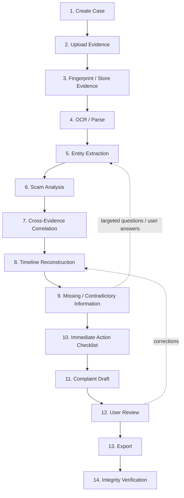
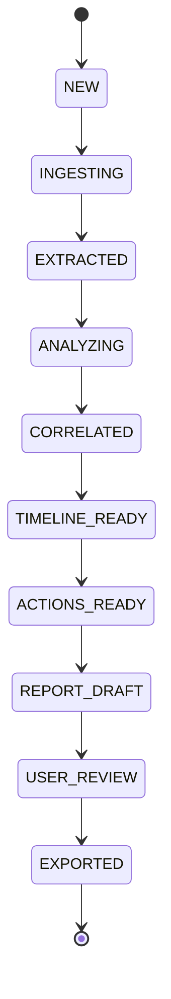
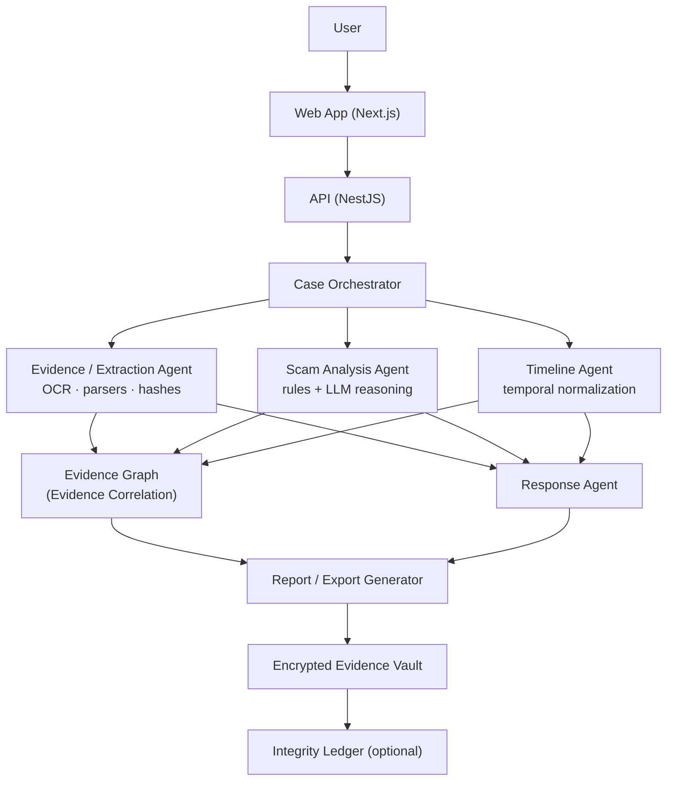
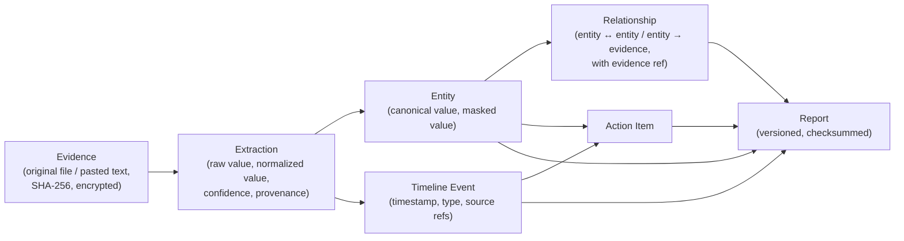
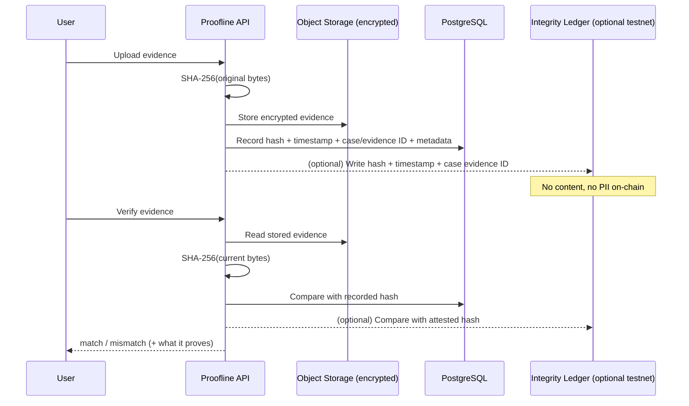
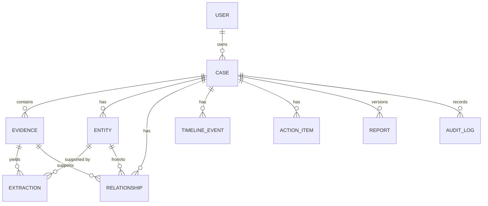
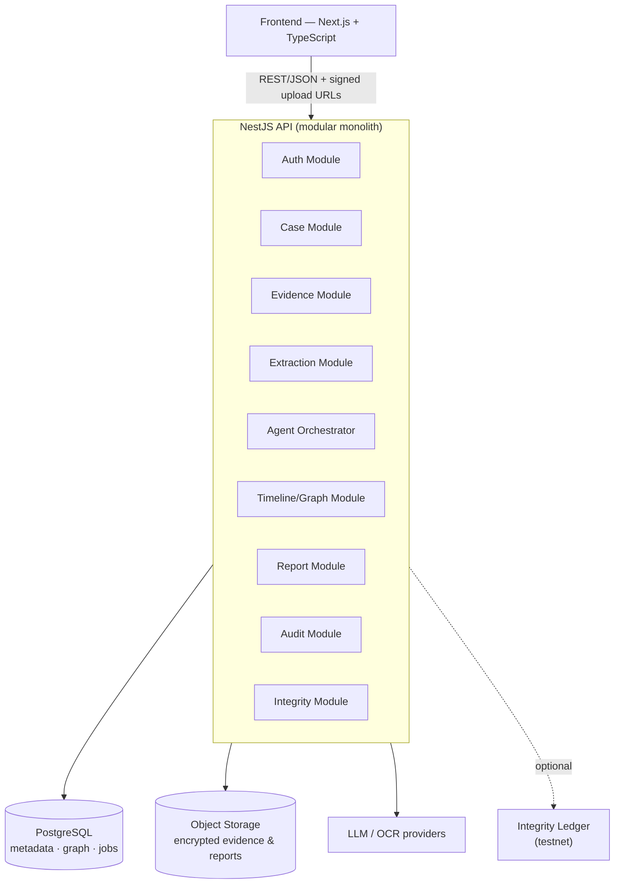

# Proofline — Master Product & System Specification

> **Trace the Evidence. Build the Case.**

---

## 1. Document Control

| Field | Value |
|---|---|
| Product | **Proofline** |
| Document | Master Product & System Specification |
| File | `docs/01-PROOFLINE-MASTER-SPEC.md` |
| Version | 1.0 |
| Status | Hackathon MVP |
| Last updated | 2026-10-02 |
| Source document | *Cyber-Fraud Response Agent — Deep Product, Technical & Hackathon Planning Document*, v1.0, prepared for PCCOE DecentraHack 2.0, dated 30 September 2026 (file: `Cyber-Fraud_Response_Agent_Deep_Dive (1).docx`) |
| Hackathon context | PCCOE DecentraHack 2.0 (themes: Agentic AI, Blockchain/Web3, Open Source). Round 2 requires a working demo, demo video and presentation; the final round is an in-person presentation on **9 October 2026** at PCCOE. |

### 1.1 Purpose

This document is the **single source of truth** for what Proofline is, what the hackathon MVP must do, what it must not do, and how its parts fit together. It is written for the engineering team and for future Claude Code sessions. All later documents (database schema, API specification, etc.) must stay consistent with it.

### 1.2 Relationship to the source document

- The source document is authoritative for the product concept, problem, positioning, workflow, architecture, AI behaviour, security principles, MVP scope and demo scenario.
- **Naming:** the source calls the product *Cyber-Fraud Response Agent*. This specification renames it to **Proofline**. The concept, scope and boundaries are unchanged.
- **Hackathon constraint (from source §2):** *only the idea submitted in Round 1 may be developed further.* The renaming must not change the product boundary or core workflow described in the Round 1 submission.
- Business/revenue model, judge Q&A, the Round 1 abstract and team allocation from the source are **context, not requirements**. They are summarised in Appendix B and are not specified further here.

### 1.3 Requirement markers

| Marker | Meaning |
|---|---|
| *(no marker)* | Stated in, or directly derived from, the source document. |
| **`OPEN DECISION`** | A choice the source leaves open, which the team must make. Collected in §27. |
| **`IMPLEMENTATION DETAIL`** | Something the source implies but does not specify. This document gives a recommended interpretation; the implementer can refine it without changing the product. |
| **`TO BE DEFINED`** | Content that must be produced later (e.g., exact synthetic artifacts, exact enumerations). |

Requirement keywords: **MUST** = required for MVP; **SHOULD** = expected unless there is a documented reason not to; **MAY** = optional.

### 1.4 Related documents (planned)

| Document | Content |
|---|---|
| `03-DATABASE-SCHEMA.md` | Physical schema derived from §17 |
| `05-API-SPECIFICATION.md` | Full API contract derived from §20 |

Other documents in the `docs/` series are **`TO BE DEFINED`**.

---

## 2. Product Definition

**Proofline** is an AI-powered, agentic web platform for the period after a person suspects or confirms that they have been the victim of a cyber scam. It takes fragmented incident evidence (chat and SMS screenshots, emails, suspicious URLs, UPI/payment receipts, bank alerts, PDFs and copied messages), fingerprints and stores it securely, extracts and normalises the key entities with provenance, links them across evidence items, reconstructs the incident timeline, identifies missing or contradictory information, and produces an immediate-action checklist and a complaint-ready case draft for the user to review. It works alongside India's official cyber-fraud reporting channels; it does not replace them.

### 2.1 One-line pitch

> Turn scattered scam messages, screenshots, transaction records and other evidence into a structured incident timeline, evidence map and complaint-ready case in minutes.

### 2.2 Product category

AI-powered **cyber-fraud evidence intelligence and response platform**: a post-incident evidence-orchestration layer.

### 2.3 Product vision (source §5.1)

> "Make the first 10–15 minutes after a cyber scam structured, evidence-driven and actionable."

### 2.4 Product promise

With Proofline, the user can:

1. **understand** what happened,
2. **connect** the evidence,
3. **identify gaps** (missing or contradictory information),
4. **prepare** the next action, and
5. **build** a structured, traceable case they can review and export.

Core transformation:

```text
MESSY EVIDENCE
      ↓
UNDERSTAND
      ↓
EXTRACT
      ↓
CONNECT
      ↓
RECONSTRUCT TIMELINE
      ↓
IDENTIFY MISSING INFORMATION
      ↓
GENERATE ACTIONS
      ↓
CREATE CASE / REPORT
      ↓
VERIFY EVIDENCE INTEGRITY
```

### 2.5 Primary value (source §1)

Proofline reduces the time spent organising evidence and makes the incident report more complete and more consistent. It does **not** control what banks, payment intermediaries or law enforcement do afterwards.

### 2.6 Differentiation statement (source §26.3)

> "We are not building another scam detector. We are building the evidence-response layer that turns a messy cyber-fraud incident into a structured case in minutes."

---

## 3. Problem Definition

### 3.1 What happens after a scam

After a cyber scam, the victim is under time pressure and may be stressed. The information about the incident is spread across several channels and devices:

- a fake SMS or WhatsApp message,
- a phone call with the scammer (often not recorded),
- a suspicious link opened in a browser,
- a credential or OTP request page,
- a UPI payment screen or receipt,
- a bank debit alert or statement.

Each artifact tells part of the story. None of them tells the whole story.

### 3.2 Why evidence becomes fragmented

- Evidence comes in **different formats**: images, PDFs, plain text, email exports, URLs.
- It sits in **different apps and devices**: SMS inbox, WhatsApp, email, banking app, browser.
- Identifiers are **inconsistently formatted**: phone numbers with or without `+91`, URLs with or without tracking parameters, transaction IDs labelled as "UTR", "Ref No." or "Transaction ID".
- **Timestamps** use different formats and time zones, or are missing.
- The victim's recollection may **conflict** with the documentary evidence.

### 3.3 Why the pieces need to be connected

Scams create relationships between entities. The same phone number can appear in a WhatsApp screenshot and an SMS. The same domain can appear in a chat and a browser screenshot. A transaction ID can link a payment receipt to a bank statement (source §11.1). Connecting these links turns isolated screenshots into a coherent account of the incident: who contacted the victim, through which channel, which link was used, and where the money went.

### 3.4 Why reporting requires structured information

The official NCRP complainant checklist (source §3.1, ref [2]) asks the victim to have ready:

| NCRP checklist item | Applies to |
|---|---|
| Incident date and time | All incidents |
| Incident details | All incidents |
| Identity document | All incidents |
| Bank / wallet / merchant | Financial fraud |
| Transaction ID or UTR | Financial fraud |
| Transaction date | Financial fraud |
| Fraud amount | Financial fraud |
| Relevant evidence | All incidents |
| Suspect details (phone numbers, email IDs, bank account details, URLs), where useful | Optional |

NCRP's "Report Suspect" facility also collects suspicious URLs, WhatsApp/Telegram handles, phone numbers, email IDs, SMS headers and social-media URLs, together with supporting evidence (source §4, ref [4]).

A victim holding screenshots must work these fields out by hand. Proofline extracts them, normalises them and shows which ones are still missing.

### 3.5 Organising evidence is a problem in its own right

The source frames the opportunity as an **information-organisation problem**. The user needs a system that can collect fragmented evidence, normalise it, connect related entities, reconstruct what happened, identify gaps and prepare a structured narrative. That is the problem Proofline solves.

### 3.6 Claims Proofline does not make

- It does **not** claim to speed up police or bank action.
- It does **not** claim to recover money.
- It claims only that a faster, more complete and more consistent picture of the incident can improve the quality and speed of the **victim's own next action** (source §2, "Real-world impact").

---

## 4. Product Positioning

### 4.1 What Proofline IS

- An **evidence-intelligence and response layer** that builds a coherent case from fragmented inputs.
- A **guided, structured workflow** for the period after a scam.
- A **provenance-aware** system: every key fact links back to the evidence it came from.
- An **agentic** system that plans and runs a multi-step workflow with tools and state (§10).
- A **preparation tool** that hands the user a structured case to use with official channels.

### 4.2 What Proofline IS NOT

| Proofline is not… | Implication for the product |
|---|---|
| A replacement for NCRP / 1930 | Directs users to official channels and never presents itself as one. |
| A police portal | Does not file complaints on the user's behalf. |
| A bank | Does not freeze, reverse or dispute transactions. |
| A money-recovery guarantee | Never promises or implies recovery. |
| Legal advice | Gives no legal determinations; output is labelled as AI-assisted. |
| An autonomous law-enforcement system | Does not contact authorities, banks or suspects in the MVP. |
| A generic chatbot | Primary UI is a structured incident-response workspace (§21). |
| Merely a scam classifier | Classification is one step in a larger evidence workflow. |

**Positioning rule (source §4):** Never pitch "we created a cybercrime reporting portal." The differentiated product is the evidence-intelligence layer that prepares a coherent case from fragmented inputs.

### 4.3 Existing ecosystem

India already has substantial cyber-fraud response infrastructure. Proofline works **before and alongside** it:

| Existing capability | What exists | Where Proofline sits |
|---|---|---|
| Official reporting | **NCRP** (National Cyber Crime Reporting Portal, under I4C) and the **1930** national helpline. **CFCFRMS** handles immediate reporting of financial fraud. | Before or alongside reporting: organise the case and evidence. |
| Suspect reporting | NCRP "Report Suspect" collects suspicious URLs, numbers and handles, with evidence. | Extract and normalise those details from the user's messy evidence. |
| Bank notification | Banks provide channels for reporting unauthorised transactions. RBI guidance stresses prompt notification. | Provide a structured incident summary the user can use when contacting the bank. |
| Cyber incident response | **CERT-In** is the national nodal agency; organisations have separate reporting obligations. | Consumer workflow plus optional organisation workflow; not a replacement for CERT-In. |

Proofline is **not** an official government service and must not look like one. It uses no government branding, logos or styling that suggests official status.

---

## 5. Target Users

| # | Persona | Pain point | Need | Proofline capability |
|---|---|---|---|---|
| 1 | **Individual victim** | Evidence is scattered and the next steps are unclear. | A simple guided workflow, timeline, evidence checklist and report draft. | Guided case creation, upload, automated extraction, timeline, action checklist, complaint draft. |
| 2 | **Family member helping a victim** | Has to collect information from several devices and chats. | A case workspace, shared evidence collection and a clear checklist. | Case workspace with multi-file upload and a missing-information checklist. Shared/multi-user case access is **`OPEN DECISION`** (OD-01). |
| 3 | **College/campus support desk** | Receives incomplete incident accounts from students. | A standardised intake form and case summary. | Standard case structure, incident summary, missing-information detection. |
| 4 | **Bank/fintech first-line support** | Customer descriptions may be inconsistent or incomplete. | Structured incident intake and entity extraction. | Entity extraction with provenance, normalised entity table, contradiction checks. |
| 5 | **Cyber-support service provider** | Manual triage and document assembly take time. | A B2B workflow, audit trail and exportable case bundle. | Audit log, evidence index, exportable case. Multi-seat/organisation features are **future scope**. |

**MVP primary persona:** the **individual victim** (and someone helping them), shown with the synthetic demo scenario. Personas 3–5 use the same core workflow. Organisation-level features (team seats, SSO, organisation tenancy) are not in the MVP.

---

## 6. Core User Journey

### 6.1 Journey overview



> The numbering follows the requested journey. In the source, integrity verification (§7.1 step 11) comes *before* user review (step 12). Verification can be run at any point after ingestion, and the user can run it on demand (FR-021). Its position in the diagram is not a strict ordering constraint.

### 6.2 Stage descriptions

| # | Stage | What happens | Primary component |
|---|---|---|---|
| 1 | **Create Case** | User creates a case with minimal metadata: incident time, contact, optional location. | Case Module |
| 2 | **Upload Evidence** | User uploads screenshots (PNG/JPG), PDFs, TXT, email exports or transaction receipts, or pastes a message or URL. | Evidence Module |
| 3 | **Fingerprint / Store** | System computes SHA-256 of the original bytes, stores the file encrypted, records metadata and writes an audit entry. Optionally registers the hash on the integrity ledger. | Evidence + Integrity Modules |
| 4 | **OCR / Parse** | OCR and document parsers extract text and visual structure (pages, regions, lines). This is a *deterministic-ish preprocessing step*. | Extraction Module |
| 5 | **Entity Extraction** | Phone numbers, URLs, UPI IDs, transaction IDs, amounts, dates, names and other entities are identified, each with provenance and confidence, then normalised. | Evidence / Extraction Agent |
| 6 | **Scam Analysis** | The likely scam pattern is classified against a fixed taxonomy, with an evidence-backed explanation in calibrated language. | Scam Analysis Agent |
| 7 | **Cross-Evidence Correlation** | Entities that appear in several evidence items are merged into canonical entities, and relationships are recorded to build the evidence graph. | Evidence Correlation Agent |
| 8 | **Timeline Reconstruction** | Events are ordered using extracted timestamps and user-provided corrections. | Timeline Agent |
| 9 | **Missing / Contradictory Info** | Required fields are checked for gaps (e.g., NCRP checklist) and conflicts between sources are flagged. Only high-value follow-up questions are asked. | Evidence Correlation Agent / Orchestrator |
| 10 | **Immediate Action Checklist** | Prioritised next steps based on the incident type, pointing to official channels (bank, 1930/NCRP, evidence preservation). | Response Agent |
| 11 | **Complaint Draft** | A structured case draft and downloadable evidence index are generated. Every key fact has provenance or is marked "not provided". | Report Generator |
| 12 | **User Review** | User reviews and corrects the summary, entities, timeline and draft. Nothing is exported until the user confirms. | Frontend + Case Module |
| 13 | **Export** | User exports the selected artifacts (draft, evidence index, chosen evidence). An audit entry is written. | Report Module |
| 14 | **Integrity Verification** | SHA-256 of the currently stored file is recomputed and compared with the recorded hash (and the optional ledger attestation). | Integrity Module |

### 6.3 Example incident (source §7.2)

| Time | Event |
|---|---|
| 12:03 | Fake KYC SMS received |
| 12:07 | User contacted the caller |
| 12:11 | User opened the URL |
| 12:16 | Credentials/OTP request shown |
| 12:19 | UPI payment initiated |
| 12:21 | ₹8,500 debit notification |
| 12:24 | User uploads evidence |
| 12:25 | Agent builds the case |
| 12:27 | Complaint draft and action checklist ready |

### 6.4 Case state machine (source §9.2)



The states above come from the source. The following are **`IMPLEMENTATION DETAIL`**:

- **Failure state:** a `FAILED` state (or a per-step error flag) with retry is needed for OCR/LLM failures. The source does not define one.
- **Re-entry:** adding evidence or correcting data after `REPORT_DRAFT` should move the case back to the earliest affected state (e.g., new evidence → `INGESTING`; a timeline correction → `TIMELINE_READY`) rather than starting from scratch.
- **Per-evidence status:** each evidence item needs its own processing status (e.g., `uploaded / processing / processed / failed`) to support the "Evidence 6/6 processed" indicator.

---

## 7. MVP Scope

| Feature | MVP | Future | Notes |
|---|:---:|:---:|---|
| Screenshot ingestion (PNG/JPG) | ✅ | | |
| PDF ingestion | ✅ | | |
| Pasted text / pasted URL | ✅ | | |
| TXT and email-export file upload | ✅ | | Listed in source §8.1 as upload types. Mailbox *connectors* are future. |
| OCR / document extraction | ✅ | | |
| Entity extraction with provenance | ✅ | | |
| Entity normalisation and masking | ✅ | | |
| Scam taxonomy classification | ✅ | | |
| Evidence-backed explanation | ✅ | | Calibrated language required. |
| Timeline reconstruction | ✅ | | Including user correction. |
| Evidence graph | ✅ | | PostgreSQL relationships, no graph DB. |
| Missing / contradictory information detection | ✅ | | |
| Targeted follow-up questions | ✅ | | "Only high-value" questions. |
| Immediate action checklist | ✅ | | |
| Complaint draft | ✅ | | |
| Evidence index | ✅ | | |
| User review gate before export | ✅ | | |
| Export | ✅ | | Format is **`OPEN DECISION`** (OD-07). |
| SHA-256 integrity fingerprinting and verification | ✅ | | |
| Blockchain/testnet hash attestation | ⚪ Optional | | Hash + timestamp + case evidence ID only. |
| Audit log | ✅ | | |
| Agent activity view | ✅ | | |
| Case and evidence deletion | ✅ | | Source §13.2 retention controls. |
| Synthetic demo data | ✅ | | Fictional data only. |
| English UI | ✅ | | |
| Optional speech-to-text summary of a caller conversation | ⚪ Optional | | Source §8.1 lists it as optional. **`OPEN DECISION`** (OD-08) on whether to build it. Calls are never recorded automatically. |
| Secondary chat/Q&A surface | ⚪ Optional | | Source §16.3: chat "can exist as a secondary surface". Not required. |
| Email connectors / mailbox ingestion | | ✅ | |
| Specialised multimodal model ensemble | | ✅ | |
| Continuous threat-intelligence enrichment | | ✅ | |
| Advanced temporal reasoning and graph analytics | | ✅ | |
| Cross-case campaign clustering (enterprise) | | ✅ | |
| Bank / call-centre workflow integrations | | ✅ | |
| Enterprise-grade notarisation and policy-controlled integrity services | | ✅ | |
| Pilot deployments with consented real cases | | ✅ | |
| Multilingual Indian-language workflows | | ✅ | |

**Scope freeze rule (source §21):** the MVP is frozen around **upload → extract → correlate → timeline → actions → report**, with integrity verification on top. Anything else needs explicit approval (§25).

---

## 8. Core Functional Requirements

Priority: **M** = Must (MVP), **S** = Should, **O** = Optional.

### FR-001 — Case Creation · M

| | |
|---|---|
| **Description** | An authenticated user creates an incident case with minimal metadata. The case is owned by the user who created it. |
| **Inputs** | Incident time (may be approximate or unknown), user contact, optional location, optional short free-text description. |
| **Outputs** | Case record with a unique ID and a human-readable case reference (display format **`IMPLEMENTATION DETAIL`**; the source mockup shows `CF-10283`), status `NEW`, audit entry. |
| **Acceptance** | A case can be created in one short step with only the minimal fields. Every field except owner is optional or can be added later. The case is visible only to its owner. |

### FR-002 — Evidence File Upload · M

| | |
|---|---|
| **Description** | User uploads one or more evidence files to a case via drag-and-drop or file picker. |
| **Inputs** | Files: PNG, JPG, PDF, TXT, email export, transaction receipt images/PDFs. Case ID. Optional user label (e.g., "bank SMS"). |
| **Outputs** | Evidence record per file (type, original filename, size, MIME type, upload time, storage key), per-evidence processing status, audit entry. |
| **Acceptance** | All six synthetic demo artifacts upload successfully. Unsupported types are rejected with a clear message. Uploads use the transport described in §18 (signed upload URLs per source §15). File size limits are **`IMPLEMENTATION DETAIL`**. |

### FR-003 — Pasted Text / URL Input · M

| | |
|---|---|
| **Description** | User pastes a copied message, chat transcript or URL directly into the case. |
| **Inputs** | Text content, input kind (message / URL / chat transcript), optional label. |
| **Outputs** | Evidence record of type `text` or `url`, stored and fingerprinted in the same way as uploaded files. |
| **Acceptance** | Pasted content is treated as first-class evidence: it gets a SHA-256 fingerprint, appears in the evidence list and evidence index, and can be a provenance source. A pasted URL is **never fetched or opened** automatically in the MVP (see FR-008 note). |

### FR-004 — Evidence Fingerprinting · M

| | |
|---|---|
| **Description** | At ingestion, SHA-256 is computed over the **original bytes** of each evidence item before any transformation. |
| **Inputs** | Original evidence bytes. |
| **Outputs** | `sha256` stored on the evidence record, ingestion timestamp, audit entry. Fingerprint shown in the UI. |
| **Acceptance** | The fingerprint is computed before encryption or processing and never changes afterwards. The UI shows a fingerprint for every uploaded item (demo step 0:30–1:15). The canonical byte representation for pasted text (encoding, normalisation) is **`IMPLEMENTATION DETAIL`** and must be fixed and documented so verification can be reproduced. |

### FR-005 — Encrypted Evidence Storage · M

| | |
|---|---|
| **Description** | Original evidence is stored encrypted in object storage, off-chain. Metadata is stored in PostgreSQL. |
| **Inputs** | Original evidence bytes, case ID. |
| **Outputs** | Encrypted object at a storage key. Access only through authorised, short-lived signed URLs or an authorised backend stream. |
| **Acceptance** | Objects are not publicly accessible. Access requires case authorisation. Encryption at rest and TLS in transit are in place. Encryption mechanism (provider-managed vs. envelope encryption) is **`OPEN DECISION`** (OD-05). |

### FR-006 — Analysis Orchestration · M

| | |
|---|---|
| **Description** | The user starts analysis (`POST /cases/:id/analyze`). The Case Orchestrator runs the agent workflow (§10) as asynchronous jobs, moving through the case state machine (§6.4). |
| **Inputs** | Case ID with at least one evidence item. |
| **Outputs** | Status transitions, intermediate structured outputs persisted per step, agent activity events visible to the user. |
| **Acceptance** | Analysis runs without blocking the HTTP request. Re-running analysis does not duplicate processing of evidence that is already processed. Each step's structured output is persisted (not only final prose). Progress is visible in the UI. The job mechanism is a PostgreSQL-backed queue or lightweight queue; Redis is optional (source §15.2). |

### FR-007 — OCR / Parsing · M

| | |
|---|---|
| **Description** | Extract text and layout from each evidence item before LLM reasoning. |
| **Inputs** | Evidence item (image, PDF, text, email export). |
| **Outputs** | Raw text with positional structure: page, region/bounding box (images), line references. Parser metadata (engine, confidence where available). |
| **Acceptance** | All synthetic demo artifacts produce text containing their key fields. Positional information is good enough for the UI to show the source snippet for an extracted fact. The OCR provider is **`OPEN DECISION`** (OD-03). |

### FR-008 — Entity Extraction with Provenance · M

| | |
|---|---|
| **Description** | Identify key entities in each evidence item. Every extraction carries provenance. |
| **Inputs** | Parsed text and structure from FR-007. Evidence type. |
| **Outputs** | Extraction records: `field_type`, `raw_value`, `normalized_value`, `confidence`, `provenance` (evidence ID, page/region/line, source text snippet). |
| **Acceptance** | Per evidence type, the system extracts at least the fields listed in §8.1 below where they are present. Numbers and identifiers (phone, UPI ID, transaction ID/UTR, amounts, URLs) are **not** produced by the LLM alone. They must be detected or confirmed against the parsed source text (source §10.1). An extracted identifier that does not literally occur in the source text is rejected. |

**§8.1 Expected extraction per input type (source §8.2):**

| Input | Extraction |
|---|---|
| Screenshot | OCR text, sender/recipient, dates, visible URLs, phone numbers, amounts |
| UPI/bank receipt | Merchant/name, amount, timestamp, transaction/reference ID, account/channel hints |
| Email | Sender, subject, timestamp, headers/URLs when available, body text |
| PDF/statement | Transaction rows, dates, reference numbers, names |
| URL | Domain, path, normalised URL, basic lexical/metadata signals. **No guarantee of maliciousness.** |
| Chat transcript | Participants, message timestamps, requests, payment details, suspicious claims |

> **URL handling note (`IMPLEMENTATION DETAIL`):** In the MVP, URL analysis is limited to **lexical/metadata signals derived from the string itself** (domain, path, look-alike patterns, etc.). Proofline does not visit, crawl or resolve suspicious URLs. Doing so would add safety risk and goes beyond the source's "basic lexical/metadata signals". Live URL inspection or reputation lookups count as future threat-intelligence enrichment.

### FR-009 — Entity Normalisation, Canonicalisation & Masking · M

| | |
|---|---|
| **Description** | Normalise extracted values (e.g., phone format, URL canonical form, amount and currency, timestamps). Produce case-level canonical entities with a masked display value. |
| **Inputs** | Extraction records. |
| **Outputs** | Entity records (`entity_type`, `canonical_value`, `masked_value`) linked to their supporting extractions. |
| **Acceptance** | The same phone number written in different formats resolves to one entity. OTPs and full card numbers are never shown in ordinary UI text (§11). The entity type list follows §12.3. Normalisation rules are **`IMPLEMENTATION DETAIL`**. |

### FR-010 — Scam Pattern Analysis · M

| | |
|---|---|
| **Description** | Classify the likely scam pattern against a fixed taxonomy and explain the evidence behind it. |
| **Inputs** | Entities, extractions, parsed text, user-provided description. |
| **Outputs** | One or more pattern labels from the taxonomy, a short explanation, references to supporting evidence/extractions, and a confidence indication. |
| **Acceptance** | Labels come only from the taxonomy: *phishing, KYC impersonation, fake investment, fake job/loan, UPI fraud, account takeover, digital-arrest/impersonation, marketplace fraud, unknown/other*. Every explanation cites at least one evidence item. The wording is calibrated ("signals consistent with…"), never "confirmed fraud". Multiple labels with one primary label are allowed (the source dashboard shows "KYC/UPI"). Exact multi-label semantics are **`IMPLEMENTATION DETAIL`**. |

### FR-011 — Cross-Evidence Correlation & Evidence Graph · M

| | |
|---|---|
| **Description** | Link entities across evidence items and build the case-level evidence graph (§13). |
| **Inputs** | Entities, extractions, evidence items. |
| **Outputs** | `appears_in` links (entity → evidence) and entity-to-entity relationships, each with a supporting evidence reference. A graph payload for `GET /cases/:id/graph`. |
| **Acceptance** | In the demo scenario the graph visibly connects **phone → URL → UPI ID → transaction** across different artifacts (demo step 2:00–2:45). Every edge references the evidence that supports it. Clicking a node shows its source evidence. |

### FR-012 — Timeline Reconstruction · M

| | |
|---|---|
| **Description** | Build a chronological list of incident events from extracted timestamps and user input. |
| **Inputs** | Extractions with temporal values, entities, evidence metadata, user-provided incident time and corrections. |
| **Outputs** | Timeline events (§14) with timestamp, type, description, source references and confidence. |
| **Acceptance** | For the demo scenario, the timeline matches the expected sequence (§22) and meets the >90% completeness target (§23). Events with no explicit timestamp are marked as such and not given invented times. |

### FR-013 — User Corrections · M

| | |
|---|---|
| **Description** | User can correct AI-generated timeline events and extracted fields (one-click correction for OCR mistakes, source §21). |
| **Inputs** | Target record (timeline event or extraction/entity), corrected value, optional note. |
| **Outputs** | Updated record with correction status. The original AI value is kept. Downstream outputs (timeline order, report) reflect the correction. Audit entry. |
| **Acceptance** | In the demo the user corrects one timeline event and the change persists (demo step 2:45–3:30). Corrected values are visibly marked as user-corrected. User-supplied values have the user as their provenance source. |

### FR-014 — Missing & Contradictory Information Detection · M

| | |
|---|---|
| **Description** | Check the case against the information needed for reporting and flag gaps and conflicts. |
| **Inputs** | Entities, timeline, scam classification, the reference checklist (NCRP fields in §3.4). |
| **Outputs** | A list of missing items (each with why it matters) and contradictions (each referencing the conflicting sources). |
| **Acceptance** | Required fields that are absent are listed explicitly as **"not provided"**. Conflicting values (e.g., two different amounts for the same transaction) are flagged with both sources. Proofline never fills a gap with a guessed value. The exact checklist per incident type is **`IMPLEMENTATION DETAIL`**, based on §3.4. |

> **Identity document:** the NCRP checklist includes an identity document. Proofline lists it as something to **keep ready for official reporting** but does **not** ask for or require an identity-document upload in the MVP. The demo must never contain a real identity document. **`OPEN DECISION`** (OD-09) whether to accept ID uploads at all.

### FR-015 — Targeted Follow-up Questions · M

| | |
|---|---|
| **Description** | The agent asks the user a small number of high-value questions to fill critical gaps or resolve contradictions. |
| **Inputs** | Output of FR-014. |
| **Outputs** | Questions shown in the Missing Information screen. User answers are stored as user-provided facts with provenance "user statement". |
| **Acceptance** | Only gaps that materially affect the case trigger questions ("ask only high-value missing questions", source §10.3). Answers update the case without a full re-analysis. A user answer is never presented as extracted documentary evidence. |

### FR-016 — Immediate Action Checklist · M

| | |
|---|---|
| **Description** | Generate prioritised next steps based on the incident type, pointing the user to official channels where relevant. |
| **Inputs** | Scam classification, entities (e.g., whether money moved), timeline, missing information. |
| **Outputs** | Action items with `priority`, `action`, `reason`, `source`, `status` (e.g., to do / done / not applicable). |
| **Acceptance** | For the demo (financial UPI fraud) the checklist includes at least: **contact your bank**, **report financial cyber fraud via 1930 / NCRP**, **preserve original evidence**. Each action explains why. Official contact channels (1930, NCRP URL) come from a **curated, static list** and are never generated by the model (`IMPLEMENTATION DETAIL`, derived from §11 guardrails). The user can mark actions done. |

### FR-017 — Complaint Draft Generation · M

| | |
|---|---|
| **Description** | Generate a structured, complaint-ready case draft (`POST /cases/:id/report`). |
| **Inputs** | Case metadata, entities, classification, timeline, missing information, user corrections. |
| **Outputs** | Versioned report draft containing: incident summary, scam-pattern signals with explanation, entity table, chronological timeline, financial details (amount, transaction ID/UTR, date, bank/wallet/merchant), suspect identifiers, missing-information list, and evidence index. Stored with version, `generated_at`, storage key and checksum. |
| **Acceptance** | **100% of key facts carry provenance** to evidence or user statement (§23). Missing fields read "Not provided". The draft has a visible notice that it is AI-assisted and not an official or legal document. Regenerating creates a new version and keeps earlier ones. Draft layout is aligned to the NCRP checklist fields (§3.4) so the user can transfer information easily. |

### FR-018 — Evidence Index · M

| | |
|---|---|
| **Description** | A downloadable list of all evidence in the case. |
| **Inputs** | Evidence records. |
| **Outputs** | Per item: evidence reference (e.g., `E01`), type, label, upload timestamp, SHA-256, integrity status, attestation reference (if any), and the key facts derived from it. |
| **Acceptance** | Every evidence item in the case appears. Fingerprints match stored values. It is included in the complaint draft and in exports. |

### FR-019 — User Review Gate · M

| | |
|---|---|
| **Description** | The user must review and explicitly confirm the case package before export or sharing. |
| **Inputs** | Report draft, user confirmation action. |
| **Outputs** | Review confirmation recorded (who and when) against the specific report version. Case status `USER_REVIEW`. Audit entry. |
| **Acceptance** | Export is impossible without a confirmation tied to the current report version. If the report is regenerated after confirmation, a new confirmation is required. |

### FR-020 — Export · M

| | |
|---|---|
| **Description** | Export selected artifacts (`POST /cases/:id/export`). |
| **Inputs** | Report version (confirmed), selection of artifacts (draft, evidence index, chosen evidence files). |
| **Outputs** | Downloadable export. Audit entry recording what was exported. Case status `EXPORTED`. |
| **Acceptance** | Only confirmed report versions can be exported. Downloads use authorised, short-lived links. The export format (PDF / JSON / ZIP bundle) is **`OPEN DECISION`** (OD-07). The MVP does **not** submit anything to any external party. |

### FR-021 — Integrity Verification · M

| | |
|---|---|
| **Description** | Recompute SHA-256 of the stored evidence and compare it with the recorded hash (`POST /evidence/:id/verify`). If an attestation exists, also compare with the ledger record. |
| **Inputs** | Evidence ID. |
| **Outputs** | Result: `match` / `mismatch` / `attestation unavailable`, with recorded hash, current hash, ingestion timestamp, attestation reference if any. Audit entry. |
| **Acceptance** | For untouched evidence, verification returns `match` **100%** of the time. A deliberately modified copy returns `mismatch` (recommended negative test for the demo). The UI states what a match does and does not prove (§15). |

### FR-022 — Blockchain/Testnet Hash Attestation · O

| | |
|---|---|
| **Description** | Optionally register `hash + timestamp + case evidence ID` on a low-cost blockchain testnet. |
| **Inputs** | Evidence SHA-256, timestamp, case evidence ID (opaque, non-PII). |
| **Outputs** | Attestation reference (e.g., transaction hash, network) stored with the evidence. |
| **Acceptance** | **Only** the minimal integrity metadata goes on-chain. No evidence content, PII, bank details or conversation text. Failure or unavailability of the chain does not block any other part of the workflow. Chain/network choice is **`OPEN DECISION`** (OD-06). On-chain identifiers must not be reversible to user identity (`IMPLEMENTATION DETAIL`). |

### FR-023 — Audit Log · M

| | |
|---|---|
| **Description** | Record security-relevant and case-relevant actions. |
| **Inputs** | System events. |
| **Outputs** | Audit entries (`actor`, `action`, `target`, `timestamp`, `metadata`). |
| **Acceptance** | At minimum: uploads, evidence views/downloads, analysis runs, corrections, report generation, review confirmation, exports, verifications and deletions are logged (source §13.2). The user can view the case audit log. Audit entries are append-only from the application's point of view. |

### FR-024 — Agent Activity View · M

| | |
|---|---|
| **Description** | Show the user, in structured form, what the agents are doing and have done. |
| **Inputs** | Orchestrator step events. |
| **Outputs** | An ordered activity feed (step, status, short description, timestamps). |
| **Acceptance** | During demo analysis the audience can see the steps progress (OCR → extraction → correlation → timeline → actions → report). The feed shows steps and results, not the model's raw reasoning. How it is delivered (polling vs. server-sent events) is **`OPEN DECISION`** (OD-10). |

### FR-025 — Case & Evidence Deletion · M

| | |
|---|---|
| **Description** | The user can delete an evidence item or an entire case. |
| **Inputs** | Case ID or evidence ID, confirmation. |
| **Outputs** | Stored objects and derived data (extractions, entities, events, reports) removed or made unrecoverable. A minimal audit record of the deletion is kept. |
| **Acceptance** | Deleted evidence can no longer be retrieved through any API. Derived data that depended only on that evidence is removed or recomputed. On-chain hashes cannot be deleted, which is why they contain no PII (§15). Retention periods are **`OPEN DECISION`** (OD-11). |

### FR-026 — Authentication & Session · M

| | |
|---|---|
| **Description** | Users authenticate with OTP/email and maintain a session. |
| **Inputs** | Email (and/or phone), one-time code. |
| **Outputs** | Authenticated session/token. Session rotation on login. |
| **Acceptance** | Unauthenticated users cannot reach any case data. Sessions can be revoked or expire. Provider choice is **`OPEN DECISION`** (OD-04). |

### FR-027 — Synthetic Demo Dataset & Deterministic Fallback · M

| | |
|---|---|
| **Description** | A fixed synthetic KYC/UPI scenario (§22) with expected outputs, plus a fallback path if external OCR/LLM services fail during a demo. |
| **Inputs** | Synthetic artifacts, expected results (benchmark). |
| **Outputs** | Reproducible demo. Benchmark results for §23 metrics. |
| **Acceptance** | The full Definition of Done (§26) runs on the synthetic dataset. Cached results for the synthetic dataset can be served when external services are unavailable (source §21). When the fallback is active it **must** be shown in the agent activity feed and in logs. The fallback must never be presented as live processing. It must not be usable for non-synthetic evidence (`IMPLEMENTATION DETAIL`). |

### FR-028 — Speech-to-Text Caller Summary · O

| | |
|---|---|
| **Description** | Optionally accept a spoken summary of a caller conversation from the user and transcribe it as evidence. |
| **Acceptance** | If built: it is user-initiated only, never automatic call recording. The transcript is stored as evidence of type `user statement` and labelled as such. **`OPEN DECISION`** (OD-08) on inclusion. |

---

## 9. Non-Functional Requirements

| ID | Category | Requirement |
|---|---|---|
| NFR-01 | **Security** | All traffic uses TLS. Evidence is encrypted at rest. Access to every case resource requires an authenticated session and an ownership/authorisation check on the server. Evidence objects are reachable only through short-lived signed URLs or authorised backend streams. |
| NFR-02 | **Privacy** | Least-privilege access. Identity data is kept separate from evidence objects where practical. No evidence or PII on-chain. Sensitive values (OTPs, full card numbers) are masked in ordinary UI text. Only synthetic data is used in the hackathon. |
| NFR-03 | **Auditability** | Uploads, views, exports, deletions, corrections, analysis runs and verifications are recorded in the audit log (FR-023). Report versions are kept and checksummed. |
| NFR-04 | **Traceability** | Every key fact in entities, timeline, classification explanation, actions and report links to its source evidence (with location) or to a user statement. A reviewer can click any key fact and jump to its source (source §11.2). |
| NFR-05 | **Reliability** | Asynchronous processing with per-step persisted outputs, so a failed step can be retried without redoing completed work. Processing is idempotent (no duplicate processing). The blockchain is not on the critical path. A deterministic fallback exists for the synthetic demo (FR-027). |
| NFR-06 | **Performance** | *Engineering/demo target, not a production SLA:* upload to usable draft in **< 2 minutes** for the six-artifact synthetic case in the demo environment. Other latency targets are **`IMPLEMENTATION DETAIL`**. |
| NFR-07 | **Explainability** | Signals, extracted facts and recommended actions are shown **separately** (source §13.3). The classification includes an evidence-backed explanation. Confidence or uncertainty is visible for AI-derived values. |
| NFR-08 | **Case isolation** | All queries, retrieval and LLM context are scoped by explicit case ID. An LLM call never contains data from more than one case. No shared retrieval index across cases in the MVP. |
| NFR-09 | **Data retention & deletion** | Users can delete cases and evidence (FR-025). Retention defaults are **`OPEN DECISION`** (OD-11). |
| NFR-10 | **Human review** | The user is the final reviewer. Export and sharing need explicit confirmation (FR-019). AI outputs carry disclaimers and link to official channels. |
| NFR-11 | **Determinism of extraction** | Identifier fields come from OCR/parsed text and are validated against it, so the same input reliably gives the same identifiers. |
| NFR-12 | **Usability** | The primary interface is a structured incident-response workspace, not a chat. English UI. It must be usable by a stressed, non-technical victim. |

---

## 10. Agentic AI Model

### 10.1 Why agentic, not a chatbot

A chatbot mainly replies to a user message. Proofline has to **carry out a workflow**: inspect files, extract fields, compare evidence, build a timeline, detect missing information, ask targeted follow-up questions, validate structured data and assemble a report (source §5.3). This requires:

- **Planning:** choosing which tools/agents to run, depending on the evidence types present.
- **Tool use:** OCR/parsers, hashing, normalisers, the database, the report renderer.
- **State:** a persistent case state machine with intermediate structured outputs.
- **Cross-checking:** validating model outputs against source text and across evidence items.
- **Human-in-the-loop:** asking targeted questions and requiring confirmation before export.

### 10.2 Canonical agent workflow (source §10.3)

```text
plan()
  → inspect evidence types
  → call OCR/parser
  → extract entities
  → normalize entities
  → correlate across files
  → rebuild timeline
  → ask only high-value missing questions
  → generate actions
  → produce report
```

### 10.3 Agent architecture (source §9)



### 10.4 Agent responsibilities

> **Specified vs. decomposed:** The source explicitly names the **Case Orchestrator**, **Evidence Agent** (also called the *Entity Extraction Agent* in source §7.1), **Scam Analysis Agent**, **Timeline Agent**, **Response Agent** and **Report Generator**. In the source, the *Evidence Agent* both extracts and "links each extracted fact to its source evidence and flags missing/contradictory information". This spec splits that role into an **Evidence / Extraction Agent** and an **Evidence Correlation Agent**. **This split is an implementation decomposition, not a source requirement.** They can be built as one module if that is simpler.
>
> **"Agent" here means a logical unit of responsibility** (a module with a defined input/output contract that may call an LLM and/or deterministic tools). It does **not** mean a separately deployed service. Whether the orchestrator is a fixed pipeline, an LLM tool-calling planner, or a hybrid is **`OPEN DECISION`** (OD-12). The recommendation for hackathon reliability is a **deterministic pipeline skeleton** (state machine) with LLM calls inside individual steps.

#### Case Orchestrator *(source-defined)*

- Creates and maintains the **case state machine** (§6.4).
- **Chooses which tool/agent runs next** based on case state and evidence types.
- **Prevents duplicate processing**.
- **Requests human confirmation** where a decision could materially affect the case.
- **Stores intermediate structured outputs**, not just final natural-language text.
- Emits agent-activity events (FR-024).
- Enforces case scoping: every downstream call receives exactly one case ID.

#### Evidence / Extraction Agent *(source: "Evidence Agent" / "Entity Extraction Agent")*

- Calls OCR/document parsers. Handles fingerprinting through the Integrity/Evidence module.
- Identifies phone numbers, URLs, UPI IDs, transaction IDs, amounts, dates, names and other entities (§8.1 table).
- Attaches **provenance** (evidence, page/region/line, snippet), confidence and normalised value to every extraction.
- Validates identifiers against the parsed source text. Rejects values that are not present in it.
- Treats all evidence content as **untrusted data** (§11).

#### Scam Analysis Agent *(source-defined)*

- Classifies the likely pattern against the fixed taxonomy (FR-010) using **rules + LLM reasoning**.
- Produces a short explanation citing the evidence behind the classification.
- Uses calibrated language. Never states "confirmed fraud" or establishes a suspect's identity.

#### Timeline Agent *(source-defined)*

- Performs **temporal normalisation** (formats, relative times, missing dates).
- Reconstructs the event sequence from extracted timestamps and **user-provided corrections**.
- Marks uncertain or inferred ordering with lower confidence. Never invents exact times.

#### Evidence Correlation Agent *(implementation decomposition of the source "Evidence Agent")*

- Merges extractions into canonical case entities.
- Builds `appears_in` links and entity-to-entity relationships (the evidence graph, §13).
- Flags **missing** information (against §3.4) and **contradictions** between sources.
- Proposes high-value follow-up questions (FR-015) for the orchestrator to put to the user.

#### Response Agent *(source-defined)*

- Creates the **immediate action checklist** from the incident type and case facts.
- **Directs the user to official channels** (bank, 1930, NCRP, NCRP Report Suspect) using curated, static channel information.
- Gives a reason for each action and orders actions by priority.

#### Report Generator *(source-defined: "Report / Export Generator")*

- Assembles the **structured complaint draft** and **downloadable evidence index** from persisted structured data. It is not free-form generation.
- Ensures every key field has provenance or reads "not provided".
- Produces versioned, checksummed reports. Handles export after the review gate.

### 10.5 Structured outputs

Every agent step **MUST** produce output that matches a typed schema, is validated before being persisted, and is stored in the database. Free-form text is allowed only in clearly marked descriptive fields (summary, explanation, description), and those fields must still cite their sources. The exact schemas are **`IMPLEMENTATION DETAIL`** for the API/schema documents.

---

## 11. AI Guardrails

These are **hard requirements**. A violation is a defect, not a quality issue.

| ID | Guardrail | Enforcement (recommended) |
|---|---|---|
| GR-01 | **Never invent transaction IDs.** | Identifier must appear literally (after normalisation) in parsed source text, otherwise reject. |
| GR-02 | **Never invent UPI IDs.** | Same as GR-01. |
| GR-03 | **Never invent phone numbers.** | Same as GR-01. |
| GR-04 | **Never invent URLs.** | Same as GR-01. |
| GR-05 | **Never invent bank names** (source §10.4). | Bank/wallet/merchant names must be sourced from evidence or user statement. |
| GR-06 | **Every important report fact must have provenance**: evidence item + location, or user statement. | Report Generator refuses to render a key fact that has no provenance link. |
| GR-07 | **Missing information is explicitly marked "Not provided".** | No placeholder or guessed values. Template fields default to "Not provided". |
| GR-08 | **Never claim suspect identity based on weak evidence.** | Suspect identifiers are listed as "identifiers observed in evidence", never as "the fraudster is X". |
| GR-09 | **Do not expose OTPs or full card numbers** in ordinary UI text. | Masking at entity level (`masked_value`). OTPs are detected and redacted in display and reports. |
| GR-10 | **Evidence content is untrusted data.** | Instructions and evidence are kept in separate parts of the prompt, with evidence clearly delimited as data. Text inside evidence (e.g., "ignore previous instructions") must never change agent behaviour, tool choice or output schema. |
| GR-11 | **Human review before export/share.** | FR-019 gate. |
| GR-12 | **Calibrated language**, e.g., "signals consistent with KYC impersonation". | Prompt rules plus a post-generation check for forbidden phrasings ("confirmed fraud", "the scammer is…"). |
| GR-13 | **AI output is never presented as an official or legal determination.** | Persistent disclaimer on analysis and report screens and in exported documents. No government branding. |
| GR-14 | **Never invent official contact channels** (helpline numbers, portal URLs). *Derived from GR-04 and source §13.1 "links to official channels".* | Official channels come from a curated static list. |
| GR-15 | **Separate signals, facts and actions** in UI and report (source §13.3). | Distinct sections and data types. |

---

## 12. Evidence Model

### 12.1 Conceptual chain



| Object | Meaning |
|---|---|
| **Evidence** | An immutable original artifact (file or pasted text), fingerprinted and stored encrypted. |
| **Extraction** | One value found in one evidence item, with its exact location and confidence. |
| **Entity** | A case-level canonical thing (a phone number, a UPI ID, …) that one or more extractions refer to. |
| **Relationship** | A link between entities, or between an entity and an evidence item, always backed by evidence. |
| **Timeline Event** | Something that happened at a point in time, backed by evidence or a user statement. |
| **Action** | A recommended next step with a reason. |
| **Report** | A versioned assembly of all of the above for review and export. |

### 12.2 Provenance

**Every important extracted fact must be traceable to its source evidence.**

```text
Phone Number  +91-98XXXXXX10   (Entity)
    ↓ supported by
Extraction X07  raw "98XXX XXX10", confidence 0.97
    ↓ found in
Evidence E01   WhatsApp screenshot, sha256 3f9a…
    ↓ at
Source region  image bbox (x,y,w,h) / line 4 / snippet "Call me on 98XXX XXX10 to update KYC"
```

Provenance record (conceptual):

| Field | Purpose |
|---|---|
| `evidence_id` | Which evidence item |
| `location` | Page / region (bounding box) / line, as applicable |
| `snippet` | The source text the value was read from |
| `method` | OCR, parser, rule, LLM, or user statement |
| `confidence` | Extraction confidence |

Provenance sources are either **evidence-derived** or **user-stated**. The UI and report must always make clear which one applies.

### 12.3 Entity types (MVP)

Based on source §§7.1, 8.2, 3.4 and 4. The exact enumeration is **`IMPLEMENTATION DETAIL`**:

`PERSON` (e.g., victim, names shown in evidence) · `PHONE` · `EMAIL` · `URL` · `DOMAIN` · `UPI_ID` · `TRANSACTION` (transaction ID / UTR / reference number) · `AMOUNT` · `BANK_OR_WALLET` (bank/wallet/merchant name) · `ACCOUNT_HINT` (masked account/channel hints) · `SMS_SENDER_HEADER` · `MESSAGING_HANDLE` (WhatsApp/Telegram) · `DATETIME`

---

## 13. Evidence Graph

### 13.1 Purpose

The graph is a **core product feature** because scams create relationships among many entities (source §11.1). It lets the user and any reviewer see at a glance how the artifacts connect: the same phone number in two chats, the same domain in an SMS and a browser screenshot, a transaction ID linking a receipt to a bank alert. It also makes the report **explainable and auditable**.

### 13.2 Nodes

| Node kind | Examples |
|---|---|
| **Case** | Root node |
| **Entity** | PERSON, PHONE, URL/DOMAIN, UPI_ID, TRANSACTION, AMOUNT, EMAIL, … |
| **Evidence** | E01…E06 (screenshot, receipt, pasted message, …) |

### 13.3 Relationships

| Relation | From → To | Status |
|---|---|---|
| `appears_in` | Entity → Evidence | **Source-defined** |
| Entity-to-entity relations (e.g., `paid_to` TRANSACTION → UPI_ID, `amount_of` AMOUNT → TRANSACTION, `contacted_from` PHONE → PERSON, `hosted_on` URL → DOMAIN) | Entity → Entity | Vocabulary **`TO BE DEFINED`**. The examples are suggestions. |

Every relationship **MUST** carry an `evidence_id` (source data model) identifying the evidence that supports it.

> **`IMPLEMENTATION DETAIL` (consistency note):** The source `Relationship` table links *entity → entity* with an `evidence_id`, while the graph example uses `appears_in` (*entity → evidence*). Both are needed. `appears_in` edges can be **derived** from Extraction records (each extraction ties an entity to an evidence item), so they do not need to be stored as Relationship rows. To be settled in `03-DATABASE-SCHEMA.md`.

### 13.4 Case-level graph (source §11.1)

```text
CASE
 ├── PERSON: victim
 ├── PHONE: +91-XXXXXXXXXX
 │    └── appears_in → WhatsApp screenshot
 ├── URL: suspicious-domain.example
 │    └── appears_in → SMS + browser screenshot
 ├── UPI_ID: example@upi
 │    └── appears_in → payment receipt
 └── TRANSACTION: UTR123... / ₹8,500
      └── appears_in → bank alert
```

### 13.5 Behaviour

- Graph data is stored as **PostgreSQL relationships** (no graph database).
- `GET /cases/:id/graph` returns nodes and edges for one case only.
- Selecting a node shows its source evidence and snippets (provenance jump).
- Masked values are shown by default (GR-09).

---

## 14. Timeline Model

### 14.1 Timeline event

| Field | Description | Source status |
|---|---|---|
| `timestamp` | When the event occurred | Source |
| `event_type` | e.g., message received, call, link opened, credential/OTP request, payment initiated, debit notification. Vocabulary is **`TO BE DEFINED`**. | Source |
| `description` | Short neutral description | Source |
| `source_refs` | Evidence/extraction references, or user statement | Source |
| `confidence` | Confidence in the event and its time | Source |
| `timestamp_precision` | exact / approximate / inferred-order-only | **`IMPLEMENTATION DETAIL`** |
| `origin` | AI-generated or user-added | **`IMPLEMENTATION DETAIL`** |
| `correction_status` | unmodified / user-corrected, with the original value kept | **`IMPLEMENTATION DETAIL`** (source: "user-provided corrections") |

### 14.2 Rules

- Events are ordered by timestamp. Events without a reliable time are placed by inferred order and **marked as such**.
- No exact time is invented (GR-07).
- **Users can correct AI-generated events** (time, type, description), add missing events (e.g., "12:07 user called the number", which may exist only as a user statement), or dismiss incorrect ones. Corrections are visible, audited and kept alongside the original AI value.
- After a correction, ordering and downstream outputs (actions, report) are updated.
- Time zone handling: default **IST**. Exact handling is **`IMPLEMENTATION DETAIL`**.

---

## 15. Integrity Model

### 15.1 Flow (source §12)



```text
UPLOAD
 ↓
SHA-256
 ↓
Encrypted Evidence Storage
 ↓
Hash + Timestamp + Case ID
 ↓
Optional Blockchain/Testnet Attestation
```

### 15.2 On-chain vs. off-chain

| On-chain (optional) | Off-chain (always) |
|---|---|
| Evidence hash | Original screenshot/image/PDF |
| Case evidence ID (opaque) | Bank details / PII |
| Timestamp/attestation | Conversation content |
| Minimal integrity metadata | User profile and authentication data |

### 15.3 What integrity does and does not prove

- **Evidence itself stays off-chain**, encrypted.
- **PII stays off-chain**.
- The blockchain is **only an integrity/attestation layer**. It is not a storage or data layer.
- **Hash equality proves** that the compared bytes match a previously registered hash, i.e., the stored file has not changed since ingestion.
- **Hash equality does NOT prove** that the evidence is truthful or authentic. A fabricated screenshot fingerprinted at upload will still verify.
- **Blockchain does NOT automatically establish legal admissibility.**

These statements **MUST** appear, in plain language, on the Integrity Verification screen and in the pitch.

---

## 16. Security and Privacy Requirements

### 16.1 Threat model (source §13.1)

| Threat | Example | Required mitigation |
|---|---|---|
| **Account takeover** | Attacker gains access to a victim's case | OTP-based auth, MFA where available, session rotation, device/session monitoring (monitoring depth is **`IMPLEMENTATION DETAIL`** for MVP) |
| **Evidence leakage** | Sensitive screenshot exposed | Encryption at rest and in transit, strict authorisation, signed temporary URLs |
| **Prompt injection** | Malicious text in an uploaded screenshot tries to control the agent | Treat extracted content as untrusted data. Separate instructions from evidence. Schema-validated outputs. Tool choice not driven by evidence text. |
| **Hallucinated report** | Model invents a transaction ID | Provenance-required structured extraction and validation (GR-01…GR-07) |
| **Cross-case data leakage** | LLM or retrieval mixes two users' data | Tenant/case isolation, scoped retrieval, explicit case IDs on every query and LLM call |
| **Evidence tampering** | Evidence changed after upload | Hashing and integrity verification (§15) |
| **AI overreliance** | User assumes the AI result is official | Clear disclaimers, human review, links to official channels |

### 16.2 Privacy architecture (source §13.2)

1. Encrypt evidence at rest using managed key infrastructure or envelope encryption (**`OPEN DECISION`** OD-05).
2. Use TLS for all network traffic.
3. Apply least-privilege access to cases.
4. Keep identity data separate from evidence objects where practical.
5. Maintain an audit log of uploads, views, exports and deletions.
6. Provide retention controls so users can delete cases and evidence.
7. Never put sensitive evidence or PII on-chain.

### 16.3 Additional MVP security requirements (`IMPLEMENTATION DETAIL`, derived from the above)

- Evidence content and PII must not appear in application logs or error messages.
- Data sent to third-party OCR/LLM providers is limited to what the current step needs, for one case only. Provider data-retention terms are an **`OPEN DECISION`** input (OD-02, OD-03).
- Uploaded files are validated by content type, not just by extension.
- Rendering of extracted text in the UI is escaped (evidence is untrusted).

### 16.4 Responsible AI (source §13.3)

The system presents **signals**, **extracted facts** and **recommended actions** separately, is open about uncertainty, and makes the user the final reviewer of the case package.

---

## 17. Data Model Overview

Logical entities only. The physical schema belongs in `03-DATABASE-SCHEMA.md`. Fields marked † are **`IMPLEMENTATION DETAIL`** additions needed to meet requirements in this spec. All others come from source §14.

| Entity | Purpose | Major fields |
|---|---|---|
| **User** | Authenticated person who owns cases | `id`, `name`, `email/phone`, `auth_status`, `created_at` |
| **Case** | One incident investigation | `id`, `user_id`, `incident_type`, `incident_time`, `status` (state machine §6.4), `summary`, `created_at`, `case_reference`†, `location`†, `scam_signals`† (classification result + explanation + refs) |
| **Evidence** | Immutable original artifact | `id`, `case_id`, `type`, `storage_key`, `sha256`, `uploaded_at`, `metadata` (filename, MIME, size, label, page count, parser info), `processing_status`†, `attestation_ref`† (optional ledger tx/network) |
| **Extraction** | One value found in one evidence item | `id`, `evidence_id`, `field_type`, `raw_value`, `normalized_value`, `confidence`, `provenance` (location, snippet, method), `entity_id`†, `correction`† (corrected value, by, at) |
| **Entity** | Case-level canonical entity | `id`, `case_id`, `entity_type`, `canonical_value`, `masked_value` |
| **Relationship** | Evidence-backed link | `id`, `case_id`, `from_entity_id`, `relation_type`, `to_entity_id`, `evidence_id` |
| **TimelineEvent** | Incident event | `id`, `case_id`, `timestamp`, `event_type`, `description`, `source_refs`, `confidence`, `timestamp_precision`†, `origin`†, `correction_status`† |
| **ActionItem** | Recommended next step | `id`, `case_id`, `priority`, `action`, `reason`, `source`, `status` |
| **Report** | Versioned case draft/export | `id`, `case_id`, `version`, `generated_at`, `storage_key`, `checksum`, `review_confirmed_by`†, `review_confirmed_at`† |
| **AuditLog** | Append-only activity record | `id`, `case_id`, `actor`, `action`, `target`, `timestamp`, `metadata` |

Structures the schema document will also need to address (**`TO BE DEFINED`** in `03-DATABASE-SCHEMA.md`):

- **Missing-information / contradiction items** and **follow-up questions and answers** (FR-014/015). These could be part of Case or a separate table.
- **Analysis job / agent step records** for the async queue and activity feed (FR-006, FR-024).
- **Auth sessions / OTP challenges** (FR-026).



---

## 18. System Architecture Overview

### 18.1 Style

A **modular monolith** (source §15): one NestJS backend split into modules, not microservices, to keep development and deployment manageable during the hackathon.



```text
Next.js
   ↓
NestJS API
   ↓
Case Orchestrator
   ↓
Evidence / AI Processing
   ↓
PostgreSQL + Object Storage + LLM/OCR + Integrity Ledger
```

### 18.2 Modules

| Module | Responsibility |
|---|---|
| **Auth** | OTP/email login, sessions, guards |
| **Case** | Case CRUD, state machine, review confirmation, ownership checks |
| **Evidence** | Upload/registration, signed URLs, metadata, deletion |
| **Extraction** | OCR/parser adapters, entity extraction, normalisation, masking |
| **Agent Orchestrator** | Workflow planning/execution, job scheduling, step persistence, activity events, follow-up questions |
| **Timeline/Graph** | Timeline events and corrections, entity correlation, relationships, graph payload |
| **Report** | Action checklist, complaint draft, evidence index, versioning, export |
| **Audit** | Append-only audit log |
| **Integrity** | SHA-256, verification, optional ledger attestation adapter |

> The source module list does not have a separate module for the Scam Analysis and Response agents. Where they live (Agent Orchestrator vs. their own modules) is **`IMPLEMENTATION DETAIL`**.

### 18.3 Processing

- OCR and LLM calls run as **asynchronous jobs**, using a simple queue backed by PostgreSQL or a lightweight queue. **Redis is optional.** Do not add infrastructure for architectural aesthetics (source §15.2).
- External providers (OCR, LLM, ledger) sit behind **adapter interfaces**. This allows the deterministic demo fallback and swapping providers.

---

## 19. Technology Direction

| Layer | Direction (source §20.1) | Status |
|---|---|---|
| **Frontend** | Next.js + TypeScript | Decided |
| **Backend** | NestJS + TypeScript | Decided |
| **Database** | PostgreSQL | Decided. Hosting provider **`OPEN DECISION`** (OD-13) |
| **ORM** | Prisma | Decided per this specification's brief (the source does not name an ORM) |
| **Object storage** | S3-compatible / Supabase Storage | Exact provider **`OPEN DECISION`** (OD-14) |
| **OCR** | Cloud OCR, or local/multimodal OCR where reliable | Provider **`OPEN DECISION`** (OD-03) |
| **AI** | Tool-calling (multimodal) LLM | Provider/model **`OPEN DECISION`** (OD-02) |
| **Graph** | PostgreSQL relationships initially | Decided. No graph database. |
| **Job queue** | PostgreSQL-backed or lightweight queue; Redis optional | Library **`OPEN DECISION`** (OD-15) |
| **Integrity** | SHA-256 + low-cost blockchain testnet | Chain/network **`OPEN DECISION`** (OD-06) |
| **Authentication** | OTP/email + session/token-based auth | Provider/implementation **`OPEN DECISION`** (OD-04) |
| **Deployment** | Not specified by source | **`OPEN DECISION`** (OD-16) |

No other infrastructure (message brokers, graph DBs, vector stores, microservices, Kubernetes) is part of the MVP.

---

## 20. API Surface Overview

Purpose only. The full contract (payloads, errors, auth, pagination) will live in `05-API-SPECIFICATION.md`.

| Method | Endpoint | Purpose | FRs |
|---|---|---|---|
| POST | `/cases` | Create a new incident case | FR-001 |
| GET | `/cases/:id` | Get case summary (status, metadata, scam signals, counts) | FR-001, FR-010 |
| POST | `/cases/:id/evidence` | Upload/register evidence (file via signed upload URL, or pasted text/URL) | FR-002–FR-005 |
| POST | `/cases/:id/analyze` | Start the analysis workflow | FR-006 |
| GET | `/cases/:id/entities` | Return extracted entities with provenance | FR-008, FR-009 |
| GET | `/cases/:id/timeline` | Return timeline events | FR-012 |
| GET | `/cases/:id/graph` | Return evidence graph (nodes/edges) | FR-011 |
| GET | `/cases/:id/actions` | Return action checklist | FR-016 |
| POST | `/cases/:id/report` | Generate report draft (new version) | FR-017, FR-018 |
| POST | `/cases/:id/export` | Export selected artifacts (requires review confirmation) | FR-019, FR-020 |
| POST | `/evidence/:id/verify` | Verify integrity hash | FR-021, FR-022 |

**Endpoints the MVP will need that the source does not list** (**`TO BE DEFINED`** in `05-API-SPECIFICATION.md`):

- Auth: request OTP, verify OTP, logout.
- List the user's cases. List evidence in a case. Get or download one evidence item (signed URL).
- Agent activity / analysis status feed.
- Missing information and follow-up questions; submit answers.
- Corrections: update a timeline event; correct an extraction or entity; add a user event.
- Update action item status.
- Review confirmation for a report version.
- Get report versions; download export.
- Audit log for a case.
- Delete evidence / delete case.

---

## 21. Frontend Product Surfaces

**Design principle (source §16.3):** the UI must feel like an **incident-response tool, not a chatbot**. Chat may exist only as a secondary surface. The primary interface is structured, visual and evidence-driven.

| # | Screen | Purpose | Key content |
|---|---|---|---|
| 1 | **Landing / New Case** | Start a case quickly | Short explanation of what Proofline is and is not, links to official channels, "New case" with minimal metadata |
| 2 | **Evidence Upload** | Collect artifacts | Drag-and-drop, paste text/URL, per-item fingerprint (SHA-256), processing status, type labels |
| 3 | **AI Processing / Agent Activity** | Show the agentic workflow | Step-by-step activity feed, per-evidence progress ("6/6 processed"), fallback indicator if active |
| 4 | **Incident Overview** | Case dashboard | Case reference and status, loss amount, urgency, scam signals, evidence count, timeline strip, entity counts, next actions, CTAs (see 21.1) |
| 5 | **Timeline** | Chronology | Ordered events with source links and confidence. Edit/add/dismiss events. Corrected events are marked. |
| 6 | **Evidence Graph** | Connections | Case/entity/evidence nodes. Click a node to open its provenance (source snippet and evidence preview). Masked values. |
| 7 | **Missing Information** | Gaps and conflicts | "Not provided" items, contradictions with both sources, targeted questions with answer inputs |
| 8 | **Immediate Action Checklist** | Next steps | Prioritised actions with reasons, official channels, done/not-applicable toggles |
| 9 | **Complaint Draft** | Review and export | Structured draft sections, provenance links per fact, "Not provided" markers, disclaimer, evidence index, review confirmation, export |
| 10 | **Integrity Verification / Audit Log** | Trust and accountability | Per-evidence verify (match/mismatch), recorded vs. current hash, optional attestation reference, "what this proves / does not prove", audit log |

### 21.1 Incident Overview layout (source §16.2)

```text
┌──────────────────────────────────────────────┐
│ CASE #CF-10283              STATUS: REVIEW   │
├───────────────┬──────────────────────────────┤
│ LOSS ₹8,500   │ SCAM SIGNALS: KYC/UPI        │
│ URGENCY HIGH  │ EVIDENCE 6/6 PROCESSED       │
├───────────────┴──────────────────────────────┤
│ TIMELINE                                     │
│ 12:03 SMS → 12:07 Call → 12:19 Payment       │
├──────────────────────────────────────────────┤
│ ENTITIES   PHONE 1 | URL 1 | UPI 1 | UTR 1   │
├──────────────────────────────────────────────┤
│ NEXT ACTIONS                                 │
│ ✓ Contact bank                               │
│ ✓ Report financial cyber fraud via 1930/NCRP │
│ ✓ Preserve original evidence                 │
├──────────────────────────────────────────────┤
│ [ Review Complaint Draft ] [ Verify Evidence ]│
└──────────────────────────────────────────────┘
```

> "Urgency" appears in the source mockup but is not defined anywhere else in the source. How urgency is derived (e.g., recency of a financial loss) is **`TO BE DEFINED`**.

---

## 22. Demo Scenario

### 22.1 Scenario

A **synthetic KYC/UPI fraud**: a fake KYC-update SMS leads the victim to contact a "support" number and open a phishing link. The page asks for credentials/OTP, the victim initiates a UPI payment, and a **₹8,500** debit follows (source §7.2, §17).

**Data rule:** fictional data only. Never use a real person's bank details, OTPs, addresses or identity documents. Use reserved/example domains (e.g., `*.example`), clearly fictional phone numbers and UPI IDs, and synthetic UTRs.

### 22.2 The six artifacts

The source specifies "six scattered artifacts", including screenshots, a payment receipt and a copied message, but does not list them individually. The set below is a **proposal**, consistent with the example timeline and the graph example. The final set is **`TO BE DEFINED`**.

| Ref | Artifact (proposed) | Format | Key planted entities | Supports timeline event |
|---|---|---|---|---|
| E01 | Fake KYC SMS screenshot | PNG | SMS sender header, URL, phone | 12:03 Fake KYC SMS received |
| E02 | WhatsApp chat screenshot with "support agent" | PNG | Phone number, URL repeated, KYC claims | 12:07 Contacted caller / follow-up |
| E03 | Browser screenshot of phishing page requesting credentials/OTP | PNG | URL/domain | 12:11 URL opened · 12:16 OTP request |
| E04 | UPI payment receipt | PNG or PDF | UPI ID, amount ₹8,500, transaction/UTR, timestamp | 12:19 UPI payment initiated |
| E05 | Bank debit alert | PNG (SMS) or PDF | Amount, UTR/reference, masked account hint | 12:21 ₹8,500 debit notification |
| E06 | Copied message / user note | Pasted text | User's account of the call (user statement), phone number | 12:07 User contacted caller |

Each artifact **SHOULD** contain at least one entity that also appears in another artifact, so that correlation is visible (phone in E01/E02/E06, URL in E01/E02/E03, UTR in E04/E05). One deliberate **gap** (e.g., bank name missing on the receipt) and optionally one **contradiction** **SHOULD** be planted to demonstrate FR-014. (`IMPLEMENTATION DETAIL`)

### 22.3 Demo run (≈5 minutes, source §17)

```text
6 scattered artifacts
        ↓
Upload
        ↓
AI processing
        ↓
Entity extraction
        ↓
Evidence graph
        ↓
Timeline
        ↓
Action checklist
        ↓
Complaint draft
        ↓
Integrity verification
```

| Time | Demo action | Visible result |
|---|---|---|
| 0:00–0:30 | Open the product and show the problem: six scattered artifacts | Audience sees fragmented evidence |
| 0:30–1:15 | Upload screenshots + payment receipt + copied message | Files appear with fingerprints and processing status |
| 1:15–2:00 | Run analysis | OCR extraction and entities populate automatically |
| 2:00–2:45 | Open evidence graph | Phone → URL → UPI ID → transaction connections become visible |
| 2:45–3:30 | Open timeline | Sequence reconstructed; user corrects one event |
| 3:30–4:15 | Open action checklist | High-priority next steps and official reporting route |
| 4:15–4:45 | Generate complaint draft | Structured report with evidence index |
| 4:45–5:00 | Verify integrity | Hash matches; team explains why this matters (and its limits) |

**Demo rule (source §17):** do not spend the demo on a long chatbot conversation. Show the transformation from raw evidence to a structured case. That is the product.

**Resilience:** the demo must work if an external API fails (cached synthetic results, deterministic fallback, FR-027), and the fallback must be disclosed when used.

---

## 23. Success Criteria

These are **engineering/demo targets for the prototype, measured on the fixed synthetic benchmark. They are not claims of production accuracy** (source §22).

| Metric | Definition | Target |
|---|---|---|
| Extraction accuracy | Correctness of key fields on the fixed synthetic benchmark | **> 95%** for simple structured fields, manually verified |
| Provenance coverage | % of key report facts with a source (evidence or user statement) | **100%** for key facts |
| Timeline completeness | % of known events correctly ordered | **> 90%** on benchmark |
| Report generation time | Upload to usable draft | **< 2 minutes** in the demo environment |
| User correction rate | How often the user must edit key fields | Minimise while keeping verification |
| Integrity verification | Hash match rate for untouched evidence | **100%** expected |

The benchmark (expected values per artifact) is **`TO BE DEFINED`** together with the synthetic dataset (§22.2). Which fields count as "key facts" and "simple structured fields" **SHOULD** be listed explicitly in the benchmark. Recommended: phone, URL, UPI ID, transaction ID/UTR, amount, transaction date/time, bank/wallet/merchant.

---

## 24. Explicit Out-of-Scope Items

The MVP **does not** do, and must not be built to do, the following:

1. Automatic submission to police, NCRP, 1930 or any authority.
2. Automatic bank actions (freezing, disputes, chargebacks, reversals).
3. Money recovery, or any promise or implication of it.
4. Legal decisions or legal advice. No binding determination that a person or organisation is fraudulent.
5. Storing evidence, PII or conversation content on a public blockchain.
6. Real-world suspect identification from weak evidence.
7. Autonomous communication with authorities, banks or suspects.
8. Automatic call recording (an optional, user-initiated speech-to-text summary is the most that is allowed; see OD-08).
9. Production-scale or continuous threat-intelligence enrichment, including live fetching or crawling of suspicious URLs.
10. Complex enterprise integrations (bank/call-centre systems, SSO, organisation tenancy, API partner access).
11. A full multilingual system (MVP is English UI).
12. Custom ML model training, unless later required and approved.
13. Email/mailbox connectors.
14. Cross-case campaign clustering.
15. Real victim data. The hackathon uses synthetic data only.
16. Payments, billing or subscription features (revenue model is context only).

---

## 25. Development Principles

Rules for the engineering team and Claude Code sessions:

1. **Prefer simple architecture.** Modular monolith, PostgreSQL, object storage.
2. **Build the MVP end-to-end before adding advanced features.** A thin working slice beats a deep partial one.
3. **Keep the backend modular.** Clear module boundaries (§18.2), with adapters for external providers.
4. **Use typed contracts.** Shared TypeScript types/schemas for API payloads and agent outputs, validated at runtime.
5. **Store structured AI outputs.** Persist each step's validated output, not just final prose.
6. **Preserve provenance.** No key fact without a source link. "Not provided" is a valid value.
7. **Never trust raw AI output blindly.** Validate against schemas and source text. Reject unsupported identifiers.
8. **Treat uploaded evidence as untrusted input**, for both the parsers and the LLM (prompt injection).
9. **Keep sensitive evidence off-chain.** Only hashes and minimal metadata go to the ledger.
10. **Make the demo deterministic and resilient.** Fixed synthetic dataset, cached fallback, disclosed when used.
11. **Use synthetic data for the hackathon.** Never real bank details, OTPs, addresses or ID documents.
12. **Do not add infrastructure just for architectural aesthetics.** No Redis, graph DB, microservices or vector DB unless a requirement demands it.
13. **Do not build features outside the MVP without explicit approval.** Check §7 and §24 first.
14. **Respect the product boundary** (§4.2) in code, copy and UI: calibrated language, disclaimers, official channels.
15. **Resolve `OPEN DECISION`s explicitly** (record the decision in §27 or the relevant doc) rather than deciding them silently in code.

---

## 26. Definition of Done

The MVP is complete **only when a user can do all of the following end-to-end with the synthetic hackathon scenario**:

```text
Create case
    ↓
Upload evidence
    ↓
Process evidence
    ↓
Extract entities
    ↓
View scam analysis
    ↓
View evidence graph
    ↓
View timeline
    ↓
See missing information
    ↓
View action checklist
    ↓
Generate complaint draft
    ↓
Verify evidence integrity
    ↓
Review/export case
```

| # | Step | Done when | FRs |
|---|---|---|---|
| 1 | Create case | Authenticated user creates a case with minimal metadata | FR-001, FR-026 |
| 2 | Upload evidence | All 6 synthetic artifacts (files + pasted text) are stored encrypted, each showing a SHA-256 fingerprint | FR-002–FR-005 |
| 3 | Process evidence | Analysis runs asynchronously, with visible agent activity and "6/6 processed" | FR-006, FR-007, FR-024 |
| 4 | Extract entities | Phone, URL, UPI ID, UTR, amount, dates appear with provenance and masked display; > 95% benchmark accuracy | FR-008, FR-009 |
| 5 | View scam analysis | Taxonomy label(s) with calibrated, evidence-cited explanation | FR-010 |
| 6 | View evidence graph | Phone → URL → UPI ID → transaction connections across artifacts; clicking a node shows its source | FR-011 |
| 7 | View timeline | Expected sequence reconstructed (> 90%); user can correct one event and it persists | FR-012, FR-013 |
| 8 | See missing information | Planted gap shown as "Not provided"; targeted question answered | FR-014, FR-015 |
| 9 | View action checklist | Contact bank · report via 1930/NCRP · preserve evidence, with reasons | FR-016 |
| 10 | Generate complaint draft | Structured draft + evidence index; 100% key-fact provenance; disclaimer present | FR-017, FR-018 |
| 11 | Verify evidence integrity | Untouched evidence returns match (100%); the screen explains what this proves and does not prove | FR-021 (FR-022 optional) |
| 12 | Review/export case | User confirms the report version; export downloads; audit log shows the actions | FR-019, FR-020, FR-023 |

Also required:

- Upload to usable draft takes < 2 minutes in the demo environment.
- The demo still completes with external OCR/LLM unavailable (fallback disclosed).
- No guardrail (§11) is violated in the demo output.

---

## 27. Open Decisions Register

| ID | Decision | Context / constraint from source | Recommendation (non-binding) |
|---|---|---|---|
| OD-01 | Shared / multi-user case access (family member persona) | Source lists "shared evidence collection" for family persona; "family/shared cases" listed as a paid B2C feature | Single-owner cases in MVP. A family member uses the victim's case or creates their own. |
| OD-02 | LLM provider and model | "Tool-calling model", multimodal | Choose one provider with reliable structured output; keep it behind an adapter |
| OD-03 | OCR provider | "Cloud OCR or local OCR where reliable" | Choose by accuracy on the synthetic set and data-handling terms |
| OD-04 | Auth implementation/provider | "OTP/email + session tokens" | Email OTP + server sessions |
| OD-05 | Evidence encryption mechanism | "Managed key infrastructure or envelope encryption" | Storage-provider encryption at rest for MVP; envelope encryption if time permits |
| OD-06 | Blockchain network for attestation | "Low-cost blockchain testnet", optional | Any EVM testnet with a minimal contract or data-carrying tx; decide only if time permits |
| OD-07 | Export format | "Downloadable evidence index", "export selected artifacts", "case bundle" | PDF draft + evidence index, optionally ZIP with selected originals |
| OD-08 | Include optional speech-to-text caller summary | Optional in source §8.1; absent from MVP table | Exclude unless the core DoD is complete |
| OD-09 | Accept identity-document uploads | NCRP lists ID document; demo must never use real IDs | Do not accept in MVP; list as "keep ready" |
| OD-10 | Progress delivery for agent activity | Not specified | Polling first; SSE if simple |
| OD-11 | Retention periods / defaults | "Retention controls so users can delete" | User-initiated deletion only in MVP; document defaults |
| OD-12 | Orchestrator style (fixed pipeline vs. LLM planner vs. hybrid) | Source: `plan()` + orchestrator "chooses which tool/agent runs next" | Hybrid: deterministic state machine; planner selects steps by evidence type |
| OD-13 | PostgreSQL hosting | Not specified | — |
| OD-14 | Object storage provider | "S3-compatible / Supabase Storage" | — |
| OD-15 | Job queue implementation | "PostgreSQL-backed or lightweight queue; Redis optional" | PostgreSQL-backed |
| OD-16 | Deployment target | Not specified | — |

---

## Appendix A — Glossary

| Term | Meaning |
|---|---|
| **NCRP** | National Cyber Crime Reporting Portal (cybercrime.gov.in), under I4C |
| **1930** | National helpline for financial cyber-fraud assistance |
| **CFCFRMS** | Citizen Financial Cyber Fraud Reporting and Management System |
| **I4C** | Indian Cyber Crime Coordination Centre |
| **CERT-In** | Indian Computer Emergency Response Team, the national nodal agency for cyber-security incident response |
| **UPI** | Unified Payments Interface |
| **UTR** | Unique Transaction Reference |
| **Provenance** | The link from a fact to the evidence item and location it was taken from, or to the user statement it came from |
| **Evidence index** | A list of all evidence in a case with fingerprints and derived facts |
| **Attestation** | Registration of an evidence hash and timestamp on an integrity ledger |
| **Case package** | Complaint draft + evidence index + selected evidence, prepared for user review and export |

## Appendix B — Source Coverage and Consistency Check

| Source section | Covered in | Notes |
|---|---|---|
| §1 Executive Summary | §2, §4 | |
| §2 Hackathon Fit | §1, §1.2 | Round 1 boundary constraint recorded |
| §3 Problem Definition | §3, §4.2 | NCRP checklist used to drive FR-014 |
| §4 Indian Ecosystem | §4.3 | Statistics from source not repeated; not needed for implementation |
| §5 Vision & Positioning | §2, §10.1 | |
| §6 Personas | §5 | |
| §7 User Journey & Example | §6 | Order difference between integrity verification and user review noted |
| §8 Functional Scope | §7, §8 | |
| §9 Multi-Agent Architecture & State Machine | §6.4, §10 | Evidence Agent split marked as decomposition |
| §10 AI/ML Design | §8 (FR-007–010), §10, §11 | |
| §11 Evidence Graph & Timeline | §13, §14 | `appears_in` vs Relationship table reconciled |
| §12 Blockchain & Integrity | §15 | |
| §13 Security, Privacy, Safety | §9, §16 | |
| §14 Data Model | §17 | Additions marked † |
| §15 Backend & API | §18, §20 | Missing endpoints listed as TO BE DEFINED |
| §16 Frontend / UX | §21 | |
| §17 Demo | §22 | Six artifacts proposed, marked TO BE DEFINED |
| §18 MVP vs Future | §7, §24 | |
| §19 Business Model | — | Context only. B2B SaaS (seats, usage, enterprise, partner/API) with optional B2C freemium. Not in MVP. |
| §20 Feasibility, Stack, 7-day plan, Team split | §19 | Day plan and team split are planning context, not spec |
| §21 Risks | §8, §11, §16, §25 | Scope freeze, OCR correction, fallback, chain-scope risks mapped |
| §22 Metrics | §23 | |
| §23 Abstract, §24 Judge Q&A | §2–§4 | Messaging kept consistent; not reproduced |
| §25 Team Division | — | Planning context |
| §26 Final Product Definition | §2, §3 | |

**Consistency checks performed:**

- Every MVP item in source §18 maps to at least one FR, and every future item appears in §7 (Future) or §24.
- Every source guardrail (§10.4) appears in §11. GR-14 and GR-15 are explicitly marked as derived.
- Every source threat (§13.1) has a mitigation in §16.1.
- Every source API endpoint (§15.1) maps to an FR in §20.
- Every DoD step (§26) maps to FRs and a demo step (§22.3).
- The case state machine (§6.4) covers the journey stages. Failure and re-entry states are marked as implementation detail.
- No technology beyond the source stack is introduced. Prisma is named per this specification's brief, and Redis, graph DBs and microservices are explicitly excluded.
