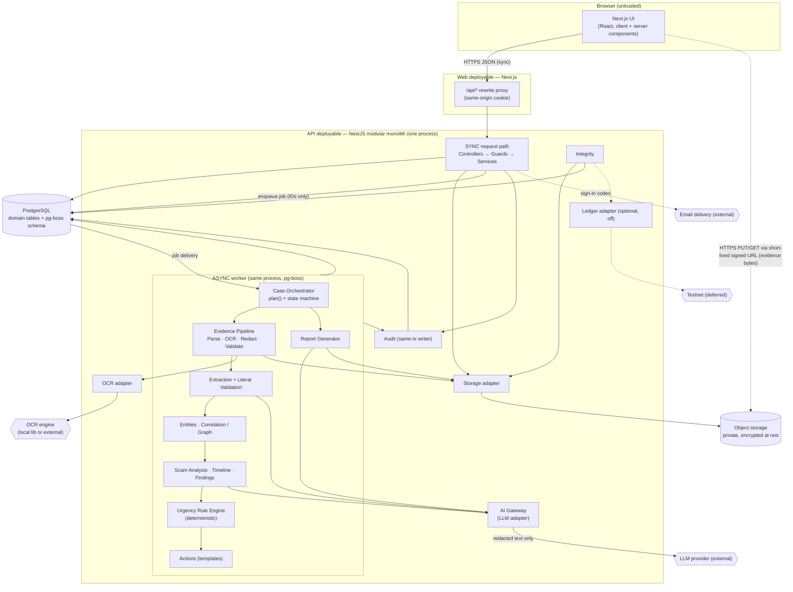
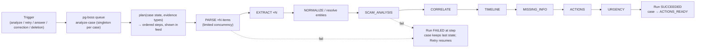
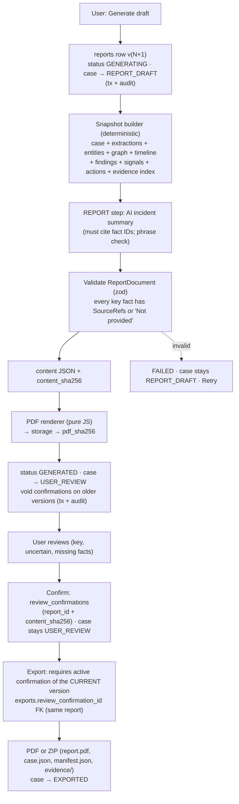
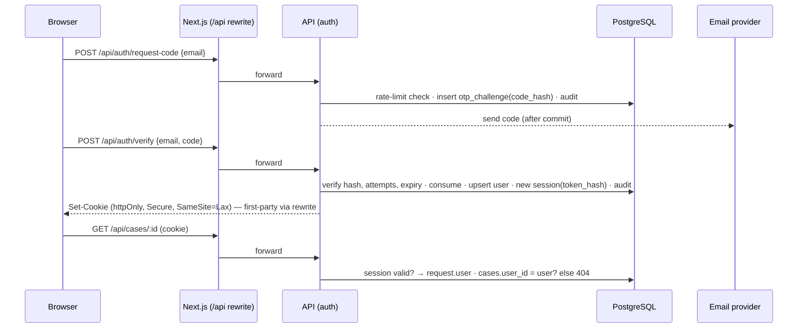
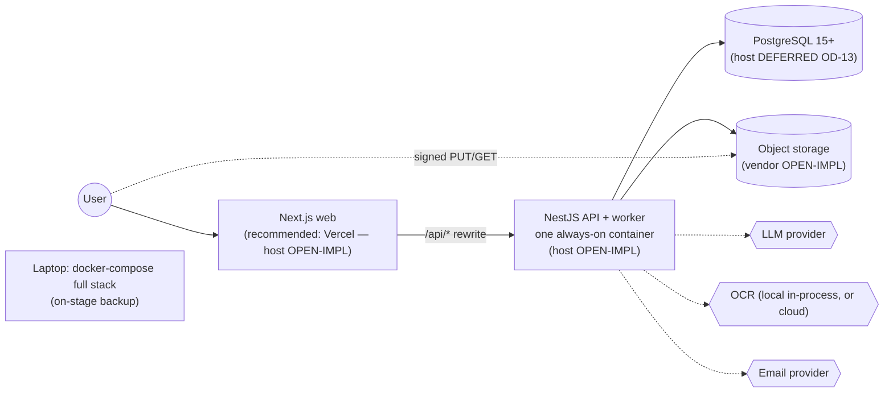
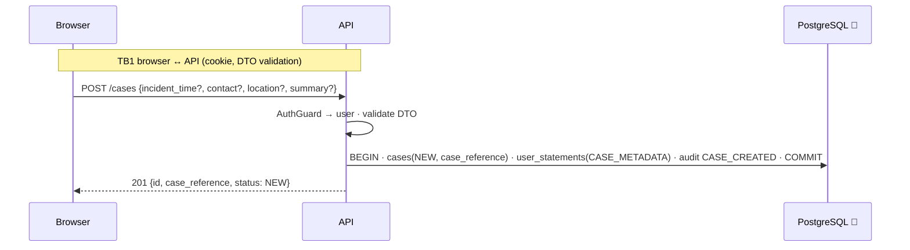
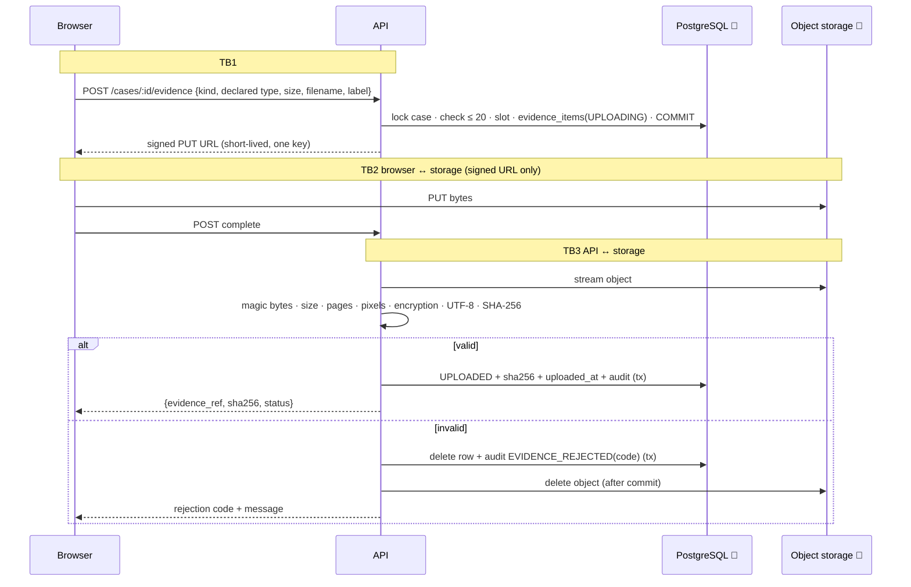
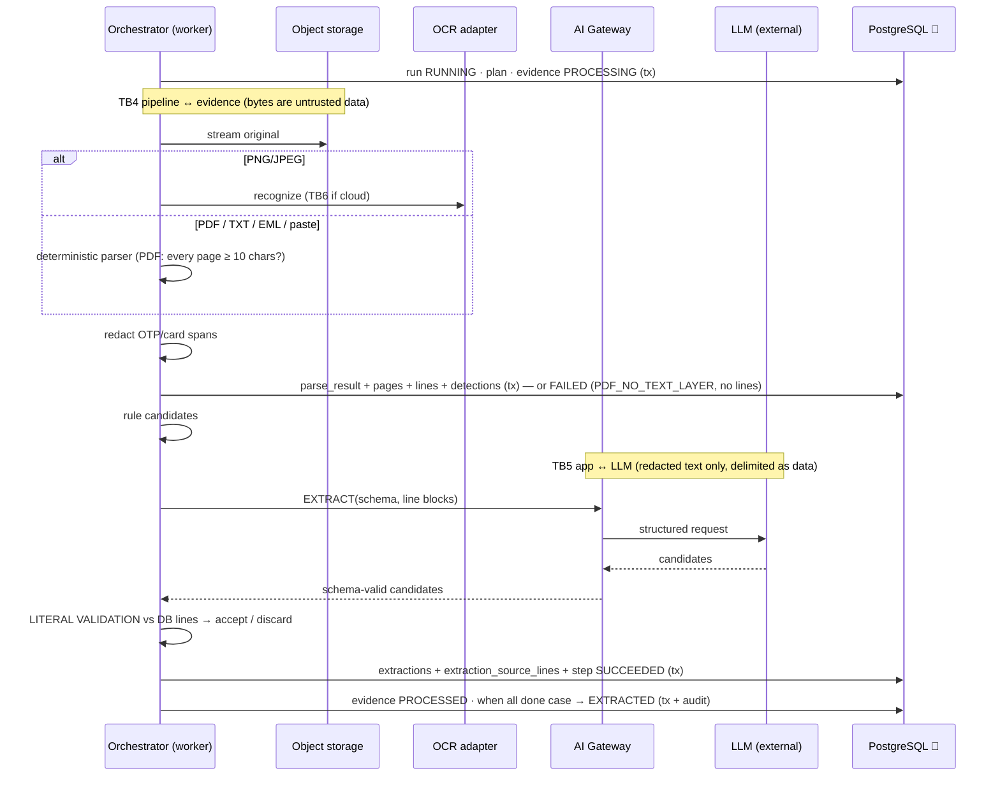
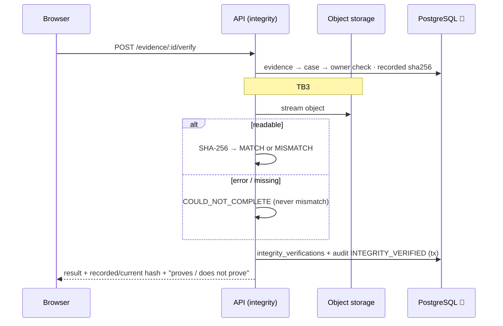

# Proofline — Technical Architecture

> **Trace the Evidence. Build the Case.**
> Evidence is the source of truth. AI produces derived analysis, not unquestioned facts.

| Field | Value |
|---|---|
| Product | **Proofline** |
| Document | Technical Architecture |
| File | `docs/04-TECHNICAL-ARCHITECTURE.md` |
| Version | 1.1 (consistency audit) |
| Status | Hackathon MVP. Architecture specification only. Contains no code, configuration, Docker or Prisma files. |
| Last updated | 2026-10-02 |
| Sources (authoritative) | `01-PROOFLINE-MASTER-SPEC.md` v1.0 · `02-PRODUCT-REQUIREMENTS.md` v1.0 · `DECISIONS.md` v0.2 · `03-DATABASE-SCHEMA.md` v1.1 |
| Precedence | `DECISIONS.md` §7–§8 → `03-DATABASE-SCHEMA.md` (persistence) → PRD → Master Spec |

### Labels used in this document

| Label | Meaning |
|---|---|
| **[RESOLVED]** | Fixed by a source document. The ID is cited. |
| **[ARCH-REC]** | An architecture recommendation made here so resolved behaviour can be implemented. It adds no product behaviour. |
| **[IMPL]** | An implementation detail that can change without changing the architecture. |
| **[OPEN-IMPL]** | A vendor or detail that `DECISIONS.md` §11 lists as an implementation decision. It is **not finalised** here. |
| **[DEFERRED]** | Deferred by `DECISIONS.md` §11. Never an MVP dependency. |

---

## 1. Architecture Overview

Proofline is a **modular monolith** (spec §18.1) with three deployables and a set of replaceable external providers.

| Part | Role | Status |
|---|---|---|
| **Next.js web app** (TypeScript) | Structured incident-response workspace: screens, forms, upload orchestration, polling. Holds **no business rules**. Talks to the API **same-origin** through `/api/*` rewrites. | [RESOLVED] spec §19; OD-04, OD-16 |
| **NestJS API + worker** (TypeScript, one process, one container) | All business logic: auth, authorisation, case state machine, validation, the evidence pipeline, the orchestrator, analysis, the urgency rule engine, reports, integrity, audit. The worker runs inside the same process (`WORKER_ENABLED`). | [RESOLVED] spec §18; OD-15, OD-16 |
| **PostgreSQL 15+** | System of record for all structured data (`03-DATABASE-SCHEMA.md`) and the job queue (pg-boss schema). | [RESOLVED] spec §19; OD-15. Host [DEFERRED] OD-13. |
| **Object storage** (S3-compatible or equivalent, private) | Evidence originals, canonical pasted bytes, report PDFs, export bundles. Encrypted at rest by the provider. | [RESOLVED] FR-005, OD-05, OD-14. Vendor [OPEN-IMPL]. |
| **OCR / document parsing** | Image OCR via an adapter. PDF text layer, TXT, EML and pasted text via deterministic parsers. **Never the LLM.** | [RESOLVED] FR-007, OD-03. Engine [OPEN-IMPL]. |
| **LLM** (tool-calling / structured-output capable) | Proposes candidates and writes calibrated explanations **inside** pipeline steps. Never controls flow, never produces source text, never decides urgency. | [RESOLVED] OD-02 contract, OD-12. Vendor [OPEN-IMPL]. |
| **Evidence pipeline + Case Orchestrator** | Deterministic state machine with a deterministic `plan()`. Runs as background jobs. | [RESOLVED] OD-12, AD-05, OD-15 |
| **Auth/session layer** | Email OTP, opaque DB sessions, httpOnly cookie | [RESOLVED] OD-04 |
| **Integrity ledger** (blockchain) | Optional adapter, off by default | [DEFERRED] OD-06 |

The architecture has **no microservices, no Redis, no message broker, no graph database, no vector store and no Kubernetes** (spec §19, principle §25.12).

---

## 2. System Architecture Diagram



Legend:
- **Solid arrows** are synchronous calls or the main data flow. **Dotted arrows** are direct browser↔storage transfers or optional/external side channels.
- The **BG** box is asynchronous (background job) processing.
- Cylinders are persistent stores. Hexagons are external providers.
- **AI calls** go only through the AI Gateway, and only from extraction, analysis and report steps.
- **Evidence bytes** flow browser → object storage → pipeline. They never pass through the web deployable.

---

## 3. Architectural Principles

| # | Principle | How the architecture enforces it | Source |
|---|---|---|---|
| P1 | **Evidence-first** | Originals are written once to object storage. Their SHA-256 is recorded at confirmation and is immutable. No component has an "update evidence bytes" operation. | EV-2, FR-004 |
| P2 | **Provenance-first** | No fact table can be written without its `fact_sources` / `extraction_source_lines` rows in the same transaction. The report renderer refuses unsourced key facts. | GR-06, NFR-04, AD-02 |
| P3 | **Deterministic before probabilistic** | Parsing, redaction, normalisation, literal validation, entity resolution, urgency, actions and checklists are deterministic code. The LLM is called only where language judgement is needed. | OD-12, NFR-11 |
| P4 | **AI is not the source of OCR** | Source text comes only from the OCR adapter or deterministic parsers. The LLM has no write path to `source_lines`. | FR-007, OD-03 |
| P5 | **AI outputs are derived** | AI output lands only in derived tables (signals, descriptions, summaries, candidates) labelled AI-derived. It never overwrites extractions or user statements. | NFR-07, GR-15 |
| P6 | **Case isolation** | Every job, query, prompt and storage key is scoped by exactly one `case_id`. Composite case FKs in the DB. | NFR-08 |
| P7 | **Least privilege** | Modules access only the tables they own. The LLM receives only the redacted lines a step needs. The app DB role cannot alter `audit_logs`. The browser never holds storage credentials. | NFR-02, §16.3 |
| P8 | **Fail closed** | Anything not validated is discarded or fails the step. A failure is shown, never papered over. | PRD §21 |
| P9 | **Auditable actions** | One audit writer, used inside the same DB transaction as the change. | FR-023 |
| P10 | **Provider abstraction** | LLM, OCR, storage, email and ledger sit behind internal interfaces selected by env. | spec §18.3, AD-06 |

---

## 4. Application Components

### 4.1 Frontend screens (spec §21; PRD §6)

| Screen | Purpose | Main backend modules used |
|---|---|---|
| Landing / New Case | What Proofline is and is not; official-channel links (static); create case | cases |
| Sign-in | Email → code → session | auth |
| Evidence Upload | Drag-drop, paste, per-item status and fingerprint | evidence |
| Processing / Agent Activity | Plan, steps, "N/N processed", fallback indicator | orchestrator (read model) |
| Incident Overview | Reference, status, loss, urgency + explanation, signals, entity counts, next actions | cases (overview read model), urgency, analysis |
| Timeline | Ordered events, precision, sources; correct, add, dismiss | timeline, provenance |
| Evidence Graph | Nodes and edges; provenance jump | graph, entities |
| Missing Information | "Not provided", contradictions, questions/answers | findings, provenance |
| Immediate Actions | Prioritised actions, channels, status toggles | actions |
| Complaint Draft | Version view, review confirmation, export | reports |
| Integrity Verification / Audit Log | Verify, recorded vs. current hash, proves/doesn't prove; audit list | integrity, audit |

### 4.2 Backend modules

| Module | Responsibility (one line) |
|---|---|
| **auth** | OTP challenges, sessions, cookie, global auth guard |
| **users** | User record (email, name, status) |
| **cases** | Case CRUD, ownership guard, `CaseStateService` (transitions), overview read model |
| **evidence** | Upload/paste lifecycle, limits, slots, confirmation, deletion, download links |
| **storage** | `ObjectStorage` adapter, key strategy, signed URLs, post-commit deletion |
| **processing** | Parser routing, OCR adapter, PDF text-layer check, EML parsing, redaction, `source_*` rows |
| **extraction** | Candidate generation (rules + LLM), literal validation, accepted extractions |
| **entities** | Normalisation, masking, entity resolution |
| **graph** | Relationship proposal and validation, `appears_in` view, graph query |
| **timeline** | Event generation, time normalisation, ordering, corrections, additions, dismissals |
| **findings** | Missing-information checklist, contradictions, follow-up questions and answers |
| **analysis** | Scam-signal classification with explanations |
| **urgency** | Deterministic G-2 rule engine |
| **actions** | Template-based action checklist; user status |
| **reports** | Snapshot builder, AI summary step, PDF renderer, versions, review confirmation, exports |
| **integrity** | Verification; optional ledger adapter |
| **audit** | Whitelisted, same-transaction audit writer; audit read model |
| **provenance** | `fact_sources`, `user_statements`, coverage checks |
| **orchestrator** | `plan()`, runs, steps, idempotency, re-entry, fallback disclosure |
| **ai** | AI Gateway: LLM adapter, prompt builder, schema validation, timeouts, metrics, cached fallback |
| **jobs** | pg-boss wiring (queues, singleton keys, retries) |
| **config / common** | Env validation, request context, errors, logging with redaction |

---

## 5. Modular Monolith Structure

### 5.1 Repository layout [RESOLVED AD-06]

```text
apps/
  web/            Next.js (App Router)
  api/            NestJS (API + worker)
    src/
      auth/  users/  cases/  evidence/  storage/  processing/  extraction/
      entities/  graph/  timeline/  findings/  analysis/  urgency/  actions/
      reports/  integrity/  audit/  provenance/  orchestrator/  ai/  jobs/
      config/  common/
packages/
  shared/         zod schemas + TS types: API payloads, step outputs, ReportDocument, enums
```

This layout is illustrative [ARCH-REC]. The module boundaries below are the requirement.

### 5.2 Module contracts

**Table ownership** below refers to `03-DATABASE-SCHEMA.md` table names. Only the owning module writes a table. Other modules read through the owner's service, or through read models where noted.

| Module | Inputs | Outputs | Depends on | Owns (writes) | Security boundary |
|---|---|---|---|---|---|
| auth | email, code, cookie | session, `request.user` | users, audit, email adapter | otp_challenges, sessions | Only module that sees codes and tokens (hashed at rest) |
| users | user ID | user profile | — | users | Email never leaves auth/users |
| cases | case input, user | case, overview | audit, provenance | cases | Owns `assertCaseAccess` and `CaseStateService` (all transitions) |
| evidence | file metadata, paste, confirm/delete | evidence items, signed URLs | storage, cases, audit, orchestrator (enqueue) | evidence_items | Enforces G-4 limits; content-type detection |
| storage | key, bytes/stream | signed URL, stream | provider SDK | object store | Only module holding storage credentials |
| processing | evidence ID | parse_results, source_pages, source_lines, sensitive_detections | storage, OCR adapter | those four tables | Treats bytes as untrusted. Redacts before persisting. |
| extraction | evidence ID + lines | extractions, extraction_source_lines | ai, processing (read) | extractions, extraction_source_lines | **Literal-validation boundary** (§12) |
| entities | extractions | entities, `extractions.entity_id` | extraction (read) | entities | Case-scoped canonicalisation |
| graph | entities, extractions | relationships, graph read model | ai (optional), provenance | relationships | Evidence-support check |
| timeline | DATETIME extractions, entities, statements | timeline_events, timeline_event_entities | ai, provenance | timeline_events, timeline_event_entities | Never invents times |
| findings | case facts, checklist | missing_information_items | ai (wording), provenance | missing_information_items | Answers become user statements |
| analysis | facts | scam_signals, `cases.incident_type` (via cases) | ai, provenance | scam_signals | Enum- and phrase-checked output |
| urgency | facts | urgency_assessments, urgency_reasons | provenance | those two tables | **No dependency on ai** (by construction) |
| actions | label, financial flag, facts | action_items | provenance | action_items | Channel codes only (GR-14) |
| reports | case facts | reports, review_confirmations, exports | ai, storage, provenance, cases | reports, review_confirmations, exports, export_evidence_items | Export gate |
| integrity | evidence ID | integrity_verifications | storage, ledger adapter | integrity_verifications | Read-only access to objects |
| audit | action, actor, target, metadata | audit rows | — | audit_logs | Metadata whitelist. Insert-only. |
| provenance | owner + refs | fact_sources, user_statements | — | fact_sources, user_statements | Same-case refs only |
| orchestrator | case ID, trigger | runs, steps, state transitions (via cases) | all pipeline modules, jobs | analysis_runs, agent_steps | Only component that sequences steps |
| ai | step name, schema, redacted blocks | validated object | LLM adapter, config | — (metrics → agent_steps via orchestrator) | Only component that talks to the LLM |

**Allowed interaction rule** [ARCH-REC]:
- Controllers call their own module's application service.
- Pipeline modules are called **only by the orchestrator**.
- No module calls the LLM except through `ai`.
- No module calls storage except through `storage`.
- Cross-module writes go through the owner's service, which is how invariants stay in one place.

### 5.3 Logical agents → modules

The spec's agents are logical units, not services (spec §10.4).

| Spec agent | Implemented by |
|---|---|
| Case Orchestrator | orchestrator + cases (`CaseStateService`) |
| Evidence / Extraction Agent | processing + extraction + entities |
| Evidence Correlation Agent (spec decomposition) | graph + findings |
| Scam Analysis Agent | analysis |
| Timeline Agent | timeline |
| Response Agent | actions (+ urgency, deterministic) |
| Report / Export Generator | reports |

### 5.4 Table ownership (all persistent objects in Document 03)

Document 03 defines **30 persistent tables**, **2 derived views** and **1 sequence** (schema §3.4). Each table has exactly one **owning module**. Only that module's services write the table. Other modules request writes through the owner's service.

Where another module computes a value for a column, the owning module performs the write on its behalf. These cases are listed in the third column.

| Database table | Owning module | Write responsibility (incl. delegated column writes) |
|---|---|---|
| users | users | Insert on first successful OTP verification (called by auth); profile/status updates |
| otp_challenges | auth | Insert, attempt count, consume |
| sessions | auth | Create on login, last-seen, revoke |
| cases | cases | All writes through `CaseStateService`/case service. `incident_type` is computed by analysis; `financial_loss_reported` and `checklist_variant` are computed by the urgency/findings derivations. cases writes all of them. |
| evidence_items | evidence | Create (slot), confirm (sha256), reject/delete. Status, failure code and page/pixel facts reported by processing are written through the evidence service. |
| parse_results | processing | Insert/replace per parse |
| source_pages | processing | Insert with parse |
| source_lines | processing | Insert (redacted text) with parse |
| sensitive_detections | processing | Insert with parse |
| extractions | extraction | Insert validated rows; correction columns via the extraction correction use case. `entity_id` is set by entities through the extraction service. |
| extraction_source_lines | extraction | Insert with each extraction |
| user_statements | provenance | Insert only (append-only), requested by cases, findings, timeline, extraction |
| entities | entities | Upsert / orphan sweep |
| relationships | graph | Upsert / orphan sweep |
| fact_sources | provenance | Insert/delete, requested by graph, timeline, findings, analysis, actions, urgency, entities |
| timeline_events | timeline | Upsert, correction, add, dismiss |
| timeline_event_entities | timeline | Insert/replace with events |
| analysis_runs | orchestrator | Create, status, plan, fallback flag |
| agent_steps | orchestrator | Create, status, idempotency key, AI metrics (from the ai module) |
| scam_signals | analysis | Replace per run |
| missing_information_items | findings | Upsert; answer linkage; resolution |
| action_items | actions | Upsert by `action_code`; user status updates |
| urgency_assessments | urgency | Insert; `is_current` flip |
| urgency_reasons | urgency | Insert with assessment |
| reports | reports | Create version, generate, fail, invalidate |
| review_confirmations | reports | Confirm, void |
| exports | reports | Create, ready, fail, delete |
| export_evidence_items | reports | Insert with export |
| integrity_verifications | integrity | Insert only |
| audit_logs | audit | Insert only (`AuditService.record(tx, …)`); no update/delete |

| Non-table object | Kind | Write responsibility |
|---|---|---|
| `entity_evidence_links` | **Derived view** (schema §11.1) | None. Read by graph and entities. Computed from `extractions`. |
| `case_overview` | **Derived view** (schema §5.3) | None. Read by the cases overview. |
| `case_reference_seq` | **Sequence** | Used by the `cases.case_reference` default |
| pg-boss schema | **Queue infrastructure, not in Document 03** (OD-15) | Managed by the pg-boss library through the jobs module. Excluded from Prisma migrations (schema §28.3). |

Summary: 30 tables → 30 owners, with no table without an owner and no table with two owners. The 2 views and the sequence have no write owner, by design.

---

## 6. Frontend Architecture

| Concern | Architecture |
|---|---|
| Framework | Next.js App Router + TypeScript (spec §19). No additional UI framework is mandated here. Component library and graph renderer are chosen in docs 10/11. |
| Routing [ARCH-REC] | `/` landing · `/sign-in` · `/cases` · `/cases/new` · `/cases/[id]` overview · `/cases/[id]/evidence` · `/cases/[id]/activity` · `/cases/[id]/timeline` · `/cases/[id]/graph` · `/cases/[id]/missing` · `/cases/[id]/actions` · `/cases/[id]/report` · `/cases/[id]/integrity` (verification + audit log) |
| Server/client boundary | Server components may render shells and static content (landing copy, curated official-channel links). **Case data is fetched from the API with the user's cookie.** The web app has **no direct database or storage credentials**. Interactive screens (upload, timeline editing, graph, polling) are client components. |
| API communication | One typed fetch client calling same-origin `/api/*`. Request and response bodies are validated with `packages/shared` zod schemas. Errors are mapped to typed error codes. |
| State | Server state = API responses (re-fetched after mutations). Polling hooks for runs and evidence status (OD-10 default). Local UI state only (forms, selection). No global client store is required. |
| Form validation | Shared zod schemas for **fast feedback** (size, type, count, paste length). The **server is authoritative** (G-4). |
| Upload flow | §8.2. The browser PUTs bytes directly to storage with a signed URL. It never computes the fingerprint; the server does. |
| Processing display | Poll `analysis_runs` / `agent_steps` / evidence status about every 1.5 s while a run is active. Render the plan, steps, "N/N processed" and the fallback badge. |
| Error handling | Map PRD §21 failure codes to fixed copy (doc 10). Never show raw server errors. Retry buttons appear only when `retryable`. |
| Authorisation handling | Next.js middleware redirects to `/sign-in` when there is no session cookie. **This is UX only.** Every API call is authorised server-side. A 404 for an unowned case is shown as "not found". |
| Rendering untrusted content | Evidence text, snippets and statements are rendered as text (escaped), never as HTML. Suspicious URLs are displayed as text, and the app never fetches them (FR-003). |
| No business logic | Urgency, labels, checklists, state transitions, validation decisions and report contents all come from the API. The UI only displays them. |

---

## 7. Backend Request Architecture

```text
HTTP request (via Next.js /api rewrite)
  ↓ Request-context middleware   → request_id, start time, structured logger (redacting)
  ↓ Controller                   → route binding only
  ↓ DTO validation               → shared zod schemas; reject unknown fields
  ↓ Authentication (AuthGuard)   → session cookie → session row → request.user; Origin check on mutations
  ↓ Authorisation (CaseGuard)    → assertCaseAccess(user, caseId); unowned ⇒ 404
  ↓ Application service / use case
  ↓ Domain logic                 → invariants, state transitions, limits
  ↓ Repository (Prisma)          → case-scoped queries in a DB transaction (+ audit insert)
  ↓ PostgreSQL
  ↓ (after commit) side effects  → enqueue job, delete object, issue signed URL
```

| Layer | Does | Does not |
|---|---|---|
| Controller | Bind route, call one use case | Hold logic or touch the DB |
| Use case / service | Orchestrate a transaction; call domain rules; write audit | Call providers inside DB transactions (except quick metadata reads) |
| Repository | Case-scoped persistence | Cross-case queries |
| Provider adapter | Talk to storage, OCR, LLM, email, ledger | Know about cases beyond the IDs passed |
| Background worker | Execute pipeline steps from jobs | Accept HTTP input |

**Evidence-upload special flow:** the API never receives file bytes. It issues a signed upload URL, the browser uploads to storage, and the API then **reads the stored object** to validate and hash it (§8). Pasted text is the exception: it is small, so it arrives in the request body.

---

## 8. Evidence Ingestion Architecture

### 8.1 Lifecycle

```text
1  POST evidence (metadata: kind, declared type, size, filename, label)
     → validate declared type/size/count  → allocate slot (case lock)  → evidence_items(UPLOADING)
     → issue short-lived signed PUT URL (storage key = opaque)
2  Browser PUTs bytes directly to object storage
3  POST complete
     → stream stored object → detect type by magic bytes → check size, page count, pixels,
       encryption, UTF-8 (TXT) → compute SHA-256 over the stored bytes
     → pass: evidence_items(UPLOADED, sha256, uploaded_at) + audit EVIDENCE_UPLOADED   (one tx)
     → fail: delete row + audit EVIDENCE_REJECTED (code, no filename)  (one tx); delete object after commit
4  POST /cases/:id/analyze → run enqueued → processing: parse/OCR → page validation → redaction
     → source_pages/source_lines (one tx) → extraction (candidates → literal validation → accepted)
     → extractions + extraction_source_lines (+ provenance) (one tx per item)
```

Pasted text/URL: the API receives the content, checks it is ≤ 20,000 characters, canonicalises it (G-3, doc 07), hashes it, puts the canonical bytes to storage, then records the row as `UPLOADED`, all before responding. The storage put happens before the DB commit. If the commit fails, a cleanup job deletes the orphan object.

### 8.2 Where each limit is enforced [RESOLVED G-4, OD-14; schema §6.2]

| Rule | Browser | API step 1 | API step 3 (authoritative) | Processing | DB backstop |
|---|---|---|---|---|---|
| Supported types (PNG, JPEG, PDF, TXT, EML; pasted TEXT/URL) | ✓ | declared | **magic bytes** | — | enum + `detected_content_type` check |
| 10 MB/file, non-empty | ✓ | declared | **actual size** | — | `byte_size` check; bucket limit |
| 20 items/case | ✓ | **slot allocation** | — | — | `sequence_no` 1–20 unique |
| PDF ≤ 20 pages; encrypted PDF rejected | — | — | **✓** | — | `page_count` check |
| Image ≤ 40 MP | — | — | **✓** (header dimensions) | — | width × height check |
| Pasted ≤ 20,000 chars | ✓ | **✓** | — | — | `text_char_count` check |
| TXT valid UTF-8 | — | — | **✓** | — | — |
| `.msg` / mailbox formats | ✓ | ✓ | ✓ | — | no enum value |
| PDF text layer (≥ 10 non-whitespace chars on **every** page) | — | — | — | **✓** → `FAILED / PDF_NO_TEXT_LAYER`, not retryable | `failure_retryable` check |
| `.eml` unparseable / encrypted | — | — | — | **✓** → FAILED, not retryable | — |

Rejected uploads leave **no evidence row**. Email links are never opened. Email attachments are listed in `source_metadata`, never processed.

---

## 9. Object Storage Architecture

| Concern | Architecture |
|---|---|
| Abstraction | `ObjectStorage` interface: `createSignedUploadUrl`, `createSignedDownloadUrl`, `getObjectStream`, `putObject`, `deleteObject`, `headObject` [RESOLVED OD-14] |
| Vendor | [OPEN-IMPL]. `DECISIONS.md` OD-14 recommends Supabase Storage (locally via the Supabase CLI stack), with an S3-compatible alternative (MinIO / R2 / S3). The architecture depends only on the interface. |
| Key strategy [ARCH-REC] | `cases/{caseId}/evidence/{evidenceId}`, `cases/{caseId}/reports/{reportId}.pdf`, `cases/{caseId}/exports/{exportId}.{pdf\|zip}`. Opaque UUIDs only: **no filenames, labels or PII in keys**. The case prefix makes case deletion and orphan reconciliation simple. |
| Visibility | **Private bucket only.** There are no public URLs. |
| Upload | Short-lived signed PUT URL, scoped to one key, issued after the ownership check. Storage CORS allows only the web origin. |
| Download / preview | Short-lived signed GET URL issued after the ownership check, and audited (`EVIDENCE_VIEWED`, `EXPORT_DOWNLOADED`) [RESOLVED FR-005] |
| Hashing | The server computes SHA-256 by streaming the stored object at confirmation (step 3). The browser's hash is never trusted [RESOLVED FR-004, OD-14]. |
| Encryption | Provider-managed at rest + TLS [RESOLVED OD-05]. Wording: "encrypted at rest", never "end-to-end". |
| Deletion | Objects are deleted **after** the DB transaction that removes their rows commits, with retry. Failures are logged by key only and reconciled by a cleanup job [ARCH-REC]. |
| Retention | Kept until the user deletes. No auto-expiry [RESOLVED OD-11]. |

---

## 10. Evidence Processing Pipeline

| Stage | Kind | Output | Persisted in |
|---|---|---|---|
| Type validation | **Deterministic** | accept / reject | evidence_items |
| Parsing (PDF text layer, TXT, EML, pasted, URL string) | **Deterministic** | pages, lines | source_pages, source_lines |
| OCR (PNG/JPEG only) | **Deterministic-ish engine** (no LLM) | lines + bbox + confidence | source_lines |
| Sensitive redaction (OTP, card numbers) | **Deterministic** | masked line text + span records | source_lines.text, sensitive_detections |
| Candidate extraction | **Rules (deterministic) + LLM (probabilistic)** | candidates `{type, value, line_ids}` | not persisted |
| **Literal validation** | **Deterministic** | accept / discard | extractions (accepted only) |
| Normalisation + masking | **Deterministic** | canonical / masked values | extractions, entities |
| Entity resolution | **Deterministic** | entities | entities |
| Correlation | **Rules + LLM proposals, deterministic validation** | relationships | relationships + fact_sources |
| Timeline | **LLM-assisted typing/description; deterministic times and validation** | events | timeline_events |
| Analysis (scam signals) | **LLM-assisted, enum + citation + phrase validated** | labels | scam_signals |
| Findings | **Deterministic checklist; LLM wording only** | items, questions | missing_information_items |
| Urgency | **Deterministic only** | level + reasons | urgency_assessments |
| Actions | **Deterministic templates** | checklist | action_items |
| Corrections, answers, additions, dismissals, review confirmation, action status | **User-confirmed** | statements, corrected values | user_statements, correction columns, review_confirmations |

**Bypass prevention.** The `extractions` repository exposes a single insert operation. It accepts only a `ValidatedCandidate` value, and the only constructor of that value is the literal validator, which takes the candidate plus the referenced `source_lines` loaded from the DB. Because LLM output types are not assignable to `ValidatedCandidate`, unvalidated values cannot reach the trusted table through any code path [ARCH-REC]. Rule INV-X1 (schema §22) is the persistent statement of this boundary.

---

## 11. OCR and Document Parsing

### 11.1 Adapter

`OcrEngine.recognize(imageStream) → { engine, engineVersion, width, height, lines[{ text, bbox(normalised 0–1), confidence }] }` [RESOLVED OD-03 contract]

- Engine [OPEN-IMPL]: tesseract.js first, with WASM language data bundled (never downloaded at demo time). Switch to a cloud OCR adapter if the day-1 spike misreads key fields (especially ₹ in E02).
- With **local OCR**, images never leave the API process. With **cloud OCR**, the trust boundary changes, because images, including any unredacted OTP, are sent to that provider (§33).

### 11.2 Parsers by type

| Type | Parser | Locations |
|---|---|---|
| PNG / JPEG | OCR adapter | page 1, line N, bbox |
| PDF | PDF text-layer extraction with positions (e.g., pdf.js-class library) [IMPL] | page N, line N, bbox where available |
| TXT | UTF-8 line split | page 1, line N |
| Pasted text | Canonical bytes (G-3) → line split | page 1, line N |
| Pasted URL | String parse only | page 1, line 1 |
| EML | MIME parser: headers From/To/Cc/Reply-To/Return-Path/Subject/Date/Message-ID; text/plain preferred, otherwise HTML converted to text (no remote loads, no script execution) | `EMAIL_HEADER` + header name; `EMAIL_BODY_LINE` + line N |

### 11.3 Scanned-PDF rule [RESOLVED OD-03, `DECISIONS.md` §7.1]

```text
for each page: count non-whitespace characters in the embedded text layer
if every page ≥ 10 → persist pages + lines (one tx) → continue
else              → persist pages only (counts, has_usable_text_layer = false)
                    evidence FAILED, failure_code = PDF_NO_TEXT_LAYER,
                    failure_detail.pages_without_text = [...], failure_retryable = false
                    NO lines, NO extractions, NO redaction records
                    UI: "upload the affected page(s) as PNG/JPG, then remove this PDF" — Remove only
```

There is no PDF rasterisation and no PDF OCR anywhere in the MVP.

---

## 12. Extraction Architecture (security boundary)

| Layer | What it is | Trusted? |
|---|---|---|
| **Source text** | `source_lines` from OCR or parsers only (redacted) | Yes, as a record of what the evidence shows. Not as a claim about truth. |
| **Candidate extraction** | Proposals from deterministic patterns and from the LLM: `{field_type, value, line_ids, label?}` | **No.** Held in memory only. |
| **Validation** | Load the referenced lines (same evidence, same case). Check the value occurs **literally** (after the documented comparison normalisation) in their concatenated text. Check type-specific format (phone, URL, UPI ID, UTR, amount). For bank/wallet names (GR-05), require presence in the text. | — |
| **Accepted extraction** | `extractions` + `extraction_source_lines`, with raw value, normalised value, method, confidence (identifier confidence = OCR line confidence × validator result), band and snippet | **Yes** (validated against source) |
| **Normalisation** | Canonical form for correlation (rules in doc 07; must reproduce `DECISIONS.md` §7.2.4) | Deterministic |
| **Provenance** | Evidence + page/line/bbox + snippet + method | Mandatory |

Discarded candidates are counted in `agent_steps.output_summary` (no values) (EX-4). The LLM never sees OTP values, because redaction happens before lines are stored and before any prompt is built.

---

## 13. AI / LLM Architecture

### 13.1 AI Gateway (`ai` module)

```text
step → AiGateway.generate(stepName, schema, instructions, evidenceBlocks)
         ├─ PromptBuilder: fixed system/developer instructions per step (versioned)
         │                 + evidence as DELIMITED DATA blocks with line IDs (redacted text)
         ├─ LlmProvider adapter (vendor SDK) — structured output bound to the JSON Schema
         │      (tool calling is used only as the structured-output mechanism: one "submit_result"
         │       tool whose input schema is the step schema; no side-effecting tools exist)
         ├─ timeout (fixed, short) · max 1 retry on transient error or schema-invalid output
         ├─ zod validation of the result → step-specific deterministic validation (§12, §15–§17)
         ├─ metrics: provider, model, latency, token counts, retry count → agent_steps
         └─ fallback: CachedLlmProvider only if DEMO_FALLBACK allows AND every evidence SHA-256
                      in scope is in the committed synthetic manifest (AD-06)
```

### 13.2 Where the LLM is used

| Step | LLM role | Deterministic guard |
|---|---|---|
| EXTRACT | Propose candidates with line IDs | Literal validation (§12) |
| CORRELATE | Propose entity-to-entity relationships | Both entities must be supported by extractions in each cited evidence item; type pair allowed (schema §11.4) |
| TIMELINE | Type events, write neutral descriptions, propose order for undated events | Times come only from DATETIME extractions or user statements. Sources required. Precision set by rule. |
| SCAM_ANALYSIS | Choose labels from the fixed enum; write a calibrated explanation | Enum; one primary; ≥ 1 citation to existing case facts; forbidden-phrase check (GR-12) |
| MISSING_INFO | Phrase questions | Which fields are missing and contradicted is decided by the deterministic checklist |
| REPORT | Write the incident summary paragraph | Must cite fact IDs present in the snapshot; phrase check |
| **Never** | Urgency, actions, official channels, state transitions, OCR, identifier values | — |

### 13.3 Prompt-injection protection (evidence is untrusted input)

1. **Instruction/data separation:** step instructions are fixed, versioned code. Evidence is inserted only as clearly delimited data blocks, and the instructions state that block contents are data.
2. **No authority for evidence:** the model's output can only fill the step schema. Control flow is decided by the deterministic orchestrator (OD-12), so text such as "ignore previous instructions" cannot change which step runs.
3. **No side-effecting tools:** the model cannot fetch URLs, call APIs, read other cases, write data or open evidence links.
4. **Output validation:** schema → enum → citation existence → literal validation → phrase checks. Anything else is discarded or fails the step.
5. **Minimal context:** one case and one step's lines only. Redacted text.

   **Text-only LLM input by default: architecture/security recommendation, not a product requirement.**
   - OD-02's accepted contract makes images an **optional** parameter (`generateStructured(…, images?)`). It does not require sending them.
   - Evidence images can contain OTPs or card numbers that text redaction cannot remove from the pixels (GR-09). Sending only redacted text reduces unnecessary exposure to the provider (SP-8).
   - The **capability is retained**: OD-02's vendor criterion "image input" still applies, and the adapter keeps the optional parameter. Using images would be a documented configuration change, not a decision change.
   - This does not reopen OD-02.
6. **No persistence of prompts or completions** beyond metrics (§27).
7. **Regression test:** the AC-20 injection fixture (doc 13/15).

### 13.4 Token and cost boundaries [ARCH-REC]

- About one EXTRACT call per evidence item, plus one call each for CORRELATE, TIMELINE, SCAM_ANALYSIS and MISSING_INFO per run, plus one REPORT call per version.
- Each call has a maximum output size, with a per-run cap on calls.
- Only lines relevant to the step are sent.
- Exact limits [IMPL] are in doc 06.

### 13.5 Failure handling

| Failure | Handling |
|---|---|
| Timeout or provider error | One retry. If it fails again, the step FAILS (run FAILED, Retry offered). For synthetic-manifest evidence with `DEMO_FALLBACK=auto`, cached output is used and disclosed. |
| Invalid output | One re-ask. If still invalid, the step FAILS. |
| Validation discards everything | Not a failure. The result is "No key details found". |

---

## 14. Agent Orchestration

### 14.1 Run model [RESOLVED OD-12, AD-05, OD-15]



| Element | Behaviour |
|---|---|
| Invocation order | As in the diagram. Status transitions go through `CaseStateService` (INGESTING → EXTRACTED → ANALYZING → CORRELATED → TIMELINE_READY → ACTIONS_READY). Report generation is a separate `REPORT_GENERATION` run started by the user. |
| Plan | `plan()` is a pure function of case state, evidence types and the re-entry point. Example: no OCR for pasted text. It is stored in `analysis_runs.plan` and shown in the feed. |
| Inputs/outputs | Each step reads persisted outputs of earlier steps and writes its own tables plus `agent_steps` status in **one transaction**. |
| Provenance propagation | Each step writes `fact_sources` alongside its facts, so provenance is never reconstructed afterwards. |
| Idempotency | `agent_steps` key `(case, step, evidence?, input_hash)`. A SUCCEEDED step with the same key is skipped. Writes upsert by natural keys (§23). |
| Failure | The step and run are marked FAILED, with failure code and retryable flag. The case does not change state. Retry creates a new run that resumes at the failed step. |
| Concurrency | One active run per case (DB partial unique index + pg-boss singleton key). |
| Re-analysis | The S-4 entry point decides which steps re-run (e.g., answer → MISSING_INFO, ACTIONS, URGENCY only) (§23). |
| Deletion races | Every step re-checks that the case and evidence still exist inside its transaction, and exits cleanly otherwise (INV-D2). |

---

## 15. Analysis Architecture

```text
Observed facts (extractions, entities, timeline events, user statements, sensitive_detections)
   ↓ deterministic derivations
Derived signals: financial_loss_reported (U1) · credential/OTP exposure (U2) · checklist variant
   ↓ analysis
Scam signals (LLM, validated) · Contradictions & missing info (deterministic) · Urgency (rules)
   ↓ recommendations
Action checklist (templates + curated channel codes)
```

| Output | How it is produced | Sources preserved by |
|---|---|---|
| Scam classification and signals | LLM selects from the enum and explains. Then: one primary, `UNKNOWN_OTHER` alone, citations exist, phrase check. `cases.incident_type` = primary. | `fact_sources(scam_signal_id)` |
| Contradictions | Deterministic comparison of extractions/statements for the same fact (time tolerance in doc 08: must flag 12:19 vs ~12:40, must not flag ~12:05) | ≥ 2 `fact_sources` |
| Missing information | Deterministic NCRP checklist (PRD §14.1) by variant. ID document = `INFORMATIONAL`. Questions only for high-value gaps. | `fact_sources(missing_info_item_id)` |
| **Urgency** | **Rule engine only** [RESOLVED G-2]: no ACTIONS_READY yet → "Not assessed yet" (no row); U1 → HIGH; ¬U1 ∧ U2 → MEDIUM; else LOW. `rule_version = G2-v1`. Template explanation + disclaimer. Reasons ordered highest first, one per transaction. | `urgency_reasons` + `fact_sources` |
| Actions | Curated templates keyed by label, financial flag and entities. Channel codes from a static list (GR-14). Upsert by `action_code`, preserving user status. | `fact_sources(action_item_id)` |

The `urgency` module has no import path to `ai`, which is enforced by module boundaries and a lint rule [ARCH-REC]. The DB CHECK in schema §14.1 rejects any level that does not match its signals.

---

## 16. Timeline Architecture

| Concern | Architecture |
|---|---|
| Event generation | The TIMELINE step builds candidate events from DATETIME extractions, related entities and user statements. The LLM assigns the event type (schema §12.3 vocabulary) and a neutral description. |
| Time normalisation | Deterministic parser for the formats in the dataset ("12:03 PM", "24 Sep 2026, 12:19 PM", "24-09-26 12:21", "Around 12:05 PM"). Rules in doc 07/08. |
| Storage / display | `event_at` stored in **UTC**, displayed in **IST**. `time_source_text` keeps the original text [RESOLVED G-5 via schema §2]. |
| Precision | `EXACT` (full date/time in source), `APPROXIMATE` ("around", or date inferred from case evidence as in E03), `INFERRED_ORDER_ONLY` (no time; `event_at` null). Never an invented time (TL-3). |
| Ordering | `sort_order`: timed events by `event_at`. Ties broken by precision (EXACT first), then evidence ref, then line number. Undated events are placed after the event they follow in their own source, as proposed by the LLM, and marked as inferred. Recomputed after every change. |
| Sources | ≥ 1 `fact_sources` per event (extraction or user statement) |
| Contradictions | Findings module (§15); badge on the event |
| Corrections | User statement (CORRECTION) → `original_*` kept → `USER_CORRECTED` → case → TIMELINE_READY → re-run ACTIONS and URGENCY → confirmation voided. Re-runs never overwrite corrected or dismissed events (`event_key` upsert rule). |
| User confirmation | User-added events have USER_STATEMENT sources and `origin = USER_ADDED` |

---

## 17. Evidence Graph Architecture

| Concern | Architecture |
|---|---|
| Entity resolution | Deterministic: `(case, entity_type, canonical_value)` upsert. Formats merge after normalisation (e.g., the three phone formats → `+919000000001`). |
| Relationship creation | Deterministic rules (e.g., URL → DOMAIN `HOSTED_ON`; receipt structure → `PAID_TO`, `AMOUNT_OF`, `DEBITED_FROM`) plus LLM proposals. Each accepted only if every cited evidence item contains extractions for **both** entities. |
| Evidence support | **One edge per (from, type, to)**. Every supporting artifact is one more `fact_sources` row, never a duplicate edge (schema §11.3). |
| `appears_in` | **Derived** from extractions (`entity_evidence_links` view). Not stored. |
| Graph query | One case-scoped read: case node + entities (masked by default) + evidence nodes + `appears_in` edges + relationships with source counts. Node click → provenance (extractions → lines → evidence preview link). |

---

## 18. Report Architecture



Guarantees [RESOLVED R-1, FR-019, OD-07, AD-04]:
- Confirmation stores `report_id` + `content_sha256`. The service checks that the report is the current GENERATED version and that the hash matches.
- **An export for version N+1 cannot use a confirmation of version N.** A composite FK ties `exports(review_confirmation_id, report_id)` to the same report, and the gate checks that this report is current and the confirmation is not voided.
- Any S-4 change, regeneration or evidence deletion voids confirmations.
- The PDF uses a pure-JS renderer (no headless browser) [RESOLVED OD-07].
- ZIP originals are streamed from storage byte-for-byte, so manifest hashes match.

---

## 19. Integrity Architecture

| Step | Behaviour |
|---|---|
| Initial hash | At upload confirmation: stream the stored object → SHA-256 → `evidence_items.sha256` + `uploaded_at` (immutable) |
| Verification (on demand) | Stream the stored object → recompute → compare with recorded → insert `integrity_verifications` + audit `INTEGRITY_VERIFIED` (one tx) |
| Match / mismatch | `MATCH` if equal; `MISMATCH` if different (both hashes shown) |
| Unreadable | Storage error or missing object → `COULD_NOT_COMPLETE` with failure code. **Never reported as mismatch.** |
| Meaning | **Hash equality proves byte equality since fingerprinting. It does not prove truth, authenticity or legal admissibility** (IN-7, spec §15.3). This is fixed UI copy. |
| Blockchain | `LedgerAdapter`, disabled (`LEDGER_ENABLED=false`) [DEFERRED OD-06]. No MVP path calls it. |

---

## 20. Audit Architecture

| Concern | Architecture |
|---|---|
| Audited actions | Schema §19.3 vocabulary (auth, case, evidence, analysis, corrections, answers, actions, reports, exports, integrity, fallback use) |
| Actor | `USER` (session user ID) or `SYSTEM` (worker) |
| Target | type + ID (no FK) |
| Time / result / IDs | `occurred_at`, `outcome`, `request_id` (HTTP) or run/step ID (worker) in whitelisted metadata |
| Metadata | **Whitelist per action**: IDs, evidence refs, hashes, enum codes, counts, version numbers. **Raw evidence, snippets, values, filenames, labels, statements, emails and IPs are rejected.** |
| Writer | `AuditService.record(tx, …)` accepts only a transaction handle. It cannot be called outside a transaction. |
| Atomicity | The audit insert is in the **same DB transaction** as the change. If it fails, the transaction rolls back and the action fails (PRD FR-023). |
| External side effects | Released **after** commit (signed URL issued, object deleted, export file published). A failed side effect is recorded as a follow-up `FAILED` entry. |
| Append-only | The app DB role has INSERT/SELECT only on `audit_logs`; a trigger blocks UPDATE/DELETE. |

---

## 21. Security Architecture

The detailed controls are in doc 09. Architecture-level controls:

| Threat / area | Control |
|---|---|
| Authentication | Email OTP (hashed, expiring, attempt-limited) → opaque session (hashed in DB), httpOnly + Secure + SameSite=Lax cookie, rotation on login, logout revokes [OD-04] |
| Authorisation / case isolation | Global AuthGuard + CaseGuard. Case-scoped repositories. Composite case FKs. Unowned ⇒ 404. Jobs carry `case_id` and re-check existence. One case per LLM call. |
| CSRF | SameSite=Lax + JSON-only mutations + Origin check |
| Upload validation / malicious files | Magic-byte type detection; size, page and pixel caps before parsing (decompression-bomb guard); parsers run on bytes as data; HTML email bodies converted to text and never rendered; no execution of content |
| Prompt injection | §13.3 |
| Cross-case leakage | No cross-case queries, views, caches or indexes. Prompt builder takes one `case_id`. Fallback keyed by artifact hash, not by case. |
| Evidence tampering | Immutable SHA-256 + verification (§19). No byte-update path. |
| Unauthorised object access | Private bucket, opaque keys, short-lived signed URLs after the ownership check |
| Sensitive data exposure | Redaction before persistence. Masked display defaults. Sensitive columns never logged or audited. |
| Secrets | Host secret stores only. Never in the repo. Nothing secret under `NEXT_PUBLIC_*`. Storage, LLM and OCR keys only in the API. |
| Logging | Structured logs with a redaction allow-list (§27) |
| Rate limiting | OTP request/verify per email and per client fingerprint. Upload and analyse endpoints per user [ARCH-REC]. |
| Dependency security | Lockfile, pinned versions, dependency audit in CI [IMPL] |
| Least privilege | Separate migration/app DB roles. Storage credentials only in the storage module. |

No security certification or compliance claim is made.

---

## 22. Failure Handling

| Failure | Retryable? | Who acts | Behaviour |
|---|---|---|---|
| Invalid upload (type mismatch, empty, not UTF-8) | No | **User** | Rejected, no row, clear message |
| Oversized upload / too many items / > 20 pages / > 40 MP / paste too long | No | **User** | Rejected with a limit message |
| Unsupported format (HEIC, WebP, .msg, .mbox, DOCX…) | No | **User** | Rejected, supported types listed |
| Unreadable evidence (no readable text in image) | Yes (Retry) | User (retry or remove) | Item FAILED `NO_READABLE_TEXT` |
| Scanned PDF | **No** | **User** (upload pages as PNG/JPG, remove PDF) | FAILED `PDF_NO_TEXT_LAYER`, Remove only |
| OCR failure (engine error) | Yes | System (auto-retry once), then user Retry | Item FAILED `OCR_FAILED` |
| Parser failure (PDF/TXT) | Yes | User Retry | Item FAILED |
| `.eml` unparseable / encrypted | No | **User** (save as .eml or paste text) | FAILED, guidance |
| LLM timeout | Yes | System (1 retry), then user Retry; fallback for synthetic set only | Step FAILED |
| LLM invalid output | Yes | System (1 re-ask), then user Retry | Step FAILED; nothing persisted |
| Provenance / literal validation failure | — (not an error) | — | Candidate discarded and counted. Never persisted. |
| Database failure | Yes | **System** (transaction rolls back), user retries the action | Action fails visibly; no partial state |
| Object-storage failure | Yes | System retry; user retries | Upload/preview/export/verify fails visibly. Verification → `COULD_NOT_COMPLETE`. |
| Report-generation failure | Yes | User Retry | Version FAILED; case stays REPORT_DRAFT; earlier versions viewable |
| Integrity verification cannot read the object | Yes | User Retry | `COULD_NOT_COMPLETE`, not mismatch |
| Audit-write failure | Yes | **System** | The whole action rolls back and fails (FR-023) |
| Email delivery failure (sign-in code) | Yes | User requests a new code | Visible error |
| Post-commit object deletion failure | Yes | **System** (cleanup job) | Logged by key; reconciled |

---

## 23. Idempotency and Reprocessing

| Risk | Prevention |
|---|---|
| Duplicate evidence processing | `agent_steps` idempotency key `(case, step, evidence, input_hash)`. Only `UPLOADED`/retryable-`FAILED` items enter processing. One active run per case. |
| Duplicate entities | `UNIQUE (case, type, canonical_value)` + upsert |
| Duplicate relationships | `UNIQUE (case, from, type, to)` + upsert. Extra support = extra `fact_sources` row. |
| Duplicate timeline events | `event_key` upsert. Corrected and dismissed events are never overwritten. |
| Duplicate findings / actions | `finding_key` / `action_code` upsert (answers and user status preserved) |
| Duplicate reports | Version numbers allocated under the case lock. A new version is always an explicit user action. |
| Duplicate jobs | pg-boss singleton key per case + DB partial unique index on active runs |

**Re-analysis (S-4 re-entry, AD-05):**

| Change | Steps re-run |
|---|---|
| New evidence | PARSE/EXTRACT for new items only, then NORMALIZE onward |
| Extraction correction | From NORMALIZE / SCAM_ANALYSIS onward |
| Timeline correction | ACTIONS, URGENCY |
| Follow-up answer | MISSING_INFO, ACTIONS, URGENCY (TIMELINE first if a time changed). No evidence reprocessing. |

**Evidence deletion — [SCHEMA/IMPLEMENTATION RECOMMENDATION from schema §24.6, not a source requirement]:** scam signals, actions and missing-information items are deleted and rebuilt by the next analysis. Action "done" marks may therefore reset, and the audit log keeps their history. The mark-preserving alternative in schema §24.6 is compatible with this architecture.

**Required by sources:** removal of dependent extractions, entities, relationships and timeline events; report invalidation; confirmation voiding; case → INGESTING/NEW (FR-025, OD-11). Urgency follows G-2 + FR-025 as specified in schema §14.4.

---

## 24. Transaction Boundaries

| Operation | Atomic DB transaction contains | Outside the transaction (not transactional with PostgreSQL) |
|---|---|---|
| Case creation | case row + metadata statement + audit | — |
| Evidence step 1 | slot allocation (case lock) + UPLOADING row | Signed URL issued after commit |
| Evidence confirmation | status UPLOADED + sha256 + audit, **or** row delete + rejection audit | Reading/hashing the object happens **before** the tx; rejected object deleted **after** commit |
| Pasted evidence | row + audit | Object `put` **before** the tx; orphan cleanup if the tx fails |
| Parse result | parse_result + pages + lines + detections + evidence status | OCR call happens **before** the tx |
| Extraction acceptance | extractions + extraction_source_lines + step status | LLM call **before** the tx; validation inside |
| Relationship / timeline / signals / findings / actions / urgency | facts + `fact_sources` + step status (+ state transition + audit) | LLM call before the tx |
| Corrections / answers / dismissals | statement + updated rows + state rewind + confirmation void + audit | Job enqueue (pg-boss insert can share the tx) |
| Report generation start / finish | row GENERATING + state + audit / content + hashes + GENERATED + state + voids + audit | AI summary and PDF render/upload **between** the two transactions |
| Report confirmation | confirmation row (checksum check) + audit | — |
| Export | exports row + audit; READY + state + audit | Bundle build/upload between them |
| Integrity verification | verification row + audit | Object read before the tx |
| Evidence/case deletion | all row deletions + invalidations + voids + state + tombstone audit | Object deletions **after** commit (retry + reconcile) |
| Every audited change | change + audit row | — |

External operations (object storage, LLM, OCR, email, blockchain) are **never assumed transactional**. The pattern is: do the external work first and store its result atomically, or commit first and then release the side effect with retry and reconciliation.

---

## 25. API Architecture

The endpoints are those of spec §20. The PRD's additional needs are grouped by module here; the contract is defined in doc 05.

| Group | Endpoints (spec §20) and needs (spec §20 "TO BE DEFINED" list) | Module |
|---|---|---|
| Auth | request code, verify code, logout | auth |
| Cases | `POST /cases`, `GET /cases/:id`, list cases, delete case, audit log | cases, audit |
| Evidence | `POST /cases/:id/evidence` (file → signed URL / paste), complete upload (OD-14), list, get/download link, delete | evidence, storage |
| Analysis | `POST /cases/:id/analyze`, activity/status feed | orchestrator |
| Entities | `GET /cases/:id/entities`, correct extraction/entity | entities, extraction |
| Timeline | `GET /cases/:id/timeline`, correct, add, dismiss event | timeline |
| Graph | `GET /cases/:id/graph` | graph |
| Missing info | list findings, answer/skip question | findings |
| Actions | `GET /cases/:id/actions`, update status | actions |
| Reports | `POST /cases/:id/report`, list versions, confirm version, `POST /cases/:id/export`, download export | reports |
| Integrity | `POST /evidence/:id/verify` | integrity |

All case-scoped routes run through AuthGuard and CaseGuard. Evidence-scoped routes resolve `evidence → case` before the ownership check.

---

## 26. Authentication and Authorisation



- **Email only.** No phone/SMS, no SSO, no sharing [RESOLVED OD-01, OD-04].
- Protected evidence access always goes ownership check → short-lived signed URL → audit.
- Email delivery uses the `EmailTransport` adapter: `console` only outside production; vendor [OPEN-IMPL].
- There is no sign-in bypass in the deployed app (AU-8).

---

## 27. Observability

| Signal | Architecture |
|---|---|
| Structured logs | JSON logs with `request_id`, `user_id`, `case_id`, `run_id`, `step_id`, module, event, duration, error code. A **redaction allow-list**: only IDs, codes, counts and durations are logged. |
| Request IDs | Generated at the edge of the API (or taken from the proxy). Echoed in responses and audit metadata. |
| Processing IDs | `run_id` / `step_id` on every worker log line and in `agent_steps` |
| Error tracking | Errors are logged with codes and stack traces (no payloads). An external error tracker is optional [IMPL]. |
| Performance | Durations per request and per step. Upload→draft time for the demo (NFR-06). |
| AI metrics | Provider, model, latency, token counts, retries and fallback use, per step (`agent_steps`). **Prompt and completion bodies are not stored or logged.** |
| Evidence metrics | Items by status, failure codes, parse/OCR durations, discarded-candidate counts |
| **Never logged** | Screenshots or bytes, evidence text, snippets, extracted values, OTPs, card numbers, emails, codes, tokens, prompt contents, statement text, filenames, labels |

---

## 28. Performance and Scalability

| Area | MVP target / approach |
|---|---|
| End-to-end | Upload → usable draft **< 2 min** for the six-artifact case in the demo environment (NFR-06). This is the only stated target; there are no SLAs. |
| Upload | Direct-to-storage PUT; the API only hashes (≤ 10 MB streams) |
| Processing | Per-item PARSE/EXTRACT with limited concurrency (e.g., 2–3) [IMPL]. Local OCR CPU shares the single process, which is acceptable at demo scale. |
| AI latency | Short fixed timeouts plus one retry. Few calls per run (§13.4). Fallback for the synthetic set. |
| Report | Deterministic snapshot + one AI call + pure-JS PDF |
| DB queries | Case-scoped indexed reads (schema §21). The graph is one case-scoped query set. |
| Concurrency | One run per case; many cases can run in parallel within the worker's limits |
| Background processing | pg-boss in-process. It can be split into a separate worker process from the same codebase via `WORKER_ENABLED`. |
| Not introduced | Kafka, Kubernetes, microservices, Redis, CDN or edge functions for the API |

---

## 29. External Provider Abstraction

| Port (internal interface) | Implementations | When unavailable |
|---|---|---|
| `LlmProvider` | Vendor adapter [OPEN-IMPL]; `CachedLlmProvider` (synthetic set only) | Step fails visibly. Disclosed fallback only for manifest hashes (FR-027). |
| `OcrEngine` | tesseract.js (local) first [OPEN-IMPL]; cloud OCR adapter optional | Local: no network dependency. Cloud: item FAILED `OCR_FAILED`; fallback for synthetic set. |
| `ObjectStorage` | Supabase Storage or S3-compatible [OPEN-IMPL] | Uploads, previews, exports and verifications fail visibly. Verify → `COULD_NOT_COMPLETE`. |
| `EmailTransport` | `console` (non-production), transactional email/SMTP [OPEN-IMPL] | Sign-in code send fails visibly |
| `LedgerAdapter` | none in MVP; EVM testnet if OD-06 is built | Never blocks anything; "attestation unavailable" |
| `PdfRenderer` | Pure-JS library [IMPL] | Report generation fails → Retry |

Providers are selected by env (`LLM_PROVIDER`, `OCR_PROVIDER`, `STORAGE_DRIVER`, `EMAIL_TRANSPORT`, `LEDGER_ENABLED`) [RESOLVED AD-06]. Application code depends only on the ports.

---

## 30. Environment Architecture

| Environment | Description |
|---|---|
| Local | Docker Compose: PostgreSQL + a storage emulator (Supabase CLI stack or MinIO). API and web run via pnpm dev. Email `console`. OCR local. LLM real or `DEMO_FALLBACK=force` for offline rehearsal. This is also the **on-stage backup** for the demo (OD-16). |
| Test | Automated tests: ephemeral DB, storage emulator, fake LLM/OCR adapters, synthetic fixtures. Not a hosted environment. |
| Production / demo | One deployed environment, no staging (AD-06). Fallback `auto`. |

| Config category | Examples (names illustrative; no `.env` files are created) |
|---|---|
| Database | `DATABASE_URL` (direct connection for pg-boss) |
| Storage | `STORAGE_DRIVER`, bucket, credentials, signed-URL lifetime |
| AI | `LLM_PROVIDER`, `LLM_MODEL`, API key, timeouts |
| OCR | `OCR_PROVIDER`, credentials if cloud |
| Auth | Session lifetime, OTP expiry and attempts, cookie settings |
| Email | `EMAIL_TRANSPORT`, credentials |
| Integrity | `LEDGER_ENABLED` (+ network/RPC/key only if OD-06 is built) |
| App | `WORKER_ENABLED`, `DEMO_FALLBACK`, web origin, API URL for rewrites |

All config is validated with zod at boot, and the process refuses to start if it is invalid. Secrets are kept in host secret stores, never in source control [RESOLVED AD-06].

---

## 31. Deployment Architecture



- The API is never deployed as serverless functions (worker, long OCR) [RESOLVED OD-15/16].
- Avoid free tiers that sleep.
- `prisma migrate deploy` on release. A health-check endpoint is provided.
- No architectural dependency on a specific Postgres host or any blockchain host.

---

## 32. Data Flow Diagrams

Trust boundaries are marked **TB** (see §33). Persistence points are marked **💾**.

### 32.1 New case creation



### 32.2 Evidence upload



### 32.3 Evidence processing



### 32.4 AI analysis (correlation → urgency)

```mermaid
sequenceDiagram
    participant O as Orchestrator
    participant AI as AI Gateway
    participant DB as PostgreSQL 💾
    O->>DB: entities upsert (deterministic) (tx)
    O->>AI: SCAM_ANALYSIS (facts as data)
    AI-->>O: labels + explanations
    O->>O: enum · one primary · citations exist · phrase check
    O->>DB: scam_signals + fact_sources · incident_type · case → ANALYZING→… (tx + audit)
    O->>AI: CORRELATE proposals
    O->>O: both entities supported in each cited evidence item?
    O->>DB: relationships upsert + fact_sources · case → CORRELATED (tx)
    O->>AI: TIMELINE typing/descriptions
    O->>O: times only from extractions/statements · precision rule · sort_order
    O->>DB: timeline_events upsert + sources · case → TIMELINE_READY (tx)
    O->>DB: findings (deterministic checklist; AI wording only) (tx)
    O->>DB: actions (templates, channel codes) (tx)
    O->>O: URGENCY rule engine (no AI) → level, reasons
    O->>DB: urgency_assessments + reasons + sources · case → ACTIONS_READY · run SUCCEEDED (tx + audit)
```

### 32.5 Report generation and review

See the diagram in §18. Persistence points: `reports` (GENERATING → GENERATED), object storage (PDF), `review_confirmations`, `exports`. TB5 (summary call) and TB3 (PDF upload) are crossed.

### 32.6 Integrity verification



---

## 33. Trust Boundaries

| # | Boundary | Data crossing | Validation | AuthN / AuthZ | Risks | Controls |
|---|---|---|---|---|---|---|
| TB1 | Browser ↔ API | JSON requests/responses, cookie | Shared zod DTOs; unknown fields rejected; output encoding in UI | Session cookie; CaseGuard; Origin check | Session theft, CSRF, IDOR, XSS via evidence text | httpOnly cookie, SameSite=Lax, 404 on unowned, escaped rendering, rate limits |
| TB2 | Browser ↔ object storage | Evidence bytes (PUT), downloads (GET) | Server re-validates after PUT | Signed URL scoped to one key, short-lived, issued after ownership check | URL leakage, oversize/forged content | Short TTL, opaque keys, server-side magic-byte and size checks, private bucket, CORS limited to the web origin |
| TB3 | API ↔ object storage | Originals, PDFs, bundles | Hash on read; content-type checks | Service credentials only in the storage module | Credential leak, tampering, unavailability | Least-privilege credentials, immutable hash, `COULD_NOT_COMPLETE` semantics |
| TB4 | Processing pipeline ↔ evidence content | Untrusted bytes and text | Type detection, caps before parsing, parsers treat content as data | n/a (worker context, case-scoped job) | Malicious files, parser exploits, decompression bombs, hidden instructions | Caps (pages/pixels/size), no execution, HTML not rendered, redaction, content never used as control input |
| TB5 | Application ↔ LLM | Redacted source lines for one case and step; step instructions | Structured-output schema; zod; enum; citations; literal validation; phrase checks | API key in env (API only) | Prompt injection, data leakage to provider, fabricated identifiers, cost blow-up | §13.3 controls, text-only default, minimal context, no tools with side effects, token/call caps, provider data terms (SP-8) |
| TB6 | Application ↔ OCR | Images (local: none leave the process; cloud: images incl. unredacted OTPs) | Output treated as text data | Key if cloud | Data exposure to OCR vendor; misreads | Prefer local engine; benchmark K fields; literal validation is downstream |
| TB7 | API ↔ database | All structured data | Prisma types + DB constraints | App role (no DDL, insert-only audit) | Injection, cross-case writes | Parameterised queries, composite case FKs, CHECKs, triggers |
| TB8 | Application ↔ other providers (email, optional ledger) | Email: address + code. Ledger (deferred): hash + timestamp + opaque ref only. | Fixed templates | Keys in env | Code interception; on-chain PII | Short-lived single-use codes; ledger off; no PII on-chain (N5) |

---

## 34. Demo Architecture

The six-artifact dataset (`DECISIONS.md` §7.2) flows through **generic** components. Nothing is hard-coded.

| Stage | What happens for E01–E06 | Determinism source |
|---|---|---|
| Upload | E01–E05 via signed PUT + complete; E06 pasted (canonical bytes) | — |
| Storage + SHA-256 | The server hash equals the committed manifest (S-H2) | Frozen committed files |
| Processing | E01/E02/E03/E05 → OCR; E04 → PDF text layer (1 page ≥ 10 chars); E06 → text parse. E02's OTP redacted + detection row. | Clean rendering spec (≥ 32 px text); deterministic parsers |
| Extraction | Rule + LLM candidates → literal validation → K fields of §7.2.4 | Validation is deterministic. Fallback (disclosed) serves cached candidates for manifest hashes if the LLM fails. |
| Correlation | One PHONE (E01/E02/E06), URL + DOMAIN (E01/E02/E03), UPI (E02/E04/E05), TRANSACTION (E04/E05); R1–R7 edges with multi-source support | Deterministic normalisation + upsert |
| Timeline | T1–T9; T5 approximate (date inferred); T8 contradiction with E06 | Deterministic time parsing and precision |
| Scam analysis | KYC_IMPERSONATION primary; PHISHING, UPI_FRAUD | LLM within the enum, validated (fallback available) |
| Urgency | HIGH (U1 via E04/E05; U2 via E03 event + E02 OTP detection) | Rule engine `G2-v1` |
| Missing info | Bank/wallet "Not provided" + question; ID document informational; payment-time contradiction | Deterministic checklist |
| Actions | CONTACT_BANK, REPORT_1930_NCRP, PRESERVE_EVIDENCE (+ REPORT_SUSPECT_NCRP) | Templates |
| Report | v1 GENERATED → USER_REVIEW; answer "Example Bank" → user statement → regenerate v2 | Snapshot builder deterministic; one AI paragraph |
| User review | Confirm v2 (checksum-bound) → export PDF/ZIP → EXPORTED | DB-enforced gate |
| Integrity | Verify each item → MATCH; QA tamper fixture → MISMATCH | SHA-256 |

---

## 35. Technology Decision Table

| Layer | Technology | Status | Reason |
|---|---|---|---|
| Frontend | Next.js + TypeScript (App Router) | **Resolved** (spec §19) | Source stack |
| Backend | NestJS + TypeScript, modular monolith | **Resolved** (spec §18–§19) | Source stack; small team |
| Database | PostgreSQL 15+ | **Resolved** (spec §19). Host **deferred** (OD-13). | Relational graph, queue, constraints |
| ORM | Prisma (+ raw SQL migrations for CHECKs, partial indexes, triggers, views) | **Resolved** (spec §19 brief) | Typed access; schema §28 |
| Job queue | pg-boss in-process | **Resolved** (OD-15) | No new infrastructure |
| Shared contracts | pnpm monorepo, `packages/shared` zod | **Resolved** (AD-06) | Typed contracts (principle §25.4) |
| Object storage | Private S3-compatible / Supabase Storage behind `ObjectStorage` | Flow **resolved** (OD-14). Vendor **recommended**, not final. | Signed URLs, encryption at rest |
| OCR | `OcrEngine` adapter; tesseract.js first | Contract **resolved** (OD-03). Engine **recommended**; final after spike. | Local, free, offline |
| PDF text / EML parsing | Deterministic parser libraries [IMPL] | **Recommended** | OD-03, G-4 |
| LLM | `LlmProvider` adapter with structured output | Contract **resolved** (OD-02). Vendor **deferred to implementation**. | Credits/data terms not in sources |
| Authentication | Email OTP + opaque DB sessions, httpOnly cookie, same-origin | **Resolved** (OD-04). Email vendor **recommended later**. | Revocable, auditable |
| Report rendering | Structured JSON → pure-JS PDF; ZIP bundle | **Resolved** (OD-07) | No headless browser |
| Integrity hashing | SHA-256 (server-side, streamed) | **Resolved** (FR-004, FR-021) | |
| Optional blockchain | EVM testnet via `LedgerAdapter`, off | **Deferred** (OD-06) | Never on the critical path |
| Activity delivery | Polling | **Deferred** default (OD-10) | Works through the rewrite proxy |
| Deployment | Next.js web host (**recommended: Vercel**) + always-on container (API) + managed DB/storage + docker-compose backup | Shape **resolved** (OD-16). **All hosting vendors, including the web host, are implementation decisions** (`DECISIONS.md` §11). Vercel is recommended only. Postgres host **deferred** (OD-13). | Simple, low cost |

---

## 36. Architectural Trade-offs

| Choice | Chosen | Reason | Consequence | Future path |
|---|---|---|---|---|
| Modular monolith vs. microservices | **Monolith** (spec §18.1) | One codebase, one deploy, one DB transaction scope | Shared process resources | Split the worker by `WORKER_ENABLED`; extract modules along existing boundaries |
| Sync vs. background processing | **Background jobs** for analysis/report; sync for CRUD/upload confirm | FR-006 non-blocking; OCR/LLM latency | Needs polling and job-state UI | SSE later (OD-10) |
| PostgreSQL graph vs. graph DB | **PostgreSQL relations** (spec §13.5) | Case-scoped small graphs; one transaction scope | No graph query language | Graph analytics are future scope |
| Provider abstraction vs. direct SDK | **Ports + adapters** (spec §18.3) | Fallback, swapping, testing | A thin interface layer | Add vendors without touching domain code |
| Deterministic validation vs. LLM trust | **Deterministic validation boundary** | GR-01–GR-05, NFR-11 | Some true values may be discarded if OCR misreads them | Better OCR via the adapter |
| Object storage vs. DB binaries | **Object storage** (FR-005) | Signed URLs, provider encryption, DB stays lean | Two-store consistency handling (§24) | — |
| Optional vs. mandatory blockchain | **Optional, off** (OD-06) | Not on the critical path; no PII on-chain | No public timestamp proof in the MVP | Enable `LedgerAdapter` if the team decides |

---

## 37. Traceability Matrix

| Component | Master Spec | PRD | Decisions | Schema (03) |
|---|---|---|---|---|
| Next.js app, routing, screens | §19, §21 | §6, NFR-12 | OD-04, OD-10, OD-16 | — |
| Auth / sessions | FR-026, §16.1 | FR-026, §19 AU-1–AU-8 | OD-01, OD-04 | §4.2–§4.4 |
| Cases + state service | FR-001, §6.4 | FR-001, §6.3 S-1–S-6, §13.8 | AD-05, R-1 | §5, §23.1 |
| Evidence ingestion + limits | FR-002–FR-005, §16.3 | FR-002–FR-005, §8, §9 | G-4, OD-14, OD-05 | §6, §23.2 |
| Storage adapter | FR-005, §18.3 | SP-1, SP-6 | OD-05, OD-14 | §6.1 (`storage_key`) |
| Processing / OCR / parsing | FR-007 | FR-007, §8.3 | OD-03 (§7.1), G-4 (§7.4) | §7, §8 |
| Redaction | GR-09 | FR-009, SP-9 | AD-03 (OTP) | §9.6 |
| Extraction boundary | FR-008, GR-01–GR-05, §11 | FR-008, §10 EX-1–EX-5 | OD-02, OD-03, AD-02 | §9 |
| Entities / graph | FR-009, FR-011, §13 | FR-009, FR-011, §12 CR-1–CR-5 | AD-02, G-6 | §10, §11 |
| Timeline | FR-012, FR-013, §14 | §13 TL-1–TL-8 | AD-05, G-5, G-6 | §12 |
| Findings | FR-014, FR-015, §3.4 | §14 MI-1–MI-7 | AD-01, OD-09 | §13 |
| Scam analysis | FR-010, §10.4 | §11 SA-1–SA-7 | AD-01 | §15 |
| Urgency engine | §21.1 | AC-R3 | **G-2** (§7.3) | §14 |
| Actions | FR-016, GR-14 | §15 AC-R1–AC-R7 | AD-01 | §16 |
| Orchestrator + jobs | FR-006, FR-024, FR-027, §10 | FR-006, FR-024, FR-027 | OD-12, OD-15, AD-05, AD-06 | §15 (runs/steps), §21 |
| AI gateway | §10, §11 GR-10, §16.1 | §10.2, SP-4, SP-8 | OD-02, OD-12, AD-06 | `agent_steps` |
| Reports / review / export | FR-017–FR-020 | FR-017–FR-020, §16, §18 | AD-04, OD-07, R-1 | §17 |
| Integrity | FR-021, FR-022, §15 | FR-021, §17 IN-1–IN-8 | OD-06 | §18 |
| Audit | FR-023, §16.2 | FR-023, SP-5 | OD-11 | §19 |
| Deletion | FR-025 | FR-025 | OD-11 | §24 |
| Security architecture | §16 | §20 SP-1–SP-13 | OD-04, OD-05 | §20 |
| Environments / deployment | §19 | — | AD-06, OD-13, OD-16 | §2, §28 |
| Demo | §22 | §22 | AD-03 (§7.2) | §25 |

---

## 38. Implementation Boundaries

Document 04 does **not** define the following:

| Topic | Owner document |
|---|---|
| Table/column definitions, constraints, Prisma mapping | `03-DATABASE-SCHEMA.md` |
| Endpoint payloads, errors, pagination, status codes | `05-API-SPECIFICATION.md` |
| Prompts, step schemas, label heuristics, confidence thresholds, action templates, checklist detail | `06-AI-AGENT-SPECIFICATION.md` |
| Parser details, canonical text bytes (G-3), normalisation/masking rules, OTP detector | `07-EVIDENCE-PROCESSING-PIPELINE.md` |
| Relationship rules, ordering algorithm, contradiction tolerance | `08-EVIDENCE-GRAPH-TIMELINE.md` |
| Detailed security controls, rate-limit values, key handling | `09-SECURITY-PRIVACY-INTEGRITY.md` |
| Screen layouts, copy, interaction details | `10-FRONTEND-UX-SPECIFICATION.md` |
| Visual design | `11-DESIGN-SYSTEM.md` |
| Demo script; synthetic files, manifest, benchmark | `12-DEMO-SCENARIO.md`, `13-SYNTHETIC-DATA-SPECIFICATION.md` |
| Schedule; test plans | `14-IMPLEMENTATION-ROADMAP.md`, `15-TESTING-STRATEGY.md` |

---

## 39. Architecture Readiness Checklist

- [x] Architecture supports all MVP requirements (FR-001–FR-027; FR-022/FR-028 optional or deferred).
- [x] Architecture matches the database schema (§5.4: 30 tables → 30 owning modules; 2 derived views and 1 sequence with no write owner; pg-boss schema outside Document 03).
- [x] Architecture matches resolved decisions (OD-01–OD-16 as resolved/deferred; AD-01–AD-06; G-2, G-4; R-1, R-2).
- [x] No deferred feature is required for the MVP (OD-06, OD-08, OD-09, OD-10, OD-13).
- [x] Evidence remains the source of truth (immutable objects + hashes; no byte-update path).
- [x] Provenance is preserved end to end (same-transaction `fact_sources`; renderer refusal).
- [x] The LLM cannot fabricate trusted evidence (no OCR role; `ValidatedCandidate` boundary; literal validation).
- [x] Prompt injection is addressed (§13.3, TB5).
- [x] Case isolation is enforced (guards, case-scoped jobs/prompts/keys, composite FKs).
- [x] Deterministic urgency is preserved (rule engine with no AI dependency; DB CHECK).
- [x] Scanned PDFs fail correctly (§11.3).
- [x] `.eml` behaviour is supported (§11.2, §8.2).
- [x] Report version confirmation is safe (checksum + composite FK + current-version check).
- [x] Integrity verification is supported (`COULD_NOT_COMPLETE` ≠ mismatch).
- [x] Audit logging is supported without raw evidence leakage (whitelist, same-transaction writer).
- [x] The six-artifact demo flow is supported (§34).
- [x] The architecture is implementable by the hackathon team (one backend process, three deployables).
- [x] External providers can be replaced (§29 ports).
- [x] No unnecessary microservices or infrastructure were introduced.
- [x] All major architectural decisions have traceability (§37).
- [x] No unresolved architectural contradiction remains.

**Consistency notes:**
- **(a) LLM image input.** Text-only input is the default as an **architecture/security recommendation** (§13.3). OD-02 makes images optional, not required. The vendor image-input criterion and the optional adapter parameter are retained. No decision is reopened.
- **(b) Vercel.** OD-16 accepted the deployment **shape** (web host + one always-on API container + managed DB/storage + local backup). `DECISIONS.md` §11 lists hosting vendors as implementation decisions. Vercel is therefore a **recommendation**, not a dependency: the architecture requires only a Next.js host that supports `/api/*` rewrites to the API. Container, DB and storage hosts remain open; the Postgres host is deferred (OD-13).
- **(c) Table count.** Document 03 has 30 tables (not 31), 2 derived views and 1 sequence. Ownership is complete and unique (§5.4). v1.0 listed `export_evidence_items` under two modules; this is corrected (owner: reports).

No contradiction with Documents 01–03 or `DECISIONS.md` was found.

**Final status: READY FOR IMPLEMENTATION**
