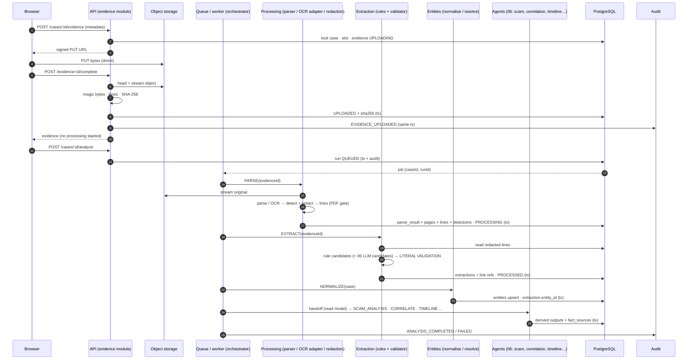

# Proofline — Evidence Processing Pipeline

> **Original stored evidence is authoritative. Everything the pipeline produces is a derived representation.**

| Field | Value |
|---|---|
| Product | **Proofline** |
| Document | Evidence Processing Pipeline |
| File | `docs/07-EVIDENCE-PROCESSING-PIPELINE.md` |
| Version | 1.0 |
| Status | Hackathon MVP. Implementation-level specification. No code, SDK calls, schema or prompts. |
| Last updated | 2026-10-02 |
| Frozen sources | `01` Master Spec · `02` PRD · `03` Database Schema v1.1 · `04` Technical Architecture v1.1 · `05` API Specification · `06` AI Agent Specification · `DECISIONS.md` v0.2 |
| Precedence | `DECISIONS.md` §7–§8 → 03 → 04 → 05 → 06 → PRD → Master Spec |

### Labels used in this document

| Label | Meaning |
|---|---|
| **[RESOLVED]** | Fixed by a frozen source. The ID is cited. |
| **[DELEGATED]** | Items the frozen documents hand to Document 07: canonical bytes for pasted text (G-3); normalisation and masking rules; OTP/card detector patterns; parser details; rule-extraction patterns; URL tracking-parameter list (`DECISIONS.md` §11; 03 §27; 04 §38; 06 §35). Settled here. |
| **[PIPE-REC]** | A pipeline design recommendation that adds no product behaviour |
| **[IMPL]** | A configurable engineering value |

### Notes on the request (sources followed)

- **N-1. Completion does not start processing.** The request describes `POST /evidence/:id/complete` as "begins processing". PRD FR-002 states "Upload does **not** start analysis. The user starts analysis (FR-006)". Document 05 §8.2 and §11 agree. Here, completion **validates, fingerprints and accepts** the item. Processing (PARSE/EXTRACT) begins when the user calls `POST /cases/:id/analyze`.
- **N-2. Upload-phase failure codes.** Document 03's enum includes `TRANSFER_FAILED`, `FINGERPRINT_FAILED` and `STORAGE_UNAVAILABLE`, but its evidence state machine (03 §23.2) has **no** `UPLOADING → FAILED` transition. This document keeps upload-phase failures on `UPLOADING`, returns them as API errors (05 §8.2: 409/503), and records them in audit. The item is shown as failed with retry/remove, as PRD FR-002/FR-004 require. The `FAILED` status is used only during processing. This is a non-blocking note; no decision is changed.

---

## 1. Purpose and Scope

The **Evidence Processing Pipeline** is the deterministic substrate that turns an uploaded artifact into **trusted, provenance-bearing source material**:
- fingerprint;
- validated type and limits;
- redacted **source lines**;
- **literally validated extractions**;
- resolved **entities**;
- **handoff objects** for the Document 06 agents.

| Owns | Does not own |
|---|---|
| Registration, signed upload, completion (G-4 limits, magic bytes, SHA-256) | Agent reasoning (scam analysis, timeline typing, relationship proposals, questions): Document 06 |
| Parsing (PDF text layer, TXT, EML, paste, URL string) and image OCR via the adapter | Report generation: 06 §15 / 04 §18 |
| Sensitive-value detection and redaction | Integrity verification (re-hashing later): 04 §19 / 05 §21. The pipeline only creates the **baseline** hash. |
| Source pages, lines and sensitive-detection records | Correlation decisions beyond deterministic entity resolution: 06 §7 |
| Deterministic candidate extraction, literal validation, normalisation, masking, entity resolution | API contract: 05. Schema: 03. |

```text
Evidence Processing (this doc)  →  produces trusted source material + validated facts + entities
AI Agent Reasoning (06)         →  interprets validated facts; may only add validated candidates
Report Generation (06 §15)      →  assembles provenance-backed versions from both
Integrity Verification (04 §19) →  re-hashes stored originals against the baseline created here
```

**Where processing begins and ends:**
- **Begins** at `POST /cases/:id/evidence` (registration).
- **Ends** when an item is `PROCESSED` or `FAILED`, its extractions are validated, its entities are resolved, and the handoff to CORRELATE/TIMELINE/SCAM_ANALYSIS is available (§20–§21).

---

## 2. Processing Pipeline Overview

```text
SYNC (HTTP request)                                   ASYNC (analysis run, worker)
───────────────────                                   ─────────────────────────────
POST /cases/:id/evidence  → register (UPLOADING)      POST /cases/:id/analyze → run (QUEUED→RUNNING)
Browser PUT → storage     (direct, signed)              ↓ PLAN
POST /evidence/:id/complete                             PARSE ×N  (per item, PROCESSING)
   → read stored object                                   ├ type-specific parser / OCR adapter
   → magic bytes + limits                                 ├ PDF text-layer gate (every page ≥ 10)
   → SHA-256 baseline                                     ├ sensitive detection + redaction
   → UPLOADED (or reject → row deleted)                   └ source_pages + source_lines (tx)
Paste: register + canonicalise + hash + store            EXTRACT ×N
   → UPLOADED (one request)                                ├ deterministic rule candidates
                                                           ├ (+ LLM candidates, doc 06 §5)
                                                           ├ LITERAL VALIDATION + format check
                                                           └ extractions + lines (tx) → PROCESSED
                                                         NORMALIZE (case)
                                                           ├ canonical + masked values
                                                           └ entity resolution (upsert)
                                                         ── handoff ──▶ SCAM_ANALYSIS, CORRELATE, TIMELINE (doc 06)
```

| Operation | Mode | Trigger |
|---|---|---|
| Registration, upload, completion, paste | **Synchronous** | User |
| Parse, OCR, redaction, extraction, validation, normalisation, entity resolution | **Asynchronous** (pg-boss job, in-process worker; OD-15) | `POST /cases/:id/analyze` (or re-entry triggers, 06 §4.3) |

---

## 3. Evidence Lifecycle

States are exactly `evidence_processing_status` (PRD S-3; 03 §23.2; 05 §9).

| State | Meaning | Allowed next | Owner | DB changes | User sees | Retry | Terminal? |
|---|---|---|---|---|---|---|---|
| `UPLOADING` | Registered; bytes not yet confirmed | `UPLOADED`; *(row deleted)* on rejection, abandonment or user delete | evidence | Row with slot, type, declared size, filename, storage key; `sha256` null | "Uploading…"; on transfer/hash error: "Upload failed — retry or remove" (N-2) | Re-call `complete` (if the object exists) or delete and re-register | No |
| `UPLOADED` | Accepted, fingerprinted, stored | `PROCESSING`; *(deleted)* | evidence | `sha256`, `uploaded_at`, `detected_content_type`, `byte_size`, page/pixel/char counts | Fingerprint shown; "Ready for analysis" | — | No |
| `PROCESSING` | In an active run's PARSE/EXTRACT | `PROCESSED`, `FAILED`; *(deleted)* | processing → evidence (status via evidence service) | — | "Processing" in the activity feed | — | No |
| `PROCESSED` | Parsed, redacted, extracted, validated | *(deleted)* | evidence | parse_results, pages, lines, detections, extractions | Source and entities viewable | Not reprocessed (§24) | Yes (until deletion) |
| `FAILED` (retryable) | `NO_READABLE_TEXT`, `OCR_FAILED`, `EXTRACTION_FAILED` | `PROCESSING` (via analyze); *(deleted)* | evidence | `failure_code`, `failure_retryable = true` | Reason + Retry/Remove | **Yes** (`POST /cases/:id/analyze`) | No |
| `FAILED` (non-retryable) | `PDF_NO_TEXT_LAYER`, `EMAIL_UNPARSEABLE`, `EMAIL_ENCRYPTED` | *(deleted)* only | evidence | `failure_retryable = false`; `failure_detail` (e.g. pages) | Guidance + **Remove only** | **No** | Yes (until removal) |

Any `FAILED` or unprocessed item blocks the case from passing `EXTRACTED` until it is processed or removed (PRD FR-006; INV-E9).

---

## 4. Evidence Registration — `POST /cases/:id/evidence` [RESOLVED 05 §8.1; OD-14]

| Concern | Behaviour |
|---|---|
| Authorisation | Session + CaseGuard (owner). Otherwise 404 (05 §4). |
| Run guard | Registration is refused while a run is `QUEUED`/`RUNNING` (409 `ANALYSIS_IN_PROGRESS`, 05 §25) |
| Slot allocation | Under `SELECT … FOR UPDATE` on the case: the lowest free `sequence_no` in 1–20. None free → 409 `TOO_MANY_ITEMS`. `evidence_ref` = `E` + 2 digits. |
| Metadata (file) | `filename` (≤ 255; display only), `declaredContentType` ∈ {image/png, image/jpeg, application/pdf, text/plain, message/rfc822}, `byteSize` (1–10,485,760), `label` (≤ 100) |
| Extension cross-check | Extension must agree with the declared type (`.png`; `.jpg`/`.jpeg`; `.pdf`; `.txt`; `.eml`). `.msg`, `.mbox`, `.mbx`, `.pst` → 415 `EMAIL_FORMAT_NOT_SUPPORTED`. Anything else → 415 `TYPE_NOT_SUPPORTED`. |
| Evidence ID | Server UUID. Opaque storage key `cases/{caseId}/evidence/{evidenceId}` (04 §9). **No filename in the key.** |
| Signed upload | Single-key, PUT-only, short-lived signed URL (lifetime [IMPL], minutes), returned with the required `Content-Type` header |
| Duplicates | Allowed. Each registration is a new item (03 §21; 05 §24). The client should prevent double submit. |
| Case state | First item: `NEW → INGESTING`. Later items: any state → `INGESTING`, voiding any active review confirmation (S-4). |
| Audit | None at step 1 [PIPE-REC]. The registered item is not yet evidence. `EVIDENCE_UPLOADED` or `EVIDENCE_REJECTED` is written at completion. |
| Registration ≠ upload | The row exists with `UPLOADING` and `sha256 = null`. It has **no** evidentiary status until completion. |

**Paste variant:**
- Validate `pasteKind` and content length (1–20,000 characters, counted after canonicalisation, §13), plus URL parse for `URL`.
- Allocate a slot, canonicalise, hash, `putObject`, insert as `UPLOADED`, and audit `EVIDENCE_UPLOADED`, all in one request (§13).

---

## 5. Direct Object Storage Upload [RESOLVED OD-14, 04 §9]

| Rule | Specification |
|---|---|
| Path | Browser → storage, using the signed URL only. **Bytes never pass through the API or the web deployable.** |
| Interface | Vendor-agnostic `ObjectStorage` port (`createSignedUploadUrl`, `headObject`, `getObjectStream`, `putObject`, `deleteObject`, `createSignedDownloadUrl`). The vendor is an implementation decision (`DECISIONS.md` §11). |
| Privacy | Private bucket. **No public URL ever exists.** Encrypted at rest by the provider (OD-05). |
| Content type | The signed URL binds the declared `Content-Type`. The server re-checks actual bytes at completion. |
| Size | The bucket-level 10 MB cap rejects larger PUTs. The server re-checks at completion. |
| Expiry | After the URL expires, a PUT fails. The item remains `UPLOADING` until it is deleted by the user or cleaned up. |
| Failed upload | The browser reports the error. The user may delete and re-register. `complete` on a missing object → 409 `EVIDENCE_NOT_UPLOADED`. |
| Abandoned registrations | A cleanup job deletes `UPLOADING` rows older than the URL lifetime plus a grace period, and their objects if present [IMPL] (03 §6.2) |
| Isolation | The key is scoped to the case and evidence UUID. A URL can write only that key. CORS allows only the web origin. |

---

## 6. Completion — `POST /evidence/:id/complete` [RESOLVED 05 §8.2]

Order of operations:

```text
1  Auth + CaseGuard (evidence → case → owner)                         else 404
2  Item must be UPLOADING                                              UPLOADED → 200 same item (idempotent)
3  headObject(key)                                                     missing → 409 EVIDENCE_NOT_UPLOADED
                                                                       storage error → 503 (item stays UPLOADING)
4  Stream object once:
     a) sniff magic bytes / structure (§8)          → type mismatch → REJECT 415
     b) count bytes (1..10,485,760)                 → REJECT 413 / 422 EMPTY_FILE
     c) type-specific limit probe (§8)              → REJECT 422 (pages, encryption, pixels, UTF-8, .eml shape)
     d) SHA-256 over every byte streamed            → read error → 503 (stays UPLOADING; audit FAILED outcome)
5  TX: UPLOADED + sha256 + uploaded_at + detected type + size + counts + audit EVIDENCE_UPLOADED
   REJECT TX: delete row + audit EVIDENCE_REJECTED{code}; after commit deleteObject
6  Respond. NO processing is enqueued (N-1). Processing starts with POST /cases/:id/analyze.
```

| Concern | Rule |
|---|---|
| Idempotency | A repeat on `UPLOADED` → `200` with the same item. A repeat after a rejection → 404 (row gone). |
| Concurrency | Two simultaneous `complete` calls are serialised by a row lock. The second sees `UPLOADED`. |
| Owner | evidence module (storage via the storage module) |

---

## 7. File Fingerprinting and Integrity Baseline [RESOLVED FR-004, FR-021, OD-14]

| Aspect | Rule |
|---|---|
| Algorithm | SHA-256, lowercase hex, 64 characters |
| When | At completion (files) or registration (paste), **before** the item becomes `UPLOADED` |
| Bytes hashed | **Files:** exactly the bytes stored in object storage, i.e. what the user uploaded, with no transformation (provider encryption is transparent). **Paste:** the canonical byte form (§13) that is also stored as the object. |
| Who computes | The server only. A client-supplied hash is never accepted. |
| Stored | `evidence_items.sha256` + `uploaded_at`, **immutable** (03 INV-E5) |
| Later | Integrity verification streams the stored object, recomputes and compares: `MATCH` / `MISMATCH` / `COULD_NOT_COMPLETE` (05 §21) |
| Blockchain | Optional and off (OD-06). If built, it would attest **this** hash plus timestamp plus an opaque reference. The pipeline never depends on it. |

```text
SHA-256 proves byte equality since fingerprinting.
It does NOT prove the evidence is true or authentic.
It does NOT establish legal admissibility.
```

---

## 8. Validation Layer (fail closed)

Every check is deterministic. **Any check that cannot complete is treated as a failure, never a pass.**

| Check | Where | Rule | Failure |
|---|---|---|---|
| Declared MIME + extension | Registration | Allowed pairs only (§4) | 415 |
| Magic bytes | Completion | PNG `89 50 4E 47 0D 0A 1A 0A`. JPEG `FF D8 FF`. PDF `%PDF-` within the first 1,024 bytes. EML: valid UTF-8/ASCII text whose first non-empty lines parse as RFC 5322 header fields (`Name: value`), not starting with `From ` (mbox). OLE compound signature `D0 CF 11 E0` (.msg) → `EMAIL_FORMAT_NOT_SUPPORTED`. TXT: decodes as UTF-8, no NUL bytes. Detected type must equal the declared type. | 415 `CONTENT_TYPE_MISMATCH` / `TYPE_NOT_SUPPORTED` / `EMAIL_FORMAT_NOT_SUPPORTED` |
| Size | Completion | 1–10,485,760 bytes | 413 / 422 `EMPTY_FILE` |
| Image dimensions | Completion | Read **header only** (PNG IHDR; JPEG SOF0/SOF2): width, height > 0; width × height ≤ 40,000,000. Missing or garbled header → reject. | 422 `IMAGE_TOO_LARGE` / 415 |
| PDF pages and encryption | Completion | Parse the document structure only (no rendering). Page count 1–20. Encrypted or password-protected → reject. | 422 `PDF_TOO_MANY_PAGES` / `PDF_ENCRYPTED` |
| PDF text layer | **Processing** (§10) | Every page ≥ 10 non-whitespace characters | `FAILED` `PDF_NO_TEXT_LAYER`, non-retryable |
| TXT encoding | Completion | Strict UTF-8 decode (BOM permitted) | 422 `TEXT_NOT_UTF8` |
| EML structure | Completion (shape) / Processing (full MIME) | Header-shape check at completion. Full parse at processing (§12). | 415 at completion / `FAILED` `EMAIL_UNPARSEABLE` / `EMAIL_ENCRYPTED` in processing |
| Pasted text | Registration | 1–20,000 characters after canonicalisation. URL kind: must parse as an absolute `http(s)` URL or a bare host with a known TLD (§16). | 413 `TEXT_TOO_LONG` / 422 `NOT_A_URL` |

Upload-time rejections leave **no evidence row** (G-4).

---

## 9. Image Processing (PNG / JPEG)

```text
stored image → header re-check → decode (bounded) → EXIF orientation applied in memory
→ OCR adapter (lines + bbox + confidence) → reading-order sort → sensitive detection + redaction
→ source_pages(1) + source_lines → extraction
```

| Topic | Rule |
|---|---|
| Decode bounds | Decode only after the header confirms ≤ 40 MP. The decoder runs with a memory cap [IMPL]. |
| EXIF | Orientation is applied **in memory** for OCR only. EXIF metadata (camera, GPS, timestamps) is **not extracted, stored or used** [PIPE-REC]. The original bytes are unchanged (EV-2). |
| Pre-processing [IMPL] | Grayscale; upscale small images so text height is OCR-friendly; no content alteration beyond rendering transforms |
| OCR adapter | `OcrEngine.recognize → { engine, engineVersion, width, height, lines[{ text, bbox (normalised 0–1), confidence (0–1) }] }` (04 §11.1). Engine: tesseract.js first (implementation decision). Cloud OCR only via the same adapter. |
| Line order | Sort by block, then top y, then left x (reading order). `line_number` is assigned 1..n in that order on `page_number = 1`. |
| Confidence | Engine word confidences are aggregated to a line confidence (min) and stored in `ocr_confidence`. No accuracy claim is made. |
| Unreadable | Fewer than 10 non-whitespace characters across all lines → `FAILED` `NO_READABLE_TEXT` (retryable per 05 §9; a retry is useful after an engine change). No lines persisted. |
| OCR error/timeout | `FAILED` `OCR_FAILED` (retryable) |
| LLM | **Never** used as OCR (OD-03). Even if image input to the LLM is enabled (06 §23), any proposed value must literally match these OCR lines. |

---

## 10. PDF Processing (text layer only) [RESOLVED OD-03, `DECISIONS.md` §7.1]

1. Validate the file at completion: magic bytes, size, page count 1–20, not encrypted.
2. At processing, open the document **without executing anything**. JavaScript, actions, forms and embedded files are ignored.
3. For **every** page, extract embedded text items with positions (no rendering, no OCR).
4. Compute `non_whitespace_char_count` per page. Write `source_pages` (`has_usable_text_layer` = count ≥ 10).
5. **If any page < 10** → item `FAILED`, `PDF_NO_TEXT_LAYER`, `failure_retryable = false`, `failure_detail.pages_without_text = [n…]`. **No lines, no detections, no extractions.** User guidance: upload the affected page(s) as PNG/JPG, then remove this PDF. **Remove only. No retry.**
6. Otherwise, group text items into lines per page: same baseline within a y-tolerance, sorted by x, with a space inserted on x-gaps [IMPL]. Order lines top to bottom. Record `bbox` from item extents (normalised to the page box).
7. Redact sensitive values (§18). Persist `source_lines` with `page_number` / `line_number`.
8. Extract (§16) and validate (§17).

> **Scanned or image-only PDFs, and mixed PDFs with any page below the threshold, are unsupported in the MVP. No fallback OCR exists for PDF pages.**

The demo E04 is a one-page text-layer PDF and passes (`DECISIONS.md` §7.2).

---

## 11. TXT Processing

| Topic | Rule |
|---|---|
| Encoding | Strict UTF-8 (validated at completion). A BOM is stripped for parsing only (the hash covers the original bytes). |
| Text normalisation for lines | Unicode NFC; CRLF/CR → LF |
| Lines | Split on LF. A line longer than 1,000 characters is split into consecutive segments at the last whitespace before 1,000 (a hard split only if there is no whitespace) [IMPL]. Each segment is its own `line_number`. `page_number = 1`. |
| Empty lines | Not persisted. Numbering counts persisted lines only [PIPE-REC]. |
| Unreadable | Fewer than 10 non-whitespace characters overall → `FAILED` `NO_READABLE_TEXT` |
| Size | ≤ 10 MB (file limit) |

---

## 12. EML Processing (single-message `.eml` only) [RESOLVED G-4]

| Topic | Rule |
|---|---|
| Accepted | One RFC 5322 / MIME message. `.msg`, mbox and mailbox stores are rejected at registration or completion with guidance: "save the email as .eml or paste its text". |
| Decoding | MIME tree parse; transfer encodings (base64, quoted-printable) and charsets decoded. `multipart/signed` → use the signed content. `multipart/encrypted` or `application/pkcs7-mime` → `FAILED` `EMAIL_ENCRYPTED` (non-retryable). |
| Headers → lines | One `source_lines` row per present header among **From, To, Cc, Reply-To, Return-Path, Subject, Date, Message-ID**, with `location_kind = EMAIL_HEADER`, `header_name` set, and text = decoded header value |
| Body → lines | `text/plain` part preferred. Otherwise `text/html` converted to text: tags stripped, entities decoded, scripts and styles dropped, **each link rendered as `anchor text (URL)`** so the target is literally present. Lines are `EMAIL_BODY_LINE`, numbered as in §11. Remote resources are never loaded. HTML is never rendered. |
| URLs | Extracted lexically from header and body lines (§16). **Never fetched, opened or resolved.** |
| Attachments | Listed in `source_metadata.attachments[]` (filename, content type, size). **Not decoded for content, not parsed, not OCR'd, not evidence.** Nested `message/rfc822` parts are treated as attachments. |
| Malformed | No parseable header section, or none of From/Date/Subject present, or an undecodable body → `FAILED` `EMAIL_UNPARSEABLE` (non-retryable). Nothing is extracted. |
| Trust | All headers and body are **untrusted evidence data** (§26). |

---

## 13. Pasted Text Processing

| Topic | Rule |
|---|---|
| Canonical bytes [DELEGATED G-3] | UTF-8; Unicode **NFC**; **CRLF and CR → LF**. **Nothing else changes**: no trimming, no whitespace collapse, no added trailing newline. The canonical bytes are hashed, stored as the object, and parsed. |
| Limit | 1–20,000 characters counted on the canonical text |
| Kinds | `MESSAGE`, `CHAT_TRANSCRIPT` → `evidence_type TEXT`. `URL` → `evidence_type URL`. |
| Lines | As in §11. A `URL` paste is a single line. |
| Provenance | A first-class evidence item: `evidence_ref`, `sha256`, `source_lines`, and validated extractions exactly like files (FR-003) |
| Distinctions | **User-provided evidence text** (a paste, e.g. E06) is *evidence*: fingerprinted and extractable. **User statements** (answers, corrections, added events) are **not evidence** and are never parsed by the pipeline (03 §9.5). **Derived representations** (normalised values, entities) are never written back into source lines. |
| URLs | A pasted URL is never fetched (FR-003) |
| Determinism | Identical pasted text → identical canonical bytes → identical hash (AC-003.2; E06 committed bytes equal canonical bytes, `DECISIONS.md` §7.2.3) |

---

## 14. Source Text Model

A **source line** is the smallest addressable unit of evidence text that provenance can point to (03 §7.4).

| Field | Meaning |
|---|---|
| `id` | Stable UUID. The target of `extraction_source_lines` and `fact_sources.source_line_id`. |
| `evidence_id`, `parse_result_id`, `case_id` | Ownership (composite FKs) |
| `page_number` | 1 for images, TXT, EML and paste; PDF page otherwise |
| `line_number` | 1-based reading order within the page |
| `location_kind` | `TEXT_LINE` / `EMAIL_HEADER` / `EMAIL_BODY_LINE` |
| `header_name` | For EML headers |
| `text` | **Redacted** text: OTP and card spans replaced by fixed tokens (§18) |
| `bbox` | Normalised region (images; PDF where available) |
| `ocr_confidence` | For OCR lines |

Masking state is implied: a line's `sensitive_detections` rows give the masked spans (kind and offsets, no value).

Ordering is `(page_number, line_number)`, total within one parse result.

**Why extraction must reference lines:**
- It makes literal validation (§17) and FK-enforced provenance possible.
- It lets the UI jump to the exact place in the evidence.
- It makes deletion cascades exact.
- It keeps free-floating text, such as model output, from ever becoming a fact.

---

## 15. Normalisation [DELEGATED]

Normalisation produces `normalized_value`, typed values and the canonical entity key. **It never changes `raw_value` or source lines and never creates values absent from the source.**

| Kind | Rule |
|---|---|
| Comparison text (for validation only, §17) | NFC; collapse whitespace runs to one space; trim; case-fold for case-insensitive types |
| PHONE | Remove spaces, hyphens, parentheses and dots. Then `+91XXXXXXXXXX` for: 10 digits starting 6–9; `91` + those 10; `0` + those 10; `+91` + those 10. Other `+` international numbers with 8–15 digits are kept as `+` + digits. Anything else → `NOT_NORMALIZED`. |
| URL | Parse. Lower-case scheme and host. Add `https://` **only for display key purposes** when the source was a bare host (the raw value stays as printed). Remove the default port. Remove fragment. **Remove tracking parameters:** `utm_*`, `fbclid`, `gclid`, `dclid`, `msclkid`, `mc_cid`, `mc_eid`, `igshid`, `ref_src`. Keep path case. Strip a single trailing `/` unless the path is root. |
| DOMAIN | Lower-cased host of the URL. Internationalised domain names stored as Unicode with a punycode attribute [IMPL]. |
| UPI_ID | Lower-case; trim surrounding punctuation |
| EMAIL | Lower-case the whole address |
| TRANSACTION | Remove spaces; upper-case letters. The label is not part of the value. |
| AMOUNT | Currency `INR` for `₹`, `Rs`, `Rs.`, `INR` (case-insensitive). Remove grouping commas (Indian or Western). Parse to minor units (paise). Normalised text e.g. `INR 8500.00`. |
| ACCOUNT_HINT | Canonical = last four digits of the masked token (`XX4821`, `****4821`, "ending 4821" → `4821`) |
| DATETIME | Parse to a structure (§16.3). `normalized_value` formats: full `YYYY-MM-DDTHH:MM+05:30`, date-only `YYYY-MM-DD`, time-only `THH:MM`. `value_datetime` (UTC) is set **only** for full date+time. Precision `EXACT`, or `APPROXIMATE` if an approximation cue is present. Day-first for numeric dates (Indian convention); `DD-MM-YY` years 00–69 → 20YY. |
| SMS_SENDER_HEADER | Upper-case |
| PERSON, BANK_OR_WALLET | Trim and collapse internal whitespace. Case preserved. |

**Masked display values** (`entities.masked_value`) [DELEGATED]:

| Type | Masked form | Example |
|---|---|---|
| PHONE | Keep `+91`, the first 2 and the last 3 digits | `+91 90XXX XX001` |
| UPI_ID | First 5 characters of the handle + `***` + `@psp` | `kyc.r***@demoupi` |
| TRANSACTION | First 4 + `…` + last 4 | `6270…8532` |
| EMAIL | First character + `***` + `@domain` | |
| URL, DOMAIN, AMOUNT, SMS header, PERSON, BANK_OR_WALLET | Shown as canonical | |
| ACCOUNT_HINT | As printed (already masked) | |

---

## 16. Deterministic Extraction

Rule patterns run on the **redacted** line text of one evidence item. Each match yields a **candidate** `{fieldType, value = matched span, lineIds, label?, attributes}` that then goes through §17. LLM candidates (06 §5) use the same validator.

### 16.1 Identifier patterns [DELEGATED]

| Type | Candidate detection | Notes |
|---|---|---|
| PHONE | Optional `+91`/`91`/`0` prefix, then a 10-digit mobile starting 6–9, allowing single space or hyphen grouping (`90000 00001`). Word boundaries on both sides. International `+` followed by 8–15 digits. | Boundaries prevent matching inside longer digit runs (e.g. a 12-digit UTR) |
| URL | `http(s)://…` up to whitespace, or a bare host with a known TLD (public-suffix list plus reserved `example`, `test`) optionally followed by `/path` | Trailing `.,;:!?)]}>'"` stripped. Never fetched. |
| DOMAIN | Derived from each URL candidate as the host substring | The host literally appears in the line |
| EMAIL | `local@domain.tld` | |
| UPI_ID | `[A-Za-z0-9._-]{2,}@[A-Za-z][A-Za-z0-9]{1,}` **not** followed by `.` + letters (so not an email) | |
| TRANSACTION | **Label-anchored only:** `UTR`, `UPI Ref No`, `Ref No`, `Ref no`, `Reference No`, `RRN`, `Transaction ID`, `Txn ID` (case-insensitive), then optional `:`, `.` or `#`, then a value of 8–22 characters `[A-Z0-9]` | The label goes in `source_label`. Unlabelled digit runs are **not** transactions. |
| AMOUNT | `₹`, `Rs`, `Rs.` or `INR` (optional space) followed by a number with Indian or Western grouping and optional `.dd` | E.g. `₹8,500`, `₹8,500.00`, `Rs.8500.00`, `Rs 8,500` |
| ACCOUNT_HINT | `A/c`, `Acct`, `account` (ending in/no.) followed by masked `X`/`*` plus 3–4 digits, or "ending 4821" | Full account numbers are never extracted (§18) |
| SMS_SENDER_HEADER | A line or header matching `^[A-Z]{2}-[A-Z0-9]{3,9}$` in SMS layouts | E.g. `VX-KYCUPD`, `VX-ALERTS` |
| MESSAGING_HANDLE | `@handle` or `t.me/handle` patterns | |
| PERSON | **Label-anchored only:** `Paid by:`, `Paid to:`, `Name:`, `From:` display name (EML). `attributes.context` = payer / payee_display_name / other. | Free-text names (e.g. a claimed name in chat) come only from LLM candidates (06 §5) |
| BANK_OR_WALLET | **Label-anchored only:** `Bank:`, `Bank name:`, `Debited from <Name> Bank`, `Wallet:` | No dictionary guessing (GR-05). The payee display name is never a bank. |

### 16.2 Per-candidate record

| Field | Source |
|---|---|
| Source span / line | Line ID(s) plus character offsets of the match within the line (offsets used for `snippet` and highlighting) |
| `raw_value` | The matched span **exactly as in the redacted line** |
| `normalized_value` | §15 |
| Validation | §17 |
| Confidence | `SOURCE_VALIDATION`: min `ocr_confidence` of the lines (1.0 for non-OCR) (06 §21) |
| Rejection | Discarded. Counted in `agent_steps.output_summary` by reason (`NOT_LITERAL`, `FORMAT`, `FOREIGN_LINE`, `REDACTED_SPAN`). **No values recorded.** |

Overlapping candidates of the same type on the same span are deduplicated: the longest span wins.

### 16.3 Temporal fragments [DELEGATED]

| Pattern | Examples | Output |
|---|---|---|
| Date | `24 Sep 2026`, `Thursday, 24 Sep 2026`, `24 September 2026`, `24-09-26`, `24/09/2026`, `2026-09-24` | Date-only fragment |
| Time | `12:03 PM`, `12:19 PM`, `12:21`, `12:16` | Time-only fragment |
| Date+time in one span | `24 Sep 2026, 12:19 PM`, `24-09-26 12:21` | Full datetime (EXACT) |
| Approximation cue | `around`, `about`, `approx`, `approximately`, `~`, `roughly` immediately before a time | Precision `APPROXIMATE` |

- Each fragment is one DATETIME extraction.
- **No combining across separate spans in the pipeline.** Instead, each time-only extraction gets `attributes.dateContextExtractionId` = the nearest **preceding** date-only extraction in the **same evidence item** (by page, then line order), if one exists.
- The Timeline Agent combines them, with provenance to both (06 §11).
- **Timestamps are never manufactured.** No date is assumed for a time without date context in the same item; cross-item inference belongs to 06 §11.
- Time zone: IST (`+05:30`) is assumed for source times without an explicit zone (spec §14.2). Stored as UTC.

---

## 17. Literal Validation (the trust boundary) [RESOLVED AD-02, GR-01–GR-05, 06 §6.3]

> **Invariant: a stored extraction's `raw_value` literally exists in the referenced source lines of its own evidence item, in the same case.**

Algorithm (applies to rule and LLM candidates alike):

1. **Ownership.** Every `lineId` must belong to `candidate.evidenceId` and `run.caseId`. Otherwise reject `FOREIGN_LINE`.
2. **Haystack.** Join the referenced lines' **redacted** `text` with a single space.
3. **Comparison form.** NFC, collapse whitespace, trim. Case-fold only for URL, DOMAIN, EMAIL and UPI_ID.
4. **Match.** `compare(candidate.value)` must be a substring of `compare(haystack)`. Otherwise reject `NOT_LITERAL`.
5. **Redaction guard.** A match that overlaps a redaction token → reject `REDACTED_SPAN`. Sensitive values can never become extractions.
6. **Format.** Type format check (§16.1 / §15). Failure → reject `FORMAT`.
7. **Store `raw_value` = the matched source span** (source casing and spacing), never the candidate string.
8. **Normalise** from `raw_value` only. The normalised value must be a deterministic function of `raw_value` (§15) and is never taken from the model.

| Allowed | Not allowed |
|---|---|
| Source `UPI ID: fraudster@upi` → raw `fraudster@upi`, normalised `fraudster@upi` | raw `fraudster@upi`, normalised `fraudster123@upi` (normalisation adds nothing) |
| Source `+91 90000 00001` → raw `+91 90000 00001`, normalised `+919000000001` | LLM proposes `+919000000002` → not in the source → rejected |
| Source `Rs.8500.00` → raw `Rs.8500.00`, normalised `INR 8500.00` | LLM proposes amount `₹85,000` → not literal → rejected |
| Source `UPI Ref No: 627000418532` → raw `627000418532` | LLM proposes a "corrected" UTR `627000418533` → rejected |
| Source contains `Example Bank` under a `Bank:` label → BANK_OR_WALLET | LLM infers a bank name from a sender header or app style → not literal → rejected (GR-05) |

**LLM-proposed identifiers** that cannot be located are rejected and never persisted (only counts are kept). There is **no path** from model text to `extractions` except through this validator (04 §10 `ValidatedCandidate`).

---

## 18. Sensitive-Value Handling [RESOLVED GR-09; 03 §9.6; DELEGATED detector]

```text
detect (in memory, during PARSE, before anything is persisted or prompted)
→ mask (replace span in line text with fixed token)
→ retain only metadata (sensitive_detections: line, kind, offsets, detector version)
→ provenance without the secret value
```

### 18.1 Detector

| Kind | Detection |
|---|---|
| **OTP** | A 4–8 digit run (allowing one space or hyphen between digit groups, e.g. `731 904`) within 30 characters of a cue on the same line. Cues (case-insensitive): `otp`, `one time password`, `one-time password`, `verification code`, `security code`, `code is`, `pin is`. Example: E02 `OTP is 731904` → detected. |
| **CARD_NUMBER** | 13–19 digits, optionally separated by single spaces or hyphens, that **pass the Luhn check** |
| **Full account numbers** | A 9–18 digit run adjacent to an account cue (`A/c`, `account no`, `acct`) that is **not** already masked → redacted as `CARD_NUMBER`-class sensitive data [PIPE-REC] (no full account numbers are stored, 03 §10.2). Masked hints (`XX4821`) are kept. |

- Exclusions: amounts (currency-prefixed), label-anchored transaction references and phone matches are evaluated first. The OTP rule requires a cue, so the 12-digit E04/E05 UTR is never treated as an OTP.
- Detector version is recorded in `sensitive_detections.detector_version`.

### 18.2 Masking token

- Fixed tokens `[REDACTED:OTP]` and `[REDACTED:CARD]`. **Fixed length, so the token does not reveal the value's length** [PIPE-REC].
- Offsets in `sensitive_detections` refer to the token's position in the stored line.

### 18.3 What is and is not retained

| Retained | Not retained (anywhere in DB, logs, prompts, API, reports) |
|---|---|
| Original evidence object (immutable, private) | OTP values, full card numbers, full account numbers |
| Redacted lines; detection rows (kind, offsets, line) | Unredacted OCR or parse text (exists only in memory during PARSE) |

### 18.4 Protection points

| Point | How the value is kept out |
|---|---|
| Logs | Allow-list logging (IDs and codes only) |
| Prompts | Built only from redacted lines |
| Extractions | Redaction guard (§17 step 5) |
| API | Serves redacted lines only (05 §10) |
| Reports | Built from extractions and entities, which cannot contain the values |
| Urgency U2(a) | Cites the detection's line by `fact_sources(EVIDENCE + source_line_id)`, not the value |

### 18.5 Honest limit

- The **original object** (e.g. E02's PNG) still visually contains the OTP. It is the user's own evidence, reachable only by the owner through a signed URL or a user-selected export (05 §10, §20).
- Image previews are not pixel-redacted in the MVP.
- If LLM image input is ever enabled (06 §23), images could expose such values to the provider. This is why text-only is the default.

---

## 19. Entity Resolution (NORMALIZE step)

| Rule | Specification |
|---|---|
| Input | `PROCESSED` items' extractions with `normalization_status = NORMALIZED` (DATETIME excluded) |
| Key | `(case_id, entity_type, canonical_value)`. Canonical = normalised value (§15). |
| Upsert | Insert if absent (with `masked_value`), then set `extractions.entity_id`. One transaction per case step. |
| Cross-evidence matching | **Exact canonical equality only.** No fuzzy or similarity matching. `9000000001` and `+91 90000 00001` merge because both normalise to `+919000000001`. Two URLs with different paths do not merge. |
| Case isolation | Keys include `case_id`. No cross-case lookup. |
| Duplicates | Prevented by the unique key and upsert |
| Provenance | Entity support = its extractions (→ lines → evidence) |
| Ambiguity | A value whose type is ambiguous (e.g. `x@y` could be UPI or email) follows the deterministic rule in §16.1. A value failing normalisation stays `NOT_NORMALIZED` and is **not merged**. |
| Not merged | PERSON names are merged only on exact canonical equality. BANK_OR_WALLET names on case-insensitive equality (06 §8). |

---

## 20. Correlation Handoff (internal contract to Document 06)

After NORMALIZE, the pipeline makes the following **read model** available to SCAM_ANALYSIS and CORRELATE (06 §7, §9) through read tools (06 §16). There is no new API.

| Element | Content |
|---|---|
| `caseId`, `runId` | Scope |
| `evidence[]` | `{ evidenceId, evidenceRef, evidenceType, processingStatus, sha256 }` (PROCESSED only for facts) |
| `extractions[]` | `{ id, evidenceId, fieldType, rawValue, normalizedValue, entityId, sourceLabel, attributes, lineIds, confidenceBand }` |
| `entities[]` | `{ id, entityType, canonicalValue, maskedValue, extractionIds[], evidenceRefs[] }` (`appears_in` is derived) |
| `coOccurrence[]` | `{ evidenceId, entityIds[] }`: the entities with validated extractions in each item. Used for the relationship support check (06 §7). |
| `structuralHints[]` [PIPE-REC] | Deterministic layout hints for rule relationships: label adjacency in receipts/alerts (e.g. `UPI ID:` / `UPI Ref No:` / `Amount:` on one item; a `VPA … Ref no …` sentence) and sender-header ↔ message membership. Each hint has `{ kind, evidenceId, entityIds, lineIds }`. |
| `sensitiveSignals[]` | `{ evidenceId, sourceLineId, kind }` (no values) |
| `temporal[]` | §21 |

Relationship **decisions** are made by the Correlation Agent (06 §7), using these hints and the support check.

---

## 21. Timeline Handoff

| Element | Content |
|---|---|
| `temporal[]` | One per DATETIME extraction: `{ extractionId, evidenceId, lineIds, rawText (= time_source_text), form: FULL \| DATE_ONLY \| TIME_ONLY, utc (FULL only), precision: EXACT \| APPROXIMATE, dateContextExtractionId? }` |
| Payment/debit context | Extractions co-occurring with AMOUNT/TRANSACTION in the same item (from `coOccurrence`) |
| User statements | **Not produced by the pipeline.** Read by the Timeline Agent from `user_statements` (06 §11). |

The pipeline:
- distinguishes **exact** (full date+time), **date-only**, **time-only** and **approximate** fragments;
- never infers order or cross-item dates (`INFERRED_ORDER_ONLY` and date inference are 06 §11);
- **never manufactures a timestamp**;
- stores UTC, keeps the original text, and leaves IST display to the client (G-5).

---

## 22. Error Handling Taxonomy

| Category | Code (internal) | Where | User-visible message (copy in doc 10) | Status / state | Retryable | Audit | Downstream |
|---|---|---|---|---|---|---|---|
| Unsupported file | `TYPE_NOT_SUPPORTED` | Reg / complete | "This file type isn't supported. Use PNG, JPG, PDF, TXT or .eml." | 415; no row | No (user action) | `EVIDENCE_REJECTED` (completion only) | n/a |
| Email format not supported | `EMAIL_FORMAT_NOT_SUPPORTED` | Reg / complete | "Save the email as .eml or paste its text." | 415; no row | No | as above | n/a |
| Type mismatch / corrupt | `CONTENT_TYPE_MISMATCH` | Complete | "This file doesn't match its type or is damaged." | 415; row deleted | No | `EVIDENCE_REJECTED` | n/a |
| Empty file | `EMPTY_FILE` | Complete | "This file is empty." | 422; row deleted | No | as above | n/a |
| Size exceeded | `FILE_TOO_LARGE` | Reg / complete | "Files can be up to 10 MB." | 413 | No | as above | n/a |
| Item limit | `TOO_MANY_ITEMS` | Reg | "A case can hold up to 20 evidence items." | 409 | No | — | n/a |
| PDF pages | `PDF_TOO_MANY_PAGES` | Complete | "PDFs can have up to 20 pages." | 422; row deleted | No | `EVIDENCE_REJECTED` | n/a |
| Encrypted PDF | `PDF_ENCRYPTED` | Complete | "Password-protected PDFs can't be read." | 422; row deleted | No | as above | n/a |
| Image too large | `IMAGE_TOO_LARGE` | Complete | "Images can be up to 40 megapixels." | 422; row deleted | No | as above | n/a |
| Invalid encoding | `TEXT_NOT_UTF8` | Complete | "Text files must be UTF-8." | 422; row deleted | No | as above | n/a |
| Paste too long / not a URL | `TEXT_TOO_LONG` / `NOT_A_URL` | Reg | Limit or URL message | 413 / 422 | No | — | n/a |
| Object missing | `TRANSFER_FAILED` (N-2) | Complete | "Upload didn't finish. Retry or remove." | 409 `EVIDENCE_NOT_UPLOADED`; stays `UPLOADING` | Yes (re-upload) | — | n/a |
| Storage / hash failure | `STORAGE_UNAVAILABLE` / `FINGERPRINT_FAILED` (N-2) | Complete | "We couldn't finish checking this file. Retry." | 503; stays `UPLOADING` | Yes | outcome `FAILED` entry | n/a |
| **Scanned PDF** | `PDF_NO_TEXT_LAYER` | PARSE | "This PDF has no readable text layer (page(s) N). Upload those pages as PNG/JPG, then remove this PDF." | `FAILED` | **No** | `EVIDENCE_PROCESSING_FAILED` | No extraction. Case blocked at EXTRACTED until removed. |
| Unreadable image/text | `NO_READABLE_TEXT` | PARSE | "No readable text found." | `FAILED` | Yes | as above | Same |
| OCR failure | `OCR_FAILED` | PARSE | "Text recognition failed. Retry." | `FAILED` | Yes | as above | Same |
| Parser failure (PDF/TXT) | `EXTRACTION_FAILED` [PIPE-REC: reused for parser errors] | PARSE | "We couldn't read this file. Retry." | `FAILED` | Yes | as above | Same |
| Malformed EML | `EMAIL_UNPARSEABLE` | PARSE | "We couldn't read this email file…" | `FAILED` | **No** | as above | Same |
| Encrypted EML | `EMAIL_ENCRYPTED` | PARSE | "This email is encrypted and can't be read." | `FAILED` | **No** | as above | Same |
| Extraction step error | `EXTRACTION_FAILED` | EXTRACT | "Processing failed. Retry." | `FAILED` | Yes | as above | Same |
| Deletion / case change during processing | `CASE_CHANGED_DURING_RUN` (run) | Any step | "The case changed during analysis. Run analysis again." | Run `FAILED` | Yes | `ANALYSIS_FAILED` | Step stops; no writes for deleted rows |
| Late upload | `EVIDENCE_PENDING` (run) | Gate | "Some evidence wasn't ready. Run analysis again." | Run `FAILED` | Yes | as above | Stops at the gate |

---

## 23. Retry and Idempotency

| Topic | Rule (aligned with 05 §11, §24 and 06 §25–§26) |
|---|---|
| Retry entry point | **`POST /cases/:id/analyze` only.** There is no retry endpoint. |
| What a run re-processes | Items `UPLOADED` (new) and `FAILED` with `failure_retryable = true` |
| Never retried | `PDF_NO_TEXT_LAYER`, `EMAIL_UNPARSEABLE`, `EMAIL_ENCRYPTED` (Remove only); rejected uploads (no row) |
| Not re-processed | `PROCESSED` items (step idempotency key, §24) |
| Duplicate extractions | Prevented: a retried item's previous `parse_results` row (unique per evidence) and its lines and extractions are **replaced in one transaction**. PROCESSED items are skipped. |
| Duplicate entities | Unique `(case, type, canonical)` + upsert |
| Provenance correctness | Replacement deletes old lines and extractions by cascade before inserting new ones, so no reference points at stale lines |
| After evidence deletion | The cascade removes all derived rows (03 §24.2). Later runs never see them. |
| Stale jobs | Each step re-reads the item **inside its transaction** (`SELECT … FOR UPDATE` on the evidence row). Missing or changed → stop with `CASE_CHANGED_DURING_RUN`. |
| Concurrent processing | One active run per case (DB partial unique index + queue singleton key). Within a run, each item is processed by exactly one step. |
| Completion | Idempotent (§6) |

---

## 24. Reprocessing

| Situation | Behaviour |
|---|---|
| Same evidence, analysis run again | PARSE/EXTRACT skipped for `PROCESSED` items. Idempotency key = `(case_id, step, evidence_id, input_hash)` with `input_hash = sha256(evidence.sha256 ‖ step)`. Downstream steps re-run per the plan (06 §4.3). |
| Analysis rerun | Re-uses existing lines, extractions and entities. Entities are upserted. Corrections persist. |
| User deletes evidence | Cascade (03 §24.2). The case returns to `INGESTING`/`NEW`. Reports are invalidated. |
| Slot reused | A new UUID, new key and new hash. Only `evidence_ref` (e.g. `E03`) repeats. Invalidated reports never reference the new item. |
| Model changes | No effect on lines or extractions already stored. A new run uses the new model only for new or failed items and for downstream AI steps. The model is recorded on `agent_steps`. |
| OCR/parser changes | **PROCESSED items are not automatically reprocessed in the MVP** [PIPE-REC]. This protects user corrections and keeps provenance stable. New engine versions apply to new or retried items. `parse_results.engine` / `engine_version` record which version produced each parse. |

```text
evidence processing version  = parse_results.engine + engine_version (+ detector_version on detections) — per item
analysis run                 = analysis_runs row (plan, steps, model metadata) — per run
report version               = reports.version_number + content_sha256 — immutable snapshot
```

Historical report versions are never mutated. Reprocessing affects only future versions.

---

## 25. Case Isolation and Security

| Control | Specification | Threat (spec §16.1) |
|---|---|---|
| Case authorisation | Every pipeline entry (register, complete, analyze) passes the ownership guard | Cross-case leakage |
| Storage isolation | Keys `cases/{caseId}/…`. Signed URLs are single-key and short-lived. Private bucket. | Evidence leakage, unauthorised access |
| Job payload isolation | Jobs carry **IDs only** (`caseId`, `runId`). Every read is filtered by `case_id`. | Cross-case leakage |
| No cross-case reads/writes | Composite case FKs (03 §20). Line-ownership check in validation. | Cross-case leakage |
| No arbitrary URLs | URLs are data. The pipeline has no HTTP client except the storage and OCR adapters. | Prompt injection, SSRF |
| No shell execution | Parsers run in-process on bytes. No subprocess built from evidence content. | Malicious files |
| No raw SQL from the model | The model has no database access (06 §16) | Injection |
| No secrets to the model | Adapter keys live in configuration only | Credential leak |
| No evidence content in logs | Allow-list logging (§28) | Evidence leakage |
| Resource guards | Header-first dimension checks; page caps; decode memory caps; timeouts (§29) | Decompression bombs, DoS |
| Tamper evidence | Immutable baseline hash (§7) | Evidence tampering |

---

## 26. Prompt-Injection Boundary (evidence side)

- **All evidence-derived text is untrusted data:** OCR text, PDF text, TXT, EML headers and body, pasted text and URLs.
- **Nothing in evidence can alter pipeline policy.** Type routing, limits, thresholds, detector rules, validation and step order are fixed code and configuration, never read from content.
- **Evidence cannot cause actions.** The pipeline performs no network fetch, execution or messaging based on content.
- **Hand-off discipline.** The pipeline hands agents redacted lines as data with stable IDs. Prompt construction and model-side defences are owned by Document 06 §18–§19. This document defines no second agent-security architecture.
- **Validation is the backstop.** Whatever a model is induced to output, only literally present values in the case's own lines can be persisted (§17).

---

## 27. Provenance Contract

```text
evidence_items (sha256)
 → source_lines (page, line, bbox, redacted text)            [same tx as parse_results/pages/detections]
 → extractions + extraction_source_lines                       [same tx; literal validation]
 → entities (support = extractions)                            [NORMALIZE tx]
 → relationships / timeline_events / scam_signals / findings   [06; fact_sources in same tx]
 → action_items / urgency_reasons                              [06; fact_sources copied from triggers]
 → reports.content facts (SourceRefs embedded; checksum)       [06 §15]
```

| Aspect | Rule |
|---|---|
| Source IDs | UUIDs of evidence, lines and extractions. All FKs are composite with `case_id`. |
| Location | `page_number` + `line_number` (+ `bbox`, `header_name`) |
| Transactions | Lines are written atomically with their parse result. Extractions are written atomically with their line refs. No dangling references. |
| Deletion | Deleting evidence cascades through lines, extractions and `fact_sources`. Owners left without sources are swept (03 §24). |
| User statements | Never in the pipeline. Referenced downstream as `USER_STATEMENT` sources (06 §27). |
| Derived values | `normalized_value`, `canonical_value` and `masked_value` are functions of `raw_value` and never sources themselves |
| Completeness | Every extraction has ≥ 1 line (INV-X2). Every line belongs to a parse result of its evidence. Every sensitive detection points to a line. |

---

## 28. Observability and Audit

| Event | Operational log (IDs/codes/durations only) | Audit (`audit_logs`, content-free) |
|---|---|---|
| Upload accepted / rejected | `evidenceId`, code, size bucket | `EVIDENCE_UPLOADED` / `EVIDENCE_REJECTED{code}` |
| Evidence viewed / downloaded | — | `EVIDENCE_VIEWED` |
| Run started / completed / failed | `runId`, plan, duration, failure code | `ANALYSIS_STARTED` / `ANALYSIS_COMPLETED` / `ANALYSIS_FAILED` |
| Parse / OCR started and completed | `stepId`, parser kind, engine version, page count, line count, duration | — |
| Item processing failed | `evidenceId`, failure code, retryable | `EVIDENCE_PROCESSING_FAILED` |
| Extraction counts | Accepted per type; rejected per reason (counts) | — |
| Sensitive detections | Count per kind (no values, no offsets in logs) | — |
| Fallback used | `stepId` | `FALLBACK_USED` |
| Integrity events | — | `INTEGRITY_VERIFIED` (04 §19) |

**Never logged:** screenshots or bytes, OCR or parse bodies, line text, snippets, extracted values, OTPs, card or account numbers, filenames, labels, email addresses.

---

## 29. Performance and Resource Controls

| Class | Control |
|---|---|
| **Hard product limits** (G-4) | 10 MB/file; 20 items/case; 20 PDF pages; 40 MP/image; 20,000 pasted characters |
| **Implementation safeguards** [IMPL] | Header-first dimension and page checks before decode or parse. Decoder memory cap. Per-item PARSE timeout (e.g. 60 s) and EXTRACT timeout. PDF parse without rendering. OCR concurrency 2–3 per worker. Line-length segmentation (1,000 characters). Bounded candidates per item. Signed-URL lifetime in minutes. Cleanup cadence for abandoned uploads. |
| Queue | One active run per case. Items processed with limited concurrency inside the run. Jobs carry IDs only. |
| Target | Upload to usable draft < 2 min for the six-artifact demo in the demo environment (NFR-06). No other SLAs. |
| **Future scaling** (not MVP) | Separate worker process (`WORKER_ENABLED`). Cloud OCR adapter. Horizontal workers. Scanned-PDF OCR (future per OD-03). |

---

## 30. Demo-Specific Processing (`DECISIONS.md` §7.2)

| Artifact | Path | Expected source text | Expected validated extractions (K = benchmark key field) | Notes |
|---|---|---|---|---|
| E01 `E01_kyc_sms.png` | OCR | Header `VX-KYCUPD`; date divider; message lines; `12:03 PM` | SMS_SENDER_HEADER; URL (raw with `?utm_source=sms`) K → normalised `https://kyc-update-verify.example/kyc`; DOMAIN; PHONE `+91 90000 00001` K; date + time fragments (dateContext) K | |
| E02 `E02_chat_kyc_agent.png` | OCR | Header phone; messages; `OTP is [REDACTED:OTP]` | PHONE K; URL K; AMOUNT `₹8,500` K; UPI_ID K; times + date divider K. PERSON "Rohan" only via LLM candidate (validated). | One `sensitive_detections` (OTP). ₹ is the OCR spike check. |
| E03 `E03_phishing_page.png` | OCR | Status-bar `12:16`; address bar URL; form labels | URL K; DOMAIN; time-only fragment (no date context) | Date inference is the Timeline Agent's job (06 §11) |
| E04 `E04_upi_receipt.pdf` | PDF text layer (1 page ≥ 10 characters) | Receipt lines | AMOUNT `₹8,500.00` K; PERSON payee (label `Paid to:`); UPI_ID K; PERSON payer (`Paid by:`); ACCOUNT_HINT `****4821`; full DATETIME `24 Sep 2026, 12:19 PM` K; TRANSACTION `627000418532` (`UPI Ref No`) K; **no BANK_OR_WALLET** K | Structural hint: receipt label adjacency |
| E05 `E05_bank_debit_sms.png` | OCR | Header `VX-ALERTS`; debit message | SMS_SENDER_HEADER; AMOUNT `Rs.8500.00` K; ACCOUNT_HINT `XX4821`; full DATETIME `24-09-26 12:21` K; UPI_ID K; TRANSACTION (`Ref no`) K; **no BANK_OR_WALLET** K | |
| E06 (paste, MESSAGE) | Canonical text | One paragraph line (or segments) | PHONE `9000000001` K; AMOUNT `Rs 8,500`; date fragment; APPROXIMATE times `Around 12:05 PM`, `around 12:40 PM` (dateContext → date) | Hash = canonical bytes = committed file bytes |

**Pipeline outputs enable:**
- One PHONE entity (E01, E02, E06); one URL and one DOMAIN (E01, E02, E03); one UPI_ID (E02, E04, E05); one TRANSACTION (E04, E05); one AMOUNT; one ACCOUNT_HINT.
- Temporal fragments for T1–T9.
- The **planted gap**: no BANK_OR_WALLET extraction anywhere.
- The **planted contradiction**: inputs E04 12:19 EXACT vs. E06 ~12:40 APPROXIMATE.
- The **correction**: an E06 APPROXIMATE ~12:05 fragment exists for the user to correct.
- **Hashes:** each item's SHA-256 equals the manifest (S-H2).

Fallback:
- Exists only as `CachedLlmProvider` / cached-step behaviour (06 §22, AD-06), selected **only** when an item's SHA-256 is in the committed manifest. It is disclosed.
- **It never activates for arbitrary uploads.**
- The pipeline's deterministic stages (hashing, parsing, validation, redaction, normalisation) always run for real.

---

## 31. Processing Sequence Diagram



---

## 32. Implementation Contracts (conceptual; no executable types)

| Contract | Fields |
|---|---|
| **EvidenceRegistration** | in: `caseId`, `source` (FILE \| PASTE), `filename?`, `declaredContentType?`, `byteSize?`, `pasteKind?`, `content?`, `label?` · out: `evidenceId`, `evidenceRef`, `status`, `upload?{url, method, headers, expiresAt}` |
| **EvidenceCompletion** | in: `evidenceId` · out: `status` (UPLOADED), `sha256`, `uploadedAt`, `detectedContentType`, `byteSize`, `pageCount?`, `imageWidth?`, `imageHeight?` · or rejection `{code}` |
| **ParsedEvidence** | `evidenceId`, `parserKind`, `engine`, `engineVersion`, `pages[{pageNumber, width?, height?, nonWhitespaceCharCount?, hasUsableTextLayer?}]`, `lines[SourceLine]`, `detections[{lineRef, kind, charStart, charEnd}]`, `status` (SUCCEEDED \| FAILED), `failure?` |
| **SourceLine** | `id`, `evidenceId`, `pageNumber`, `lineNumber`, `locationKind`, `headerName?`, `text` (redacted), `bbox?`, `ocrConfidence?` |
| **ExtractionCandidate** | `origin` (RULE \| LLM), `evidenceId`, `fieldType`, `value`, `lineIds[]`, `label?`, `attributes?`, `judgementConfidence?` (LLM non-identifiers only) |
| **ValidatedExtraction** | `evidenceId`, `fieldType`, `rawValue` (matched span), `normalizedValue?`, `normalizationStatus`, `typedValue?`, `lineIds[]`, `matchOffsets`, `method`, `confidence`, `confidenceBasis`, `confidenceBand`, `snippet`, `sourceLabel?`, `attributes` (only constructible by the validator) |
| **EntityCandidate** | `caseId`, `entityType`, `canonicalValue`, `maskedValue`, `extractionIds[]` |
| **ProcessingResult** | `evidenceId`, `status` (PROCESSED), `lineCount`, `acceptedByType{}`, `rejectedByReason{}`, `detectionsByKind{}`, `durationMs` |
| **ProcessingFailure** | `evidenceId?`, `runId`, `stepName`, `code`, `retryable`, `detail?{pagesWithoutText?}` (no content) |
| **CorrelationHandoff** | §20 elements + §21 `temporal[]` |

---

## 33. Testing Requirements (behaviour to verify; test plans in doc 15)

| Area | Tests |
|---|---|
| File validation | Each accepted type is accepted. Each rejected type (HEIC, WebP, GIF, TIFF, DOCX, .msg, mbox) is rejected with the right code. 10,485,760 bytes accepted; +1 rejected; 0 bytes rejected. PDF with 20 pages accepted; 21 rejected. Encrypted PDF rejected. Image of exactly 40,000,000 px accepted; 40,000,001 rejected. Pasted text of 20,000 characters accepted; 20,001 rejected. Renamed non-image `.png` rejected. TXT that is not UTF-8 rejected. |
| Extraction | Valid phones in each format → one canonical. Invalid phone (9 digits; starts 1–5) → none. URL with `utm_source` → canonical without it. UPI vs. email disambiguation. Labelled UTR extracted; an unlabelled 12-digit run is not. Amounts `₹8,500`, `₹8,500.00`, `Rs.8500.00`, `Rs 8,500` → 850000 paise INR. Each date/time format → the right form and precision. |
| Literal validation | Exact match accepted. Whitespace/case-normalised match accepted (case-insensitive types only). Fabricated value rejected. **LLM-proposed fabricated identifier rejected and absent everywhere** (AC-019 / AC-AD03). Foreign-line reference rejected. Normalisation cannot change digits. |
| Sensitive values | E02 OTP → `[REDACTED:OTP]` + detection row; no `731904` in DB, logs, API, report or prompts. Luhn-valid card → redacted. Luhn-invalid 16-digit → not a card. UTR not treated as OTP. Unmasked account number → redacted. |
| Provenance | Every extraction has ≥ 1 own-evidence line. Deleting evidence removes lines, extractions and dependent sources. Case A IDs from Case B → rejected or 404. |
| PDF | E04 text-layer PDF → PROCESSED. Image-only PDF → `PDF_NO_TEXT_LAYER`, pages listed, no lines or extractions, not retried by analyze. Mixed PDF (one page < 10) → same, failing page listed. |
| Email | Valid `.eml` → header and body lines with locations. HTML body link → `text (URL)` line and URL extraction; **no network request**. Attachment listed, not processed. Malformed → `EMAIL_UNPARSEABLE`, non-retryable. Encrypted → `EMAIL_ENCRYPTED`. |
| Idempotency | Repeated `complete` → same result. Re-running analysis does not reprocess PROCESSED items or duplicate entities. Concurrent analyze → one run. Retried failed item replaces its prior parse cleanly. |
| Determinism | Same input bytes → identical lines, extractions and hashes across runs (NFR-11) |

---

## 34. Traceability Matrix

| Pipeline concern | Master Spec | PRD | 03 Schema | 04 Architecture | 05 API | 06 Agents | DECISIONS |
|---|---|---|---|---|---|---|---|
| Registration + signed upload | FR-002, §18 | FR-002, §8 | §6 evidence_items | §8, §9 | §8.1 (#3) | — | **OD-14** |
| Completion + validation | FR-002, FR-004, §16.3 | FR-002, FR-004, EV-4 | §6.2 | §8.2 | §8.2 (#18) | — | **G-4**, OD-14 |
| Fingerprint baseline | FR-004, §15 | FR-004, IN-1/IN-2 | §6.1, INV-E5 | §19 | §21 | — | OD-06 (optional) |
| PDF text-layer rule | FR-007 | §8.3, EV-7–EV-9 | §7 | §11.3 | §9 | — | **OD-03** (§7.1) |
| Image OCR | FR-007 | FR-007 | §7.4 | §11.1 | — | §5 | OD-03 (engine impl.) |
| EML | FR-002 ("email export") | §8.1 | §8 | §11.2 | §8.4 | — | **G-4** (§7.4) |
| Pasted text | FR-003 | FR-003, AC-003.2 | §6.3 | §8.1 | §8.1 | — | G-3 |
| Source lines | FR-007, §12.2 | P-6, P-7 | §7.4, §14 | §10 | §10 (#20) | §6 | AD-02 |
| Normalisation / masking | FR-009 | FR-009, AC-009.1 | §10.2 | §12 | §13 | §8 | AD-02 |
| Deterministic extraction | FR-008 | §10.1 | §9.2 | §10, §12 | §13 | §5 | — |
| **Literal validation** | FR-008, GR-01–GR-05, NFR-11 | §10.2 EX-2 | §9.1, INV-X1 | §10, §12 | — | §6.3 | AD-02 |
| **Sensitive values** | GR-09 | FR-009, SP-9 | §9.6 | §21 | §29 | §29 | AD-03 (OTP) |
| Entity resolution | FR-009, §12.3 | CR-1 | §10, §21 | §17 | §13 | §8 | — |
| Correlation / timeline handoff | FR-011, FR-012 | §12, §13 | §11, §12 | §16, §17 | — | §7, §11 | G-5, G-6 |
| Retry / idempotency | FR-006, NFR-05 | FR-006, S-3 | §21, §23.2 | §14, §23 | §11, §24 | §25, §26 | AD-05 |
| Case isolation | NFR-08 | AU-5, SP-2 | §20 | §21 | §4 | §17 | OD-01 |
| Prompt-injection boundary | GR-10, §16.1 | SP-4 | — | §13.3, TB4 | §28 | §18, §19 | OD-12 |
| Audit / observability | FR-023 | SP-5, SP-10 | §19 | §20, §27 | §22 | §31 | OD-11 |
| Demo processing / fallback | §22, FR-027 | §22 | §25 | §34 | §33 | §33 | **AD-03**, AD-06 |

---

## 35. Implementation Readiness Checklist

| Question | Answer |
|---|---|
| Can the backend implement upload registration? | **Yes**: §4 |
| Can the backend implement direct storage upload? | **Yes**: §5 (vendor-agnostic port) |
| Can the backend implement completion? | **Yes**: §6 (no processing started, N-1) |
| Can the backend validate every supported evidence type? | **Yes**: §8–§13 |
| Can the backend implement source-line provenance? | **Yes**: §14, §27 |
| Can the backend implement deterministic extraction? | **Yes**: §16 |
| Can the backend enforce literal-source validation? | **Yes**: §17 |
| Can the backend safely handle sensitive values? | **Yes**: §18 (honest limit on originals noted) |
| Can the backend hand validated data to the Document 06 agents? | **Yes**: §20, §21 |
| Can the backend retry safely? | **Yes**: §23 |
| Can the backend prevent cross-case leakage? | **Yes**: §25 |
| Can the demo run deterministically? | **Yes**: §30 (OCR quality of the ₹ glyph is verified by the OD-03 engine spike) |
| Are any product decisions still unresolved? | **No.** Only implementation decisions already listed in `DECISIONS.md` §11 remain (storage/OCR vendors, signed-URL lifetime, timeouts). |

**Non-blocking notes:**
- **N-1:** completion does not start processing (PRD FR-002 followed).
- **N-2:** upload-phase failure codes stay on `UPLOADING` with API/audit reporting (03 §23.2 has no `UPLOADING → FAILED`). A later Document 03 touch-up could clarify that these enum values are API/audit codes.
- **N-3 [PIPE-REC]:** `EXTRACTION_FAILED` is reused for parser (non-OCR) errors, because no dedicated parser-failure code exists in 03.

No decision is reopened. No new endpoint, table or column is introduced.

**Final status: READY WITH NON-BLOCKING NOTES**
