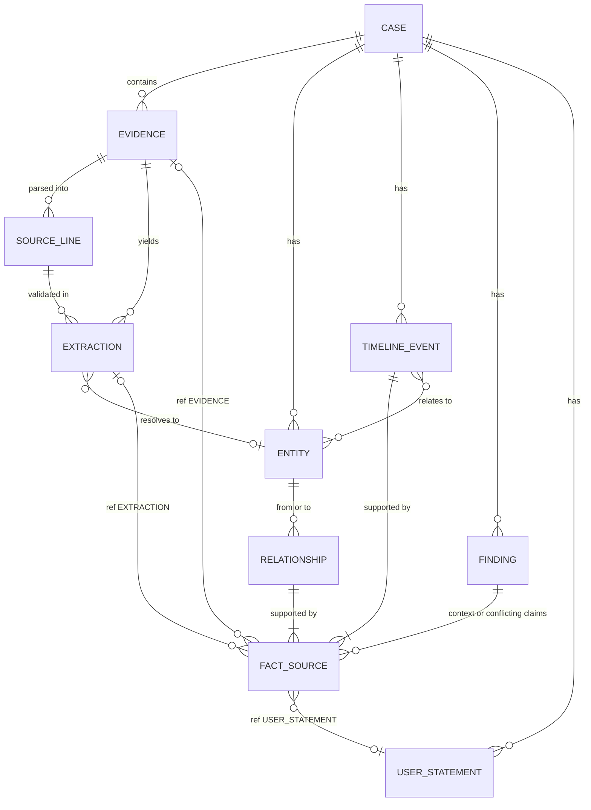
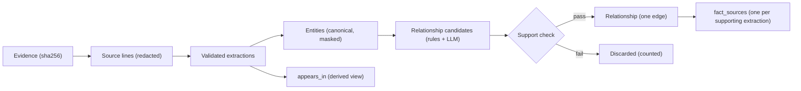
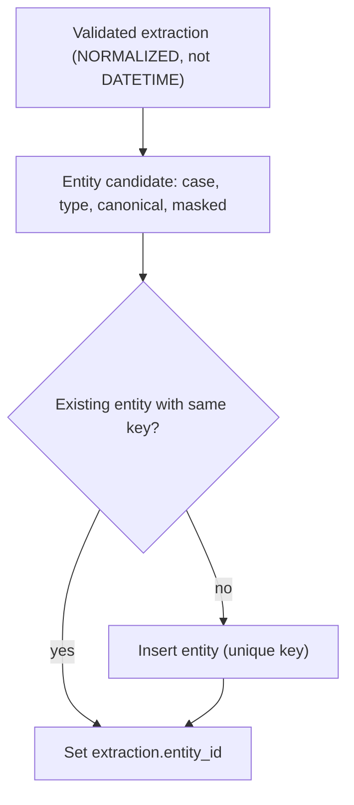
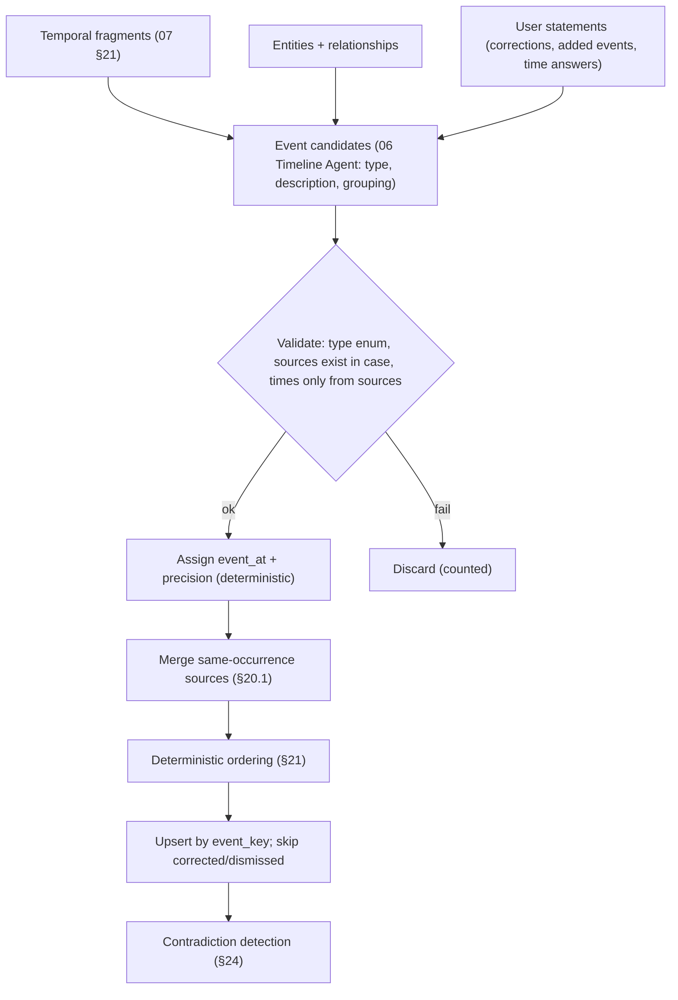
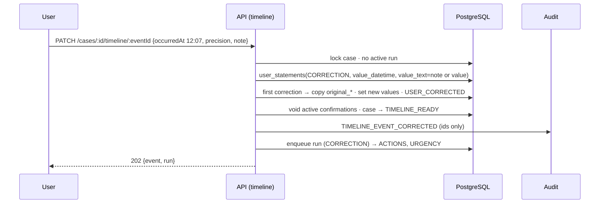
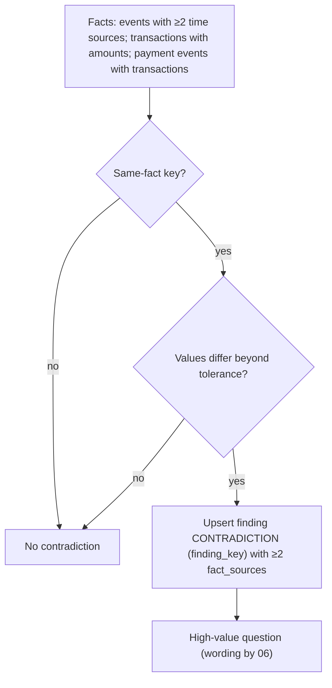
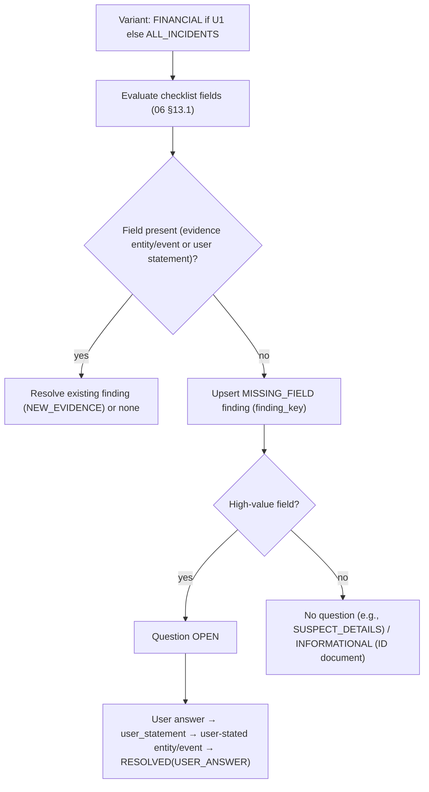
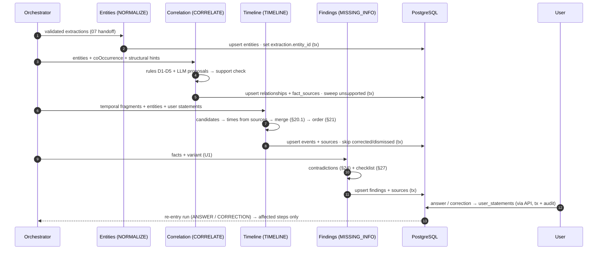
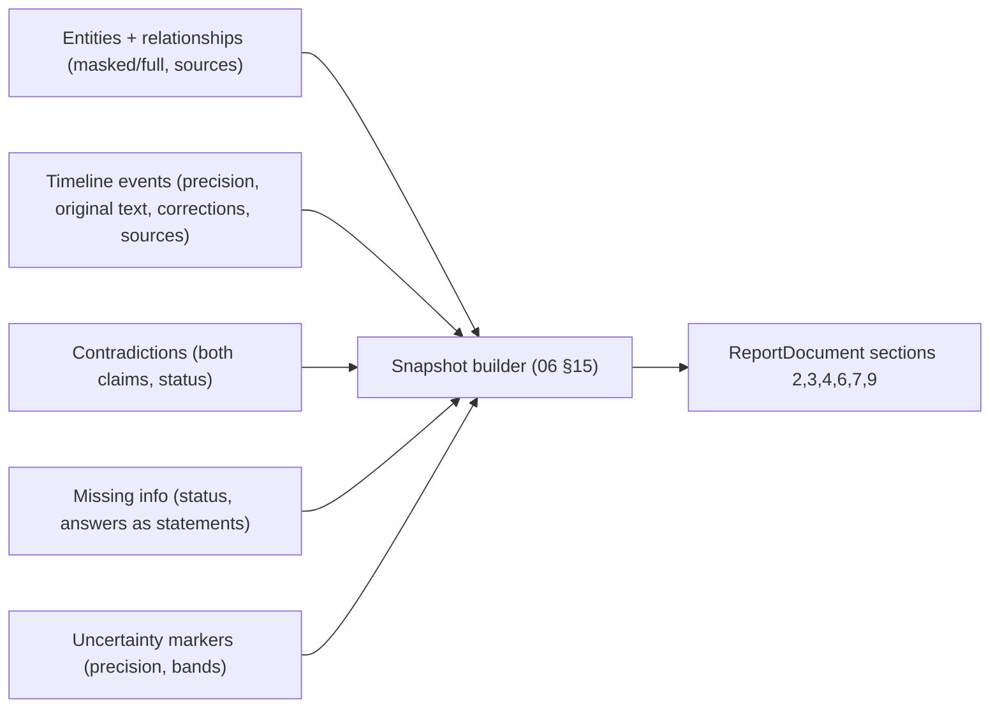

# Proofline — Evidence Graph and Timeline

> **The graph and the timeline are derived case data. Original evidence remains authoritative. Every node, edge, event, contradiction and gap is traceable to its sources.**

| Field | Value |
|---|---|
| Product | **Proofline** |
| Document | Evidence Graph and Timeline |
| File | `docs/08-EVIDENCE-GRAPH-TIMELINE.md` |
| Version | 1.0 |
| Status | Hackathon MVP. Implementation-level specification. No code, schema, endpoints or prompts. |
| Last updated | 2026-10-02 |
| Frozen sources | `01` · `02` · `03` v1.1 · `04` v1.1 · `05` · `06` · `07` · `DECISIONS.md` v0.2 |
| Precedence | `DECISIONS.md` §7–§8 → 03 → 04 → 05 → 06 → 07 → PRD → Master Spec |

### Labels used in this document

| Label | Meaning |
|---|---|
| **[RESOLVED]** | Fixed by a frozen source. The ID is cited. |
| **[DELEGATED]** | Items the frozen documents hand to Document 08: relationship rule details, the ordering algorithm and the time-contradiction tolerance (04 §38; 05 §35; 06 §7, §11, §12, §35), and display wording for relationship codes (03 §11.4). Settled here. |
| **[GT-REC]** | A design recommendation adding no product behaviour |
| **[IMPL]** | A configurable value |

### Notes on the request (sources followed)

- **N-1. Origin of the eight relationship types.** The request attributes them to `DECISIONS.md`. `DECISIONS.md` §7.2.5 lists the seven **expected demo relationships** R1–R7. The **eight-code vocabulary** is defined in Document 03 §11.4 (delegated G-6): R1–R7 plus `CONTACTED_FROM` from Master Spec §13.3. Document 03's vocabulary is used unchanged.
- **N-2. No contradiction table.** Contradictions are `missing_information_items` rows with `finding_kind = CONTRADICTION` (03 §13). No separate table exists, and none is invented.

---

## 1. Purpose and Scope

| Responsibility | This document |
|---|---|
| Evidence graph | Entity identity, relationship rules, relationship evidence, `appears_in`, rebuild, isolation, graph read model |
| Timeline | Event types, temporal representation, reconstruction, deterministic ordering, corrections |
| Contradictions and missing information | Detection rules, tolerance, provenance, resolution |
| Handoff | What the report generator receives from graph and timeline |

| Boundary | Owner |
|---|---|
| Upload, parsing, OCR, redaction, extraction, literal validation, normalisation, temporal fragments | **07** |
| Agent prompts, LLM tasks, gateway, validation of model output | **06** |
| Tables and constraints | **03** |
| HTTP shapes | **05** |
| Report document assembly | **06 §15** |
| Detailed security controls | **09** |

The graph and the timeline are **derived, rebuildable case data** (03 §24, 06 §26). Neither is independent proof of anything.

**Out of scope:** cross-case linking (N14), graph analytics (future), scanned-PDF OCR (OD-03), blockchain (OD-06), new tables, endpoints or vocabularies.

---

## 2. Conceptual Model



`FINDING` = `missing_information_items` (missing fields, contradictions, missing timestamps, missing evidence). `FACT_SOURCE` = `fact_sources` (03 §11.2).

---

## 3. Evidence Graph Architecture

| Element | Representation (03) |
|---|---|
| Case node | `cases` row (root) |
| Entity nodes | `entities` (unique per `(case, type, canonical)`) |
| Evidence nodes | `evidence_items` with `PROCESSED` status and ≥ 1 linked extraction |
| `APPEARS_IN` edges | **Derived view** `entity_evidence_links` (from `extractions`) |
| Relationship edges | `relationships` (one row per `(case, from, type, to)`) |
| Edge support | `fact_sources(relationship_id, …)` rows (EXTRACTION or EVIDENCE refs) |
| Ownership | Every row carries `case_id`. Composite FKs prevent cross-case references (03 §20). |
| Derivation | NORMALIZE (entities) → CORRELATE (relationships) in an analysis run (06 §4) |
| Rebuild | Upserts by natural keys plus orphan sweeps (§12) |

**Why relational, not a graph database [RESOLVED spec §13.5, 04 §36]:**
- Graphs are small and per-case (dozens of nodes).
- Every edge must be joined to provenance in the **same transaction** as the facts.
- Case isolation is enforced by composite FKs.
- One database keeps the system simple.

There is no graph query language, no global graph, and no graph DB.



---

## 4. Entity Taxonomy (03 §4.1 `entity_type`; 06 §8; 07 §15–§16)

| Type | Purpose | Canonical | Masked display | Matching | Provenance |
|---|---|---|---|---|---|
| `PHONE` | Contact numbers | E.164 (`+919000000001`) | `+91 90XXX XX001` | Exact canonical | Extractions → lines |
| `URL` | Links (never fetched) | Lower-case scheme/host, tracking parameters removed | As canonical | Exact canonical (path-sensitive) | Same |
| `DOMAIN` | Hosts | Lower-case host | As canonical | Exact | Same |
| `UPI_ID` | Payment handles | Lower-case `handle@psp` | `kyc.r***@demoupi` | Exact | Same |
| `TRANSACTION` | UTR/reference | Characters as printed, spaces removed, upper-case | `6270…8532` | Exact | Same |
| `AMOUNT` | Money | `INR 8500.00` + minor units | As canonical | Exact (minor units + currency) | Same |
| `ACCOUNT_HINT` | Masked account | Last four digits | As printed | Exact last four | Same |
| `BANK_OR_WALLET` | Bank/wallet/merchant | Name as stated | As canonical | Case-insensitive exact | Evidence (labelled) **or** user statement |
| `SMS_SENDER_HEADER` | SMS sender IDs | Upper-case | As canonical | Exact | Extractions |
| `EMAIL` | Addresses | Lower-case | `k***@domain` | Exact | Extractions |
| `MESSAGING_HANDLE` | WhatsApp/Telegram handles | Normalised handle | Partially masked | Exact | Extractions |
| `PERSON` | Names as printed (payer, payee, claimed) | Name as printed | As canonical | **Exact only** | Extractions (context attribute) |
| `DATETIME` | Temporal fragments | Typed value | — | **Not merged into entities** (03 §10.2) | Feed the timeline |

There are no OTP or card entities (07 §18). No other types exist.

---

## 5. Entity Identity

Two validated extractions represent **the same entity iff** `(case_id, entity_type, canonical_value)` are equal (07 §19).

| Rule | Behaviour |
|---|---|
| Exact normalised match | Required |
| Case-insensitive | Built into canonical forms for URL host, DOMAIN, UPI_ID, EMAIL, BANK_OR_WALLET |
| Phone | `+91 90000 00001` and `9000000001` → `+919000000001` → same entity |
| URL | `…/kyc?utm_source=sms` and `…/kyc` → same. `…/kyc` and `…/kyc/login` → **different** URLs, same DOMAIN. |
| UPI | Case-folded only |
| Transaction | Spaces removed only. Labels ignored. |
| Email | Lower-cased only |
| Ambiguity | Type is decided by deterministic rules (07 §16.1). `NOT_NORMALIZED` values are **never merged**. |
| **Prohibited** | Fuzzy, similarity, edit-distance or phonetic merging. Partial-number matching. Merging across types. Merging across cases. |

---

## 6. Entity Creation



| Concern | Rule |
|---|---|
| Owner | entities module (06 Evidence/Extraction agent, NORMALIZE step) |
| Duplicate prevention | `UNIQUE (case_id, entity_type, canonical_value)` + `INSERT … ON CONFLICT` upsert |
| Transaction | One transaction per NORMALIZE step: upserts + `entity_id` updates + step status |
| Provenance | Implicit through extractions. User-stated entities: `is_user_stated = true` + `fact_sources(USER_STATEMENT)`. |
| Masking | `masked_value` computed deterministically at insert (07 §15) |
| Lifecycle | Lives while it has support. Orphans are deleted (§7). |

User-stated entities (e.g., `BANK_OR_WALLET` from a follow-up answer) are created by the findings flow (§27), not by NORMALIZE.

---

## 7. Entity Provenance

"Where did this entity come from?" is answered by:

```text
entity → extractions (entity_id) → extraction_source_lines → source_lines (page, line, bbox) → evidence_items
       └→ fact_sources(entity_id, USER_STATEMENT) → user_statements        (user-stated entities only)
```

| Situation | Behaviour |
|---|---|
| Multiple evidence items / extractions | All are listed (`appearsIn`, `extractions[]`, 05 §13) |
| One source removed (evidence deleted) | Its extractions cascade away. The entity remains if any extraction or user-statement support remains. |
| Last support removed | Entity deleted (orphan sweep, INV-N1). Its relationships, event links and owned `fact_sources` cascade. |
| Correction of a supporting extraction | Entity recanonicalised from the corrected value. A correction to a value that already exists merges by key. Originals are kept on the extraction (03 §9.2). |

---

## 8. Relationship Taxonomy (exactly eight; 03 §11.4)

| Code (display wording [DELEGATED]) | From → To | Meaning | Direction | Evidence requirement | Demo example |
|---|---|---|---|---|---|
| `HOSTED_ON` ("is hosted on") | URL → DOMAIN | The URL's host is the domain | Yes | Each URL extraction's evidence | URL → `kyc-update-verify.example` (E01, E02, E03) |
| `SENT_LINK` ("sent link") | PHONE / MESSAGING_HANDLE / EMAIL / SMS_SENDER_HEADER → URL | The sender sent the link | Yes | Both in the same evidence item, sender role evident | PHONE → URL (E02) |
| `REQUESTED_PAYMENT_TO` ("requested payment to") | PHONE / MESSAGING_HANDLE / EMAIL → UPI_ID | The sender asked for payment to this UPI ID | Yes | Both in the same item | PHONE → UPI_ID (E02) |
| `PAID_TO` ("paid to") | TRANSACTION → UPI_ID | The transaction went to the UPI ID | Yes | Both in the same item with a payee cue | E04, E05 |
| `AMOUNT_OF` ("amount of") | AMOUNT → TRANSACTION | The amount of the transaction | Yes | Both in the same item | E04, E05 |
| `DEBITED_FROM` ("debited from") | TRANSACTION → ACCOUNT_HINT | Debited from the masked account | Yes | Both in the same item with a debit cue | E04, E05 |
| `MESSAGE_CONTAINED` ("message contained") | SMS_SENDER_HEADER / EMAIL → PHONE / URL / UPI_ID | A message from that sender contained the identifier | Yes | Both in the same single-message item | `VX-KYCUPD` → PHONE, URL (E01) |
| `CONTACTED_FROM` ("contacted from") | PHONE → PERSON | The person (as named in evidence) contacted the victim from this number | Yes | Both in the same item | PHONE → "Rohan" (E02, E06) |

Every edge requires ≥ 1 `fact_sources` row of kind `EXTRACTION` (or `EVIDENCE`) (INV-P2). User statements alone never support an edge (CR-3, CR-4). **There is no ninth type.** `APPEARS_IN` is not a relationship type (§11).

---

## 9. Relationship Creation [DELEGATED rule details]

### 9.1 Deterministic rules

These run in CORRELATE using the 07 §20 handoff: `coOccurrence`, `structuralHints`, and extraction offsets recomputed by locating `raw_value` in its line.

| Rule | Condition (all within **one** evidence item) | Edge |
|---|---|---|
| D1 Hosting | A URL extraction and the DOMAIN extraction derived from its host | `HOSTED_ON` URL → DOMAIN |
| D2 Amount | Exactly one TRANSACTION entity and exactly one AMOUNT entity in the item | `AMOUNT_OF` AMOUNT → TRANSACTION |
| D3 Payee | Exactly one TRANSACTION and exactly one UPI_ID, and a payee cue in the item (`Paid to`, `to VPA`, `UPI ID:` within a receipt structure hint) | `PAID_TO` TRANSACTION → UPI_ID |
| D4 Debit | Exactly one TRANSACTION and exactly one ACCOUNT_HINT, and a debit cue (`debited from`, `From account`, `A/c … debited`) | `DEBITED_FROM` TRANSACTION → ACCOUNT_HINT |
| D5 Message | An item that is a single SMS or a single email (one sender header, or EML `From`) containing PHONE / URL / UPI_ID extractions | `MESSAGE_CONTAINED` sender → each identifier |

"Exactly one" guards prevent ambiguous pairing. When there are several, no deterministic edge is created; the pair is left to an LLM proposal with the support check.

### 9.2 LLM-proposed candidates (06 §7)

For `SENT_LINK`, `REQUESTED_PAYMENT_TO`, `CONTACTED_FROM`, and ambiguous cases of D2–D4, the model proposes `{from, type, to, evidenceIds, extractionIds}`. **Acceptance** requires:
- (a) the type pair is allowed (§8);
- (b) for **every** cited evidence item, both entities have a validated extraction in that item;
- (c) all IDs are in the case;
- (d) the type is one of the eight codes.

Rejected proposals are counted only (06 §16). Conceptual relatedness alone never creates an edge.

### 9.3 Writing

- Upsert one edge per `(case, from, type, to)`.
- Insert one `fact_sources` row per supporting extraction (the from- and to-entity extractions in each supporting item).
- Use the CORRELATE step transaction (facts + sources + step status).

**Demo note [non-blocking]:** rule D5 also yields `MESSAGE_CONTAINED` `VX-ALERTS` → UPI_ID from E05. This is factual (the bank SMS contains the VPA). It is additional to `DECISIONS.md` R1–R7, which list *expected* edges and do not claim to be exhaustive. AC-AD03.5 (R2–R4 shown) is unaffected.

---

## 10. Relationship Evidence (once per edge, many sources)

| Need | Mechanism |
|---|---|
| Represent a connection once | `UNIQUE (case_id, from_entity_id, relation_type, to_entity_id)` |
| Keep every supporting artifact | One `fact_sources` row per supporting extraction. `supportCount` = distinct evidence items among those sources. |
| Avoid duplicate edges on re-run | Upsert. `fact_sources` are deduplicated by their unique key (03 §11.2). |
| Lose one artifact | Its source rows cascade. The edge survives on the remaining support. With zero evidence-derived sources left, the edge is deleted. |

Demo: `PAID_TO` TRANSACTION → UPI_ID is **one edge** with sources from E04 and E05 (`supportCount = 2`).

---

## 11. "Appears In" Representation

`APPEARS_IN` is a **derived view**, not a relationship type (03 §11.1):

```text
entity_evidence_links = DISTINCT (case_id, entity_id, evidence_id) FROM extractions WHERE entity_id IS NOT NULL
```

The UI shows:

```text
PHONE +91 90XXX XX001
  appears in  E01 (line 3)   E02 (line 1)   E06 (line 1)
```

- `appearsIn` comes from 05 #5 entities, and `APPEARS_IN` edges from 05 #7 graph (edge ID `appears:{entityId}:{evidenceId}`).
- Line detail comes from each extraction's source lines.
- Nothing is stored for `APPEARS_IN`, so it can never drift from extractions.

---

## 12. Graph Rebuild and Idempotency

| Event | Behaviour |
|---|---|
| Analysis runs again | NORMALIZE upserts entities. CORRELATE re-evaluates rules and proposals, upserting edges and sources. **Stale edges:** AI/rule edges whose support no longer satisfies the rules are deleted at the end of CORRELATE (edges not re-asserted in this run lose their rule- or proposal-derived sources; zero sources → delete) [GT-REC]. |
| Extraction reprocessed (retry of a failed item) | Old lines and extractions cascade. Sources pointing to them cascade. Orphan sweep. Then NORMALIZE and CORRELATE re-run. |
| Evidence deleted | Cascade + orphan sweep (03 §24.2). The case returns to `INGESTING`. The next run rebuilds. |
| Evidence added | New extractions → entity upserts (may join existing entities) → new edges and sources |
| Entity changes (correction) | Recanonicalisation. Edges re-keyed by upsert. The old entity is swept if orphaned. |
| Relationship support changes | Source rows added or removed. Edge kept while ≥ 1 evidence-derived source remains. |

**Guarantees:**
- no duplicate entities (unique key);
- no duplicate relationships (unique key);
- provenance is always current (cascades);
- no edge without support (INV-P2 sweep).

---

## 13. Cross-Case Isolation

| Threat | Control |
|---|---|
| Entity leakage | Entity key includes `case_id`. There is no global entity table or index. |
| Relationship leakage | Composite FKs `(entity_id, case_id)` on both ends |
| Traversal across cases | The graph query takes one `case_id`, and all joins carry it (05 #7) |
| Accidental global matching | Matching queries always filter by `case_id`. No cross-case lookup function exists. |

**A phone number appearing in two cases does not connect those cases.** Cross-case clustering is out of scope (N14).

---

## 14. Graph Query Model — `GET /cases/:id/graph` (05 §15, unchanged)

| Element | Source | Notes |
|---|---|---|
| `CASE` node | `cases` | Label = `case_reference` |
| `ENTITY` nodes | `entities` | `entityType`, **masked** label by default (spec §13.5) |
| `EVIDENCE` nodes | `evidence_items` (PROCESSED with ≥ 1 link) | `evidenceRef`, `evidenceType` |
| `APPEARS_IN` edges | `entity_evidence_links` | Derived |
| `RELATIONSHIP` edges | `relationships` | `relationType`, `supportCount`, `sources: SourceRef[]` |
| Confidence | **Not returned for edges.** `relationships` has no confidence column (03 §11.3). Support is expressed by `supportCount` and sources. | |
| Case metadata | Only the case node label | |

Full entity values and extraction detail come from `GET /cases/:id/entities` (05 #5).

---

## 15. Graph UI Read Model

| Item | Field(s) |
|---|---|
| Node identity | `id` (`case:`, `entity:`, `evidence:` prefixes) |
| Label | Masked value (entity) / `evidenceRef` (evidence) / `caseReference` |
| Entity type | `entityType` |
| Display value | Masked by default. Full value via the entities endpoint. |
| Evidence count | Count of `APPEARS_IN` edges for the entity node |
| Source references | Edges carry `sources` (SourceRef with evidenceRef, page, lines, snippet) |
| Edge identity | `id` (`rel:{uuid}` or `appears:{entity}:{evidence}`) |
| Edge label | Display wording of the `relationType` (§8) |
| Support count | `supportCount` |
| Expandable evidence | SourceRef → `GET /evidence/:id/source` for lines (05 #20) |

Visual design is owned by Document 11.

---

## 16. Timeline Architecture

The timeline is the **chronological reconstruction of incident events**, derived and rebuildable.

| Time concept | Meaning | Stored in | On the timeline? |
|---|---|---|---|
| **Evidence timestamp** | A time printed in evidence ("12:19 PM") | DATETIME extraction + `time_source_text` | Yes, as the source of an event time |
| **Event timestamp** | When the incident event happened | `timeline_events.event_at` (UTC) + precision | **Yes** |
| **Upload timestamp** | When evidence was ingested | `evidence_items.uploaded_at` | **No** (evidence index only) |
| **Processing timestamp** | Run/step times | `analysis_runs`, `agent_steps` | **No** (activity feed only) |
| **User-provided time** | The user's stated time (answer, correction, added event, case incident time) | `user_statements.value_datetime` | Yes, labelled user-stated |

System timestamps are **never** used as incident event times.

---

## 17. Timeline Event Taxonomy (exactly ten; 03 §12.3)

| Code | Meaning | Valid sources | Timestamp requirement | User-providable | Demo |
|---|---|---|---|---|---|
| `MESSAGE_RECEIVED` | The victim received a message (SMS, chat, email) | Message evidence | Any precision | Yes | T1, T3 |
| `MESSAGE_SENT` | The victim sent a message | Chat or email evidence | Any | Yes | — |
| `CALL` | A phone call took place | Evidence or user statement | Any | Yes | T2 |
| `LINK_OPENED` | The victim opened a link | Chat statement, browser evidence, user statement | Any | Yes | T4 |
| `CREDENTIAL_OTP_REQUEST` | Credentials or an OTP were requested | Page or message evidence | Any | Yes | T5 (G-2 U2(b) only if evidence-sourced) |
| `CREDENTIALS_OR_OTP_SHARED` | The victim shared credentials or an OTP (value never shown) | Chat evidence, user statement | Any | Yes | T6 |
| `PAYMENT_REQUESTED` | Someone asked the victim to pay | Message evidence | Any | Yes | T7 |
| `PAYMENT_INITIATED` | The victim made a payment | Receipt, user statement | Any | Yes | T8 (G-2 U1) |
| `DEBIT_NOTIFICATION` | A debit alert was received | Bank alert evidence | Any | Yes | T9 (G-2 U1) |
| `OTHER` | Anything else relevant | Any | Any | Yes | — |

Every event needs ≥ 1 source (INV-P1). No other types exist.

---

## 18. Temporal Representation [RESOLVED G-5; 03 §12]

| Field | Rule |
|---|---|
| `event_at` | UTC `timestamptz`, or null |
| Display | IST (Asia/Kolkata), by the client |
| `time_source_text` | Original text, e.g. `"Around 12:05 PM"`, `"24 Sep 2026, 12:19 PM"`, `"12:16"` |
| `timestamp_precision` | `EXACT` (full date+time stated) · `APPROXIMATE` (approximation cue, or date inferred from case evidence) · `INFERRED_ORDER_ONLY` (no usable time; `event_at` null) |

**Date-only events** [GT-REC; non-blocking]: the precision enum has no date-only value. An event whose only temporal source is a date-only fragment is stored with:
- `precision = APPROXIMATE`;
- `event_at` = 00:00 IST of that date, **used for ordering only**;
- `time_source_text` = the date text.

The read model derives `displayGranularity = DATE` from the source fragment's form (07 §21), so **no time is displayed**. No time is ever fabricated from vague statements.

---

## 19. Timestamp Extraction (from 07)

| Source text | Line | Fragment (07 §16.3) | Time zone | UTC | IST display | Precision |
|---|---|---|---|---|---|---|
| `24 Sep 2026, 12:19 PM` (E04) | page 1, line 8 | FULL | IST assumed | `2026-09-24T06:49:00Z` | 24 Sep 2026, 12:19 PM | EXACT |
| `24-09-26 12:21` (E05) | p1 L3 | FULL (DD-MM-YY) | IST | `06:51:00Z` | 12:21 PM | EXACT |
| `Thursday, 24 Sep 2026` + `12:03 PM` (E01) | L2 + L5 | DATE_ONLY + TIME_ONLY (dateContext) | IST | `06:33:00Z` | 12:03 PM | EXACT (both explicit in the same item) |
| `12:16` (E03) | L1 | TIME_ONLY, no date context | IST | `06:46:00Z` with the date inferred from case evidence (06 §11) | 12:16 PM | APPROXIMATE |
| `Around 12:05 PM` (E06) | L1 | TIME_ONLY + approximation cue, dateContext `24 Sep 2026` | IST | `06:35:00Z` | ~12:05 PM | APPROXIMATE |
| `around 12:40 PM` (E06) | L1 | as above | IST | `07:10:00Z` | ~12:40 PM | APPROXIMATE |

Combining a time with its date context (same evidence item) yields the stated precision. Cross-item date inference always yields `APPROXIMATE`.

---

## 20. Timeline Reconstruction



| Event kind | Definition |
|---|---|
| Directly sourced | Time and occurrence stated in one evidence item (T1, T8, T9) |
| Derived | Occurrence inferred from evidence content, with time from a fragment (T4 "opened the link" from a chat message time) |
| User-stated | `origin = USER_ADDED` with a USER_STATEMENT source |
| Uncertain | `APPROXIMATE` or `INFERRED_ORDER_ONLY` precision |

### 20.1 Same-occurrence merge (deterministic validation of model grouping) [DELEGATED]

A temporal fragment may be attached to an event as an additional time source only if:
- (a) the event type matches; **and**
- (b) the fragment's line contains an extraction of one of the event's related payment or contact entities (AMOUNT, TRANSACTION, UPI_ID, PHONE) **within 80 characters** of the fragment [IMPL].

Demo: E06 "paid Rs 8,500 at around 12:40 PM" attaches to T8 (AMOUNT within 80 characters). E06 "Around 12:05 PM I called the number…" does **not** attach to T8.

### 20.2 Event key

`event_key = eventType + ":" + sorted primary source extraction/statement IDs`. A re-run reproduces the same key for the same grouping. Events not re-asserted in a run are deleted unless they are `USER_CORRECTED`, dismissed or `USER_ADDED` [GT-REC].

---

## 21. Event Ordering [DELEGATED]

`sort_order` is recomputed densely (1..n) after every timeline change. Dismissed events are excluded from ordering and from the default view.

1. Events with `event_at` are ordered **ascending by `event_at`** (corrected values used where corrected).
2. Ties broken by: precision (`EXACT` < `APPROXIMATE`) → lowest `evidence_ref` of the primary source → lowest page/line → event-type order (§17 table order) → `id`.
3. `INFERRED_ORDER_ONLY` events are placed **immediately after** their validated predecessor (`afterEventKey`, 06 §11), in evidence/line order. With no valid predecessor, they go at the end. They are always shown as "order inferred".
4. Approximate events are ordered by their approximate value and **displayed as approximate**. Relative order between an approximate and an exact event closer than the tolerance (§24.2) is not presented as certain; the UI shows the approximation marker.
5. All comparisons are in UTC.

---

## 22. Timeline Provenance

"Why is this event on the timeline?" Every event's `sources: SourceRef[]` (05 §14) answers it:

| Event kind | Sources |
|---|---|
| Evidence-derived | EXTRACTION refs (DATETIME + related entities' extractions) → lines → evidence |
| User statement | USER_STATEMENT ref (`ADDED_EVENT`) |
| Corrected | The original evidence sources **plus** the CORRECTION statement. Originals are kept in `original_*` columns. |
| Derived | The extraction(s) whose content implies the occurrence, plus the time fragment |

---

## 23. User Timeline Corrections (FR-013; 05 #25–#27)



| Item | Representation |
|---|---|
| Original value | `original_event_at`, `original_timestamp_precision`, `original_event_type`, `original_description` (set once, immutable) |
| Corrected value | Current `event_at`, `timestamp_precision`, etc. |
| Who / when | `user_statements.author_user_id`, `created_at`; `timeline_events.correction_statement_id` |
| Reason | The optional `note` is stored in `user_statements.value_text` |
| Provenance | Evidence sources kept, plus the USER_STATEMENT source. The UI marks the event "user-corrected". |
| Audit | `TIMELINE_EVENT_CORRECTED` / `_ADDED` / `_DISMISSED` |
| Downstream | Re-ordering. ACTIONS and URGENCY re-run (MISSING_INFO too if a checked time changed). Confirmations voided. **Existing report versions unchanged** (immutable); the user regenerates. |
| Evidence | **Never rewritten.** The E06 extraction "Around 12:05 PM" remains. |

Demo: T2 `CALL` ~12:05 (E06) → corrected to 12:07.

---

## 24. Contradiction Detection [DELEGATED tolerance]

A contradiction is **two or more sources asserting different values for the same fact**. Absence is never a contradiction (§27).

### 24.1 Categories (MVP)

| Category | Same-fact key | Detected when |
|---|---|---|
| **Timestamp** | Same timeline event (merged occurrence, §20.1) | Its time sources differ beyond tolerance (§24.2) |
| **Amount** | Same TRANSACTION entity | Two AMOUNT entities each linked by `AMOUNT_OF` to it, **or** a user-stated amount for the payment differing from the evidence amount |
| **Transaction ID** | Same PAYMENT_INITIATED / DEBIT_NOTIFICATION event | The event relates to ≥ 2 distinct TRANSACTION entities |
| **User statement vs. evidence** | Any of the above where one source is a USER_STATEMENT | Same rules |
| Names / other entities | — | **Not detected in the MVP.** No product rule defines a name or entity conflict. Implementation consideration for later. |

### 24.2 Time tolerance [DELEGATED]

| Source A precision | Source B precision | Contradiction if \|A − B\| > |
|---|---|---|
| EXACT | EXACT | 2 minutes |
| EXACT | APPROXIMATE | 10 minutes |
| APPROXIMATE | APPROXIMATE | 20 minutes |
| Date-only vs. any | — | Different calendar date (IST) |

- Demo: E04 12:19 (EXACT) vs. E06 ~12:40 (APPROXIMATE) = 21 min > 10 → **contradiction**.
- E06 ~12:05 has no other source for the call → **no contradiction**.
- E05 12:21 is a separate DEBIT_NOTIFICATION event, not the same occurrence → no contradiction.



---

## 25. Contradiction Provenance

| Required | Representation |
|---|---|
| Source A / Source B | ≥ 2 `fact_sources` rows (EXTRACTION or USER_STATEMENT) on the finding |
| Conflicting field | `finding_key` (e.g., `CONTRADICTION:TIME:{eventKey}`, `CONTRADICTION:AMOUNT:{transactionEntityId}`, `CONTRADICTION:TXN:{eventKey}`) + subject (`subject_timeline_event_id` / `subject_entity_id`) |
| Values | Read from the sources (raw text + normalised value). **Never copied.** |
| Evidence refs / lines | Through the SourceRefs |
| Detection reason | `reason_text` (template naming the category and tolerance) |
| Resolution status | `status` / `resolution` / `question_status` (§26) |

A contradiction is an **observation**. It does not establish which source is false.

---

## 26. Contradiction Resolution (03 §13 states only)

| State | Meaning | Effect |
|---|---|---|
| `OPEN` (question `OPEN`) | Unresolved | Event shows both sources and a "contested" marker. Report §7 lists both. |
| `OPEN` (question `SKIPPED`) | The user declined to answer | Same as unresolved. Still shown. |
| `RESOLVED` / `USER_ANSWER` | The user stated which value is right | USER_STATEMENT source added. The event shows the user-confirmed value labelled "you stated", and **both original sources stay linked**. Report shows the confirmed value + "conflicting source noted". |
| `RESOLVED` / `USER_CORRECTION` | The user corrected the event time directly | As §23 |
| `RESOLVED` / `NEW_EVIDENCE` / `NO_LONGER_APPLICABLE` | A re-run no longer finds the conflict (e.g., a source deleted) | Finding marked resolved by the deterministic re-check |

There is **no "ignore/acknowledge" state** in the MVP (not in 03). Conflicting evidence is never discarded.

---

## 27. Missing Information

**Definition:** information required or useful for the case (NCRP checklist, PRD §14.1; 06 §13.1) that is **not present** in the evidence or case data. Absence is **never** a contradiction.



| Kind | Rule |
|---|---|
| `MISSING_FIELD` | Checklist field absent |
| `MISSING_TIMESTAMP` | An event relevant to reporting (PAYMENT_INITIATED, DEBIT_NOTIFICATION) has `INFERRED_ORDER_ONLY` precision |
| `MISSING_EVIDENCE` | A user-stated payment or debit with no supporting document (RELEVANT_EVIDENCE hint) |

Demo:
- No `BANK_OR_WALLET` entity → `MISSING_FIELD:BANK_WALLET_MERCHANT`, high value, question open.
- The user answers (fictional "Example Bank"; **not hard-coded**) → `FOLLOW_UP_ANSWER` statement → user-stated `BANK_OR_WALLET` entity → resolved.
- The payee display name never fills this field.

---

## 28. Missing-Information Provenance

| Question | Answer from |
|---|---|
| Why is it missing? | `reason_text` (template per checklist field) + `checklist_variant` |
| What evidence was checked? | All `PROCESSED` evidence at the time of the MISSING_INFO step (the gate guarantees every item was processed). The step's `output_summary` records the checked evidence IDs [GT-REC]. |
| Which field or category? | `checklist_field` / `finding_kind` |
| Required or recommended? | Required = rows applicable to the variant (06 §13.1). Recommended/optional = `SUSPECT_DETAILS`; informational = `IDENTITY_DOCUMENT`. `is_high_value` marks question-worthy items. |
| Did the user supply it? | `answer_statement_id` → `user_statements` (USER_STATEMENT) |
| Still unresolved? | `status = OPEN` (and `question_status`) |

Missing-field findings have **no evidence sources by nature**. Their context sources (where present) point to related facts (e.g., the transaction lacking a bank).

---

## 29. Graph + Timeline + Missing Information Interaction

```text
TRANSACTION 627000418532 (E04, E05)
   ├─ AMOUNT_OF ← INR 8,500 ; PAID_TO → UPI_ID ; DEBITED_FROM → …4821
   ↓
PAYMENT_INITIATED (T8, 12:19 EXACT; E06 ~12:40 → CONTRADICTION)  +  DEBIT_NOTIFICATION (T9)
   ↓ U1 true → FINANCIAL variant
MISSING_FIELD BANK_WALLET_MERCHANT → question → user answer (USER_STATEMENT)
   ↓
user-stated BANK_OR_WALLET entity → finding RESOLVED → actions/urgency re-run → report v(N+1) shows "(you stated)"
```

User statements create **user-stated** entities and events with `USER_STATEMENT` sources. They never become extractions or evidence.

**End-to-end graph + timeline sequence:**



---

## 30. Confidence and Uncertainty (06 §21; no new system)

| Item | Representation |
|---|---|
| Extraction confidence | Stored 0–1 + band. Identifiers use source validation (06 §21). |
| Relationship confidence | **Not supported** (no column). Use `supportCount` and sources. |
| Timeline confidence | Event band per 06 §21 (EXACT / APPROXIMATE / INFERRED caps) plus a precision marker |
| Contradiction | Not a confidence value. An explicit finding. |
| **Urgency** | **Not confidence.** Deterministic `G2-v1` rule (HIGH/MEDIUM/LOW, or Not assessed yet). No confidence field. |

---

## 31. Report Handoff



The graph and timeline layer supplies:
- incident date/time facts and payment/debit facts (sections 2–3);
- observed identifiers with sources (section 4);
- the timeline with precision, `time_source_text`, correction status and sources (section 6);
- contradictions and missing information with both claims and user answers (section 7);
- per-evidence key facts (section 9);
- uncertainty markers.

**Report assembly itself is defined in 06 §15**, not here.

---

## 32. Graph and Timeline Failure Modes

| Condition | Failure or empty? | Retryable | User-visible | Audit |
|---|---|---|---|---|
| No entities | **Empty result** (step SUCCEEDED) | — | "No key details found" | — |
| No timestamps | Events `INFERRED_ORDER_ONLY`; `INCIDENT_DATETIME` finding | — | "Time not known", plus a question | — |
| Duplicate entities | Prevented by key. A conflict on insert → upsert. | — | — | — |
| Conflicting normalisation (value fails a rule) | `NOT_NORMALIZED`, not merged | — | Shown under unmerged extractions | — |
| Invalid relationship candidate | Discarded (counted) | — | Not shown | — |
| Missing provenance on a write | Write rejected → step **FAILED** | Yes | "Analysis failed — Retry" | `ANALYSIS_STEP_FAILED` |
| Stale graph (case rewound) | Data kept; status shows re-analysis needed | — | Overview shows the state; urgency "may be out of date" | — |
| Deleted evidence | Cascade + sweep; rebuilt on the next run | — | Removed immediately | `EVIDENCE_DELETED` |
| Partial processing (item FAILED/pending) | Run stops at the `EXTRACTED` gate (06 §4) | Yes / remove | "Some evidence isn't processed" | `ANALYSIS_FAILED` |
| Only approximate times | Valid timeline, all marked approximate | — | Approximate markers | — |
| Correction after report generation | Report versions unchanged; confirmation voided; case → TIMELINE_READY | — | "Regenerate the draft to include your change" | `TIMELINE_EVENT_CORRECTED`, `REPORT_CONFIRMATION_VOIDED` |
| CORRELATE or TIMELINE step error (LLM, DB) | **FAILED** | Yes | "Timeline/graph not available — Retry" (PRD §21) | `ANALYSIS_STEP_FAILED` |

---

## 33. Security and Privacy (details in 09)

- **Case isolation** (§13).
- **Masked by default** in the graph. Full values only to the owner via the entities endpoint.
- **No sensitive values:** no OTP or card entities or text (07 §18). Snippets come from redacted lines.
- **Provenance access:** SourceRefs and lines are served only after the ownership check (05 #20). Evidence downloads use signed URLs.
- **User statements:** visible only to the owner. Never in audit metadata or logs.
- **Reports:** owner-only, through versions and exports (05).
- **Logs:** IDs, counts and codes only. No entity values, times or statement text.

---

## 34. API and Database Traceability

| API (05, unchanged) | Graph/timeline content | Tables/views (03) |
|---|---|---|
| `GET /cases/:id` | `entityCounts`, urgency, scam signals, run/report state | `cases`, `entities` (counts), `urgency_*`, `scam_signals` |
| `GET /cases/:id/entities` | Entities, extractions, `appearsIn`, user sources | `entities`, `extractions`, `extraction_source_lines`, `source_lines`, `fact_sources`, view `entity_evidence_links` |
| `GET /cases/:id/timeline` | Ordered events, precision, original text, corrections, contradictions, sources | `timeline_events`, `timeline_event_entities`, `fact_sources`, `user_statements`, `missing_information_items` (contradiction IDs) |
| `GET /cases/:id/graph` | Nodes, `APPEARS_IN` edges, relationship edges with support | `entities`, `evidence_items`, `relationships`, `fact_sources`, view `entity_evidence_links` |
| `GET /cases/:id/actions` | Action sources referencing graph/timeline facts | `action_items`, `fact_sources` |
| `GET /cases/:id/missing-information` (05 #28) | Missing fields and contradictions | `missing_information_items`, `fact_sources`, `user_statements` |
| Corrections (05 #24–#27), answers (#29–#30) | User statements and corrections | `user_statements`, `timeline_events` (original_*), `extractions` (correction columns) |

No new endpoint, table or view is introduced. There is no contradictions table (N-2).

---

## 35. Testing and Acceptance Criteria

| Area | Tests |
|---|---|
| Entity resolution | The three phone formats → one PHONE (E01, E02, E06). URL with and without `utm_source` → one URL (E01, E02, E03). UPI across E02/E04/E05 → one. Distinct UPI handles stay distinct. Same phone in Case A and Case B → two entities, no link. |
| Relationships | D1–D5 produce the expected edges. A re-run creates no duplicates. `PAID_TO` has `supportCount = 2` (E04, E05). An LLM proposal whose entities are not both in a cited item is rejected. An unknown relation code is rejected. Every edge has ≥ 1 evidence-derived source. |
| Timeline | T1–T9 order matches `DECISIONS.md` §7.2.6 (> 90%). `24-09-26 12:21` → `06:51Z` and displays 12:21 IST. Date-only source → no time displayed. Approximate marked. Undated event placed after its predecessor and flagged. The T2 correction to 12:07 persists, the original is kept, and the order updates. |
| Contradictions | 12:19 vs ~12:40 → one contradiction with two sources. ~12:05 call → none. Two amounts for one transaction → contradiction. A user-stated amount differing from the receipt → contradiction. A missing bank → **not** a contradiction. |
| Missing information | Bank/wallet missing → finding + question. Answer → statement + user-stated entity + resolved. A skipped question stays open and visible. ID document → informational only. |
| Deletion / reprocessing | Deleting E05 → its extractions are gone; `PAID_TO` survives on E04 (supportCount 1); the T9 event is removed (only source); provenance has no dangling references. Deleting E04 and E05 → the TRANSACTION entity is swept and its edges removed. Retry of a failed item rebuilds without duplicates. |
| Isolation | Graph and timeline queries never return another case's rows (ID manipulation → 404) |

---

## 36. Traceability Matrix

| Concern | 01 | 02 | 03 | 04 | 05 | 06 | 07 | DECISIONS |
|---|---|---|---|---|---|---|---|---|
| 8 relationship types | §13.3 | CR-3 | §11.4 | §17 | §15 | §7 | §20 | §7.2.5 (R1–R7), G-6 |
| 10 event types | §14.1 | §13.1 | §12.3 | §16 | §14 | §11 | §21 | §7.2.6, G-6 |
| Entity resolution | FR-009, §12.3 | CR-1, AC-009.1 | §10 | §17 | §13 | §8 | §19 | §7.2.4 |
| Provenance | §12.2, NFR-04 | GR-06 | §9, §11.2 | §3 P2 | §3.1 | §27 | §27 | AD-02 |
| UTC/IST | §14.2 | TL-2 | §2 (G-5) | §16 | §3 | §11 | §21 | G-5 |
| User corrections | FR-013 | FR-013, TL-6/7 | §12.4 | §16 | #25–#27 | §11, §32 | — | AD-05 |
| Contradiction | FR-014 | MI-2, TL-8 | §13 | §15 | §16 | §12 | — | §7.2.6 |
| Missing information | FR-014, FR-015, §3.4 | §14 | §13 | §15 | §16 | §13 | — | AD-01, OD-09, §7.2.6 |
| Graph rebuild / idempotency | NFR-05 | S-4 | §24, §28 | §23 | §24 | §26 | §23–§24 | OD-11 |
| Case isolation | NFR-08 | AU-5 | §20 | §21 | §4 | §17 | §25 | OD-01 |
| Demo behaviour | §22 | §22 | §25 | §34 | §33 | §33 | §30 | AD-03 |

---

## 37. Implementation Readiness Checklist

| Question | Answer |
|---|---|
| Are all graph entities defined? | **Yes**: §4 (13 types; DATETIME not merged) |
| Are all 8 relationship types defined? | **Yes**: §8 (03 §11.4 vocabulary; N-1) |
| Are relationship provenance rules defined? | **Yes**: §9–§10 |
| Is entity deduplication deterministic? | **Yes**: §5–§6 (exact canonical key; no fuzzy matching) |
| Is cross-case isolation explicit? | **Yes**: §13 |
| Is the graph API fully mapped? | **Yes**: §14–§15, §34 (05 unchanged) |
| Are all 10 timeline event types defined? | **Yes**: §17 |
| Are temporal precision rules defined? | **Yes**: §18 (date-only rule noted) |
| Is UTC/IST handling defined? | **Yes**: §18–§19 |
| Are user corrections defined? | **Yes**: §23 |
| Are contradictions defined separately from missing information? | **Yes**: §24–§27 |
| Is missing-information handling defined? | **Yes**: §27–§28 |
| Is provenance preserved through graph and timeline? | **Yes**: §7, §10, §22, §25, §28 |
| Is reprocessing/idempotency defined? | **Yes**: §12, §20.2 |
| Is the report handoff defined? | **Yes**: §31 |
| Are failure modes defined? | **Yes**: §32 |
| Are tests defined? | **Yes**: §35 |
| Are there unresolved decisions? | **No.** |

**Non-blocking notes:**
- **N-1:** the eight relationship types are defined in 03 §11.4, not `DECISIONS.md`.
- **N-2:** contradictions live in `missing_information_items`; there is no separate table.
- **N-3:** date-only events use `APPROXIMATE` + date-start ordering + derived `displayGranularity`, because the precision enum has no date-only value (§18).
- **N-4:** rule D5 adds a factual `VX-ALERTS → UPI_ID` edge beyond R1–R7 (§9.3).
- **N-5:** name/entity conflicts are not detected in the MVP (no source rule; §24.1).

No decision is reopened. No table, endpoint, relationship type, event type or agent is added.

**Final status: READY WITH NON-BLOCKING NOTES**
