# Proofline — Frontend UX Specification

> **Scattered evidence → structured case → connected evidence → timeline → missing information → actionable response → reviewable report.**
> An evidence investigation workspace, not a chatbot.

| Field | Value |
|---|---|
| Product | **Proofline** |
| Document | Frontend UX Specification |
| File | `docs/10-FRONTEND-UX-SPECIFICATION.md` |
| Version | 1.0 |
| Status | Hackathon MVP. UX behaviour and screen specification. No code, visual tokens or components. |
| Last updated | 2026-10-02 |
| Frozen sources | `01` · `02` · `03` v1.1 · `04` v1.1 · `05` · `06` · `07` · `08` · `09` · `DECISIONS.md` v0.2 |
| Visual design | Owned by `11-DESIGN-SYSTEM.md`: colours, type, spacing, icons, breakpoints, component styling |

### Labels used in this document

| Label | Meaning |
|---|---|
| **[RESOLVED]** | Fixed by a frozen source. The ID is cited. |
| **[UX-REC]** | A UX recommendation that adds no backend or product behaviour |
| **[IMPL]** | A frontend implementation choice (e.g., exact route names) |
| **[API-GAP]** | The UI needs information no existing endpoint exposes. Recorded, not invented (§39.2). |

**Copy rules (all screens; GR-08, GR-12, GR-13; spec §4.2):**
- Never say "confirmed fraud", "criminal identified", "scammer is…", "money recovered", "legally valid evidence" or "official complaint filed".
- Use "signals consistent with…", "identifiers observed in evidence", "you stated…", "not provided".
- Proofline never says it contacted anyone, and never looks like a government service.

---

## 1. Purpose and Scope

| Aspect | Definition |
|---|---|
| Scope | Screens, flows, states, interactions, copy rules, accessibility, responsive behaviour and client-side security for the MVP web app (Next.js, spec §19) |
| Target users | Primary: individual victim and helper (on the victim's session, OD-01). Secondary personas use the same flow (PRD §5). Stressed, non-technical users (NFR-12). |
| Primary workflow | Landing → sign-in → create case → upload → analyse → overview → timeline/graph/missing info/actions → draft → review → verify → export (PRD §6) |
| Backend relationship | Consumes **only** Document 05 endpoints via the same-origin `/api` proxy. All business rules (states, urgency, validation, limits, gates) are server-side. |
| Design system | Document 11 defines the look. This document defines behaviour. |
| Exclusions | New endpoints, chat UI as the primary surface (optional secondary chat is not built), shared cases, notifications by email/SMS, PDF inline rendering, offline mode, admin screens |

---

## 2. UX Architecture

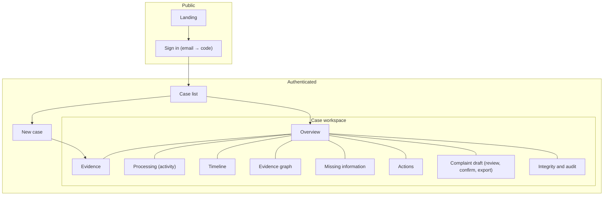

---

## 3. Information Architecture

```text
Application
 └─ Case (CF-xxxxx)                     ← every screen below is scoped to one case
     ├─ Evidence (E01…E20)              ← source of truth
     ├─ Derived intelligence            ← entities, graph, timeline, signals, findings, urgency, actions
     ├─ Review                          ← report versions, confirmation
     └─ Export                          ← PDF / ZIP of a confirmed version
```

**Navigation rules [UX-REC]:**
- The workspace tab bar is always present inside a case.
- Every fact everywhere has a **"Source" affordance** that opens the source panel (§14), which shows the evidence item, page/line and redacted snippet.
- Cross-links:
  - overview cards → their tab;
  - entity → graph node and entity detail;
  - timeline event → sources and contradictions;
  - missing-info item → answer form;
  - action → its source facts;
  - draft facts → sources.

---

## 4. Route Map [IMPL names; 04 §6]

| Route | Screen | Primary API (05) |
|---|---|---|
| `/` | Landing | — (static) |
| `/sign-in` | Sign in | #12 request-code, #13 verify-code |
| `/cases` | Case list | #15 `GET /cases` |
| `/cases/new` | New case | #1 `POST /cases` |
| `/cases/[id]` | Overview | #2 `GET /cases/:id`, #8 actions, #28 missing info |
| `/cases/[id]/evidence` | Evidence workspace + upload | #19, #3, #18, #20, #21, #22, #4 |
| `/cases/[id]/activity` | Processing / agent activity | #23 |
| `/cases/[id]/timeline` | Timeline | #6, #25–#27 |
| `/cases/[id]/graph` | Evidence graph | #7, #5 |
| `/cases/[id]/missing` | Missing information + contradictions | #28–#30 |
| `/cases/[id]/actions` | Action checklist | #8, #31 |
| `/cases/[id]/report` | Complaint draft, review, confirm, export | #9, #32–#36 |
| `/cases/[id]/integrity` | Integrity + audit | #19, #11, #37 |

URLs contain **only** UUIDs and route names: no evidence content, values or query parameters with sensitive data (09 §37).

---

## 5. Global Application Shell

| Region | Content | Behaviour |
|---|---|---|
| Header | Product name. Inside a case: case reference + status chip. Sign-out control. | No user email displayed ([API-GAP] G3). The "Sign out" button calls #14. |
| Navigation | Case workspace tabs (§10); "My cases" link | Collapses on narrow screens (§35) |
| Breadcrumbs | `My cases › CF-10001 › Timeline` | Reference only; no evidence values |
| Main area | Active screen | |
| Global notifications | Toast region (§34) | `aria-live="polite"`; errors `assertive` |
| Global loading | A route-level skeleton while the first case fetch runs | No spinners longer than needed; skeletons mirror the layout |
| Persistent disclaimer | Footer on case screens: "Proofline is an AI-assisted preparation tool. It is not an official service, police, a bank or legal advice." | Always visible on draft and overview (GR-13) |

---

## 6. Landing Page

| Element | Content |
|---|---|
| Headline | "Turn scattered scam evidence into a structured case." (spec §2.1) |
| What it does | Three steps: upload screenshots, receipts and messages → see connected evidence and a timeline → get next steps and a draft you review |
| Who it helps | People who just experienced a cyber scam, and people helping them |
| Evidence-first | "Every fact links back to the evidence it came from." |
| Privacy posture | "Your evidence is private to your account and encrypted at rest. Links in your evidence are never opened." "You can delete evidence or a case at any time." (no stronger claims; 09 §16) |
| Official channels | Static, curated: "For financial fraud, contact your bank and call 1930 or report at cybercrime.gov.in." (GR-14; static list, not AI) |
| Primary CTA | "Start a case" → `/sign-in` (or `/cases/new` if signed in) |
| Secondary CTA | "How it works" (scrolls) |
| Avoid | Chat bubbles, "Ask AI" boxes, government styling, recovery promises |

---

## 7. Authentication UX [RESOLVED OD-04; 09 §6]

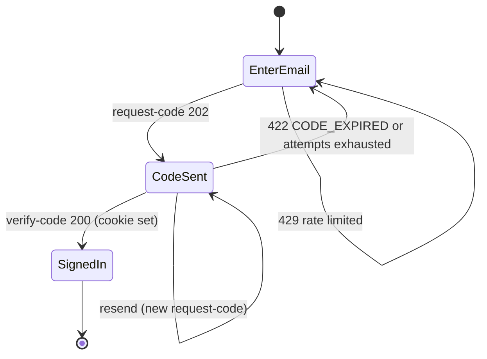

| State | UX |
|---|---|
| Email entry | Single email field. Client format check. "Send code". |
| Code sent | "If this email can be used, we sent a 6-digit code. It expires in 10 minutes." The same message appears for any email (09 §6, no enumeration). Six-digit input with `autocomplete="one-time-code"`. |
| Invalid code | "That code isn't right. Check the latest email." |
| Expired or locked | "That code has expired or had too many tries. Request a new one." → back to email |
| Resend | Enabled after 30 s [UX-REC]. A 429 response shows "Please wait before requesting another code." |
| Email delivery failure (502) | "We couldn't send the code. Try again shortly." |
| Session | Cookie only. The UI never reads or stores the token. |
| Unauthorised (401 on any call) | Redirect to `/sign-in?next=<route>` (route path only) with "Please sign in again." |
| Sign-out | Calls #14, clears client caches, then goes to `/` |
| Not supported | Passwords, social login, phone/SMS, any bypass (AU-8) |

---

## 8. Case List (`/cases`; #15)

| Column | Source | Notes |
|---|---|---|
| Case reference | `caseReference` | Link to the overview |
| Incident type | `incidentType` → human label ("KYC impersonation"), or "Not analysed yet" | Label only, no explanation text |
| Status | `status` → human label (§11.1) | Text label, not colour-only |
| Urgency | `urgency.level` or "Not assessed yet" | |
| Evidence | `evidence.total` | |
| Created / updated | `createdAt` / `updatedAt` (IST) | |

**Review state** is not in the list response, so the list shows `USER_REVIEW` as "Awaiting review / reviewed – see case" ([API-GAP] G1).

| State | Behaviour |
|---|---|
| Empty | "No cases yet." CTA "Start a case". |
| Loading | Table skeleton |
| Error | "We couldn't load your cases. Retry." |
| Pagination | "Load more" using `nextCursor` (limit 20) |

No evidence content, summaries or entity values appear in the list.

---

## 9. New Case (`/cases/new`; #1)

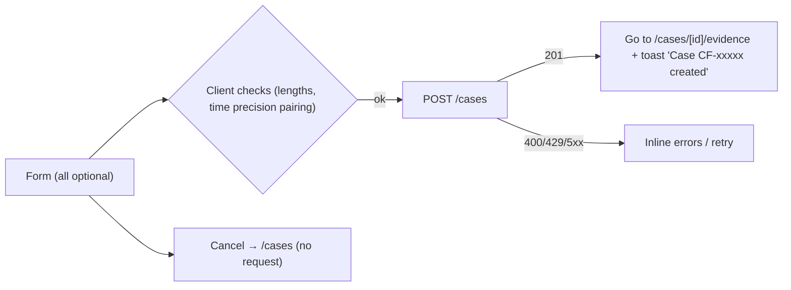

| Field | Input | Validation |
|---|---|---|
| When did it happen? | Date + time picker (IST) **plus** a precision selector: Exact / Approximate / I don't know | `UNKNOWN` clears the time. Precision is required if a time is set. |
| Your description (optional) | Multiline, ≤ 2,000 characters, helper "In your own words" | Saved as **your** summary. It is never overwritten by AI (03 §5.4). |
| Contact (optional) | Text ≤ 200, helper "Optional. Stored with your case. Proofline does not use it to contact you." | 03 §5.5: stored as entered, never used for messaging |
| Location (optional) | Text ≤ 200 | |

There is **no incident-type field**: the type is derived by analysis (AD-01). A case can be created with every field empty (AC-001.1). Editing later uses #16 from the overview.

---

## 10. Case Workspace

| Region | Purpose |
|---|---|
| **Case header** (§11) | Identity, status, urgency, review state, primary next action |
| **Workspace tabs** | Overview · Evidence · Activity · Timeline · Graph · Missing info · Actions · Draft · Integrity |
| **Main panel** | Active tab |
| **Source panel** (side drawer; bottom sheet on mobile) | Provenance details for any selected fact (§14) |

The workspace guides the user through the story order: **What happened? → What evidence? → How connected? → When? → What's missing? → What next? → Review and export.**

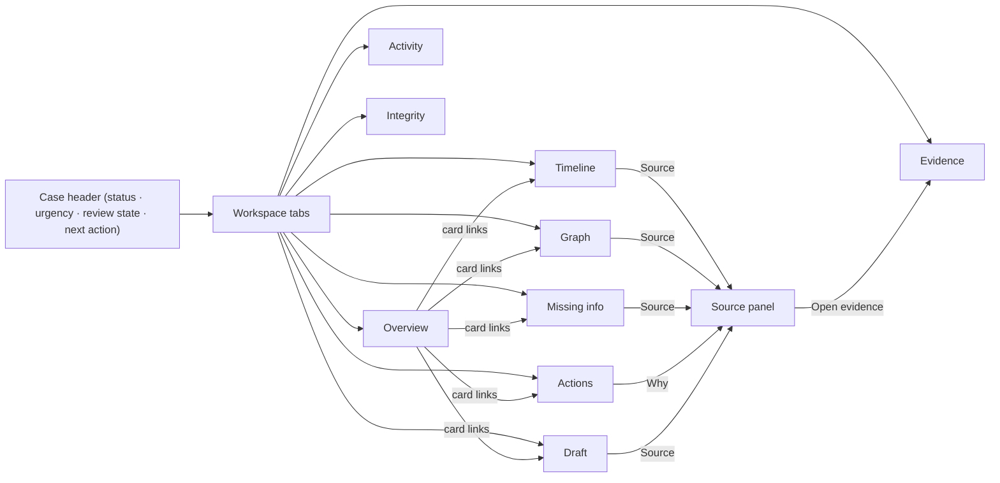

**Primary-next-action logic [UX-REC]** (from `GET /cases/:id`):

| Condition | Next action |
|---|---|
| No evidence | Add evidence |
| Items `UPLOADED` and no active run | Analyse evidence |
| Run active | View progress |
| Run `FAILED` | Retry analysis |
| `ACTIONS_READY` with open high-value questions | Answer questions |
| `ACTIONS_READY` | Generate draft |
| `USER_REVIEW`, not reviewed | Review draft |
| Reviewed | Export |

---

## 11. Case Header

| Element | Rule |
|---|---|
| Case reference | `CF-10001` |
| Incident type | Primary label in calibrated wording: "Signals consistent with KYC impersonation", with secondary labels as chips |
| Status | Human label (§11.1) |
| Urgency | `HIGH` / `MEDIUM` / `LOW`, or **"Not assessed yet"** (`urgency.assessed = false`). An "i" control expands `urgency.explanation` (+ reason sources) and **always shows the disclaimer**: "Urgency shows how soon to act on the steps below, based only on facts recorded in this case. It is not a risk score, a legal assessment, or a law-enforcement determination." `outOfDate = true` → badge "Based on the last analysis — may be out of date". **Never a number or score.** |
| Review state | When `status = USER_REVIEW`: "Awaiting your review", or **"Reviewed – version N"** if `report.reviewed`. Never "Confirmed" as a status. |
| Processing state | When `latestRun.status ∈ {QUEUED, RUNNING}`: a "Processing…" chip linking to Activity. `FAILED` → "Analysis stopped — Retry". |
| Key actions | Primary next action (§10); overflow menu: Edit case details (#16), Delete case (§23) |

### 11.1 Status labels (exact enum → copy)

| Status | Copy |
|---|---|
| `NEW` | New |
| `INGESTING` | Adding evidence |
| `EXTRACTED` | Evidence read |
| `ANALYZING` | Analysing |
| `CORRELATED` | Evidence connected |
| `TIMELINE_READY` | Timeline ready |
| `ACTIONS_READY` | Next steps ready |
| `REPORT_DRAFT` | Preparing draft |
| `USER_REVIEW` | Awaiting review (or "Reviewed – version N") |
| `EXPORTED` | Exported |

---

## 12. Evidence Upload Experience [RESOLVED G-4; 07 §4–§6, §13]

**Limits shown before upload (always visible above the drop zone):**

> "PNG, JPG, PDF (with selectable text), TXT or .eml email files · up to 10 MB each · up to 20 items per case · PDFs up to 20 pages · images up to 40 megapixels · pasted text up to 20,000 characters. Scanned PDFs aren't supported — upload those pages as images. Email attachments aren't analysed. Links are never opened."

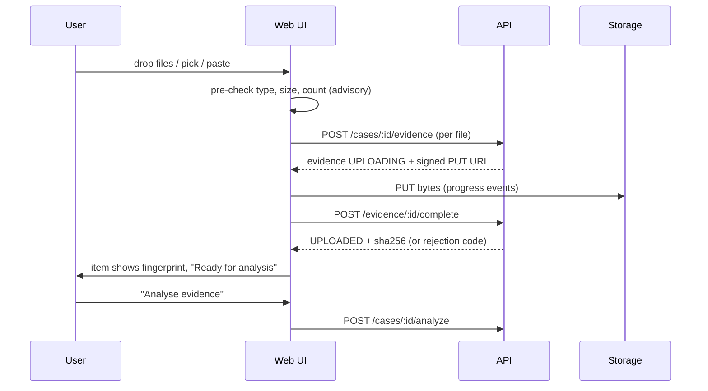

| Interaction | Behaviour |
|---|---|
| Drag and drop / file picker | Multiple files. Each becomes a row immediately ("Checking…"). Pre-check failures show inline and are never sent. |
| Item count | "6 of 20 items". At 20, the drop zone is disabled with "This case has the maximum of 20 items." |
| Upload progress | Per-file bar from PUT progress. After the PUT, "Verifying file…" during `complete`. |
| Success | Row shows the evidence ref (E04), type, size, **fingerprint** (first and last 8 characters + "copy full"), and "Ready for analysis" |
| Validation errors (server) | The row turns into a dismissible error with the 07 §22 message (e.g., "This file doesn't match its type or is damaged."). The item disappears on dismiss (no evidence row remains). |
| Retry | Transfer interrupted or 503 → "Retry" re-attempts the PUT (if the URL is unexpired) and `complete`, or re-registers. Rejections are not retryable. |
| Remove | Row menu → confirm dialog → #22 |
| Pasted text | "Paste text or a link" panel: kind selector (Message / Chat transcript / Link), live counter "x / 20,000", optional label. Link kind shows "Proofline won't open this link." |
| Upload does not analyse | After uploads, the primary button is **"Analyse evidence"** (#4). Upload never auto-starts analysis (PRD FR-002). |
| During an active run | Adding evidence is disabled: "Analysis is running. You can add more evidence when it finishes." (05 §25) |

---

## 13. Evidence Item Component

| Field | Display |
|---|---|
| Evidence ref | `E04` (prominent) |
| Title | User label if set, otherwise the original filename (owner-only display) |
| Type | PNG / JPG / PDF / TXT / Email / Pasted text / Link |
| Size / pages / dimensions | Where available |
| Upload status | Uploading x% · Verifying · Ready |
| Processing status | `processingStatus` → Ready for analysis / Processing / Processed / Failed |
| Integrity | "Not yet verified" / "Verified" / "Mismatch" / "Could not complete" (latest) |
| Fingerprint | Shortened SHA-256 + copy |
| Failure | Fixed message for `failure.code`; pages for `PDF_NO_TEXT_LAYER`; Retry only if `retryable` |
| Email | "N attachments listed (not analysed)" |
| Actions | View source text (#20) · View original (#21) · Verify (#11) · Remove (#22) |

No extracted values, snippets or thumbnails appear in list rows by default [UX-REC]. Image thumbnails load only when the user opens the item.

---

## 14. Evidence Preview and Source Panel

| Type | Preview |
|---|---|
| Image (PNG/JPG) | Original via signed URL from #21, shown in the viewer after an explicit "Show original image" action. Note: "The original image may show sensitive details such as codes." (09 §14). Source lines and boxes overlay as an optional layer. |
| PDF | **Extracted text view** (redacted lines by page from #20) + "Download original" (#21; downloads as a file). No inline PDF rendering (09 §11 attachment disposition). |
| TXT / pasted text | Redacted lines from #20, line-numbered |
| EML | Header table (From, To, Cc, Reply-To, Return-Path, Subject, Date, Message-ID) and body lines from #20, as **plain text**, never HTML. Links shown as text ("not opened"). Attachments listed with "not analysed". |
| Link (pasted URL) | Text only + "Proofline never opens links." |

**Source panel** (opened from any fact's "Source"):
- Evidence ref and type.
- Page/line.
- Snippet with the matched value highlighted.
- Neighbouring lines (±2) from #20.
- Method badge: Read from image (OCR) / From PDF text / From text / You stated.
- "Open evidence" link.

Redaction tokens appear as "▮ hidden code" / "▮ hidden card number" (the value is never shown).

---

## 15. Evidence Processing Experience (`/cases/[id]/activity`; #23)

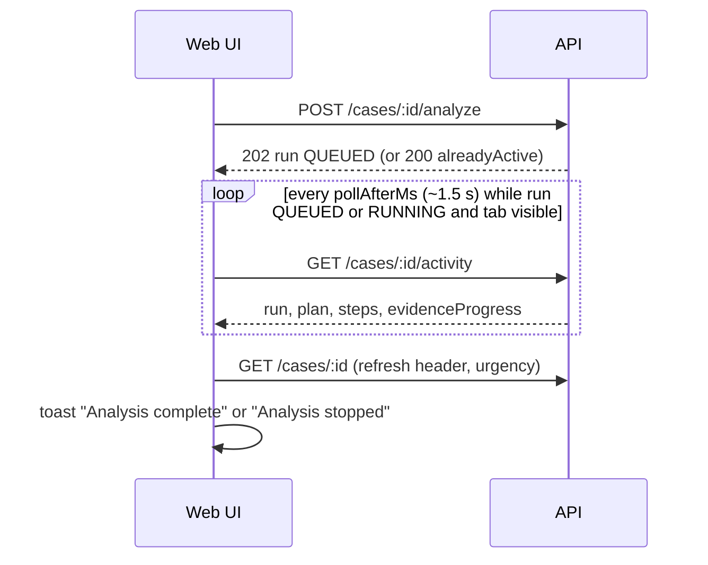

**Displayed steps** (from the `plan` and `steps`; labels [UX-REC]):

| Step | Label |
|---|---|
| PLAN | Planned the analysis |
| PARSE | Read text from E0x |
| EXTRACT | Found key details in E0x |
| NORMALIZE | Matched identical details across evidence |
| SCAM_ANALYSIS | Checked for known scam patterns |
| CORRELATE | Connected the evidence |
| TIMELINE | Rebuilt the timeline |
| MISSING_INFO | Checked for missing information |
| ACTIONS | Prepared next steps |
| URGENCY | Set urgency (rule-based) |
| REPORT | Prepared the draft (only in report runs) |

Plus a counter "Evidence 6/6 processed".

- **No model reasoning or prompts** are shown (FR-024).
- If `fallbackUsed`, a visible note: "Prepared demo results were used for this step because an AI service was unavailable." (FR-027)
- There is no "Report prepared" step in analysis runs. The report is generated separately (§27).

---

## 16. Processing Failure UX

| Failure (code) | Message | Action shown |
|---|---|---|
| `PDF_NO_TEXT_LAYER` | "This PDF is a scanned image (no readable text on page(s) N). Scanned PDFs aren't supported. Upload those pages as PNG or JPG images, then remove this PDF." | **Remove** + "Add images". **No Retry.** |
| `NO_READABLE_TEXT` | "No readable text found in this image." | Retry · Remove |
| `OCR_FAILED` / `EXTRACTION_FAILED` | "We couldn't read this file this time." | Retry · Remove |
| `EMAIL_UNPARSEABLE` | "We couldn't read this email file. Save it as .eml again, or paste its text." | Remove · Paste text |
| `EMAIL_ENCRYPTED` | "This email is encrypted and can't be read." | Remove |
| Run `EVIDENCE_PENDING` | "Some evidence wasn't ready when analysis ran. Analyse again." | Analyse |
| Run `CASE_CHANGED_DURING_RUN` | "The case changed during analysis. Analyse again." | Analyse |
| Step failed (AI/DB) | "Analysis stopped at '<step>'. Your completed work is kept." | Retry analysis |

**Retry** always calls `POST /cases/:id/analyze` (no per-item endpoint, 05 §6.3). The case cannot pass "Evidence read" until failed items are retried successfully or removed. A banner explains: "Remove or fix the items marked below to continue."

---

## 17. Incident Overview (`/cases/[id]`)

Answers **"What happened, what do we know, and what needs attention?"**

| Card | Content (source) |
|---|---|
| What happened | Incident type in calibrated wording + the top signal explanation + "Your description" (`summary`, labelled as yours) |
| Urgency | Level + explanation + disclaimer (§11) |
| Loss | Amount from entities/actions where available (e.g., "₹8,500 debited (E04, E05)"), otherwise "Not provided" |
| Key identifiers | `entityCounts` strip (PHONE 1 · URL 1 · UPI 1 · UTR 1) → Graph |
| Key events | First 3–5 timeline events → Timeline |
| Evidence | "6/6 processed", failures highlighted → Evidence |
| Needs attention | Open questions count, contradictions count → Missing info |
| Next steps | Top 3 actions with status → Actions |
| Draft and review | Current version, "Awaiting review" / "Reviewed – version N" → Draft |

Before analysis, cards show the "Not analysed yet" empty state with an "Analyse evidence" CTA.

**Investigation flow:**

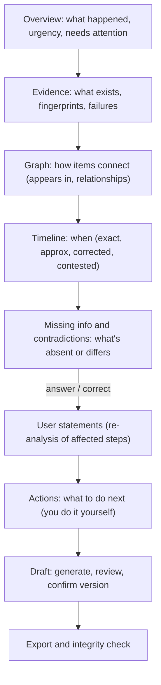

---

## 18. Evidence Summary (Evidence tab, above the list)

- Counts by status and type.
- Integrity summary ("5 verified · 1 not yet verified").
- **"Supports"**: per evidence item, which key facts it supports, derived from entities' `appearsIn` and event sources. For example, "E04 supports: amount, transaction ID, UPI ID, payment time."
- Clicking a fact opens its source panel.

---

## 19. Entity View (inside Graph tab "List" mode and entity detail; #5)

| Field | Display |
|---|---|
| Type | Phone / Link / Domain / UPI ID / Transaction ID / Amount / Account (last 4) / Bank or wallet / SMS sender / Email / Messaging handle / Name |
| Value | **Masked by default.** A "Show full" toggle reveals `canonicalValue` (owner-only; not for OTP/card values, which don't exist) [UX-REC]. |
| Appears in | Evidence refs (chips → source panel) |
| Relationships | From graph data (edges touching the node) with display wording (08 §8) |
| Confidence | Band label only (High / Medium / Low). Never a number. |
| Origin | "From evidence", or **"You stated"** for `isUserStated` |
| Corrections | "Correct this value" on an extraction (#24). The original remains visible as "Originally read as…". |

Unmerged extractions (`NOT_NORMALIZED`) are listed as "Couldn't standardise this value".

---

## 20. Timeline View (#6)

| Element | Rule |
|---|---|
| Order | `sortOrder` |
| Time display (IST) | **EXACT:** "12:19 PM, 24 Sep 2026". **APPROXIMATE:** "~12:05 PM" with the label "approx." **Date-only** (derived when `timeSourceText` has no time, [API-GAP] G2): "24 Sep 2026" with no time. **INFERRED_ORDER_ONLY:** "Time unknown — order inferred". |
| Original text | Tooltip/expander: "As written: 'Around 12:05 PM' (E06)" |
| Event type | Human label (Message received, Call, Link opened, Password/OTP requested, Password/OTP shared, Payment requested, Payment made, Debit alert, Message sent, Other) |
| Description | Neutral description |
| Sources | Chips (E04 · line 8) → source panel |
| Origin | "From evidence" / **"You added"** |
| Corrected | Badge "You corrected this" + "Originally: ~12:05 PM" |
| Contradiction | Marker "Sources differ" → the contradiction (§25) |
| Confidence | Band label |
| Dismissed | Hidden. "Show dismissed (n)" toggle. |

**Approximate times are never shown as exact.**

---

## 21. Timeline Corrections (#25–#27)

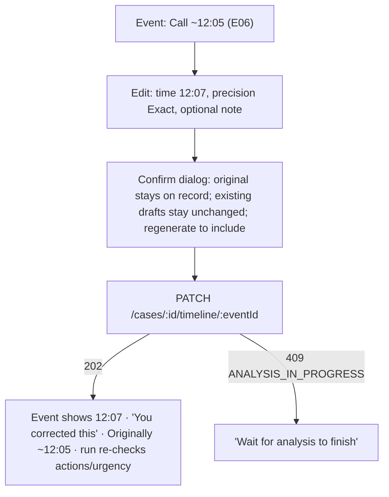

| Element | Behaviour |
|---|---|
| Original | Always shown ("Originally read as ~12:05 PM from E06") |
| Corrected | The new value becomes primary, labelled **"You stated"** |
| Note | Optional, ≤ 2,000 characters |
| Confirmation | Dialog: "Your correction is saved as your statement. The original evidence isn't changed. If you've reviewed a draft, you'll need to review the regenerated draft." |
| Audit indication | "Saved · recorded in the audit log" |
| Add event | "Add an event" form (type, time + precision, description) → #25 |
| Dismiss | "This isn't right" → #27 with confirm |
| Report effect | Existing versions are unchanged. The header shows "Draft out of date — regenerate". |

---

## 22. Evidence Graph View (#7)

| Feature | Behaviour |
|---|---|
| Nodes | Case (centre), entity nodes (masked labels, type marker), evidence nodes (E0x) |
| Edges | `APPEARS_IN` (entity ↔ evidence, lighter) and relationships with wording: is hosted on · sent link · requested payment to · paid to · amount of · debited from · message contained · contacted from |
| Node selection | Side panel: type, masked/full value, appears in, connected entities, sources |
| Edge selection | Panel: "PHONE requested payment to UPI ID", **"Supported by 1 item (E02)"**, sources with snippets |
| Evidence count | Badge on entity nodes (number of evidence items) |
| Navigation | "Open source" → source panel. "Show in timeline" for entities with related events. |
| Filters [UX-REC] | Hide/show `APPEARS_IN` edges; filter by entity type |
| List mode | Accessible table alternative (§36): entities with appears-in and relationships |

Exact layout and styling are owned by Document 11.

---

## 23. Graph Empty and Partial States

| State | Message |
|---|---|
| No entities | "No key details were found yet. Add more evidence or check failed items." (not an error) |
| One entity | Single node: "Connections appear when the same details show up in more than one item." |
| Few relationships | Normal render + hint "Only connections shown in your evidence are drawn." |
| Partially processed / failed items | Banner: "2 items aren't processed — the graph may be incomplete." |
| Stale (case rewound, run pending) | Banner: "Evidence changed — analyse again to update connections." |
| Rebuilding (run active) | Last data shown dimmed, with "Updating…" |
| Load error | "Couldn't load the graph. Retry." |

---

## 24. Missing Information (`/cases/[id]/missing`; #28–#30)

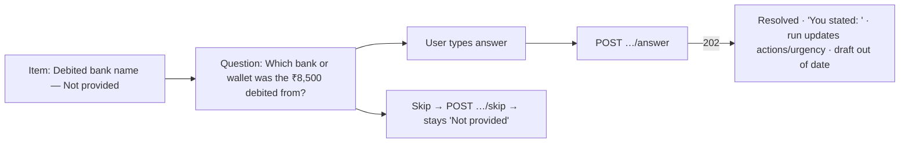

| Element | Display |
|---|---|
| What's missing | Field label (e.g., "Debited bank or wallet") + "Not provided" |
| Why it matters | `reasonText` |
| Evidence checked | "Checked all processed evidence (E01–E06)", derived from the evidence list ([API-GAP] G4) |
| Required / recommended | "Needed for financial fraud reports" (variant FINANCIAL), "Optional" (suspect details), "Keep ready" (identity document, **no upload control**, OD-09) |
| Question | Text + answer field. Only for high-value items. |
| Answer state | Open / Answered / Skipped |
| Provenance | Answer shown as **"You stated: Example Bank"** (whatever the user typed). It is never shown as evidence. |
| During a run | Answering disabled with "Wait for analysis to finish" |

---

## 25. Contradictions (same screen, separate section)

| Element | Display |
|---|---|
| Heading | "These pieces of information differ" (never "false", "lie" or "fraudulent") |
| Values | Side by side: **"12:19 PM — E04 receipt (line 8)"** vs **"around 12:40 PM — E06 your note"** |
| Sources | Chips → source panel |
| Why flagged | `reasonText` (e.g., "Two different payment times were found.") |
| Resolution | Open / resolved by your answer ("You stated 12:19 PM is correct"). Both sources always remain visible. |
| Question | Optional answer, as §24 |

---

## 26. Immediate Action Checklist (#8, #31)

| Element | Display |
|---|---|
| Order | `priorityRank` (1 first). "Do first" label for rank 1 [UX-REC]. |
| Action | `actionText` (instructional, e.g., "Contact your bank…") |
| Reason | `reasonText` + "Why" → sources |
| Official channel | Curated details from the response (e.g., 1930 · cybercrime.gov.in), with the label **"You do this yourself — Proofline does not contact anyone."** External links open in a new tab with `rel="noopener noreferrer"`. These are the curated official sites only, never evidence URLs. |
| Status | To do / Done / Not applicable control → #31 (no-op if unchanged) |
| Recommended by | "Suggested by Proofline". Completion is shown as "Marked done by you · date". |
| Urgency link | The header urgency is not repeated as a score. Actions are independent of urgency. |

---

## 27. Complaint Draft (`/cases/[id]/report`; #9, #32, #33)

| State | UX |
|---|---|
| No draft | "Generate draft" (enabled at `ACTIONS_READY` and later, no active run). Explains: "Creates a structured draft from your case. You'll review it before exporting." |
| Generating | Run status via polling (#23, kind REPORT_GENERATION). Header shows "Preparing draft". |
| Failed | "Draft couldn't be prepared. Retry." Earlier versions stay listed. |
| Generated | Version selector (current marked). Sections rendered from `content` in AD-04 order: header + disclaimer · incident summary (marked "AI-written summary — check it") · date/time · financial details · identifiers observed in evidence · scam signals · timeline · missing info and contradictions · recommended actions · evidence index · ID-document reminder. |
| Facts | Each fact shows its value + source chips, or **"Not provided"**. User-stated facts carry "You stated". |
| Editing | **The draft text is not edited directly** (03 §5.4; 06 §15). Changes are made through corrections, answers and case details, then **regenerate** (new version). Each section has "Fix this" links to the relevant tab [UX-REC]. |
| Banner | "This is an AI-assisted draft for you to review. It is not an official complaint and has not been submitted anywhere." |

---

## 28. Report Review

The review pane is shown alongside the current version.

| Shows | Source |
|---|---|
| Version and generated time | #32 |
| Key facts with sources | `content` |
| **Uncertain items**: approximate times, inferred order, Medium/Low confidence facts | `content` precision and confidence fields |
| Unresolved missing items and contradictions | `content` section 7 |
| Your corrections and statements | Facts with origin `USER_STATEMENT` / corrected events |
| Evidence index with fingerprints | Section 9 |
| Confirmation state | "Not reviewed" / "Reviewed – version N" |

If any unresolved items exist, a checklist reminder appears before confirmation: "3 items are uncertain or unresolved — they will appear in the export as shown." This informs; it does not block (PRD RV-1–RV-3).

---

## 29. USER_REVIEW and Confirmation UX [RESOLVED R-1]

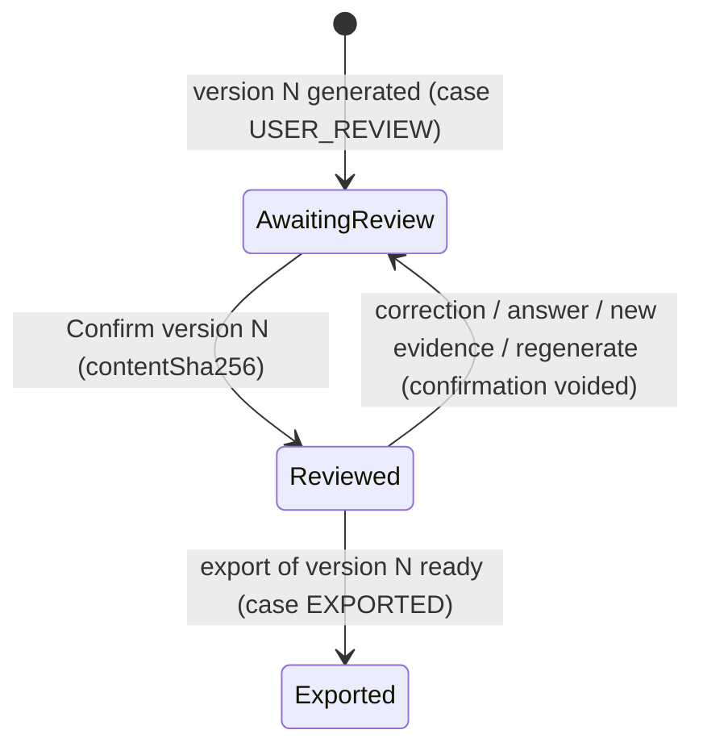

| Rule | UX |
|---|---|
| Case state | `USER_REVIEW` is displayed as "Awaiting review" until confirmed, then **"Reviewed – version N"**. The status label never changes to "Confirmed". |
| Confirm action | "I've reviewed version N" → dialog showing the version and checksum (short) → #34 with the version's `contentSha256` |
| Errors | 409 `REPORT_NOT_CURRENT`: "A newer version exists — review version M." 409 `REPORT_CHECKSUM_MISMATCH`: "This draft changed — reload and review again." |
| Voiding | After any change, the badge returns to "Awaiting review" with the note "Your earlier review no longer applies because the case changed." |
| Export link | Enabled only when reviewed for the **current** version |

---

## 30. Export UX (#10, #35, #36)

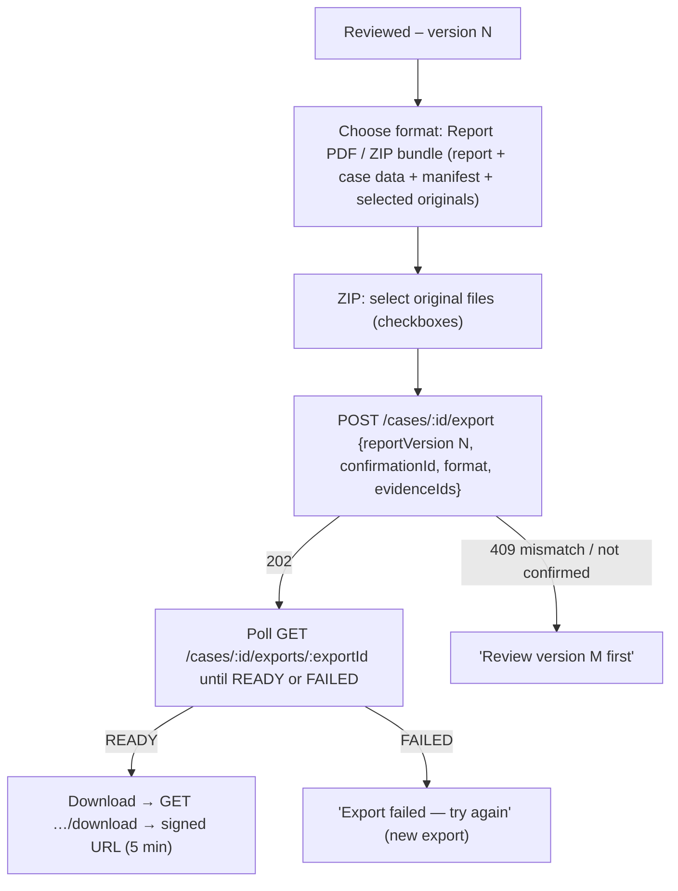

| Element | Behaviour |
|---|---|
| Formats | **Only** Report PDF and ZIP bundle (OD-07) |
| Version match | The request uses the confirmed version and its confirmation ID. A mismatch shows a 409 message. |
| Checksum | The ready export shows its SHA-256 (short + copy) and "Manifest included" for ZIP |
| Download | Button fetches a fresh signed URL each time. On expiry, the user clicks again (no stale links stored). |
| Note | "The ZIP includes your original files exactly as uploaded. Originals may show sensitive details." |
| After export | Case status "Exported". The download is audited. |

---

## 31. Integrity Verification (`/cases/[id]/integrity`; #11)

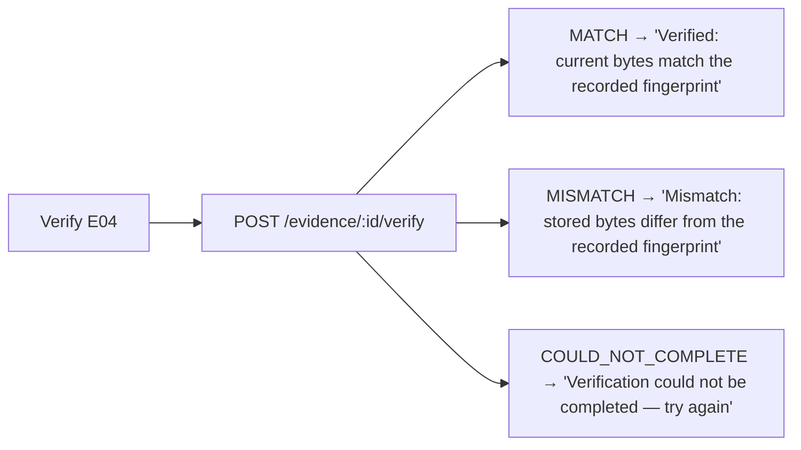

| Element | Display |
|---|---|
| Per item | Ref, type, recorded fingerprint, last result + time, "Verify" button; "Verify all" runs sequential calls [UX-REC] |
| Result | Recorded vs. current hash (short + copy); time (IST) |
| Wording | **Verified** / **Mismatch** / **Could not complete**. An unreadable file is **never** called tampered or a mismatch. |
| What it proves | Always visible: "Proves: the stored file is byte-for-byte the same as when it was uploaded. Doesn't prove: that the evidence is true or authentic, who created it, or that it's legally admissible." |
| Blockchain | Not shown unless an `attestation` object exists (OD-06 off by default). If shown, it is a secondary detail row. |

---

## 32. Audit Log UX (same screen, second section; #37)

| Column | Display |
|---|---|
| Time | IST |
| Actor | "You" (`actorIsYou`) or "System" |
| Action | Human label (e.g., "Uploaded evidence", "Confirmed draft", "Verified integrity") |
| Target | Type + human reference (E04, version 2) where derivable from metadata |
| Outcome | Succeeded / Failed / Denied |
| Details | Whitelisted metadata (version, evidence ref, result) |

Paginated with "Load more". No evidence content, values or secrets appear; the API cannot return them (05 §22).

---

## 33. Loading, Empty, Error and Offline States

| Situation | Behaviour |
|---|---|
| Initial loading | Skeletons per screen. Header loads first. |
| API failure | Specific message from the error `code` (05 §5) + Retry. Generic text only for `INTERNAL_ERROR`, with the request ID shown for support. |
| Processing | Activity view + "Processing…" chip. Data tabs show the last data dimmed. |
| Partial processing | Banner listing unprocessed or failed items |
| Empty case | Evidence tab with drop zone and limits |
| Empty graph / no timeline / no missing info / no actions | Calm empty states: "Nothing missing was found — review the draft to confirm." / "No events with times were found." |
| Report generation | Draft tab progress state |
| Export generation | Export panel progress |
| Integrity verification | Per-row spinner, then result |
| Offline (`navigator.onLine` false) | Banner "You're offline — changes can't be saved." Mutating buttons disabled. Polling paused. |
| 404 (unowned or missing) | "This case isn't available." → My cases |

---

## 34. Notifications

All toasts contain **no evidence values, names, numbers or filenames**. Only references and states.

| Event | Toast |
|---|---|
| Case created | "Case CF-10001 created." |
| Evidence uploaded | "E04 added." |
| Evidence rejected | "A file wasn't added: <reason>." |
| Processing complete | "Analysis complete." |
| Processing failed | "Analysis stopped — see Activity." |
| Correction saved | "Correction saved." |
| Answer saved | "Answer saved." |
| Report generated | "Draft version 2 is ready to review." |
| Confirmation recorded | "Version 2 marked as reviewed." |
| Export ready | "Your export is ready to download." |
| Integrity result | "E04: Verified." / "E04: Mismatch." / "E04: Verification could not be completed." |

---

## 35. Responsive UX

| Context | Behaviour |
|---|---|
| Desktop | Tabs + main panel + right source panel |
| Tablet | Tabs scroll horizontally; source panel overlays |
| Mobile | Tab bar becomes a menu or bottom navigation. Source panel becomes a bottom sheet. Graph defaults to **list mode**, with "Show graph" offering pan/zoom and tap selection. Timeline as a vertical list. Upload via file picker plus camera-roll images. Primary next action pinned at the bottom. |

Breakpoints are owned by Document 11.

---

## 36. Accessibility

| Requirement | Implementation |
|---|---|
| Keyboard | All controls reachable. The graph supports arrow-key node traversal and Enter to select. Dialogs trap focus and Escape closes them. |
| Focus | Always visible. Focus moves to the dialog heading on open and returns on close. |
| Headings | One H1 per screen. Sections in order. |
| Labels and errors | Every input has a label. Errors are linked via `aria-describedby` and announced. |
| Dialogs | `role="dialog"`, labelled |
| **Graph alternative** | The list mode table (entities, appears-in, relationships with sources) is equivalent and keyboard/screen-reader friendly |
| Timeline | Ordered list (`<ol>`). Each item reads type, time with precision ("approximately 12:05 PM"), sources, and corrected or contradiction state. |
| Status semantics | Text labels + icon, **never colour only** (urgency, integrity, statuses) |
| Live regions | Processing progress `polite`; failures `assertive` |
| Contrast | Meets WCAG 2.1 AA (values in Doc 11) |
| Reduced motion | Graph animation and progress transitions disabled under `prefers-reduced-motion` |
| Touch targets | Minimum target size per Doc 11 (≥ 44 × 44 px guideline) |

---

## 37. Security UX Requirements [RESOLVED 09]

| Situation | UX |
|---|---|
| Unauthorised / unowned case | "This case isn't available." (404). No hint that it exists. |
| Expired session | Redirect to sign-in. Unsaved form text kept in memory only for this tab. |
| Expired signed URL | Re-request the link automatically once. Otherwise "This link expired — try again." |
| Protected evidence | Originals only via explicit "Show original" / "Download". Never preloaded in lists. |
| Masking | Graph and overview use masked values. "Show full" is per entity and owner-only. Redacted tokens are displayed as hidden. |
| Errors | Fixed messages. Request ID only (no stack traces or provider text). |
| Notifications | No sensitive content (§34) |
| URLs | IDs only. No values in query strings. `Referrer-Policy: no-referrer`. |
| Evidence URLs in content | Rendered as plain text, never clickable |

---

## 38. Frontend State Model

| State class | Examples | Rule |
|---|---|---|
| **Server state** (source of truth = API) | Case, evidence list, activity, entities, graph, timeline, findings, actions, reports, exports, audit | Fetched on demand. Re-fetched after mutations and on poll completion. **Never edited locally as truth.** Cached in memory per session only. |
| **Temporary UI state** | Selected tab, node, source panel, filters, upload progress per file, dialog open, polling timers | Component or route memory. Lost on reload (acceptable). |
| **User-editable draft state** | New-case form, correction form, answer text, paste text | Local component state until submitted. **Not persisted to localStorage or sessionStorage** (sensitive) [UX-REC]. |
| Authentication state | Signed in / not signed in | Inferred: a 401 means signed out. No token in JS. |

Concrete flows:
- **Upload:** per file `{evidenceId, phase: registering|uploading|verifying|done|failed, progress}`.
- **Processing:** `{runId, status, steps}` from the poll.
- **Review:** `{currentVersion, reviewed}` from #2/#32.
- **Export:** `{exportId, status}`.
- **Integrity:** per item `{inFlight, lastResult}`.

---

## 39. API-to-UI Mapping

### 39.1 Endpoint mapping (05)

| Endpoint | UI usage |
|---|---|
| `POST /auth/request-code`, `POST /auth/verify-code`, `POST /auth/logout` | Sign-in, sign-out |
| `GET /cases` | Case list |
| `POST /cases` | New case |
| `GET /cases/:id` | Header, overview, urgency, signals, review state, entity counts |
| `PATCH /cases/:id` | Edit case details |
| `DELETE /cases/:id?confirm=true` | Delete case (double-confirm dialog typing the case reference [UX-REC]) |
| `POST /cases/:id/evidence` | Register file / paste |
| `POST /evidence/:id/complete` | Finish upload |
| `GET /cases/:id/evidence` | Evidence tab, evidence summary, integrity list |
| `GET /evidence/:id/source` | Source panel, text previews |
| `GET /evidence/:id/download` | Show original / download |
| `DELETE /evidence/:id?confirm=true` | Remove evidence (dialog explains report invalidation) |
| `POST /cases/:id/analyze` | Analyse / Retry |
| `GET /cases/:id/activity` | Activity screen, polling, report-run progress |
| `GET /cases/:id/entities` | Entity list/detail, overview loss and identifiers |
| `POST /cases/:id/extractions/:id/correction` | Correct a value |
| `GET /cases/:id/timeline`, `POST`, `PATCH`, `POST …/dismiss` | Timeline view and corrections |
| `GET /cases/:id/graph` | Graph |
| `GET /cases/:id/missing-information`, `…/answer`, `…/skip` | Missing info and contradictions |
| `GET /cases/:id/actions`, `PATCH …/actions/:id` | Checklist |
| `POST /cases/:id/report`, `GET /cases/:id/reports`, `GET …/reports/:v`, `POST …/reports/:v/confirm` | Draft, review, confirm |
| `POST /cases/:id/export`, `GET …/exports/:id`, `GET …/exports/:id/download` | Export |
| `POST /evidence/:id/verify` | Integrity |
| `GET /cases/:id/audit-log` | Audit log |

### 39.2 API gaps (non-blocking; no new endpoint invented)

| ID | UI need | Gap | Resolution in the MVP UI |
|---|---|---|---|
| G1 | Review state in the case list | `GET /cases` items have no `report.reviewed` | Show status only. Review state appears inside the case. |
| G2 | Date-only timeline display | `GET /cases/:id/timeline` lacks the `displayGranularity` that 08 §18 derives | The UI derives date-only when `timeSourceText` contains no time pattern. Presentation-only. A future 05 field is recommended. |
| G3 | Show signed-in email | No current-user endpoint | The header shows "Sign out" only |
| G4 | "Evidence checked" for missing info | Not exposed (08 §28 keeps it in step output) | Derived as "all processed evidence" from the evidence list (valid because the `EXTRACTED` gate requires all items processed) |

---

## 40. Frontend Data Refresh / Polling [RESOLVED OD-10]

| Aspect | Rule |
|---|---|
| Starts | After #4 or #9 returns a run, or when a page loads with `latestRun.status ∈ {QUEUED, RUNNING}`. Exports start polling after #10. |
| What | `GET /cases/:id/activity` (runs). `GET /cases/:id/exports/:exportId` (exports). |
| Interval | `pollAfterMs` (~1.5 s). Doubles up to 10 s after 60 s of no change [UX-REC]. |
| Stops | Run `SUCCEEDED`/`FAILED`; export `READY`/`FAILED`; navigation away from the case; sign-out. |
| Hidden tab | Paused on `visibilitychange` hidden; resumes with an immediate poll. |
| Stale responses | Each request carries a sequence number. Responses older than the latest applied one are ignored. |
| Browser refresh | The page reloads server state. Polling resumes if a run is active (no client-held truth). |
| Completion | Re-fetch the case and affected tabs (entities, graph, timeline, findings, actions, reports). Toast. |
| Failures | A poll HTTP error retries with backoff. After 3 consecutive failures: "Connection problem — retrying" banner. 401 → sign-in. |
| No WebSockets or SSE | — |

---

## 41. Frontend Security Boundaries [RESOLVED 04 §6, 09]

- No API keys, storage credentials or secrets in the browser bundle (nothing secret under `NEXT_PUBLIC_*`).
- No direct database access. All data comes via `/api`.
- Storage access is only through API-issued signed URLs, used immediately and not stored.
- Authentication is via the httpOnly cookie. JS never reads tokens.
- **Client validation is convenience. The server is authoritative** (G-4).
- No evidence values, statements or snippets in `localStorage`, `sessionStorage`, IndexedDB or URLs.
- Downloads use the provider's `attachment` disposition. The UI never renders downloaded EML/TXT/HTML as HTML.
- Evidence text is always rendered escaped (no `dangerouslySetInnerHTML`).
- External links: only the curated official channels, with `noopener noreferrer`.

---

## 42. Demo UX (`DECISIONS.md` §7.2; fictional data)

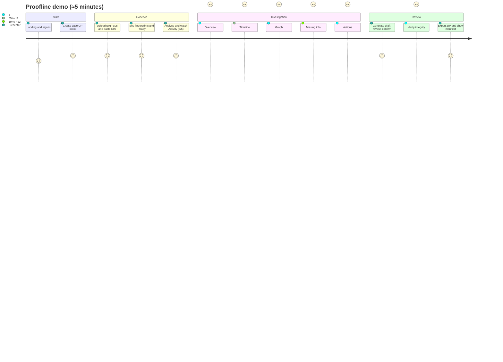

| Step | What is shown (visibly) |
|---|---|
| Upload | Six rows with fingerprints. E04 is a text PDF. E06 is pasted text. |
| Processing | Plan + steps + "6/6 processed". A fallback note appears only if it was used. |
| Overview | **Urgency HIGH** with explanation + disclaimer. "Signals consistent with KYC impersonation" + UPI fraud, phishing. Loss ₹8,500. Counts PHONE 1 · URL 1 · UPI 1 · UTR 1. |
| Timeline | T1–T9 in order. T5 approximate. **Correction** of the call to 12:07 with "Originally ~12:05". The T8 "Sources differ" marker. |
| Graph | **Cross-evidence correlation:** PHONE appears in E01/E02/E06. URL appears in E01/E02/E03. UPI in E02/E04/E05. "paid to" edge "Supported by 2 items (E04, E05)". |
| Missing info | **Debited bank name**: answer "Example Bank" (typed live) → "You stated". **Contradiction** 12:19 (E04) vs ~12:40 (E06). |
| Actions | Contact bank · Report via 1930/NCRP · Preserve evidence · Report suspect identifiers, each with sources and the "You do this yourself" label |
| Draft | Generate → v1 (or v2 after the answer). Sources on facts. "Not provided" absent once answered. Review and confirm → "Reviewed – version N". |
| Integrity | Verify all → **Verified** for each, with the "proves / doesn't prove" text |
| Export | ZIP → download; checksum shown |
| Provenance | Clicking any fact (e.g., the UTR) opens the source panel at E04 line 9 |

The OTP from E02 appears as "▮ hidden code" in the text view. The demo uses the general UI; **nothing demo-specific is hard-coded**.

---

## 43. UX Acceptance Criteria

| Area | ID | Criterion |
|---|---|---|
| Authentication | UX-01 | Email → code → signed in. Invalid and expired codes show the right messages. Same message for unknown emails. No bypass. |
| Case | UX-02 | A case can be created with no fields. The header shows the reference and the "New" status. Status labels map exactly (§11.1). |
| Evidence | UX-03 | Limits are visible before upload. Supported files upload with progress and fingerprint. 21st item blocked. Oversize or spoofed files rejected with a message. |
| Evidence | UX-04 | A scanned PDF shows the scanned-PDF guidance with **no Retry**, and Remove works |
| Processing | UX-05 | Activity shows plan, steps and N/N via polling. Polling stops on completion. Failures show the correct actions. |
| Investigation | UX-06 | Entities show masked values, appears-in and sources. The graph shows relationship wording and support counts. The list alternative is equivalent. |
| Investigation | UX-07 | Timeline shows exact vs. approximate correctly. The correction keeps the original. Contradiction shows both sources. |
| Investigation | UX-08 | Missing item answer is labelled "You stated". Skip keeps "Not provided". The ID document has no upload. |
| Review | UX-09 | Draft sections render with sources and "Not provided". The status stays `USER_REVIEW`. "Reviewed – version N" appears after confirm and resets after changes. |
| Review | UX-10 | Export works only for the reviewed current version. The mismatch message appears for stale confirmations. Download refreshes expired links. |
| Integrity | UX-11 | Verified / Mismatch / Could not complete are shown with exact wording. The proves/doesn't-prove text is visible. No ledger UI when off. |
| Security | UX-12 | Another user's case → "isn't available". Toasts contain no values. No secrets in the client bundle. No sensitive data in web storage or URLs. |
| Accessibility | UX-13 | Full keyboard operation including the graph list. Labelled inputs and errors. Status text not colour-only. Reduced motion honoured. |
| Copy | UX-14 | No forbidden phrases anywhere ("confirmed fraud", "money recovered", …) |

---

## 44. Traceability Matrix

| Concern | 01 | 02 | 03 | 04 | 05 | 06 | 07 | 08 | 09 | DECISIONS |
|---|---|---|---|---|---|---|---|---|---|---|
| Screens | §21 | §6 | — | §6 | §6 | — | — | — | — | — |
| Evidence limits | FR-002 | §8 | §6.2 | §8.2 | §8 | — | §8 | — | §19 | G-4, OD-03 |
| Evidence states | FR-002 | S-3 | §23.2 | — | §9 | — | §3 | — | — | AD-05 |
| Processing / activity | FR-006, FR-024 | FR-024 | §15 | §14 | §11 | §4 | §2 | — | — | OD-10, OD-12 |
| Graph | FR-011, §13 | §12 | §11 | §17 | §15 | §7 | §20 | §8–§15 | — | G-6 |
| Timeline | FR-012 | §13 | §12 | §16 | §14 | §11 | §21 | §16–§23 | — | G-5, G-6 |
| Contradictions | FR-014 | MI-2 | §13 | §15 | §16 | §12 | — | §24–§26 | — | §7.2.6 |
| Missing info | FR-014, FR-015 | §14 | §13 | §15 | §16 | §13 | — | §27–§28 | — | AD-01, OD-09 |
| Urgency | §21.1 | AC-R3 | §14 | §15 | §7.3 | §10 | — | §30 | §25 | G-2 |
| USER_REVIEW / confirmation | FR-019 | §13.8 | §17.3 | §18 | §19 | §15 | — | §23 | §33 | R-1 |
| Export | FR-020 | §18.2 | §17.4 | §18 | §20 | — | — | — | §33 | OD-07 |
| Integrity | FR-021 | §17 | §18 | §19 | §21 | — | §7 | — | §30–§32 | OD-06 |
| Security UX | §16 | §19–§20 | §20 | §21 | §28–§29 | §29 | §25 | §33 | §8–§11, §37 | OD-04, OD-05 |
| Demo | §22 | §22 | §25 | §34 | §33 | §33 | §30 | §35 | — | AD-03 |

---

## 45. Implementation Readiness Checklist

| Question | Answer |
|---|---|
| Are all screens defined? | **Yes**: §6–§32 |
| Are all primary user journeys defined? | **Yes**: §2, §42 |
| Are routes defined? | **Yes**: §4 ([IMPL] names) |
| Are backend API mappings defined? | **Yes**: §39 |
| Are loading/error/empty states defined? | **Yes**: §23, §33 |
| Is evidence upload defined? | **Yes**: §12–§13 |
| Is processing UX defined? | **Yes**: §15–§16 |
| Is graph UX defined? | **Yes**: §22–§23 |
| Is timeline UX defined? | **Yes**: §20 |
| Are corrections defined? | **Yes**: §19, §21 |
| Are contradictions defined? | **Yes**: §25 |
| Is missing information defined? | **Yes**: §24 |
| Are actions defined? | **Yes**: §26 |
| Is the complaint draft defined? | **Yes**: §27–§28 |
| Is USER_REVIEW defined? | **Yes**: §29 |
| Is export defined? | **Yes**: §30 |
| Is integrity UX defined? | **Yes**: §31–§32 |
| Is accessibility defined? | **Yes**: §36 |
| Is responsive behaviour defined? | **Yes**: §35 |
| Is frontend security defined? | **Yes**: §37, §41 |
| Is the demo flow defined? | **Yes**: §42 |
| Are there genuine API/UX gaps requiring a decision? | **No blocking gaps.** Four non-blocking gaps (G1–G4, §39.2) have MVP workarounds. A future 05 revision could add review state to the case list and `displayGranularity` to timeline events. |

**Non-blocking notes:**
1. **"Editable" draft:** the draft is not text-editable. It changes through corrections, answers and regeneration, consistent with 03 §5.4 and 06 §15.
2. **PDF preview:** shown as extracted text plus download; there is no inline rendering (attachment disposition, 09 §11).
3. **"Report prepared":** the request's example step list included it. Report generation is a separate user action (06 §4), so it is not an analysis step here.

No decision is reopened. No endpoint, table, agent, authentication method or export format is added.

**Final status: READY WITH NON-BLOCKING NOTES**
