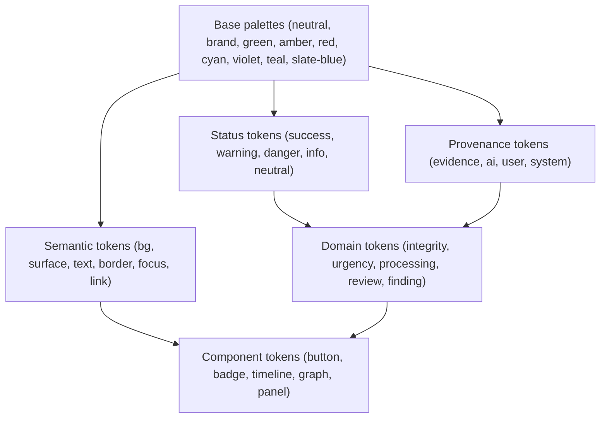
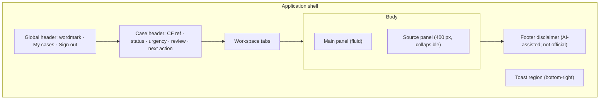
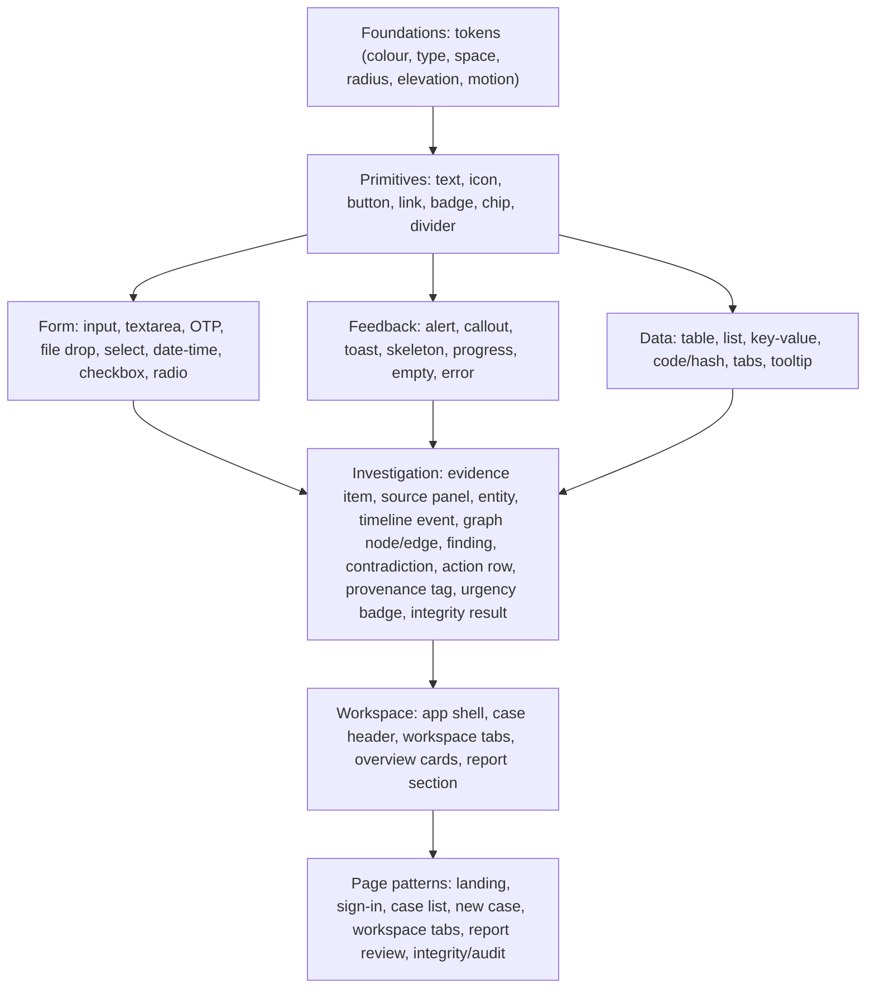
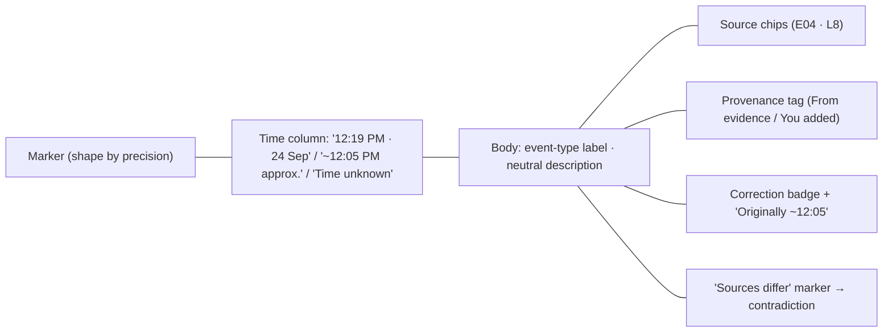
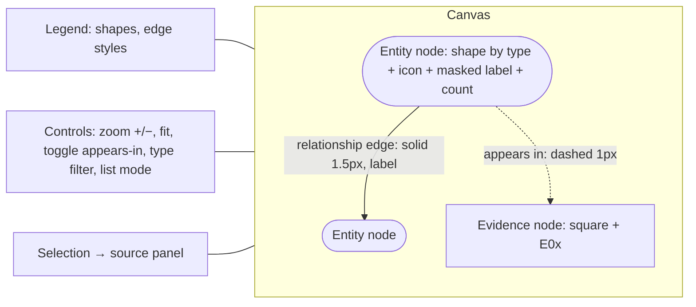
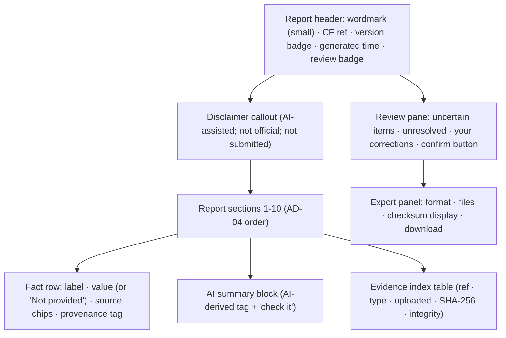
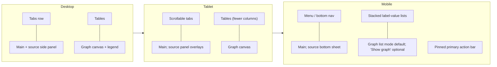
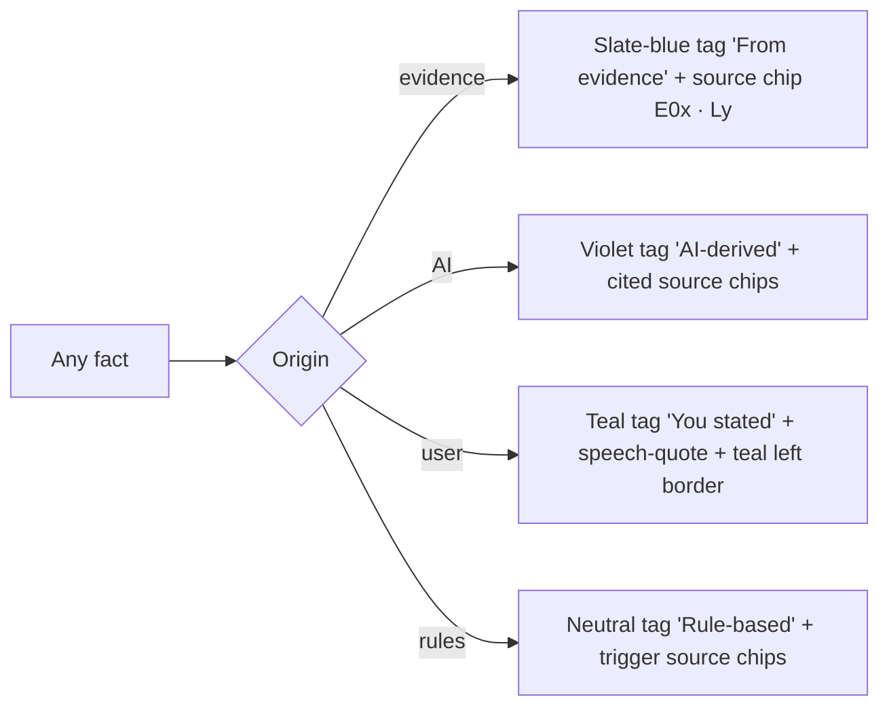
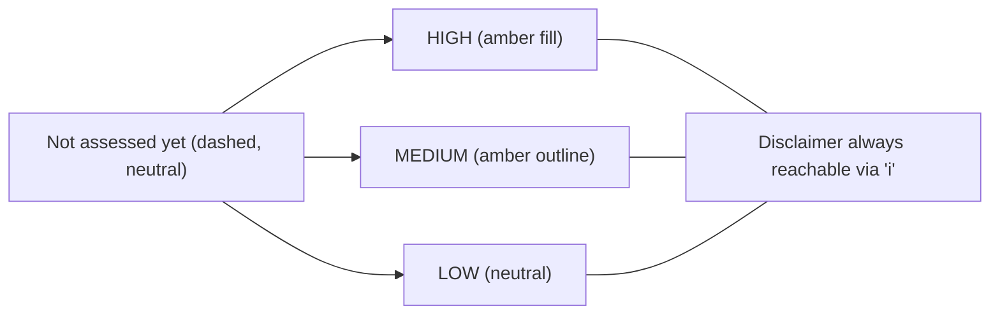

# Proofline — Design System

> **Trace the Evidence. Build the Case.**
> Forensic workspace + modern professional SaaS, not chatbot, not cyberpunk.

| Field | Value |
|---|---|
| Product | **Proofline**, an AI-powered cyber-fraud evidence intelligence platform |
| Document | Design System (visual language and reusable UI primitives) |
| File | `docs/11-DESIGN-SYSTEM.md` |
| Version | 1.0 |
| Status | Hackathon MVP. Visual specification only. No code, CSS framework or component library files. |
| Last updated | 2026-10-02 |
| Frozen sources | `01`–`10` · `DECISIONS.md` v0.2 |
| Rule | Document 11 owns **how things look**. Document 10 owns **behaviour**. If a visual choice conflicts with Documents 01–10 or `DECISIONS.md`, the frozen document wins. |

### Labels used in this document

| Label | Meaning |
|---|---|
| **[DS]** | A design-system decision made here |
| **[IMPL-INPUT]** | An asset or value supplied at implementation time, not invented here |
| **[FROM-10]** | Behaviour or copy fixed by Document 10, restated for styling |

---

## 1. Purpose and Scope

| Aspect | Definition |
|---|---|
| Purpose | One visual language from landing to integrity/audit, so every screen in Document 10 looks like the same product |
| Visual scope | Colour, typography, spacing, layout, radius, elevation, iconography, imagery, motion, accessibility foundations |
| Component scope | Primitives, forms, feedback, data display, and Proofline-specific investigation components (evidence item, source panel, timeline, graph, missing info, contradiction, action, report, integrity, provenance, urgency) |
| Relationship to 10 | Every component here implements a Document 10 screen element. **No behaviour is added or changed.** |
| Frontend | Tokens and component names are implementation-neutral (§44). No CSS framework or component library is mandated. |
| Exclusions | Product behaviour, API, schema, copy rules beyond Doc 10, logo design (§12), marketing campaign assets, motion for AI "thinking" |

---

## 2. Design Philosophy

| Principle | Concrete rule |
|---|---|
| **Evidence over decoration** | The largest, highest-contrast elements are facts and their sources (amounts, identifiers, times, evidence refs). Decoration gets no colour of its own. |
| **Calm over alarm** | Red is reserved for **failures and mismatches**. Urgency and contradictions use amber/neutral tones with text labels. Errors stay as calm as possible. |
| **Precision over spectacle** | Monospace for hashes and identifiers. Tabular numerals for amounts and times. No glow, neon, particles, gradients on data, or 3D. |
| **Transparency over magic** | AI-derived content always carries the AI-derived provenance marker (§42). No sparkle or "magic wand" icons. No typing or shimmer effects pretending to think. |
| **Human review over automation theatre** | Review state, "You stated" and "You corrected" are first-class visual elements, as prominent as AI output |
| **Trust through restraint** | One accent colour. Flat surfaces with borders. Depth only for overlays. |

---

## 3. Brand Personality

| Trait | Desired (visual behaviour) | Avoid |
|---|---|---|
| Serious | Neutral slate surfaces, one restrained blue accent, sentence-case labels | Playful illustrations, emoji, bright multicolour |
| Technical | Monospace identifiers, tabular numbers, precise alignment, visible metadata | Fake terminal/hacker styling, green-on-black |
| Investigative | Source chips everywhere, evidence refs (E01), line references, graph with labelled edges | Decorative "network" art, glowing nodes |
| Calm | Generous line-height in reading areas, amber (not red) for attention, short motion | Flashing, pulsing alerts, red banners for warnings |
| Modern | Clean sans-serif, 8 px rhythm, subtle radii, crisp 1 px borders | Skeuomorphism, heavy shadows, glassmorphism |
| Human | Plain-language labels, "You stated" given equal visual weight, clear next action | Robotic jargon, chatbot avatars |

---

## 4. Visual Direction

| Aspect | Direction [DS] |
|---|---|
| Light/dark | **Light mode is the default and MVP-required.** Dark-mode tokens are defined (§5.4) as **optional** for the MVP. There is no dark-only aesthetic. |
| Surfaces | Canvas (off-white) → surface (white) → raised surface (white with border). Flat. |
| Borders | 1 px subtle borders define regions. Borders are preferred over shadows. |
| Depth | Shadows only for overlays: menus, popovers, drawers, dialogs, toasts |
| Card usage | Cards only for **self-contained summaries** (overview cards, evidence items in grid view, action rows). Investigation data lives in lists, tables and panels (§19). |
| Density | Workspace: **compact-comfortable** (body 14 px, rows 40–44 px). Reading surfaces (report, landing): **comfortable** (body 16 px). |
| Whitespace | Consistent 8 px rhythm. Section gaps larger than intra-component gaps (§8). |
| Hierarchy | Page title → section heading → fact value → source/metadata. Metadata is always muted. |
| Imagery | Product screenshots and simple explanatory diagrams. Evidence thumbnails only on explicit open (§13). |
| Icons | Outline, 1.5 px stroke, always paired with text for status (§11) |

---

## 5. Colour System

### 5.1 Base palettes (light) [DS]

| Palette | 50 | 100 | 200 | 300 | 400 | 500 | 600 | 700 | 800 | 900 |
|---|---|---|---|---|---|---|---|---|---|---|
| **Neutral (slate)** | `#F4F6F8` | `#E9EDF1` | `#D5DCE3` | `#B6C1CC` | `#8794A3` | `#5F6B7A` | `#475261` | `#333D4A` | `#222A35` | `#141A22` |
| **Brand (Proofline blue)** | `#EEF3FC` | `#D9E4F8` | `#B3C7F0` | `#7F9FE3` | `#4F78D6` | `#2F5BD3` | `#2549B3` | `#1D3A8F` | `#172E70` | `#10204F` |
| Green (success) | `#ECF7F1` | `#D3EEDF` | — | — | — | `#2A8F5C` | `#1F7A4D` | `#17603C` | — | — |
| Amber (warning / attention) | `#FDF5E6` | `#FAE7C2` | — | — | — | `#C47A0C` | `#A8640A` | `#8A5208` | `#6E4106` | — |
| Red (danger) | `#FCEEEE` | `#F8D7D5` | — | — | — | `#C8352A` | `#B42318` | `#912018` | — | — |
| Cyan (info) | `#EAF5F7` | `#CDE8EE` | — | — | — | `#13839A` | `#0E6E80` | `#0B5868` | — | — |
| Violet (AI-derived) | `#F2EFFA` | `#E1DAF4` | — | — | — | `#7E62C8` | `#6A4FB5` | `#553F94` | — | — |
| Teal (user-stated) | `#E8F4F3` | `#C9E6E3` | — | — | — | `#16827B` | `#0F6E68` | `#0B5853` | — | — |
| Slate-blue (evidence) | `#EDF2F7` | `#D6E1EC` | — | — | — | `#456A8F` | `#34587A` | `#284563` | — | — |

White `#FFFFFF`. All text/background pairs used by semantic tokens are chosen to meet **WCAG 2.1 AA (≥ 4.5:1 for body text, ≥ 3:1 for large text and UI boundaries)**. They must be confirmed with a contrast checker during implementation.

### 5.2 Semantic tokens (light)

| Token | Value | Use |
|---|---|---|
| `color.bg.canvas` | neutral.50 `#F4F6F8` | App background |
| `color.bg.surface` | `#FFFFFF` | Panels, tables, cards |
| `color.bg.raised` | `#FFFFFF` + border | Overlays (with elevation) |
| `color.bg.subtle` | `#F9FAFB` | Table header, zebra rows, code blocks |
| `color.border.default` | neutral.200 `#D5DCE3` | Dividers, panel borders |
| `color.border.strong` | neutral.300 `#B6C1CC` | Inputs, selected rows |
| `color.text.primary` | neutral.900 `#141A22` | Body, values |
| `color.text.secondary` | neutral.600 `#475261` | Labels, secondary text |
| `color.text.muted` | neutral.500 `#5F6B7A` | Metadata, timestamps (≥ 4.5:1 on white) |
| `color.text.disabled` | neutral.400 `#8794A3` | Disabled text (non-essential) |
| `color.text.inverse` | `#FFFFFF` | On brand/dark fills |
| `color.brand.default` | brand.600 `#2549B3` | Primary actions, active tab, links |
| `color.brand.hover` | brand.700 `#1D3A8F` | |
| `color.brand.subtle` | brand.50 `#EEF3FC` | Selected backgrounds |
| `color.link` | brand.600 | Underlined on hover/focus |
| `color.focus.ring` | brand.500 `#2F5BD3` | 2 px ring + 2 px offset |

### 5.3 Status and domain tokens

Each token has `fg` (text/icon on subtle bg), `bg` (subtle) and `border`.

| Token family | fg | bg | border |
|---|---|---|---|
| `status.success` | green.700 | green.50 | green.600 |
| `status.warning` | amber.700 | amber.50 | amber.600 |
| `status.danger` | red.700 | red.50 | red.600 |
| `status.info` | cyan.700 | cyan.50 | cyan.600 |
| `status.neutral` | neutral.700 | neutral.50 | neutral.300 |
| `provenance.evidence` | slate-blue.700 | slate-blue.50 | slate-blue.600 |
| `provenance.ai` | violet.700 | violet.50 | violet.600 |
| `provenance.user` | teal.700 | teal.50 | teal.600 |
| `provenance.system` | neutral.700 | neutral.50 | neutral.400 |

### 5.4 Dark mode (optional for MVP) [DS]

| Token | Dark value |
|---|---|
| canvas / surface / raised | `#0F141A` / `#161D25` / `#1E2630` |
| border default / strong | `#2C3643` / `#3C4857` |
| text primary / secondary / muted | `#E6EBF0` / `#B7C1CC` / `#93A0AE` |
| brand default | `#7FA2F2` (text on dark); fills use brand.600 with inverse text |
| Status/provenance | Use the 500-level as `fg`, a 10–15 % tint of the hue as `bg`, and the 500 border. Verify AA. |

Dark mode, if shipped, follows the OS preference with a manual toggle. It is a theme, not a "hacker" aesthetic.

---

## 6. Colour Semantics

**Rule: never colour alone.** Every state below is **colour + icon/shape + text label**.

| Meaning | Token | Icon / shape | Label (exact) |
|---|---|---|---|
| Verified | `status.success` | Shield with check | **Verified** |
| Mismatch | `status.danger` | Shield with ✕ | **Mismatch** |
| Could not complete | `status.neutral` | Shield with ? (dashed outline) | **Could not complete** |
| Processing | `status.info` | Determinate/indeterminate ring | **Processing** |
| Failed (processing) | `status.danger` | Circle-alert | **Failed** |
| Processed | `status.success` (subtle) | Check | **Processed** |
| Ready for analysis (`UPLOADED`) | `status.neutral` | Circle-dot | **Ready for analysis** |
| User stated | `provenance.user` | Speech-quote | **You stated** |
| AI-derived | `provenance.ai` | Model (chip) icon | **AI-derived** |
| Evidence-derived | `provenance.evidence` | Document-with-lines | **From evidence** |
| System-derived (rules) | `provenance.system` | Function / gear | **Rule-based** |
| Required (missing info) | `status.warning` | Asterisk-in-circle | **Needed** |
| Recommended / optional | `status.neutral` | Circle-outline | **Optional** |
| Keep ready (ID document) | `status.info` | Bookmark | **Keep ready** |
| Unresolved | `status.warning` | Half-filled circle | **Open** |
| Resolved | `status.success` (subtle) | Check-circle | **Resolved** |
| Sources differ | `status.warning` | Two-arrows-diverge | **Sources differ** |
| Urgency HIGH | urgency.high (§43) | Clock with filled hands | **HIGH** |
| Urgency MEDIUM | urgency.medium | Clock outline | **MEDIUM** |
| Urgency LOW | urgency.low | Clock, light | **LOW** |
| Not assessed yet | neutral, dashed | Clock dashed | **Not assessed yet** |

**Urgency semantics:** urgency is **deterministic operational urgency (`G2-v1`)**. It is **not** a risk score, fraud probability, confidence or legal assessment.
- It is therefore never shown as a gauge, meter, percentage, bar, heat colour scale or danger red.
- It is always a **word label** with the disclaimer reachable (§43).

---

## 7. Typography

| Role | Family [DS] | Fallback |
|---|---|---|
| UI and body | **Inter** (open licence; supports ₹ and Indian names) | `system-ui, -apple-system, "Segoe UI", Roboto, "Noto Sans", sans-serif` |
| Identifiers, hashes, source text | **JetBrains Mono** (open licence) | `ui-monospace, "SF Mono", Menlo, Consolas, monospace` |
| Report body (reading) | Inter | same |

Load with `font-display: swap`. Use `font-variant-numeric: tabular-nums` for amounts, times, counts and tables.

| Token | Size / line-height | Weight | Use |
|---|---|---|---|
| `type.display` | 36 / 44 | 600 | Landing hero only |
| `type.h1` | 24 / 32 | 600 | Page title (one per screen) |
| `type.h2` | 20 / 28 | 600 | Section heading |
| `type.h3` | 16 / 24 | 600 | Card/panel title |
| `type.body.reading` | 16 / 26 | 400 | Report, landing, explanations |
| `type.body` | 14 / 20 | 400 | Workspace default |
| `type.label` | 13 / 18 | 500 | Form labels, column headers |
| `type.meta` | 12 / 16 | 400 | Timestamps, refs, helper text (muted) |
| `type.value.lg` | 20 / 28 | 600, tabular | Key amounts (₹8,500) |
| `type.mono` | 13 / 20 | 400 | Identifiers (UTR, UPI ID, phone), hashes |
| `type.source` | 13 / 20 mono | 400 | Source lines and snippets |

- **Timestamps:** `type.meta` with tabular numerals, e.g., "12:19 PM · 24 Sep 2026". Approximate times are prefixed with "~" and suffixed "approx." (§26).
- **Case:** sentence case everywhere. Status badges may use small caps/uppercase for HIGH/MEDIUM/LOW only.

---

## 8. Spacing System

Base unit **4 px**. Scale tokens [DS]:

| Token | px | Typical use |
|---|---|---|
| `space.0` | 0 | — |
| `space.1` | 4 | Icon–text gap, chip padding-y |
| `space.2` | 8 | Inline gaps, compact cell padding |
| `space.3` | 12 | Input padding-x, list item gap |
| `space.4` | 16 | Card/panel padding (workspace), form field gap |
| `space.5` | 20 | — |
| `space.6` | 24 | Section internal spacing, panel padding (reading) |
| `space.8` | 32 | Between sections |
| `space.10` | 40 | Page top padding (desktop) |
| `space.12` | 48 | Landing section gaps |
| `space.16` | 64 | Landing hero spacing |

| Context | Rule |
|---|---|
| Page padding | Desktop 32, tablet 24, mobile 16 |
| Section spacing | 32 (workspace), 48–64 (landing) |
| Card / panel padding | 16 (workspace), 24 (report, dialogs) |
| Component gaps | 8 inline, 12–16 stacked |
| Dense data | Table cell 8 × 12. Row height 40 (default) / 32 (audit dense). |
| Mobile | Same scale; padding drops to 16. Touch targets stay ≥ 44 px. |

---

## 9. Layout Grid

| Area | Rule [DS] |
|---|---|
| App max width | 1440 px workspace, centred; landing content 1120 px |
| Reading width | 720 px max for report text and long explanations |
| Grid | 12 columns, 24 px gutters (desktop); 8 columns (tablet); 4 columns, 16 px gutters (mobile) |
| Workspace | Header (case header) → tab bar → main (fluid) + source panel (right, 400 px, collapsible) |
| Overview | 12-column card grid: 2–3 cards per row desktop, 1 per row mobile |
| Graph canvas | Fills the main area height (min 480 px desktop); legend and controls as overlays in the canvas corner |
| Timeline | Single column, max 880 px, time column 160 px + content |
| Responsive | §39 |

---

## 10. Border, Radius and Elevation

| Token | Value | Use |
|---|---|---|
| `border.width.default` | 1 px | Panels, inputs, tables |
| `border.width.strong` | 2 px | Selected node/row, focus ring (with offset) |
| `radius.sm` | 4 px | Chips, badges, inputs |
| `radius.md` | 6 px | Buttons |
| `radius.lg` | 8 px | Cards, panels |
| `radius.xl` | 12 px | Dialogs, bottom sheets (top corners) |
| `radius.full` | 999 px | Pills, avatars-free indicators |
| `elevation.0` | none | Default (flat with border) |
| `elevation.1` | `0 1px 2px rgba(20,26,34,.06)` | Sticky headers only |
| `elevation.2` | `0 4px 12px rgba(20,26,34,.10)` | Menus, popovers, toasts |
| `elevation.3` | `0 12px 32px rgba(20,26,34,.16)` | Dialogs, drawers, bottom sheets |

Dividers (`border.default`) separate list rows and sections. Not every section is a card.

---

## 11. Iconography

| Aspect | Rule [DS] |
|---|---|
| Style | Outline, 1.5 px stroke, rounded joins, 24 px grid. Filled variants only for selected or active states. |
| Sizes | 16 (inline in text and badges), 20 (buttons, tabs), 24 (empty states, headers) |
| Library | Any open outline set meeting this spec (e.g., a Lucide-style set). **Not mandated.** |
| Pairing | Status icons **always** with a text label. Icon-only buttons need a visible tooltip and `aria-label`. |

| Group | Icons |
|---|---|
| Navigation | Overview (layout), Evidence (folder-file), Activity (list-checks), Timeline (clock-lines), Graph (share-nodes), Missing info (help-circle), Actions (check-square), Draft (file-text), Integrity (shield) |
| Evidence types | Image, PDF (file-text), TXT (file-type), Email (mail), Pasted text (clipboard), Link (link, no "external" arrow, because it is never opened) |
| Status | §6 table |
| Actions | Upload, Analyse (play-outline), Retry (rotate), Remove (trash), Download, Copy, Show full (eye), Hide (eye-off), Source (quote-file), Correct (pencil), Dismiss (x-circle) |
| Integrity | Shield-check, shield-x, shield-question, fingerprint (hash) |
| Prohibited | Sparkles, magic wands, robot heads, brains, padlocks implying "military-grade", police badges, government emblems, currency-recovery symbols |

---

## 12. Logo and Wordmark Usage

**No official Proofline logo or app mark exists in the frozen materials. The final asset is an [IMPL-INPUT].** This document does not design one.

| Rule | Specification |
|---|---|
| Interim wordmark | The text "Proofline" set in Inter 600, `color.text.primary` (or inverse on dark), with optional tagline "Trace the Evidence. Build the Case." in `type.meta` |
| Placement | Global header left. Landing hero top-left. Report header (small, muted). |
| Clear space | ≥ the cap height of the wordmark on all sides |
| Small size | Min 16 px cap height. Below that, use the official app mark once supplied. |
| Favicon / app mark | Derived from the official mark when supplied [IMPL-INPUT] |
| Prohibited | Government emblems or colours suggesting official status (spec §4.3, N19). Shields or badges implying police. Gradients, glows, distortion, recolouring outside the tokens. |

---

## 13. Photography and Illustration

| Use | Rule |
|---|---|
| Product screenshots | **Preferred** on the landing page, using the synthetic demo case only (fictional data) |
| Simple diagrams | Evidence → case flow, the three-step "how it works". Line style, neutral palette, brand accent. |
| Evidence thumbnails | Only inside the evidence viewer after an explicit "Show original" (Doc 10 §14). Never in lists. |
| Photography | Avoid. No stock photos of hackers, police, handcuffs or worried people. |
| Abstract graphics | Avoid network/particle backgrounds |
| Illustrations | Optional, minimal line illustrations in empty states only |

---

## 14. Motion Principles

| Token | Duration | Use |
|---|---|---|
| `motion.fast` | 120 ms | Hover, press, focus, badge change |
| `motion.standard` | 200 ms | Panel/drawer open, tab change, toast in |
| `motion.slow` | 300 ms | Dialog, bottom sheet, graph re-layout settle |
| Easing | `cubic-bezier(0.2, 0, 0, 1)` enter; `cubic-bezier(0.4, 0, 1, 1)` exit | |

| Situation | Behaviour |
|---|---|
| Entrance / exit | Fade + 4–8 px translate. No bounce. |
| Loading | Skeleton shimmer ≤ 1.5 s cycle, low contrast |
| Processing | Step list ticks (check appears with a 120 ms fade). A determinate ring only where progress is real. **No "AI thinking" dots, typing or pulsing brains.** |
| Graph | Layout animates once on load (≤ 300 ms), then stays put. Selection highlight is instant. Panning and zooming follow input. |
| Panels | Source panel slides in 200 ms. Focus moves immediately. |
| Success feedback | Subtle check + toast. No confetti. |
| Rule | Motion never covers or delays reading evidence values |
| **Reduced motion** | `prefers-reduced-motion: reduce` → no translate or shimmer, opacity changes ≤ 100 ms, graph static layout |

---

## 15. Accessibility Foundations [FROM-10 §36]

| Area | Rule |
|---|---|
| Contrast | WCAG 2.1 AA: text ≥ 4.5:1 (large ≥ 3:1). UI boundaries and focus ≥ 3:1. Verified per token pair. |
| Focus | 2 px `color.focus.ring` + 2 px offset on every interactive element. Never removed. |
| Text size | Min 12 px (metadata). Body 14 px workspace / 16 px reading. Respects user zoom to 200 % without loss. |
| Non-colour status | Icon + text for every status (§6) |
| Reduced motion | §14 |
| Keyboard states | Hover, focus and active are visually distinct. Focus is styled independently of hover. |
| Disabled | `text.disabled` + no pointer + explanation tooltip where the reason matters ("Analysis is running") |
| Errors | Red text + icon + message linked to the field. Not colour-only. |
| Dense info | Row heights ≥ 32 px; line-length caps; tabular numerals |
| Touch | Targets ≥ 44 × 44 px on touch devices |

---

## 16. Component Architecture

**Composition rules [DS]:**
1. Components consume **semantic or domain tokens only**, never palette values.
2. Investigation components compose primitives. They never introduce local colours.
3. Every fact-bearing component exposes a **Source** slot (opens the source panel).
4. Every derived fact displays a **provenance tag** (§42).
5. No local variants: new needs become a documented variant here.

---

## 17. Buttons

| Variant | Look | Use |
|---|---|---|
| Primary | Brand fill, inverse text | One per view: the primary next action (Analyse evidence, Generate draft, I've reviewed version N, Export) |
| Secondary | Surface + strong border + primary text | Secondary actions (Add evidence, Retry) |
| Tertiary / ghost | No border, brand text | Inline actions (Show source, Load more) |
| Destructive | Red.600 fill, inverse text | Only inside confirmation dialogs (Delete case, Remove evidence) |
| Link | Brand text, underline on hover/focus | Navigation within text |
| Icon button | 36 × 36 (44 touch), ghost, tooltip + `aria-label` | Copy, close, overflow |

| Size | Height | Padding-x | Font |
|---|---|---|---|
| sm | 32 | 12 | 13/500 |
| md (default) | 40 | 16 | 14/500 |
| lg | 48 | 20 | 16/500 (landing CTA) |

| State | Rule |
|---|---|
| Hover | Fill or border darkens one step |
| Focus | Focus ring |
| Active | One step darker again |
| Disabled | 40 % contrast reduction, no pointer, tooltip with the reason |
| Loading | Label stays; leading spinner; width locked; `aria-busy` |
| Destructive confirmation | The first click opens a dialog. The destructive button lives only in the dialog. Case deletion requires typing the case reference [FROM-10 §39]. |

---

## 18. Inputs and Forms

| Component | Spec |
|---|---|
| Text input | 40 px; `border.strong`; `radius.sm`; label above (`type.label`); helper below (`type.meta`) |
| Textarea | Min 4 rows. Live counter for limits ("1,240 / 20,000"); the counter turns warning at 90 % and danger at the limit. |
| OTP input | Single field (`inputmode="numeric"`, `autocomplete="one-time-code"`) rendered as 6 visual cells. Mono 20 px. |
| File drop zone | Dashed `border.strong` region with an upload icon, title, the **limits line** [FROM-10 §12], and a "Choose files" secondary button. Drag-over: `brand.subtle` bg + solid brand border. Disabled at 20 items. |
| Select | Native or listbox styled like the input |
| Combobox | Only where Doc 10 needs a type list (paste kind, event type) |
| Date + time | Paired inputs (date, time) + precision segmented control (Exact / Approximate / I don't know). IST label shown. |
| Validation | Inline on blur and submit. Error text `status.danger.fg` + alert icon. Field border danger. |
| Required | Fields are optional by design. Mark **optional** fields as "(optional)" rather than marking required ones [DS]. |
| Disabled / read-only | Read-only uses `bg.subtle`, not the disabled style |

---

## 19. Cards and Panels

| Container | Use | Avoid |
|---|---|---|
| **Card** (`radius.lg`, border, padding 16) | Overview summaries, evidence grid items, action rows on mobile | Wrapping every section |
| **Panel** (border-left or full border, no radius on edges against the shell) | Source panel, entity detail, review side pane | Floating shadows |
| **Section** (heading + content, no border) | Report sections, settings-like groupings | — |
| **Table** | Evidence list, audit log, entity list mode | Card grids for tabular data |
| **List** (dividers) | Timeline, missing info, contradictions, activity steps | — |
| **Inline block** (`bg.subtle`, `radius.sm`) | Source snippet, hash, quoted original value | — |

Overview uses cards. All other investigation tabs use lists, tables and panels, so the workspace does not look like dozens of dashboard tiles.

---

## 20. Badges and Status Indicators

Anatomy: `[icon] LABEL` in a pill (`radius.full`), 20–24 px tall, `type.meta` 500. Tokens per §6.

| Group | Badges (exact text) |
|---|---|
| Case status [FROM-10 §11.1] | New · Adding evidence · Evidence read · Analysing · Evidence connected · Timeline ready · Next steps ready · Preparing draft · Awaiting review · Exported |
| Review | Awaiting review · **Reviewed – version N** |
| Evidence state | Uploading · Verifying · Ready for analysis · Processing · Processed · Failed |
| Processing step | Pending · Running · Done · Failed · Skipped |
| Urgency | HIGH · MEDIUM · LOW · Not assessed yet · (secondary) May be out of date |
| Confidence | High · Medium · Low (neutral tone, small; **never** a number) |
| Integrity | Verified · Mismatch · Could not complete · Not yet verified |
| Provenance | From evidence · AI-derived · You stated · Rule-based · You corrected |
| Findings | Needed · Optional · Keep ready · Open · Resolved · Sources differ |

Confidence badges use `status.neutral` with a 1–3 bar glyph plus a word. They must never use urgency or danger colours.

---

## 21. Alerts and Callouts

| Variant | Token | Use | Tone |
|---|---|---|---|
| Info | `status.info` | Neutral facts ("Analysis is running…") | Calm |
| Success | `status.success` | Completed operations | Brief |
| Warning | `status.warning` | Needs attention (unprocessed items, out-of-date draft) | Calm, actionable |
| Danger | `status.danger` | Failures that block (analysis stopped, export failed) | Factual, never alarmist |
| Neutral explanation | `status.neutral` | "What this proves / doesn't prove", urgency disclaimer | Informative |
| Security notice | `status.neutral` + lock-free shield icon | "Originals may show sensitive details" | Matter-of-fact |
| Provenance notice | `provenance.ai` subtle | "AI-written summary — check it" | Transparent |

Anatomy: left icon, title (optional), body, optional action link. Full-width **banners** are only for case-level blocking states. Most notices are inline callouts.

---

## 22. Toasts and Notifications [FROM-10 §34]

| Aspect | Rule |
|---|---|
| Position | Bottom-right (desktop); bottom-centre above the pinned action (mobile) |
| Duration | Success/info 5 s; warning 8 s; error persists until dismissed |
| Stacking | Max 3 visible, newest on top; older ones collapse |
| Dismissal | Close button + Escape when focused; swipe on mobile |
| Severity | Icon + token per §21 |
| Announcement | `aria-live="polite"` (errors `assertive`) |
| Content | Refs and states only. **No evidence values, names or filenames.** |

---

## 23. Modal, Dialog and Confirmation Patterns

| Type | Size | Content |
|---|---|---|
| Confirmation (standard) | 480 px max | Title (verb + object), consequence text, Cancel (secondary) + Confirm (primary) |
| Destructive | 480 px | Consequences listed (e.g., "All draft versions will be invalidated"), typed confirmation for case deletion, Destructive button |
| Correction confirmation | 560 px | Original vs. new (two inline blocks), note field, "Original evidence isn't changed" callout |
| Review/confirm | 560 px | Version, short checksum (mono), unresolved-items summary, "I've reviewed version N" |
| Export | 640 px | Format radio (PDF / ZIP), file checklist (ZIP), note about originals |
| Integrity result | Inline in the row (no dialog) | — |

Rules:
- Focus trap; Escape closes (except during submission).
- Return focus to the trigger on close.
- Overlay `rgba(20,26,34,.45)`.
- **Avoid modal chains.** At most one dialog at a time.

---

## 24. Drawer and Source Panel (core pattern) [FROM-10 §14]

| Element | Spec |
|---|---|
| Desktop | Right panel, 400 px, border-left, full height of the workspace body. Pushes the main content (not an overlay) at ≥ 1280 px; overlays below that. |
| Mobile | Bottom sheet, 85 % height max, `radius.xl` top, drag handle |
| Header | Evidence ref badge (E04) · type icon · title · close button |
| Location | "Page 1 · Line 8" (`type.meta`) |
| Source excerpt | Inline block (`bg.subtle`, `type.source` mono). Matched value highlighted with `brand.subtle` bg + 1 px brand underline. Neighbouring lines ±2 muted. |
| Method | Provenance tag (From evidence: OCR / PDF text / Text, or You stated) |
| Redaction token | Rendered as a chip "▮ hidden code" / "▮ hidden card number" (`status.neutral`), never the value |
| Navigation | "Open evidence" link; previous/next source (when a fact has several) |
| Close | Close button, Escape, or selecting the same fact again |
| Focus | On open → panel heading. On close → back to the triggering "Source" control. |

---

## 25. Tables

| Aspect | Rule |
|---|---|
| Header | `bg.subtle`, `type.label`, sticky on scroll |
| Rows | 40 px default; 32 px dense (audit). Dividers between rows; no vertical lines. |
| Cells | Text left. Numbers, amounts and times right/tabular. Mono for refs and hashes. |
| Hover / selected | Hover `bg.subtle`; selected `brand.subtle` + 2 px left brand bar |
| Sorting / filtering | **Only where Doc 10 specifies** (timeline dismissed toggle; graph list type filter). There is no generic sorting. |
| Pagination | "Load more" button (Doc 10 §8, §32) |
| Responsive | Below tablet, rows become stacked label-value lists (§39) |

---

## 26. Timeline Component

| Element | Visual [DS] |
|---|---|
| Rail | 2 px `border.default` vertical line |
| **Marker by precision (shape + text, not colour only)** | EXACT: **filled circle**. APPROXIMATE: **hollow circle with dashed outline** + "approx." text. Date-only: **hollow square** + date only. Inferred order: **small diamond outline** + "Time unknown — order inferred". |
| Time text | Tabular. Approximate prefixed "~". Never shown more precisely than the source. |
| Event type | `type.label` (e.g., Payment made) |
| Source chips | Mono `E04 · L8` chips → source panel |
| User-added | Teal provenance tag "You added" + speech-quote icon |
| Correction | Badge "You corrected this" (teal) + inline muted "Originally ~12:05 PM (E06)" |
| Contradiction | Amber "Sources differ" marker with the diverge icon, linked to §32 |
| Dismissed | Hidden by default; when shown, 60 % opacity + "Dismissed" label |

---

## 27. Evidence Item Component [FROM-10 §13]

| Slot | Visual |
|---|---|
| Ref | Mono badge `E04` (prominent, left) |
| Type | Type icon + label |
| Title | Label, or filename (truncated middle with the full value in a tooltip) |
| Meta | Size · pages/dimensions (`type.meta`) |
| States | Upload progress bar (determinate), then the evidence-state badge |
| Fingerprint | `fingerprint` icon + mono `3f9a1c2e…88b0d1f4` + copy button |
| Integrity | Integrity badge (latest) |
| Failure | Inline danger callout with the fixed message; Retry only if retryable |
| Email | "3 attachments listed — not analysed" meta line |
| Actions | Overflow menu: View source text · View original · Verify · Remove |

Layout: list row on desktop/tablet (single line + meta line); card on mobile. **No thumbnails or values in rows.**

---

## 28. Evidence Viewer

| Type | Visual |
|---|---|
| Image | Viewer canvas (`bg.subtle`) shown only after "Show original image". Fit/zoom controls. Optional overlay of OCR line boxes (1 px brand outline). Security callout above it. |
| PDF | Page-tabbed **text view** of redacted lines (mono `type.source`, line numbers in the gutter) + "Download original" secondary button. **No inline PDF rendering.** |
| Text / paste | Line-numbered mono text view |
| Email | Header key-value table + body text view (mono), links as plain text with a "not opened" meta label, attachment list with "not analysed" |
| Link (pasted) | Mono URL with wrapping + "Proofline never opens links." |
| Highlighting | Matched span `brand.subtle` bg; the selected line gets a 2 px brand left bar |
| Downloads | Download buttons only. Downloaded EML/TXT/ZIP are never rendered as web pages (09 §11). |

---

## 29. Entity Component

| Variant | Spec |
|---|---|
| Entity chip | Type icon + **masked value** (mono) + optional count badge ("3 items"). `radius.sm`, `bg.subtle`. |
| Entity card / row | Type label · masked value · "Show full" (eye icon, owner only, where `canonicalValue` is returned) · appears-in chips · confidence badge · provenance tag |
| Entity detail (panel) | Header (type + value) · Appears in (source chips) · Connections (relationship rows) · Extractions (raw "as read" in mono, "Originally read as…" if corrected) · "Correct this value" action |
| User-stated | **Teal** provenance tag "You stated" + speech-quote icon + teal left border on the card/row |
| Evidence-derived | Slate-blue tag "From evidence" |

"Show full" toggles only server-provided full values. The client never reconstructs masked or redacted values (§41).

---

## 30. Relationship / Graph Components

| Element | Visual [DS] |
|---|---|
| Case node | Small neutral circle with the CF ref (de-emphasised) |
| **Entity node shapes (not colour only)** | PHONE: circle · URL: rounded rectangle · DOMAIN: rounded rectangle with a double border · UPI_ID: hexagon · TRANSACTION: diamond · AMOUNT: pill · ACCOUNT_HINT: rectangle with a cut corner · BANK_OR_WALLET: rectangle · PERSON: circle with a user icon · EMAIL / MESSAGING_HANDLE / SMS_SENDER_HEADER: rounded rectangle with icon. Each node has an icon and a masked label. Fill `bg.surface`, border `neutral.400`, icon `text.secondary`. |
| Evidence node | Square, `provenance.evidence` border, `E04` label |
| User-stated entity | Teal border + speech-quote mini-icon |
| Relationship edge | Solid 1.5 px `neutral.500`, arrowhead (direction), label midpoint `type.meta` on a surface pill (e.g., "paid to"). Support count suffix "· 2". |
| Appears-in edge | Dashed 1 px `neutral.300`, no label; toggleable |
| Selected node / edge | 2 px brand border/stroke + focus ring for keyboard. Non-adjacent elements fade to 40 %. |
| Hover | Border darkens; tooltip with type + masked value |
| Legend | Shapes and edge styles with text |
| Controls | Icon buttons (zoom, fit, toggles) top-right of the canvas |
| List alternative | Table: Entity · Type · Appears in · Connections (label + support) · Sources |
| Prohibited | Glow, neon, particle links, animated flowing edges, dark-cyber canvas |

---

## 31. Missing Information Component

| Element | Visual |
|---|---|
| Item row/card | Title (what's missing) · status badge (Open / Resolved) · requirement badge (**Needed** amber / **Optional** neutral / **Keep ready** info) |
| Value | "Not provided" in muted italic |
| Why | `type.body` secondary |
| Evidence checked | `type.meta`: "Checked all processed evidence (E01–E06)" |
| Question | Callout `status.neutral` with the question text + inline answer input + "Save answer" (primary sm) + "Skip" (ghost) |
| Answered | Teal block "You stated: <answer>" with speech-quote icon; status Resolved |
| Skipped | Neutral meta "Skipped — still not provided" |
| ID document | Info "Keep ready" badge; **no upload control** |

---

## 32. Contradiction Component

| Element | Visual [DS] |
|---|---|
| Container | Neutral panel with an amber left accent bar (4 px), title **"These pieces of information differ"** + diverge icon |
| Comparison | Two equal columns (stacked on mobile), each: value (`type.value`, tabular) · source chip · provenance tag (e.g., "From evidence E04" vs. "Your note E06") |
| Neutrality | Same size, weight and colour for both sides. No ✓/✗ marks, no red, no "correct/incorrect" styling. |
| Why flagged | `type.meta` reason text |
| Resolution | Open: amber "Open" badge + optional answer. Resolved: teal "You stated 12:19 PM is correct", **both columns remain visible**. |

---

## 33. Action Checklist Component

| Element | Visual |
|---|---|
| Row | Checkbox-style status control (To do / Done / Not applicable as a 3-option segmented control on desktop, menu on mobile) · priority marker · action text (`type.body`, 500) |
| Priority | Rank number in a neutral circle (1, 2, 3…). Rank 1 adds a "Do first" neutral badge. **Not urgency colours.** |
| Reason | Secondary text + "Why" ghost link → sources |
| Source | Source chips |
| Official channel | Inline block: channel name + contact (from the curated list) + external-link icon (official sites only) |
| External notice | Callout meta under every external action: **"You do this yourself — Proofline does not contact anyone."** |
| Completion | Done → check icon + "Marked done by you · date" (muted). Text is not struck through (keeps readability). |
| Suggested-by | Rule-based provenance tag "Suggested by Proofline" |

---

## 34. Report / Complaint Draft Components

| Element | Visual |
|---|---|
| Report header | Neutral, document-like. Small wordmark, CF ref, **version badge** ("Version 2"), generated time, review badge. **No government styling, seals or form numbering.** |
| Section | `type.h2` + content at reading width (720). Facts as label-value rows. |
| Source reference | Superscript-free chips after values (E04 · L8) |
| Not provided | Muted italic "Not provided" |
| User-stated fact | Teal tag "You stated" |
| Correction indicator | Teal "You corrected this" |
| AI summary | Block with the violet "AI-derived" tag + "AI-written summary — check it" |
| Review status | Badge "Awaiting review" / "Reviewed – version N" |
| Export controls | Export panel (dialog) + result row: format · size · **checksum** (mono short + copy) · Download |
| Out-of-date | Warning callout "Draft out of date — regenerate to include your changes" |

---

## 35. Integrity Components

| Element | Visual |
|---|---|
| Result row | Evidence ref · result badge (**Verified** / **Mismatch** / **Could not complete** / Not yet verified) · time (meta) · Verify button |
| Hash display | Two mono lines: "Recorded 3f9a…f4" / "Current 3f9a…f4" with copy; mismatched characters are **not** highlighted (avoid implying meaning) |
| Could not complete | Neutral badge + "Try again" (never red, never "tampered") |
| Proves / doesn't prove | Always-visible neutral callout. **"Proves: the stored file is byte-for-byte the same as when it was uploaded."** **"Doesn't prove: that the evidence is true or authentic, who created it, or that it's legally admissible."** |
| Audit event | Small meta link "Recorded in audit log" |
| Blockchain attestation | **Hidden unless an attestation exists** (OD-06 off). When present: a secondary key-value row (network, transaction hash). Visually subordinate (no chain icons, no crypto styling). |

---

## 36. Loading and Skeleton System

| Pattern | Use |
|---|---|
| Skeleton | Content loading (lists, cards, timeline, graph placeholder). Matches the final layout. |
| Spinner (16/20 px) | Inline short operations (button loading, verify in progress) |
| Determinate progress bar | **Real** upload progress only |
| Step list | Processing activity: per-step status icons (pending circle, running ring, done check, failed alert, skipped dash) |
| Indeterminate bar | Report/export generation (no fake percentages) |
| Rule | **Never fake progress.** No percentages without real data. |

---

## 37. Empty States

Anatomy: 24 px icon · title · one-sentence explanation stating **which kind of empty** · optional action.

| Screen | Kind | Copy pattern |
|---|---|---|
| No cases | Nothing yet | "No cases yet." + Start a case |
| No evidence | Nothing yet | "Add screenshots, receipts, emails or pasted messages." + limits |
| No entities | Insufficient evidence | "No key details were found yet." |
| No timeline events | Insufficient | "No events with times were found." |
| No graph relationships | Insufficient | "Connections appear when the same details show up in more than one item." |
| No missing information | Genuinely empty | "Nothing missing was found — review the draft to confirm." |
| No actions | Not analysed / empty | "Next steps appear after analysis." |
| No audit entries | Nothing yet | "No activity recorded yet." |
| Processing incomplete | Incomplete | Warning callout: "2 items aren't processed — results may be incomplete." |

---

## 38. Error States

| Level | Visual |
|---|---|
| Inline validation | Danger text + icon under the field; field border danger |
| Component error | Inline neutral/danger callout inside the component + Retry |
| Page error | Centred block: icon, title, explanation, Retry, request ID (meta mono) |
| Auth error | Inline on the sign-in form (§7 of Doc 10 copy) |
| Permission / 404 | Neutral page: "This case isn't available." + My cases |
| Upload error | Row becomes a dismissible danger row with the specific message |
| Processing error | Activity step failed + case-level danger callout with Retry (or Remove only for scanned PDFs) |
| Export error | Export result row danger + "Try again" |
| Integrity error | Neutral "Could not complete" (not danger) |
| Network / offline | Top warning banner "You're offline — changes can't be saved." |

Tone: factual and calm, no exclamation marks, no blame.

---

## 39. Responsive Component Behaviour

| Component | Desktop | Tablet | Mobile |
|---|---|---|---|
| Navigation | Header + tab row | Scrollable tabs | Menu button + bottom nav (5 most-used) |
| Source panel | Side panel (push) | Overlay drawer | Bottom sheet |
| Tables | Full | Priority columns | Stacked lists |
| Graph | Canvas | Canvas | **List mode default**; canvas on request with pan/zoom |
| Evidence viewer | Inline split | Full-width | Full-screen sheet |
| Timeline | Two-column (time + body) | Same | Single column, time above body |
| Action checklist | Rows with segmented control | Rows | Cards with menu control |
| Report | Reading column + review pane | Review pane below | Single column; sticky confirm/export bar |
| Dialogs | Centred | Centred | Full-screen sheet |

Exact breakpoints are an implementation choice. Suggested: compact < 640 px, medium 640–1023 px, wide ≥ 1024 px [DS].

---

## 40. Data Density Rules

| Rule | Specification |
|---|---|
| Primary vs. secondary | One primary value per row (bold or regular `text.primary`). Metadata in `type.meta` muted. |
| Metadata order | Ref → type → time → size → status |
| Truncation | Middle-truncate filenames and URLs with a full-value tooltip/expander. **Never truncate** amounts, UTRs, UPI IDs or phone numbers in detail views. |
| Long URLs | Mono, wrap at `/ ? & .` (break-word), max 2 lines then "Show all" |
| Transaction IDs | Mono, full in detail. Masked in graph labels per backend. |
| Hashes | `first8…last8` + copy + "Show full" expander |
| Source excerpts | Max 3 lines in lists; full in the source panel |
| Timestamps | Short form in lists ("12:19 PM"); full date on hover/expander; precision marker always |
| Line length | ≤ 80 characters in reading areas |

---

## 41. Sensitive Data Presentation [FROM-09]

| Data | Presentation |
|---|---|
| OTP | **Never displayed.** Redaction token chip "▮ hidden code". |
| Card numbers | **Never displayed.** "▮ hidden card number". |
| Account numbers | Only the last-4 hint as printed ("XX4821"). There is no "Show full", because no full value exists. |
| Phone / UPI / email / transaction ID | **Masked by default** (backend `maskedValue`) in the graph, overview, chips and toasts. "Show full" (eye) only in entity detail and source panel, where the API returns `canonicalValue`. |
| Original images | Behind an explicit "Show original" with the security callout |
| Rules | The client never reconstructs, un-masks or infers removed values. No sensitive values in toasts, URLs, titles or browser storage. |

---

## 42. Provenance Visual Language (core concept)

| Origin | Token | Icon | Tag text | Extra marker |
|---|---|---|---|---|
| Evidence-derived | `provenance.evidence` (slate-blue) | Document-with-lines | **From evidence** + E-ref | Source chip(s) |
| AI-derived | `provenance.ai` (violet) | Model chip | **AI-derived** | "check it" hint on summaries |
| User-stated | `provenance.user` (teal) | Speech-quote | **You stated** / **You added** / **You corrected** | Teal left border on rows |
| System-derived (rules) | `provenance.system` (neutral) | Function | **Rule-based** | Used for urgency, actions, checklists |

| Surface | How provenance appears |
|---|---|
| Entity | Tag on the row/card; appears-in chips |
| Timeline event | Tag + source chips; "You added" / "You corrected" |
| Relationship | Edge panel: "Supported by N items" + source chips (evidence-derived only) |
| Action | "Suggested by Proofline" (rule-based) + trigger sources |
| Missing information | Answer block "You stated" (teal); checked-evidence meta |
| Scam signal | "AI-derived" tag + citations |
| Report | Each fact: value + source chips + tag; summary block AI-derived |

---

## 43. Urgency Visual Language [RESOLVED G-2; FROM-10 §11]

| Level | Visual [DS] |
|---|---|
| **Not assessed yet** | Neutral pill with a dashed border + dashed clock icon |
| **HIGH** | Solid **amber.700 fill**, inverse text, filled-clock icon, label "HIGH". Noticeable but **not danger red**. |
| **MEDIUM** | Amber.50 bg, amber.700 text and border, outline clock |
| **LOW** | Neutral.50 bg, neutral.700 text, light clock |
| May be out of date | Additional neutral meta badge |

Always shown as: **"Urgency: HIGH"** + "i" control → explanation text + reason source chips + **fixed disclaimer**:

> "Urgency shows how soon to act on the steps below, based only on facts recorded in this case. It is not a risk score, a legal assessment, or a law-enforcement determination."

**Prohibited:** gauges, meters, percentages, progress-bar styles, red/green risk scales, "probability", "risk" or "threat level" wording, flashing or pulsing.

---

## 44. Component Naming and Token Conventions

| Item | Convention [DS] | Example |
|---|---|---|
| Base palette tokens | `palette.{hue}.{step}` | `palette.brand.600` |
| Semantic tokens | `color.{role}.{variant}` | `color.text.muted`, `color.bg.surface` |
| Status / domain tokens | `color.{family}.{name}.{fg\|bg\|border}` | `color.status.warning.fg`, `color.provenance.user.bg`, `color.urgency.high.bg` |
| Other foundations | `space.{n}`, `radius.{size}`, `elevation.{n}`, `type.{role}`, `motion.{speed}` | `space.4`, `radius.lg`, `type.mono` |
| Components | PascalCase nouns | `EvidenceItem`, `SourcePanel`, `TimelineEvent`, `GraphNode`, `ProvenanceTag`, `UrgencyBadge`, `IntegrityResult`, `ContradictionCard`, `ActionRow`, `ReportSection` |
| Variants | `variant` prop, lower-case | `variant="primary"` |
| States | `state` / boolean props | `state="error"`, `isSelected` |
| Icons | `icon-{group}-{name}` | `icon-status-verified`, `icon-evidence-email` |
| Data attributes (testing/a11y hooks) | `data-status`, `data-provenance` with exact enum values | `data-status="COULD_NOT_COMPLETE"` |

Tokens are exported in a framework-neutral format (e.g., JSON or CSS custom properties). The choice is an implementation decision.

---

## 45. Design-System Acceptance Criteria

| Area | ID | Criterion |
|---|---|---|
| Visual consistency | DS-01 | Each semantic state (§6) looks identical across all screens (same token, icon and label) |
| | DS-02 | Typography uses only the §7 tokens; one H1 per page |
| | DS-03 | Spacing uses only the §8 scale |
| | DS-04 | No component defines local colours or variants outside this document |
| Accessibility | DS-05 | No status relies on colour alone (icon + text present) |
| | DS-06 | Focus ring is visible on all interactive elements |
| | DS-07 | All token text pairs pass AA (checker report) |
| | DS-08 | Reduced motion disables translate, shimmer and graph animation |
| Evidence UX | DS-09 | Every derived fact shows a provenance tag; user statements are teal-tagged everywhere |
| | DS-10 | OTP/card values never render; masked values stay masked except "Show full" where the API returns full values |
| | DS-11 | Source chips open the same source panel pattern everywhere |
| Investigation UX | DS-12 | Timeline precision is shown by marker shape + text, not colour only |
| | DS-13 | Graph uses the 8 relationship labels, shapes per type and a legend; the list alternative exists |
| | DS-14 | Contradictions use neutral, symmetric styling (no ✓/✗, no red) |
| | DS-15 | Urgency is a word badge with the disclaimer; no gauges, percentages or red |
| Integrity | DS-16 | Verified / Mismatch / Could not complete are visually distinct; Could not complete is neutral |
| | DS-17 | No blockchain UI when no attestation exists |
| Responsive | DS-18 | §39 transformations are implemented for desktop, tablet and mobile |
| Brand | DS-19 | No government emblems, sparkles, neon, glows or cyber styling anywhere |

---

## 46. Design-System Traceability

| Concern | 01 | 02 | 06 | 08 | 09 | 10 | DECISIONS |
|---|---|---|---|---|---|---|---|
| Evidence states | FR-002 | S-3 | — | — | §12 | §13, §16 | AD-05 |
| Provenance | §12.2, NFR-04 | GR-06, RV-4 | §27 | §7, §22 | — | §3, §14 | AD-02 |
| Urgency | §21.1 | AC-R3 | §10 | §30 | §25 | §11 | G-2 |
| Timeline | §14 | §13 | §11 | §16–§23 | — | §20–§21 | G-5, G-6 |
| Graph | §13 | §12 | §7 | §8–§15 | — | §22–§23 | G-6 |
| Missing info | FR-014, FR-015 | §14 | §13 | §27–§28 | — | §24 | AD-01, OD-09 |
| Contradictions | FR-014 | MI-2, TL-8 | §12 | §24–§26 | — | §25 | §7.2.6 |
| USER_REVIEW | FR-019 | §13.8 | §15 | — | §33 | §29 | R-1 |
| Integrity | FR-021, §15.3 | §17 | — | — | §30–§32 | §31 | OD-06 |
| Sensitive data | GR-09 | SP-9 | §29 | §33 | §13–§14 | §37, §41 | AD-03 |
| Accessibility | NFR-12 | NFR-12 | — | — | — | §36 | — |
| Responsive | NFR-12 | — | — | — | — | §35 | — |
| No-official-look | §4.3 | N19 | — | — | §34 | §6 | — |

---

## 47. Implementation Readiness

| Item | Status |
|---|---|
| Foundations | ✅ §4–§10, §14 |
| Colours / semantic colours | ✅ §5–§6 |
| Typography | ✅ §7 |
| Spacing / layout | ✅ §8–§9 |
| Iconography | ✅ §11 |
| Motion | ✅ §14 |
| Accessibility | ✅ §15 |
| Buttons / forms | ✅ §17–§18 |
| Status components | ✅ §20 |
| Evidence components | ✅ §27–§28 |
| Source panel | ✅ §24 |
| Timeline | ✅ §26 |
| Graph | ✅ §30 |
| Missing information | ✅ §31 |
| Contradiction | ✅ §32 |
| Actions | ✅ §33 |
| Report components | ✅ §34 |
| Integrity components | ✅ §35 |
| Sensitive-data presentation | ✅ §41 |
| Provenance language | ✅ §42 |
| Urgency language | ✅ §43 |
| Responsive behaviour | ✅ §39 |
| Acceptance criteria | ✅ §45 |
| Traceability | ✅ §46 |

**Non-blocking notes:**
1. **No official logo or app mark exists.** The text wordmark is interim and the asset is an [IMPL-INPUT] (§12).
2. **Dark mode tokens are defined but optional for the MVP.** Light mode is required.
3. **Fonts (Inter, JetBrains Mono) and an outline icon set are recommendations** with system fallbacks. No library is mandated.
4. **Contrast** for every token pair must be confirmed with a checker during implementation (values were chosen to meet AA).

No product behaviour, API, schema, vocabulary or decision was changed.

**Final status: READY WITH NON-BLOCKING NOTES**
