# Proofline — Demo Scenario

> **Scattered cyber-fraud evidence → structured incident → connected evidence → reconstructed timeline → gaps and contradictions → actionable response → reviewable complaint draft → integrity verification.**
> **All data in this demo is fictional.**

| Field | Value |
|---|---|
| Product | **Proofline** |
| Document | Hackathon Demo Scenario |
| File | `docs/12-DEMO-SCENARIO.md` |
| Version | 1.0 |
| Status | Presentation specification. It uses the real product; it is not a separate architecture. No code, data files or prompts. |
| Last updated | 2026-10-02 |
| Data authority | `DECISIONS.md` AD-03 (§7.2) → 07 §30 → 08 (demo notes) → 10 §42 → 01 §22. **This document does not redefine the dataset.** Document 13 formalises the files. |
| Event | PCCOE DecentraHack 2.0: Round 2 demo video + final in-person presentation, **9 October 2026** (01 §1) |

### Notes on the request (sources followed)

| # | Request wording | Frozen source | Used here |
|---|---|---|---|
| D-1 | A fixed "demo case reference" | Case references are **server-generated** (`CF-` + sequence from 10001, 03 §5.1). None is fixed in `DECISIONS.md`. | `CF-xxxxx` = whatever the server assigns. On a fresh database the first case is `CF-10001`. |
| D-2 | Processing order: correlation before scam analysis | Established order (06 §4.2): PARSE → EXTRACT → NORMALIZE → **SCAM_ANALYSIS → CORRELATE** → TIMELINE → MISSING_INFO → ACTIONS → URGENCY | 06 order |
| D-3 | Correction "about 12:05" | E06 text is "Around 12:05 PM" (`DECISIONS.md` §7.2.3) | "~12:05 (Around 12:05 PM)" → 12:07 |
| D-4 | Missing item "Debited bank name" | UI label "Debited bank or wallet" (10 §24); question "Which bank or wallet was the ₹8,500 debited from?" (`DECISIONS.md` §7.2.6) | Frozen wording |
| D-5 | "Do not invent additional relationships" | 08 §9.3 notes rule D5 also yields a factual `VX-ALERTS → UPI_ID` edge. 08 §8 lists `CONTACTED_FROM` PHONE → "Rohan" as an LLM-proposed demo example. | Both may appear. The presenter highlights only R1–R7 (§18). |
| D-6 | OCR fallback | 07 §30: deterministic stages (hashing, parsing, OCR, validation) **always run for real**. The fallback covers cached **LLM-step** outputs only (06 §22, AD-06). | No OCR fallback. Use the local backup stack instead (§35). |

---

## 1. Purpose

| Aspect | Definition |
|---|---|
| Purpose | Specify exactly how Proofline is demonstrated to judges, end to end, using the real MVP and the frozen six-artifact synthetic case |
| Audience | Hackathon judges (product, AI, Web3, open-source reviewers), cybersecurity professionals, developers, support teams |
| Duration | **5 minutes standard** (01 §22.3). 3-minute and 8-minute variants in §34. |
| Judges should understand | Proofline turns scattered evidence into a structured, provenance-backed, reviewable case, with humans in control and integrity checks. It is an evidence-response layer, not a chatbot or reporting portal (01 §2.6, §4.1). |
| Relationship to product | Every screen is the production UI (Doc 10). No demo-only code paths. The disclosed fallback is limited to known file hashes. |

---

## 2. Demo Story

On a Thursday afternoon (24 Sep 2026), a person receives a fake "KYC expired" SMS, calls the number in it, chats with a "KYC support" contact, opens a look-alike link, shares an OTP and pays ₹8,500 over UPI before a debit SMS arrives. Afterwards they hold six disconnected fragments:
- an SMS screenshot;
- a chat screenshot;
- a browser screenshot;
- a UPI receipt PDF;
- a bank SMS screenshot;
- their own note.

Proofline turns these fragments into one structured case: connected identifiers, a reconstructed timeline, the one missing fact, one contradiction, clear next steps, and a draft they review before exporting. **Every name, number, link and account is fictional.**

---

## 3. Demo Objective

By the end, a judge should be able to say:

1. Proofline accepts scattered evidence of different types (PNG, PDF, pasted text).
2. Each item is fingerprinted, processed and traceable to its source lines (provenance).
3. Separate artifacts become **connected entities** (one phone, one link, one UPI ID, one transaction).
4. The system **reconstructs the incident timeline** with exact vs. approximate times.
5. It surfaces **missing information** (the bank) and a **contradiction** (the payment time) without guessing.
6. **Urgency is HIGH** because a debit is recorded: a deterministic rule on checked facts, not a score.
7. It produces **actionable guidance** the user performs themselves.
8. The user **reviews and confirms** a versioned complaint draft.
9. Evidence **integrity can be verified**, and the screen states what that does and doesn't prove.

---

## 4. Demo Principles

| Principle | Rule |
|---|---|
| Show, don't lecture | ≤ 20 seconds of architecture talk in total |
| Progressive reveal | Fragments → overview → detail (graph, timeline) → gaps → actions → review → integrity |
| Six artifacts only | E01–E06 exactly. No seventh. |
| Evidence-first | Every highlighted fact is clicked through to its source at least once |
| Human intervention | Show **both** the correction (call time) and the answer (bank name) |
| Uncertainty | Show the contradiction and leave it **unresolved** (`DECISIONS.md` §7.2.6 allows this) |
| End strong | Finish on review + integrity + export, not on AI extraction |
| Honesty | Fictional data said aloud. Fallback disclosed if used. No overclaiming (§38). |

---

## 5. Demo Preconditions

| Item | Ready state |
|---|---|
| Deployment | Web + API + DB + storage reachable. A health check passes. |
| Authentication | Email OTP works. The presenter is signed in before going on stage (AU-8; 09 §6). **No sign-in bypass exists.** |
| Synthetic evidence | E01–E05 files and E06 text on the presenting laptop, byte-identical to the committed set (hashes equal the manifest, S-H2) |
| Pipeline | OCR engine data bundled; the six items process within the target (< 2 min to draft, NFR-06) |
| Analysis | LLM provider reachable. `DEMO_FALLBACK=auto` (AD-06). |
| Graph, timeline, report, export, verify | Rehearsed end-to-end on the deployment that will be used |
| Backup | Docker-compose local stack on the laptop with the same build (OD-16) |
| Browser | Clean profile, zoom 110–125 % for projection, notifications muted, no other tabs with personal data |
| Clean state | No prior demo case (reset per §36) |

---

## 6. Demo Case

| Field | Value |
|---|---|
| Case reference | Server-assigned `CF-xxxxx` (D-1) |
| Incident type | Determined by analysis: signals consistent with KYC impersonation (primary) |
| Fictional names | **Asha Verma** (payer on E04, the victim); **Rohan** (the caller's claimed name); **KYC Refund Desk** (payee display name) |
| Fictional identifiers | Phone `+91 90000 00001`; domain `kyc-update-verify.example`; UPI `kyc.refund.desk@demoupi`; UTR `627000418532`; account hint `XX4821`; headers `VX-KYCUPD`, `VX-ALERTS`; OTP `731904` (never shown) |
| Date / zone | Thursday 24 Sep 2026, IST |

No other victim identity information exists or is added. The case is announced aloud as fictional.

---

## 7. Six Demo Artifacts

| ID | File / title | Type | Source channel | Purpose in story | Processing | Key literal values | Entities | Timeline | Relationships | UI moment |
|---|---|---|---|---|---|---|---|---|---|---|
| **E01** | `E01_kyc_sms.png` | PNG | SMS | The lure | OCR | `VX-KYCUPD`, `https://kyc-update-verify.example/kyc?utm_source=sms`, `+91 90000 00001`, `12:03 PM`, `Thursday, 24 Sep 2026` | SMS header, URL, DOMAIN, PHONE | T1 12:03 (exact) | R1 HOSTED_ON; R7 MESSAGE_CONTAINED | URL with the tracking parameter merges with E02's link |
| **E02** | `E02_chat_kyc_agent.png` | PNG | Chat app (generic layout) | The social engineering | OCR (₹ check); OTP redacted | `+91 90000 00001`, "Rohan", `https://kyc-update-verify.example/kyc`, `₹8,500`, `kyc.refund.desk@demoupi`, times 12:09–12:18, `24 September 2026` | PHONE, PERSON (LLM-validated), URL, AMOUNT, UPI_ID | T3 12:09, T4 12:11, T6 12:17, T7 12:18 | R2 SENT_LINK; R3 REQUESTED_PAYMENT_TO; R1 | OTP shows as "▮ hidden code" |
| **E03** | `E03_phishing_page.png` | PNG | Browser | The credential/OTP harvest | OCR | Status bar `12:16`; `https://kyc-update-verify.example/kyc`; form labels | URL, DOMAIN | T5 12:16 (**approximate**, date inferred) | R1 | Approximate marker on T5 |
| **E04** | `E04_upi_receipt.pdf` | PDF (text layer) | Payment app receipt | The payment | PDF text (no OCR) | `₹8,500.00`, `kyc.refund.desk@demoupi`, `Paid by: Asha Verma`, `Paid to: KYC Refund Desk`, `****4821`, `24 Sep 2026, 12:19 PM`, `UPI Ref No: 627000418532`; **no bank name** | AMOUNT, UPI_ID, PERSON ×2, ACCOUNT_HINT, TRANSACTION | T8 12:19 (exact) | R4 PAID_TO; R5 AMOUNT_OF; R6 DEBITED_FROM | Source panel at the UTR line |
| **E05** | `E05_bank_debit_sms.png` | PNG | Bank SMS | The debit | OCR | `VX-ALERTS`, `Rs.8500.00`, `XX4821`, `24-09-26 12:21`, `kyc.refund.desk@demoupi`, `Ref no 627000418532`; **no bank name** | SMS header, AMOUNT, ACCOUNT_HINT, UPI_ID, TRANSACTION | T9 12:21 (exact) | R4, R5, R6 (second support) | "Supported by 2 items" on PAID_TO |
| **E06** | "My note about the call" (pasted; source `E06_user_note.txt`) | Pasted text (MESSAGE) | User's own note | The victim's recollection | Text parse | `Around 12:05 PM`, `9000000001`, "Rohan", `Rs 8,500`, `around 12:40 PM`, `24 Sep 2026` | PHONE, PERSON, AMOUNT | T2 ~12:05 (approximate) | Supports PHONE identity; T8 conflicting time | **Contradiction** and **correction** |

Exact visible contents are owned by `DECISIONS.md` §7.2.3 and Document 13.

---

## 8. Artifact Dependency Map

| Artifact | Contributes | Corroborates | Conflicts with | Enables |
|---|---|---|---|---|
| E01 | Lure SMS, link, phone | E02 (phone, link), E03 (link), E06 (phone) | — | Graph (phone/link), T1 |
| E02 | Contact, link sent, OTP shared, payment request to UPI | E01, E03, E04/E05 (UPI), E06 (phone, name) | — | Graph (SENT_LINK, REQUESTED_PAYMENT_TO), T3/T4/T6/T7, urgency U2 (OTP) |
| E03 | Phishing page requesting credentials/OTP | E01/E02 (domain) | — | T5, urgency U2 (request), PHISHING signal |
| E04 | Payment: amount, UPI, UTR, account hint, time | E05 (UTR, amount, UPI, account), E02 (UPI, amount) | **E06 payment time** | T8, PAID_TO / AMOUNT_OF / DEBITED_FROM, urgency U1, financial details |
| E05 | Debit alert | E04 | — | T9, second support for E04 edges, urgency U1 |
| E06 | Call, claimed name, payment recollection | E01/E02 (phone), E02 (name) | **E04 payment time** | T2 (correctable), contradiction |

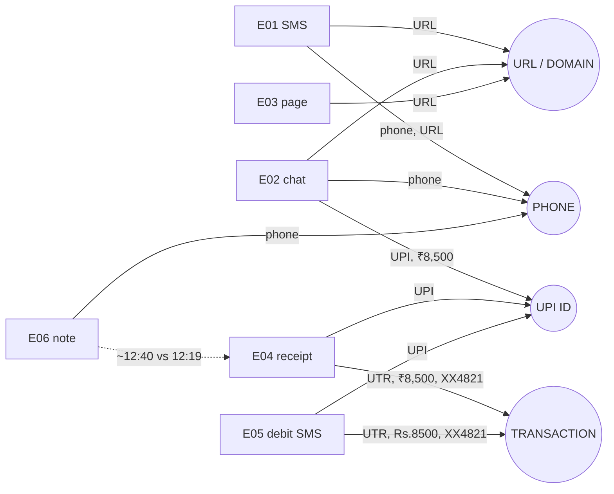

---

## 9. Demo Evidence Narrative

1. Before any processing, the judges see **six separate items in a list**: three screenshots of different apps, a PDF, an SMS, and a typed note. Each has only a reference (E01–E06), a type and a fingerprint.
2. Nothing on screen yet says "phone", "UPI" or "timeline". The presenter states: "These are the fragments a victim actually has."
3. The transformation becomes visible only after "Analyse evidence".

---

## 10. Step 1 — Landing (≈ 0:00–0:15)

| | |
|---|---|
| Screen | Landing page (10 §6) |
| Say | "After a scam, people have screenshots, receipts and messages scattered across apps. Proofline turns them into a structured case they can act on. Everything you'll see is fictional." |
| Notice | Evidence-first positioning; "links are never opened"; not a chatbot; no government styling |
| Do | Click **Start a case** |

```mermaid
flowchart LR
    L["Landing"] --> S["Sign in (or already signed in)"] --> N["New case"] --> U["Upload E01–E06"] --> A["Analyse"] --> O["Overview (HIGH)"] --> G["Graph"] --> T["Timeline + contradiction + correction"] --> M["Missing info: answer"] --> X["Actions"] --> D["Draft"] --> R["Review + confirm"] --> I["Integrity"] --> E["Export"]
```

---

## 11. Step 2 — Sign In (≈ 0:15–0:20)

| | |
|---|---|
| Primary path | The presenter is **already signed in** (session established before the demo with the real email OTP). The landing CTA goes straight to the case list. |
| Optional (8-min version) | Show email → 6-digit code → signed in, using the real inbox on a second screen |
| Say (only if shown) | "Sign-in is a one-time code by email — no passwords." |
| Don't | Explain sessions or cookies. There is no bypass. |

---

## 12. Step 3 — Create Case (≈ 0:20–0:30)

| Field | Entered? | Reason |
|---|---|---|
| When did it happen? | **Left empty** ("I don't know" not selected) | The timeline must be discovered from evidence |
| Your description | **Empty** in the standard demo (optionally one line in the 8-min version: "Got a KYC SMS, called the number and paid by UPI.") | Facts must come from evidence, not typing |
| Contact / location | Empty | Not used by analysis (03 §5.5) |

- Do: **Create case** → toast "Case CF-xxxxx created."
- Say: "The case starts nearly empty."

---

## 13. Step 4 — Upload Six Artifacts (≈ 0:30–1:15)

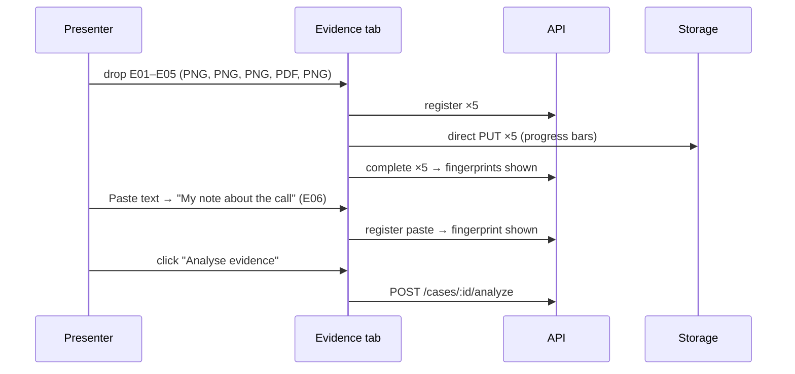

| Show | Point to |
|---|---|
| Limits line above the drop zone | "Up to 10 MB, 20 items, text PDFs; links are never opened" |
| Six rows E01–E06 | Different types; "6 of 20 items" |
| Progress, then fingerprint per row | "Each file gets a SHA-256 fingerprint the moment it's stored." |
| Status "Ready for analysis" | Uploading did not start analysis |
| Action | Click **Analyse evidence** |

---

## 14. Step 5 — Processing / Agent Activity (≈ 1:15–1:45)

```mermaid
flowchart LR
    P0["Planned the analysis"] --> P1["Read text from E01–E06 (OCR for images, PDF text for E04, text for E06)"]
    P1 --> P2["Found key details (validated against source text)"]
    P2 --> P3["Matched identical details"]
    P3 --> P4["Checked for known scam patterns"]
    P4 --> P5["Connected the evidence"]
    P5 --> P6["Rebuilt the timeline"]
    P6 --> P7["Checked for missing information"]
    P7 --> P8["Prepared next steps"]
    P8 --> P9["Set urgency (rule-based)"]
    P9 --> D["Analysis complete · Evidence 6/6 processed"]
```

| | |
|---|---|
| Screen | Activity tab: plan, step list, "Evidence 6/6 processed" (10 §15) |
| Say | "It reads each item, keeps only details it can find literally in the source text, then connects them." |
| Notice | Steps and results only. No raw model reasoning. If a fallback note appears, the presenter says so (§35). |

---

## 15. Step 6 — Processing Results (≈ 1:45–1:55)

The presenter points quickly to:
- the header now showing **Urgency HIGH** and the signals;
- entity counts **PHONE 1 · URL 1 · UPI 1 · UTR 1**;
- "Needs attention: 1 question · 1 contradiction";
- "Evidence 6/6 processed".

**Do not open the draft yet.**

---

## 16. Step 7 — Incident Overview (≈ 1:55–2:10)

| Question | Card |
|---|---|
| What happened? | "Signals consistent with KYC impersonation" + UPI fraud, phishing chips |
| What do we know? | Loss ₹8,500 (E04, E05); identifiers strip; first timeline events |
| What needs attention? | 1 open question (bank), 1 "sources differ" |

Say: "Within seconds we have the shape of the incident — and the system is telling us what it doesn't know."

---

## 17. Step 8 — HIGH Urgency (≈ 2:10–2:20)

| | |
|---|---|
| Do | Click the "i" on **Urgency: HIGH** |
| Shows | "Urgency is HIGH because a debit of ₹8,500 on 24 Sep 2026 at 12:21 PM is recorded in this case (E04, E05). A request for passwords or an OTP was also observed (E02, E03)." + the fixed disclaimer |
| Say | "This isn't a fraud score. It's a fixed rule: money left the account, so act on the next steps soon. It isn't a risk score or a legal assessment." |
| Don't | Say probability, severity, confidence or "95 %" |

---

## 18. Step 9 — Entity Correlation (≈ 2:20–2:35)

| Correlation | Evidence | Shown via |
|---|---|---|
| PHONE `+91 90XXX XX001` | E01, E02, E06 (three formats → one number) | Entity row "appears in E01 · E02 · E06" |
| URL `kyc-update-verify.example/kyc` | E01, E02, E03 (tracking parameter removed) | Entity row |
| UPI `kyc.r***@demoupi` | E02, E04, E05 | Entity row |
| UTR `6270…8532` | E04, E05 | Entity row |

Say: "Three different apps, one phone number. Proofline matched them exactly — no fuzzy guessing."

---

## 19. Step 10 — Evidence Graph (≈ 2:35–3:05) ★ key moment

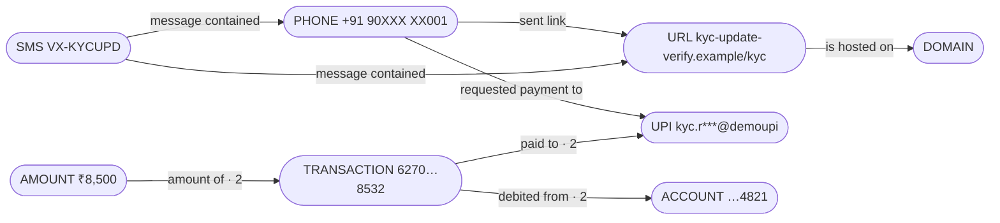

| Do | Show |
|---|---|
| Point along **phone → link → UPI → transaction** | Labelled edges (R2, R3, R4) |
| Click the **"paid to"** edge | Panel: "Supported by 2 items (E04, E05)" with snippets |
| Click **E04** source chip | Source panel: E04 page 1, UTR line highlighted |
| Say | "Every line on this graph is backed by evidence you can open. This one is supported by both the receipt and the bank SMS." |
| Don't | Linger on extra edges (`VX-ALERTS → UPI`, `contacted from` "Rohan") (D-5) |

---

## 20. Step 11 — Timeline (≈ 3:05–3:25)

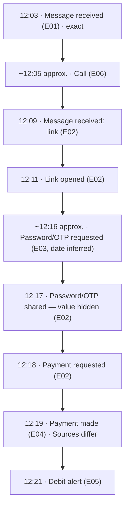

Call out:
- the **approximate** markers on T2 and T5 vs. exact times;
- the call (T2), contact messages (T3, T6, T7), payment (T8) and debit (T9);
- the "Sources differ" marker on T8.

All times are IST on 24 Sep 2026.

---

## 21. Step 12 — Planted Contradiction (≈ 3:25–3:35)

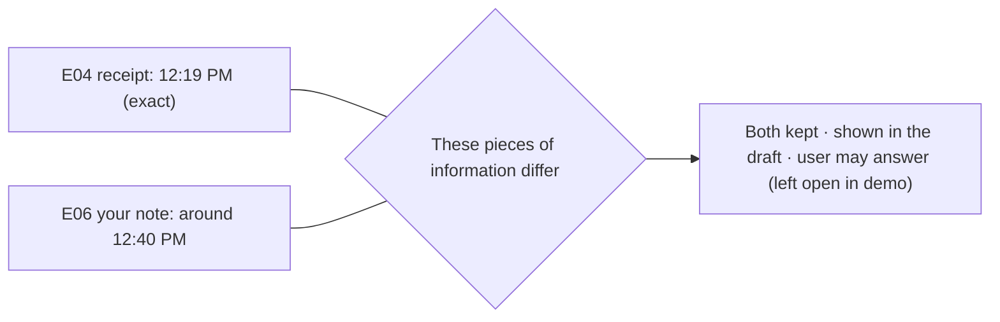

| | |
|---|---|
| Do | Click "Sources differ" on T8 → contradiction card (both sides shown identically) |
| Say | "Proofline doesn't silently choose one. It surfaces the discrepancy and keeps both sources. Memory under stress is often off by minutes." |
| Don't | Say either source is false. Don't resolve it in the standard demo. |

---

## 22. Step 13 — User Correction (≈ 3:35–3:50)

| | |
|---|---|
| Do | On T2 "~12:05 (Around 12:05 PM, E06)" → **Edit** → time 12:07, precision Exact, note "Checked my call log" → confirm |
| Shows | T2 at **12:07**, badge **"You corrected this"**, "Originally ~12:05 PM (E06)"; toast "Correction saved." Order unchanged. Actions and urgency re-check briefly (activity chip). |
| Say | "The user knows better — their call log says 12:07. The original evidence isn't changed. The correction is recorded as their statement, with an audit entry." |
| Wait | Until the processing chip clears (≈ seconds) before continuing |

---

## 23. Step 14 — Missing Information (≈ 3:50–4:05)

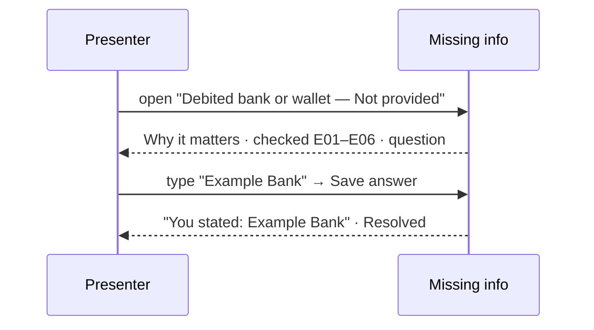

| | |
|---|---|
| Shows | "Debited bank or wallet — **Not provided** · Needed". Why: needed for financial fraud reports. Checked all processed evidence (E01–E06). Question: "Which bank or wallet was the ₹8,500 debited from?" |
| Do | Type **Example Bank** → Save |
| Shows after | Teal **"You stated: Example Bank"**. Item resolved. ID document shown as "Keep ready" (no upload). |
| Say | "No evidence names the bank — so Proofline asks, instead of guessing. This came from the user, and it's labelled that way everywhere." |

---

## 24. Step 15 — Immediate Actions (≈ 4:05–4:15)

| Rank | Action | Reason source |
|---|---|---|
| 1 | Contact your bank (official customer-care channel) | Debit recorded (E04, E05); OTP shared |
| 2 | Report financial cyber fraud via 1930 / NCRP | Debit recorded |
| 3 | Preserve original evidence | Evidence present |
| 4 | Report suspect identifiers via NCRP Report Suspect | Phone, link and UPI observed |

Say: "Each step says why. And Proofline doesn't contact anyone — **you do this yourself**." (Point to the label.)

---

## 25. Step 16 — Complaint Draft (≈ 4:15–4:30)

| | |
|---|---|
| Do | Draft tab → **Generate draft** → version 1 appears (polling) |
| Show | Disclaimer banner. AI-written summary block (tagged AI-derived). Financial details: ₹8,500 · UTR 627000418532 · 24 Sep 2026 · **Example Bank (You stated)**. Identifiers observed in evidence. Timeline incl. 12:07 "You corrected". Contradiction listed with both sources. Evidence index with fingerprints. |
| Say | "A structured draft, aligned to what the official complaint form asks for. It's a draft for review — nothing has been submitted anywhere." |

---

## 26. Step 17 — Review (≈ 4:30–4:40)

| Shows | Point to |
|---|---|
| Version 1, generated time | Header |
| Uncertain items: T5 approximate, open contradiction | Review pane |
| Your corrections and statements | 12:07 call, Example Bank |
| Evidence references | Index |
| Status | **Awaiting review** (case `USER_REVIEW`) |

Say: "The person stays the final reviewer."

---

## 27. Step 18 — Confirmation (≈ 4:40–4:45)

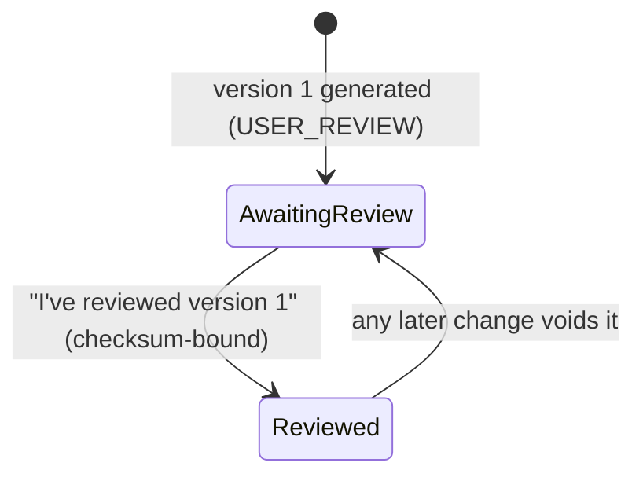

- Do: **I've reviewed version 1** → dialog with version + short checksum → confirm.
- Result: badge **"Reviewed – version 1"**. The status remains `USER_REVIEW`. There is never a "Confirmed" status.

---

## 28. Step 19 — Integrity Verification (≈ 4:45–4:55)

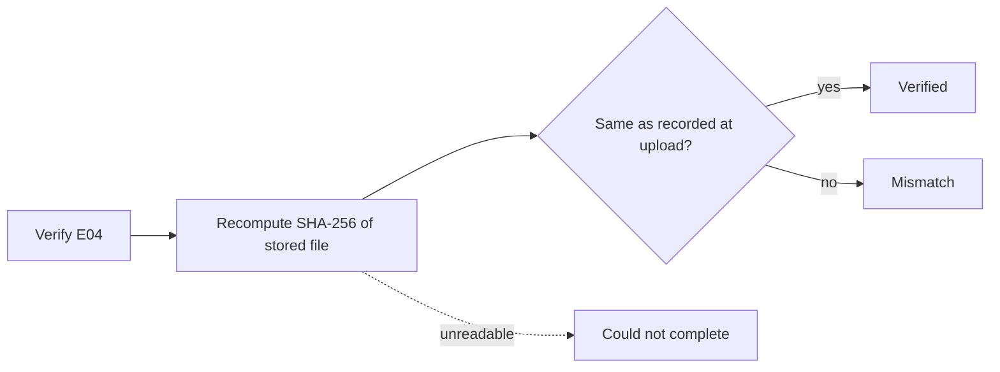

| | |
|---|---|
| Do | Integrity tab → **Verify all** (or Verify E04) |
| Shows | **Verified** for each item; recorded = current hash |
| Say | "The stored bytes match the hash recorded at upload. That proves the file hasn't changed since — it doesn't by itself prove the event is true, who sent it, or that it's legally admissible." |

---

## 29. Optional Integrity Mismatch Moment

**The live demo uses the Verified path only.**

- A mismatch requires replacing the stored E04 object with `E04_upi_receipt.TAMPERED.pdf` in a **test environment** (S-H6). That is a QA operation, not a product feature, and it must never touch the live demo data.
- **Optional:** in the 8-minute version or Q&A, show a recorded clip or screenshot from the QA run, **labelled on screen "Test environment — tamper check"**.

---

## 30. Blockchain Presentation

- Blockchain attestation is **OFF** (OD-06). The standard demo has **no blockchain screen or narration**.
- **If** the team enables attestation by the 2026-10-06 go/no-go, an optional 10-second branch on the integrity screen shows the secondary row: network, transaction hash and attestation status for E04. Say: "Optionally, the hash and a non-identifying reference can be anchored on a testnet. No evidence goes on-chain, and this doesn't prove truth."
- It is never central to the story.

---

## 31. Final Demo Moment (≈ 4:55–5:00)

- **Do:** Export → **ZIP bundle** (selected originals E04, E05) for **version 1** → download → show the manifest checksum line (DEMO-14).
- **Final screen:** the Overview with "Reviewed – version 1", the 6/6 evidence count, urgency, actions and the integrity summary.
- **Closing line:**

> "Six scattered fragments became one connected case: who contacted them, where the money went, what happened when, what's missing, what to do next — and a reviewed draft whose evidence you can verify. That's Proofline."

---

## 32. Demo Narration Script

| Step | SCREEN | WHAT TO DO | WHAT TO SAY | JUDGES NOTICE |
|---|---|---|---|---|
| 1 | Landing | Start a case | "Scattered evidence → a structured case. All fictional." | Not a chatbot |
| 3 | New case | Create (empty) | "It starts nearly empty." | Facts come from evidence |
| 4 | Evidence | Drop 5 files, paste note, Analyse | "Each file is fingerprinted when stored." | Mixed formats; fingerprints |
| 5 | Activity | Watch | "It keeps only details it can find in the source text." | Structured steps, 6/6 |
| 7 | Overview | Scan cards | "Shape of the incident, and what it doesn't know." | Signals, loss, attention |
| 8 | Urgency | Open "i" | "A fixed rule, not a fraud score." | Deterministic reason + disclaimer |
| 9–10 | Graph | Click "paid to", open E04 | "Every line is backed by evidence you can open." | Cross-evidence correlation |
| 11–12 | Timeline | Click "Sources differ" | "It surfaces the discrepancy and keeps both." | Uncertainty surfaced |
| 13 | Timeline | Correct T2 to 12:07 | "Original kept; this is the user's statement." | Human correction |
| 14 | Missing info | Answer "Example Bank" | "It asks instead of guessing." | You stated |
| 15 | Actions | Point to the label | "You do this yourself." | Actionable, honest |
| 16–18 | Draft | Generate, review, confirm | "A draft for review — nothing is submitted." | Human oversight, version badge |
| 19 | Integrity | Verify all | "Proves unchanged, not true." | Tamper detection, limits |
| End | Export / overview | Download ZIP | Closing line | Complete transformation |

---

## 33. Judge Attention Map

| Moment | Judge takeaway |
|---|---|
| Upload | Scattered, mixed-format evidence, each fingerprinted |
| Processing | Structured, validated extraction (steps, not chat) |
| Overview | Incident shape + what needs attention |
| Urgency | Rule-based, explained, not a score |
| Graph | Cross-evidence correlation with provenance |
| Timeline | Incident reconstruction with precision markers |
| Contradiction | Uncertainty is surfaced, not hidden |
| Correction | The human corrects; the original is preserved |
| Missing info | The system knows what's missing and asks |
| Actions | Actionable response; the user acts externally |
| Draft and review | Human oversight; versioned confirmation |
| Integrity | Tamper detection, with honest limits |

---

## 34. Demo Timing

| Segment | 3-min | 5-min (standard) | 8-min |
|---|---|---|---|
| Landing + (sign-in) | 0:10 | 0:15 | 0:40 (show OTP) |
| Create + upload + analyse | 0:35 | 1:15 | 1:40 |
| Processing | 0:15 | 0:30 | 0:40 |
| Overview + urgency | 0:15 | 0:25 | 0:40 |
| Graph | 0:25 | 0:30 | 0:50 |
| Timeline + contradiction + correction | 0:25 | 0:45 | 1:10 |
| Missing info | 0:10 | 0:15 | 0:25 |
| Actions | 0:05 | 0:10 | 0:20 |
| Draft + review + confirm | 0:15 | 0:30 | 0:50 |
| Integrity + export + close | 0:15 | 0:15 | 0:45 (incl. optional QA mismatch clip / ledger branch) |

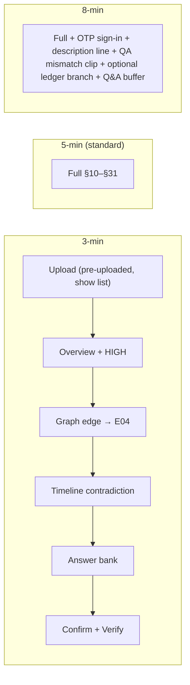

In the 3-minute version:
- Uploads may be done **live but before speaking** (the list shown already analysed), **stated aloud**.
- Correction and actions are shown in passing.
- The core transformation is never cut.

---

## 35. Demo Fallback Strategy

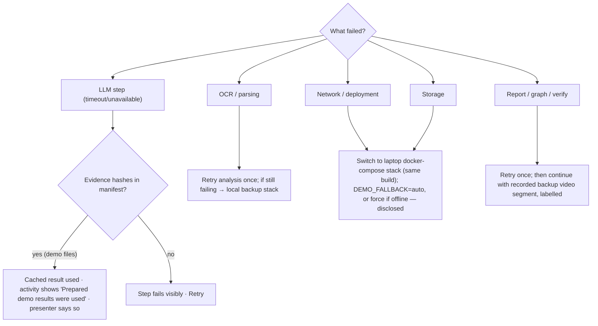

| Failure | Response |
|---|---|
| OCR fails | Retry analysis (`POST /cases/:id/analyze`). If it persists, switch to the local backup stack. **No OCR fallback** (D-6). |
| LLM unavailable | Disclosed cached results apply automatically **only** to the six manifest hashes. The presenter says: "The AI service is down, so this step is using prepared results for these demo files — the app shows that." |
| Processing too slow | Narrate the activity steps. After 60 s, switch to the pre-analysed backup case on the local stack (stated aloud). |
| Storage fails | Local backup stack |
| Report generation fails | Retry once. Otherwise the local stack. |
| Graph fails | Retry. Otherwise show the graph list mode (same data). |
| Verification unavailable | "Could not complete" is the correct, honest result. Say so and retry once. |
| Network unstable | Local backup stack. `DEMO_FALLBACK=force` only if fully offline, and it is **disclosed**. |

**Never** use the fallback for non-demo files, and never present fallback output as live processing.

---

## 36. Demo Reset Procedure (product operations only)

1. Sign in as the presenter.
2. **Delete the previous demo case** via the product (case menu → Delete → type the case reference). This removes evidence, derived data, reports, exports, answers, corrections, review state and verification records. Content-free audit rows remain by design (OD-11).
3. Confirm the case list is empty (or shows no demo case).
4. Create a **new** case during the demo. The case reference will be the next sequence number (D-1). This is expected and is not reset.
5. Re-verify that the local files' hashes equal the manifest (Doc 13 tooling).

No database surgery is needed. For a fully fresh reference (`CF-10001`), deploy a fresh database. That is an operator choice, not a product feature.

---

## 37. Demo Failure Recovery

| Symptom | Presenter action |
|---|---|
| Upload stuck | Remove the row, re-drop the file (it registers fresh). If storage is down → backup stack. |
| One item fails | Read the message aloud (e.g., "No readable text found"), click Retry analysis. If it repeats → backup stack. |
| Analysis slow | Narrate the activity steps. At 60 s → pre-analysed backup case. |
| Graph empty | Check the "N items aren't processed" banner → Retry analysis. Show list mode. |
| Timeline incomplete | Point out the precision markers. If events are missing → backup case. |
| Draft fails | Retry. Earlier versions are unaffected. |
| "Analysis is running" blocks a click | Wait for the chip to clear (corrections and answers trigger a short re-check) |
| Verification "Could not complete" | Explain it honestly. Retry once. |

---

## 38. Demo Do / Don't

| DO | DON'T |
|---|---|
| Say "all data is fictional" at the start | Claim police or NCRP submission |
| Click through to sources (provenance) | Claim money recovery |
| Show the contradiction with both sources | Claim legal admissibility |
| Show the missing bank → "You stated" | Claim a confirmed criminal identity ("the scammer is Rohan") |
| Show the call correction with the original preserved | Call urgency a fraud score, probability or confidence |
| Show review → "Reviewed – version 1" | Show or describe hidden chain-of-thought |
| Show integrity + its limits | Invent evidence or edit artifacts |
| Disclose fallback use | Use real personal data, phones or bank names |
| Use the calibrated wording ("signals consistent with") | Pretend fallback output was live |
| Mention "Proofline doesn't contact anyone" | Claim blockchain proves truth |

---

## 39. Demo Acceptance Criteria

| ID | Criterion |
|---|---|
| DEMO-01 | All six artifacts upload (E01–E05 files, E06 paste), with fingerprints equal to the manifest |
| DEMO-02 | All six reach `PROCESSED` (E04 via the PDF text layer) |
| DEMO-03 | Expected entities appear (`DECISIONS.md` §7.2.4), counts PHONE 1 · URL 1 · UPI 1 · UTR 1 |
| DEMO-04 | Relationships R1–R7 appear with sources. PAID_TO / AMOUNT_OF / DEBITED_FROM supported by E04 and E05. |
| DEMO-05 | Timeline T1–T9 in order (> 90 %), with T2 and T5 approximate |
| DEMO-06 | Contradiction 12:19 (E04) vs. ~12:40 (E06) appears with both sources |
| DEMO-07 | T2 corrects from ~12:05 to 12:07; the original is preserved; "You corrected this" is shown |
| DEMO-08 | "Debited bank or wallet — Not provided" appears with the question |
| DEMO-09 | The answer "Example Bank" appears as "You stated" in missing info, entities and the draft |
| DEMO-10 | Urgency HIGH (`G2-v1`) with the U1 reason (E04/E05), the U2 sentence and the disclaimer |
| DEMO-11 | The action checklist shows the 3 MUST actions (+ Report Suspect) with "You do this yourself" |
| DEMO-12 | Draft version 1 generates with all sections, sources and "Not provided" only where applicable |
| DEMO-13 | Confirmation produces "Reviewed – version 1"; the status remains `USER_REVIEW` |
| DEMO-14 | Export of version 1 uses its confirmation; a manifest checksum is shown |
| DEMO-15 | Verification of untouched items returns **Verified** |
| DEMO-16 | No real personal data anywhere; the OTP never displays |
| DEMO-17 | No demo-specific code paths. Fallback only by manifest hash, and disclosed. |

---

## 40. Traceability Matrix

| Demo element | 01 | 02 | 05 | 06 | 07 | 08 | 09 | 10 | 11 | DECISIONS |
|---|---|---|---|---|---|---|---|---|---|---|
| Six artifacts | §22.2 | §22 | §33 | §33 | §30 | §35 | — | §42 | — | AD-03 §7.2.2–§7.2.3 |
| Processing | §22.3, FR-006 | AC-04 | #4, #23 | §4 | §2, §30 | — | §26 | §15 | §36 | OD-12 |
| Graph | FR-011 | AC-07 | #7 | §7 | §20 | §8–§15 | — | §22 | §30 | §7.2.5 |
| Timeline | FR-012 | AC-08 | #6 | §11 | §21 | §17–§21 | — | §20 | §26 | §7.2.6 |
| Contradiction | FR-014 | AC-09 | #28 | §12 | — | §24–§26 | — | §25 | §32 | §7.2.6 |
| Correction | FR-013 | AC-013.1 | #26 | §11 | — | §23 | — | §21 | §26 | §7.2.6 |
| Missing bank | FR-014/015 | AC-015.1 | #29 | §13 | — | §27 | — | §24 | §31 | §7.2.6 |
| Urgency | §21.1 | AC-R3 | #2 | §10 | — | §30 | §25 | §11 | §43 | G-2 |
| Actions | FR-016 | AC-10 | #8 | §14 | — | — | §34 | §26 | §33 | §7.2.7 |
| Report | FR-017 | AC-11 | #9, #33 | §15 | — | §31 | §33 | §27 | §34 | AD-04 |
| Review / confirm | FR-019 | AC-12 | #34 | — | — | — | §33 | §29 | §20 | R-1 |
| Export | FR-020 | AC-14 | #10, #36 | — | — | — | §33 | §30 | §34 | OD-07 |
| Integrity | FR-021, §15.3 | AC-13 | #11 | — | §7 | — | §30–§31 | §31 | §35 | S-H1–S-H7 |
| Fallback | FR-027 | AC-16 | #23 | §22 | §30 | — | — | §15 | — | AD-06 |

---

## 41. Implementation Readiness

| Item | Status |
|---|---|
| Demo story | ✅ §2 |
| Six artifacts | ✅ §7 (exactly E01–E06) |
| Artifact dependencies | ✅ §8 |
| Presenter journey | ✅ §10–§31 |
| All major screens | ✅ |
| Processing sequence | ✅ §14 (06 order) |
| Graph moment | ✅ §19 |
| Timeline moment | ✅ §20 |
| Contradiction | ✅ §21 |
| Correction | ✅ §22 |
| Missing information | ✅ §23 |
| Urgency | ✅ §17 |
| Action checklist | ✅ §24 |
| Report | ✅ §25 |
| Review | ✅ §26 |
| Confirmation | ✅ §27 |
| Integrity | ✅ §28–§29 |
| Fallback | ✅ §35 |
| Reset | ✅ §36 |
| Recovery | ✅ §37 |
| Timing | ✅ §34 |
| Acceptance criteria | ✅ §39 |
| Traceability | ✅ §40 |

**Final quality check:**
- Exactly six artifacts are used, with values only from frozen sources.
- No new evidence, API, table, agent or capability.
- No blockchain dependency and no sign-in bypass.
- No real personal data and no chain-of-thought.
- Fallback limited to manifest hashes and disclosed.
- Corrections preserve originals. User statements are labelled. Urgency is deterministic.
- Review is human-controlled. Export is tied to the reviewed version. Integrity claims are limited.
- Documents 01–11 unchanged.

**Non-blocking notes:** D-1 to D-6 (case reference is server-assigned; 06 processing order used; frozen wording for the correction and the bank question; extra factual edges may appear; no OCR fallback).

**Final status: READY WITH NON-BLOCKING NOTES**
