# Proofline — Synthetic Data Specification

> **Six fictional artifacts. Deterministic inputs, deterministic expected outputs. One planted gap, one planted contradiction, one correctable event.**
> **Every value in this dataset is fictional.**

| Field | Value |
|---|---|
| Product | **Proofline** |
| Document | Synthetic Data Specification (demo + validation fixtures) |
| File | `docs/13-SYNTHETIC-DATA-SPECIFICATION.md` |
| Version | 1.0 |
| Status | Specification only. **The actual files, manifest and hashes are not created by this document.** |
| Last updated | 2026-10-02 |
| Source authority | 1 `DECISIONS.md` AD-03 (§7.2.1–§7.2.8) and G-2, G-3, G-4, OD-03, AD-06 → 2 Doc 07 §30 → 3 Doc 08 → 4 Doc 12 → 5 Docs 01–06 |
| Delegated here | Manifest path and format, benchmark/oracle format, artifact rendering tooling (`DECISIONS.md` §11; S-H1) |

### Labels used in this document

| Label | Meaning |
|---|---|
| **[FROZEN]** | Value copied verbatim from the authoritative source |
| **[DERIVED]** | Deterministic consequence of frozen values under Docs 07/08 rules (e.g., normalised forms, UTC conversions, PDF line numbers) |
| **[UNDEFINED]** | The source does not define it. **The implementation must not invent a conflicting value.** |
| **[DS13]** | Decision delegated to this document (paths, manifest and oracle formats, construction rules) |

### Discrepancies recorded (sources followed, nothing reconciled silently)

| # | Discrepancy | Authority used |
|---|---|---|
| X-1 | Doc 08 §19 cites E01 date at "L2" and time at "L5". Doc 10 §11 shows "E01 (line 3)" for the phone. With the §7.2.3 layout (header, date, three message lines, time), E01 time would be line 6 and the phone line 5. **Line numbers for OCR'd images depend on final rendering and line-wrapping, which are not frozen.** | `DECISIONS.md` §7.2.3 content. OCR line *numbers* are [UNDEFINED]. Tests match source lines **by text**, not number (§14). |
| X-2 | `DECISIONS.md` §7.2.6 lists T1–T9. E02 also contains a 12:15 PM contact message and a 12:18 PM "Ok paying now" message that a correct timeline step **may** turn into additional sourced events. | T1–T9 are the **required** oracle. Additional sourced events are permitted but not asserted (§20). |
| X-3 | Doc 08 §9.3: rule D5 also yields `MESSAGE_CONTAINED` `VX-ALERTS` → UPI_ID (E05). Doc 08 §8 lists `CONTACTED_FROM` PHONE → "Rohan" as an LLM-proposed demo example. Neither is in R1–R7. | R1–R7 are **required**. These two are **permitted** (§18). |

---

## 1. Purpose and Scope

| Use | How |
|---|---|
| Demo (Doc 12) | The six artifacts are uploaded/pasted live. Expected screens follow the oracle (§35). |
| Automated tests (Doc 15) | Fixture files + manifest + oracle drive acceptance tests (DEMO-01–17, AC-AD03.1–10) |
| Deterministic validation | Same bytes → same hashes, lines, extractions, entities and timeline (NFR-11) |
| Doc 07 | Defines parsing, redaction, extraction and validation rules the dataset must satisfy |
| Doc 08 | Defines graph, timeline, contradiction and missing-info rules the oracle encodes |
| Doc 15 | Will consume the oracle and the negative-scenario list (§36) |

**This document specifies the dataset. It does not create the files, manifest, hashes or seeds.**

---

## 2. Dataset Principles

| Principle | Rule |
|---|---|
| Deterministic inputs | Content fixed verbatim (§13). Construction rules remove nondeterminism (§33). |
| Deterministic outputs | The oracle (§35) lists expected facts derived only from frozen values and Docs 07/08 rules |
| Fictional only | `DECISIONS.md` §7.2.1 register. No real people, numbers, accounts, domains, OTPs or keys. |
| Provenance | Every expected fact names its artifact and literal source text |
| Planted issues | **Exactly one** gap (debited bank/wallet), **exactly one** contradiction (payment time), **one** correctable event (call time) |
| Reproducibility | Hashes recorded **after** final file creation in the manifest. Regenerating any file requires updating the manifest, oracle and fallback cache together (S-H7). |
| Sensitive examples | One synthetic OTP (`731904`) exists only to test redaction (GR-09). No card or full account numbers exist. |

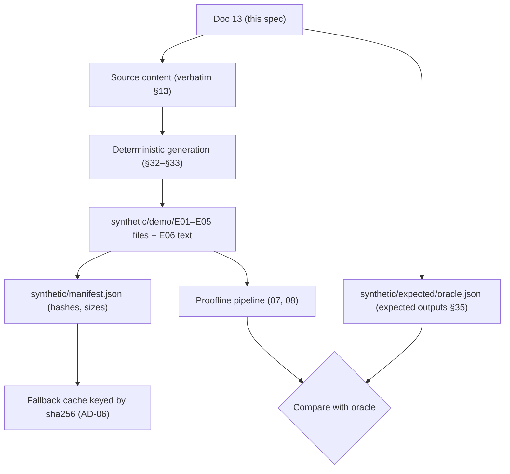

---

## 3. Dataset Inventory [FROZEN `DECISIONS.md` §7.2.2]

| ID | Format | Filename | Purpose | Processing |
|---|---|---|---|---|
| E01 | PNG screenshot | `E01_kyc_sms.png` | Fake KYC SMS (lure) | OCR |
| E02 | PNG screenshot | `E02_chat_kyc_agent.png` | Chat with "KYC support" (link, OTP, payment request) | OCR; OTP redaction |
| E03 | PNG screenshot | `E03_phishing_page.png` | Phishing page requesting credentials/OTP | OCR |
| E04 | PDF, one page, **text layer** | `E04_upi_receipt.pdf` | UPI payment receipt (no bank name) | PDF text extraction (no OCR) |
| E05 | PNG screenshot | `E05_bank_debit_sms.png` | Bank debit SMS (no bank name) | OCR |
| E06 | Plain text, **pasted** (kind MESSAGE, label "My note about the call") | Source file `E06_user_note.txt` | Victim's note (approximate times; contradiction source) | Text parse (canonical bytes) |

**Exactly six. No seventh artifact.**

---

## 4. Demo Case Context [FROZEN]

- **Case:** fictional. The case reference is server-assigned (Doc 12 D-1).
- **Date and zone:** Thursday, 24 September 2026, IST (+05:30), for every artifact.
- **Incident:** a fake KYC-expiry SMS leads to a call, a chat with "KYC support", a phishing page requesting credentials/OTP, an OTP shared in chat, and a ₹8,500 UPI payment followed by a debit alert (01 §6.3, §22).
- **Why six artifacts:** each comes from a different channel, so correlation across items is visible (01 §22.2).
- **Names:** the only names are Asha Verma (payer), Rohan (claimed caller name) and KYC Refund Desk (payee display name). No other biography is defined. **[UNDEFINED: anything else; do not add.]**

**Six-artifact dependency graph:**

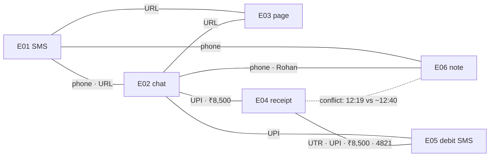

---

## 5. Global Synthetic Data Rules

| Item | Convention [FROZEN unless noted] |
|---|---|
| Time zone | IST (+05:30). No zone printed on artifacts. |
| Date forms (as printed) | `Thursday, 24 Sep 2026` (E01, E05); `24 September 2026` (E02); `24 Sep 2026, 12:19 PM` (E04); `24-09-26 12:21` (E05, DD-MM-YY); `24 Sep 2026` (E06) |
| Time forms | `12:03 PM`, `12:19 PM`, `12:21`, `12:16`, `Around 12:05 PM`, `around 12:40 PM` |
| Currency forms | `₹8,500` (E02); `₹8,500.00` (E04); `Rs.8500.00` (E05); `Rs 8,500` (E06) |
| Phone forms | `+91 90000 00001` (E01, E02); `9000000001` (E06) |
| UPI | `kyc.refund.desk@demoupi` (identical in E02, E04, E05) |
| URL / domain | `https://kyc-update-verify.example/kyc?utm_source=sms` (E01); `https://kyc-update-verify.example/kyc` (E02, E03); domain `kyc-update-verify.example` |
| Transaction ref | `627000418532` with labels `UPI Ref No:` (E04) and `Ref no` (E05) |
| Account hint | `****4821` (E04), `XX4821` (E05) |
| SMS headers | `VX-KYCUPD` (E01), `VX-ALERTS` (E05) |
| Filenames | `Exx_<description>.<ext>`, lower-case, as in §3 |
| Fictional marker | Not printed inside artifacts (it would alter OCR content). Stated in this spec, the manifest (`"fictional": true`) and the demo narration. [DS13] |

---

## 6. Evidence ID Rules

- `E01`–`E06` are **application-assigned** evidence refs (`evidence_ref` = `E` + 2-digit slot, 03 §6.1). They match the filename prefixes **only because** the demo uploads in order E01 → E06 into an empty case.
- The refs appear in extraction provenance, graph nodes, timeline sources, the report evidence index, integrity and demo validation.
- There is **no second ID system**. The manifest keys files by filename and sha256; the oracle refers to `E01`–`E06` under the assumption of upload order. Tests must upload in that order (§38).

---

## 7. E01 Specification

| Field | Value |
|---|---|
| Evidence ID / file | E01 · `E01_kyc_sms.png` |
| Format / MIME | PNG · `image/png` |
| Size range | [UNDEFINED] (must be ≤ 10 MB; G-4) |
| Channel | SMS (generic messaging layout; no OS or brand logos) |
| Structure | Header → date divider → one message bubble (3 visual lines) → time |
| Exact text | §13 |
| Expected OCR source lines (by text) | `VX-KYCUPD` · `Thursday, 24 Sep 2026` · `Dear Customer, your bank KYC has expired. Your account will be BLOCKED today.` · `Update KYC now: https://kyc-update-verify.example/kyc?utm_source=sms` · `or call KYC desk +91 90000 00001` · `12:03 PM` (numbers [UNDEFINED], X-1) |
| Extractions | SMS_SENDER_HEADER `VX-KYCUPD`; URL (raw incl. `?utm_source=sms`); DOMAIN; PHONE `+91 90000 00001`; DATETIME date-only `Thursday, 24 Sep 2026` + time-only `12:03 PM` (dateContext) |
| Entities | SMS_SENDER_HEADER, URL, DOMAIN, PHONE |
| Timestamps | T1 12:03 IST, exact |
| Relationships | R1 HOSTED_ON (URL → DOMAIN); R7 MESSAGE_CONTAINED (`VX-KYCUPD` → PHONE, URL) |
| Scam signals | Cited by KYC_IMPERSONATION |
| Provenance | Each extraction → its OCR line(s) of E01 |

---

## 8. E02 Specification

| Field | Value |
|---|---|
| Evidence ID / file | E02 · `E02_chat_kyc_agent.png` · `image/png` · size [UNDEFINED] |
| Channel | Chat app (generic layout; header shows the phone and "~ KYC Support") |
| Structure | Header → date divider → six messages with times (C = contact, U = user) |
| Exact text | §13 (the ₹ glyph is the OCR spike check) |
| Expected source lines (by text) | Header line(s) with `+91 90000 00001` and `~ KYC Support`; `24 September 2026`; message lines (wrapped as rendered), incl. `OTP is [REDACTED:OTP]` after redaction |
| Extractions | PHONE (header); PERSON `Rohan` (**LLM candidate**, literal-validated); URL `https://kyc-update-verify.example/kyc` + DOMAIN; AMOUNT `₹8,500`; UPI_ID `kyc.refund.desk@demoupi`; date-only `24 September 2026`; times `12:09 PM`, `12:11 PM`, `12:15 PM`, `12:17 PM`, `12:18 PM` ×2 |
| Not extracted | OTP `731904`: detected + redacted; **never an extraction or entity** |
| Entities | PHONE, PERSON, URL, DOMAIN, AMOUNT, UPI_ID |
| Timestamps | T3 12:09, T4 12:11, T6 12:17, T7 12:18 (exact) |
| Relationships | R1; R2 SENT_LINK (PHONE → URL); R3 REQUESTED_PAYMENT_TO (PHONE → UPI_ID); permitted `CONTACTED_FROM` (X-3) |
| Scam signals | Cited by KYC_IMPERSONATION, PHISHING, UPI_FRAUD |
| Sensitive | One OTP detection (kind OTP) on the `OTP is …` line (§28) |

---

## 9. E03 Specification

| Field | Value |
|---|---|
| Evidence ID / file | E03 · `E03_phishing_page.png` · `image/png` · size [UNDEFINED] |
| Channel | Mobile browser screenshot |
| Structure | Status bar (time only) → address bar → page title → text (2 visual lines) → field labels → button. Fields empty (placeholders only). |
| Exact text | §13 |
| Expected source lines (by text) | `12:16` · `https://kyc-update-verify.example/kyc` · `KYC Verification Centre` · body text line(s) · field labels · `Verify KYC` |
| Extractions | URL + DOMAIN; time-only `12:16` (**no date context in E03**) |
| Entities | URL, DOMAIN |
| Timestamps | T5 12:16; date 24 Sep 2026 **inferred** from case evidence → **APPROXIMATE** (06 §11) |
| Relationships | R1 (third support) |
| Scam signals | Cited by PHISHING |
| Notes | No bank name or logo. The URL is never fetched (FR-003). |

---

## 10. E04 Specification (text-layer PDF; must pass OD-03)

| Field | Value |
|---|---|
| Evidence ID / file | E04 · `E04_upi_receipt.pdf` · `application/pdf` · size [UNDEFINED] |
| Channel | Payment receipt (no payment-app branding) |
| Pages | **Exactly 1** |
| Text layer | **Required.** All ten lines are real embedded text (not an image). Page 1 non-whitespace characters far exceed 10, so `has_usable_text_layer = true` (07 §10). |
| OD-03 | **Processable. Not scanned/image-only. No `PDF_NO_TEXT_LAYER`. No OCR.** |
| Source lines [DERIVED; deterministic, one printed line each] | p1 L1 `UPI Payment Receipt` · L2 `Payment Successful` · L3 `Amount: ₹8,500.00` · L4 `Paid to: KYC Refund Desk` · L5 `UPI ID: kyc.refund.desk@demoupi` · L6 `Paid by: Asha Verma` · L7 `From account: ****4821` · L8 `Date & time: 24 Sep 2026, 12:19 PM` · L9 `UPI Ref No: 627000418532` · L10 `Note: KYC deposit` (consistent with Doc 05 examples L5/L8 and Doc 10 §42 L9) |
| Extractions | AMOUNT `₹8,500.00` (L3); PERSON `KYC Refund Desk` (L4, payee_display_name); UPI_ID (L5); PERSON `Asha Verma` (L6, payer); ACCOUNT_HINT `****4821` (L7); DATETIME full `24 Sep 2026, 12:19 PM` (L8); TRANSACTION `627000418532` (L9, label `UPI Ref No`) |
| Gap | **No BANK_OR_WALLET** (planted) |
| Timestamps | T8 12:19 exact |
| Relationships | R4 PAID_TO, R5 AMOUNT_OF, R6 DEBITED_FROM (structural hints: one TRANSACTION, one AMOUNT, one UPI_ID, one ACCOUNT_HINT + payee and debit cues; 08 §9.1) |
| Contradiction | T8 time vs E06 "around 12:40 PM" |

---

## 11. E05 Specification

| Field | Value |
|---|---|
| Evidence ID / file | E05 · `E05_bank_debit_sms.png` · `image/png` · size [UNDEFINED] |
| Channel | Bank SMS |
| Structure | Header → date divider → message (3 visual lines) → time |
| Exact text | §13 |
| Expected source lines (by text) | `VX-ALERTS` · `Thursday, 24 Sep 2026` · `Rs.8500.00 debited from A/c XX4821 on 24-09-26 12:21 via UPI to VPA` · `kyc.refund.desk@demoupi. Ref no 627000418532. If not done by you, report to your` · `bank immediately.` · `12:21 PM` |
| Extractions | SMS_SENDER_HEADER `VX-ALERTS`; AMOUNT `Rs.8500.00`; ACCOUNT_HINT `XX4821`; DATETIME full `24-09-26 12:21`; UPI_ID; TRANSACTION `627000418532` (label `Ref no`); time `12:21 PM` |
| Gap | **No BANK_OR_WALLET** ("report to your bank" names none) |
| Timestamps | T9 12:21 exact (DEBIT_NOTIFICATION; separate event from T8, so no contradiction) |
| Relationships | Second support for R4, R5, R6; permitted `MESSAGE_CONTAINED` `VX-ALERTS` → UPI_ID (X-3) |
| Urgency | Provides U1 (debit recorded) with E04 |

---

## 12. E06 Specification

| Field | Value |
|---|---|
| Evidence ID / source | E06 · pasted (kind `MESSAGE`, label "My note about the call") · source file `E06_user_note.txt` |
| Evidence type | `TEXT` |
| Encoding | UTF-8, Unicode NFC, LF, **no trailing newline**. File bytes = canonical pasted bytes (G-3; 07 §13). |
| Length | Well under 20,000 characters; one paragraph (no LF) |
| Source lines [DERIVED] | One logical line. It is under 1,000 characters, so no segmentation (07 §11) → **page 1, line 1** |
| Extractions | DATETIME date-only `24 Sep 2026`; time `Around 12:05 PM` (APPROXIMATE; dateContext → 24 Sep 2026); PHONE `9000000001`; PERSON `Rohan` (LLM candidate, validated); AMOUNT `Rs 8,500`; time `around 12:40 PM` (APPROXIMATE) |
| Entities | PHONE (merges with E01/E02), PERSON (Rohan), AMOUNT |
| Timeline | T2 CALL ~12:05 (correctable → 12:07); second time source for T8 (merge: `Rs 8,500` within 80 characters of `around 12:40 PM`; 08 §20.1) → contradiction |
| Note | E06 is **evidence** (fingerprinted user-provided text). It is distinct from **user statements** (corrections, answers). |

---

## 13. Exact Artifact Content [FROZEN `DECISIONS.md` §7.2.3, reproduced verbatim]

| Artifact | Source kind | Content |
|---|---|---|
| E01 | Exact image text | below |
| E02 | Exact image text | below |
| E03 | Exact image text | below |
| E04 | Exact PDF embedded text | below |
| E05 | Exact image text | below |
| E06 | Exact pasted text (also the committed TXT) | below |
| — | Email content | **None.** No `.eml` is part of the six. |

Bracketed labels such as `[Header]` describe layout regions. **They are not printed text.** Visual line breaks shown inside messages are the specified wrapping. Exact pixel wrapping is [UNDEFINED].

**E01**
```text
[Header]        VX-KYCUPD
[Date divider]  Thursday, 24 Sep 2026
[Message]       Dear Customer, your bank KYC has expired. Your account will be BLOCKED today.
                Update KYC now: https://kyc-update-verify.example/kyc?utm_source=sms
                or call KYC desk +91 90000 00001
[Time]          12:03 PM
```

**E02** (C = contact, U = user; the sender marker is layout, not text)
```text
[Header]        +91 90000 00001   ~ KYC Support
[Date divider]  24 September 2026
12:09 PM  C:  Hello, this is Rohan from KYC verification team as discussed on call. Open this link
              and complete KYC: https://kyc-update-verify.example/kyc
12:11 PM  U:  Opened the link. It is asking for customer ID and password.
12:15 PM  C:  Enter all details. You will get an OTP, share it here to complete verification.
12:17 PM  U:  OTP is 731904
12:18 PM  C:  Final step: pay refundable KYC security deposit ₹8,500 to UPI ID
              kyc.refund.desk@demoupi. It will be refunded in 2 hours.
12:18 PM  U:  Ok paying now
```

**E03**
```text
[Status bar]    12:16
[Address bar]   https://kyc-update-verify.example/kyc
[Page title]    KYC Verification Centre
[Text]          Your KYC has expired. Complete verification within 24 hours to avoid account
                suspension.
[Fields]        Customer ID | Password | Registered Mobile Number | Enter OTP sent to your mobile
[Button]        Verify KYC
```

**E04** (embedded text, one page)
```text
UPI Payment Receipt
Payment Successful
Amount: ₹8,500.00
Paid to: KYC Refund Desk
UPI ID: kyc.refund.desk@demoupi
Paid by: Asha Verma
From account: ****4821
Date & time: 24 Sep 2026, 12:19 PM
UPI Ref No: 627000418532
Note: KYC deposit
```

**E05**
```text
[Header]        VX-ALERTS
[Date divider]  Thursday, 24 Sep 2026
[Message]       Rs.8500.00 debited from A/c XX4821 on 24-09-26 12:21 via UPI to VPA
                kyc.refund.desk@demoupi. Ref no 627000418532. If not done by you, report to your
                bank immediately.
[Time]          12:21 PM
```

**E06**
```text
On 24 Sep 2026 I got an SMS saying my bank KYC had expired. Around 12:05 PM I called the number in the SMS, 9000000001. A man who said his name was Rohan from the KYC team told me to open a link he would send on chat. I entered my customer ID, password and the OTP. He then asked me to pay a refundable deposit, and I paid Rs 8,500 at around 12:40 PM. After that I got a debit SMS.
```

[UNDEFINED] visual details: fonts (other than "sans-serif with a correct ₹ glyph"), colours, image heights, exact bubble positions, the E02 message-time placement relative to text, PDF font and page size. These must not change any text.

---

## 14. Source-Line Specification

| Artifact | Page / section | Line identity | Assertion style |
|---|---|---|---|
| E01, E02, E03, E05 (OCR) | Page 1 | Reading-order lines (07 §9) | **Match by text** (after 07 comparison normalisation). Line numbers are [UNDEFINED] (X-1). Every expected text in §7–§11 must appear as one line or a contiguous run of lines. |
| E04 (PDF) | Page 1 | L1–L10 as §10 | **Match by page + line number + text** |
| E06 (paste) | Page 1 | L1 = entire text | **Match by page + line number + text** |

```text
Evidence → page → source line → exact text            (example)
E04      → p1   → L9          → "UPI Ref No: 627000418532"
E06      → p1   → L1          → "On 24 Sep 2026 I got an SMS … After that I got a debit SMS."
E02      → p1   → (by text)   → "OTP is [REDACTED:OTP]"      (stored, redacted)
```

Every expected extraction (§15) must be literally present in its referenced line(s) (07 §17).

---

## 15. Extraction Expectations [FROZEN §7.2.4 + DERIVED]

Confidence band:
- **HIGH** is expected for non-OCR sources (E04, E06: line confidence 1.0).
- For OCR items, the expected band is HIGH under the rendering rules, but it is **not a hard assertion** (it depends on the engine). [DERIVED/UNDEFINED]

| Ev | Category | Raw (exact source text) | Line | Normalised [DERIVED, 07 §15] | Entity | K |
|---|---|---|---|---|---|:-:|
| E01 | SMS_SENDER_HEADER | `VX-KYCUPD` | text | `VX-KYCUPD` | yes | |
| E01 | URL | `https://kyc-update-verify.example/kyc?utm_source=sms` | text | `https://kyc-update-verify.example/kyc` | yes | K |
| E01 | DOMAIN | `kyc-update-verify.example` | text | same | yes | |
| E01 | PHONE | `+91 90000 00001` | text | `+919000000001` | yes | K |
| E01 | DATETIME | `Thursday, 24 Sep 2026` | text | `2026-09-24` (date-only) | no | K |
| E01 | DATETIME | `12:03 PM` | text | `T12:03` (dateContext → E01 date) | no | K |
| E02 | PHONE | `+91 90000 00001` | header | `+919000000001` | yes | K |
| E02 | PERSON | `Rohan` | text | `Rohan` (context claimed_name) | yes | |
| E02 | URL / DOMAIN | `https://kyc-update-verify.example/kyc` / `kyc-update-verify.example` | text | same | yes | K |
| E02 | AMOUNT | `₹8,500` | text | `INR 8500.00` (850000 paise) | yes | K |
| E02 | UPI_ID | `kyc.refund.desk@demoupi` | text | same | yes | K |
| E02 | DATETIME | `24 September 2026`; `12:09 PM`; `12:11 PM`; `12:15 PM`; `12:17 PM`; `12:18 PM` | text | date-only + time-only (dateContext) | no | K |
| E03 | URL / DOMAIN | `https://kyc-update-verify.example/kyc` | text | same | yes | K |
| E03 | DATETIME | `12:16` | text | `T12:16` (no dateContext) | no | |
| E04 | AMOUNT | `₹8,500.00` | p1 L3 | `INR 8500.00` | yes | K |
| E04 | PERSON | `KYC Refund Desk` | p1 L4 | same (payee_display_name) | yes | |
| E04 | UPI_ID | `kyc.refund.desk@demoupi` | p1 L5 | same | yes | K |
| E04 | PERSON | `Asha Verma` | p1 L6 | same (payer) | yes | |
| E04 | ACCOUNT_HINT | `****4821` | p1 L7 | `4821` | yes | |
| E04 | DATETIME | `24 Sep 2026, 12:19 PM` | p1 L8 | `2026-09-24T12:19+05:30` (UTC `06:49:00Z`), EXACT | no | K |
| E04 | TRANSACTION | `627000418532` | p1 L9 | `627000418532` (label `UPI Ref No`) | yes | K |
| E04 | BANK_OR_WALLET | — | — | **none** | — | K |
| E05 | SMS_SENDER_HEADER | `VX-ALERTS` | text | same | yes | |
| E05 | AMOUNT | `Rs.8500.00` | text | `INR 8500.00` | yes | K |
| E05 | ACCOUNT_HINT | `XX4821` | text | `4821` | yes | |
| E05 | DATETIME | `24-09-26 12:21` | text | `2026-09-24T12:21+05:30` (UTC `06:51:00Z`), EXACT | no | K |
| E05 | UPI_ID | `kyc.refund.desk@demoupi` | text | same | yes | K |
| E05 | TRANSACTION | `627000418532` | text | same (label `Ref no`) | yes | K |
| E05 | BANK_OR_WALLET | — | — | **none** | — | K |
| E06 | PHONE | `9000000001` | p1 L1 | `+919000000001` | yes | K |
| E06 | PERSON | `Rohan` | p1 L1 | `Rohan` | yes | |
| E06 | AMOUNT | `Rs 8,500` | p1 L1 | `INR 8500.00` | yes | |
| E06 | DATETIME | `24 Sep 2026`; `Around 12:05 PM`; `around 12:40 PM` | p1 L1 | date-only; `T12:05` APPROXIMATE; `T12:40` APPROXIMATE | no | |

The OTP `731904` is **not** an extraction (redacted before validation; 07 §17 step 5).

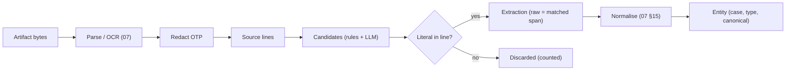

---

## 16. Entity Expectations [FROZEN §7.2.4]

| Entity type | Canonical | Masked display [DERIVED 07 §15] | Evidence | Origin | In graph |
|---|---|---|---|---|---|
| PHONE | `+919000000001` | `+91 90XXX XX001` | E01, E02, E06 | Evidence | Yes |
| URL | `https://kyc-update-verify.example/kyc` | as canonical | E01, E02, E03 | Evidence | Yes |
| DOMAIN | `kyc-update-verify.example` | as canonical | E01, E02, E03 | Evidence | Yes |
| UPI_ID | `kyc.refund.desk@demoupi` | `kyc.r***@demoupi` | E02, E04, E05 | Evidence | Yes |
| TRANSACTION | `627000418532` | `6270…8532` | E04, E05 | Evidence | Yes |
| AMOUNT | `INR 8500.00` | `₹8,500` | E02, E04, E05, E06 | Evidence | Yes |
| ACCOUNT_HINT | `4821` | as printed (`XX4821` / `****4821`) | E04, E05 | Evidence | Yes |
| SMS_SENDER_HEADER | `VX-KYCUPD` | as canonical | E01 | Evidence | Yes |
| SMS_SENDER_HEADER | `VX-ALERTS` | as canonical | E05 | Evidence | Yes |
| PERSON | `Rohan` | as canonical | E02, E06 | Evidence (LLM-validated) | Yes |
| PERSON | `KYC Refund Desk` | as canonical | E04 | Evidence | Yes |
| PERSON | `Asha Verma` | as canonical | E04 | Evidence | Yes |
| BANK_OR_WALLET | `Example Bank` | as canonical | — | **User-stated** (after answer) | Yes (teal, `is_user_stated`) |

- Overview counts: **PHONE 1 · URL 1 · UPI 1 · UTR 1**.
- DATETIME values are **not** entities (03 §10.2).
- No OTP or card entity exists.

---

## 17. Entity Resolution Expectations

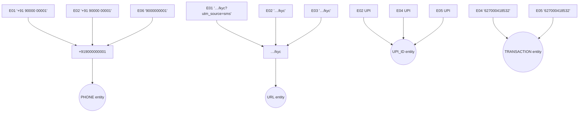

| Entity | Must merge | Must not merge with |
|---|---|---|
| PHONE | E01, E02, E06 | anything else |
| URL | E01, E02, E03 | — |
| UPI_ID | E02, E04, E05 | EMAIL (no email exists) |
| TRANSACTION | E04, E05 | — |
| AMOUNT | E02, E04, E05, E06 (equal minor units) | — |
| ACCOUNT_HINT | E04, E05 (last 4) | — |
| PERSON | "Rohan" E02 + E06 only | "KYC Refund Desk", "Asha Verma" (distinct) |

Exact canonical equality only. **No fuzzy matching. No cross-case matching.** The same values in another case form separate entities.

---

## 18. Relationship Expectations (8-type vocabulary, 03 §11.4)

| ID | Type | From → To | Supporting evidence | Supporting lines | Status |
|---|---|---|---|---|---|
| R1 | `HOSTED_ON` | URL → DOMAIN | E01, E02, E03 | URL lines in each | **Required** |
| R2 | `SENT_LINK` | PHONE → URL | E02 | header + 12:09 message lines | **Required** |
| R3 | `REQUESTED_PAYMENT_TO` | PHONE → UPI_ID | E02 | header + 12:18 message lines | **Required** |
| R4 | `PAID_TO` | TRANSACTION → UPI_ID | E04, E05 | E04 L5, L9; E05 message lines | **Required** (supportCount 2) |
| R5 | `AMOUNT_OF` | AMOUNT → TRANSACTION | E04, E05 | E04 L3, L9; E05 message | **Required** (2) |
| R6 | `DEBITED_FROM` | TRANSACTION → ACCOUNT_HINT | E04, E05 | E04 L7, L9; E05 message | **Required** (2) |
| R7a | `MESSAGE_CONTAINED` | SMS `VX-KYCUPD` → PHONE | E01 | header + message | **Required** |
| R7b | `MESSAGE_CONTAINED` | SMS `VX-KYCUPD` → URL | E01 | header + message | **Required** |
| X-3a | `MESSAGE_CONTAINED` | SMS `VX-ALERTS` → UPI_ID | E05 | header + message | Permitted (08 §9.3) |
| X-3b | `CONTACTED_FROM` | PHONE → PERSON "Rohan" | E02, E06 | header/message; E06 L1 | Permitted (08 §8) |

**Demo path:** PHONE →(R2) URL; PHONE →(R3) UPI_ID ←(R4) TRANSACTION. **No ninth type. No other edges are expected.**

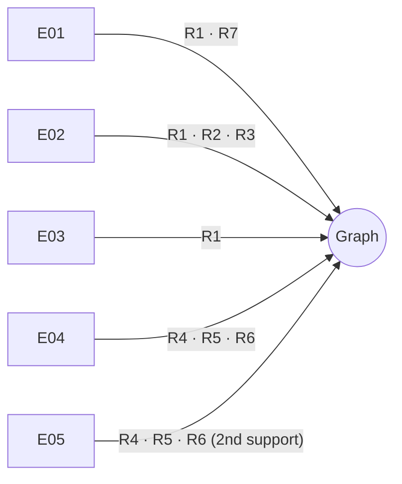

---

## 19. "Appears In" Expectations (derived from extractions)

| Entity | E01 | E02 | E03 | E04 | E05 | E06 |
|---|:-:|:-:|:-:|:-:|:-:|:-:|
| PHONE | ✓ | ✓ | | | | ✓ |
| URL | ✓ | ✓ | ✓ | | | |
| DOMAIN | ✓ | ✓ | ✓ | | | |
| UPI_ID | | ✓ | | ✓ | ✓ | |
| TRANSACTION | | | | ✓ | ✓ | |
| AMOUNT | | ✓ | | ✓ | ✓ | ✓ |
| ACCOUNT_HINT | | | | ✓ | ✓ | |
| SMS `VX-KYCUPD` | ✓ | | | | | |
| SMS `VX-ALERTS` | | | | | ✓ | |
| PERSON Rohan | | ✓ | | | | ✓ |
| PERSON KYC Refund Desk | | | | ✓ | | |
| PERSON Asha Verma | | | | ✓ | | |

These rows come from the `entity_evidence_links` view. They are not stored edges.

---

## 20. Timeline Expectations [FROZEN §7.2.6; types per 03 §12.3; UTC DERIVED]

| ID | Type | Date | Time (IST) | UTC | Precision | Source | Original text | UI label (10 §20) |
|---|---|---|---|---|---|---|---|---|
| T1 | MESSAGE_RECEIVED | 2026-09-24 | 12:03 | 06:33Z | EXACT | E01 | `12:03 PM` (+ `Thursday, 24 Sep 2026`) | Message received |
| T2 | CALL | 2026-09-24 | ~12:05 → **12:07** after correction | 06:35Z → 06:37Z | APPROXIMATE → user-corrected | E06 (+ CORRECTION statement) | `Around 12:05 PM` | Call |
| T3 | MESSAGE_RECEIVED | 2026-09-24 | 12:09 | 06:39Z | EXACT | E02 | `12:09 PM` | Message received |
| T4 | LINK_OPENED | 2026-09-24 | 12:11 | 06:41Z | EXACT | E02 | `12:11 PM` | Link opened |
| T5 | CREDENTIAL_OTP_REQUEST | 2026-09-24 (inferred) | 12:16 | 06:46Z | APPROXIMATE | E03 | `12:16` | Password/OTP requested |
| T6 | CREDENTIALS_OR_OTP_SHARED | 2026-09-24 | 12:17 | 06:47Z | EXACT | E02 | `12:17 PM` | Password/OTP shared (value hidden) |
| T7 | PAYMENT_REQUESTED | 2026-09-24 | 12:18 | 06:48Z | EXACT | E02 | `12:18 PM` | Payment requested |
| T8 | PAYMENT_INITIATED | 2026-09-24 | 12:19 | 06:49Z | EXACT (+ conflicting E06 source) | E04 (+ E06) | `24 Sep 2026, 12:19 PM` | Payment made · Sources differ |
| T9 | DEBIT_NOTIFICATION | 2026-09-24 | 12:21 | 06:51Z | EXACT | E05 | `24-09-26 12:21` | Debit alert |

- After the correction the order is T1 → T2 → … → T9 (12:03 → 12:07 → 12:09 → 12:11 → 12:16 → 12:17 → 12:18 → 12:19 → 12:21).
- **Additional sourced events** (e.g., E02 12:15, E02 12:18 "Ok paying now") are permitted but not asserted (X-2).

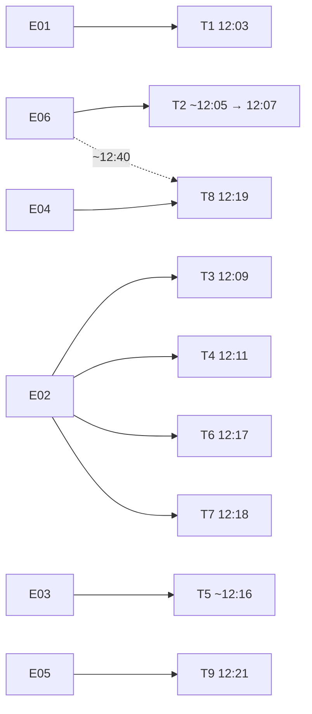

---

## 21. Time Precision Expectations

| Precision | Events / fragments |
|---|---|
| Exact | T1, T3, T4, T6, T7, T8, T9 |
| Approximate | T2 (before correction), T5 (date inferred); the E06 `around 12:40 PM` fragment |
| Date-only | Fragments `Thursday, 24 Sep 2026` (E01, E05), `24 September 2026` (E02), `24 Sep 2026` (E06): used as date context, **not** standalone events |
| Unknown (inferred order) | None expected |
| User-stated | T2 after correction (12:07, CORRECTION statement) |

Original text is retained in `time_source_text`. Approximate values are never converted to exact, except where the **user** corrects them (T2).

---

## 22. Planted Contradiction

| Item | Value |
|---|---|
| Evidence A | E04 p1 L8 `24 Sep 2026, 12:19 PM`: EXACT |
| Evidence B | E06 p1 L1 `around 12:40 PM`: APPROXIMATE |
| Category | Timestamp (same occurrence: T8 PAYMENT_INITIATED; merge by the 80-character proximity of `Rs 8,500`; 08 §20.1) |
| Tolerance | EXACT vs. APPROXIMATE > 10 min → 21 min → **contradiction** (08 §24.2) |
| Finding | `CONTRADICTION:TIME:{T8 key}` with ≥ 2 `fact_sources` (E04 and E06 extractions) |
| Display | "These pieces of information differ" with 12:19 PM (E04) and around 12:40 PM (E06), both shown identically (10 §25, 11 §32) |
| Resolution | **Unresolved** in the fixture (`DECISIONS.md` §7.2.6 allows this). Both sources preserved. Listed in report section 7. |
| Non-contradictions | E06 `Around 12:05 PM` (no other source for the call); T9 12:21 (a separate DEBIT_NOTIFICATION event) |

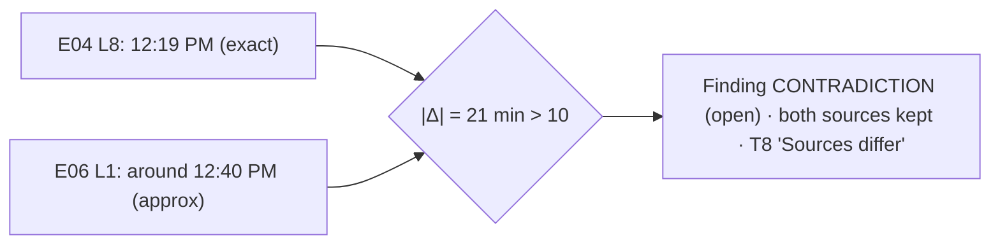

---

## 23. User Correction Fixture

| Item | Value |
|---|---|
| Target | T2 (CALL) |
| Original | `Around 12:05 PM` (E06 p1 L1), APPROXIMATE, `06:35Z` |
| Corrected | **12:07 PM**, precision EXACT (`06:37Z`) |
| Note (fixture) | "Checked my call log" (Doc 12 §22; optional) |
| User statement | `user_statements` kind CORRECTION (`value_datetime` 06:37Z; `value_text` = the note) |
| Preservation | `original_event_at` = 06:35Z, `original_timestamp_precision` = APPROXIMATE. **E06 evidence and its extraction unchanged.** |
| Audit | `TIMELINE_EVENT_CORRECTED` |
| Re-run | Case → `TIMELINE_READY` → ACTIONS + URGENCY re-run (results unchanged: still HIGH) |
| Review | Voids any active confirmation (none if the correction happens before the draft, as in Doc 12) |
| Report | The draft timeline shows 12:07 with "You corrected this" and "Originally ~12:05" |

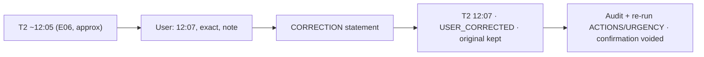

---

## 24. Missing Information Fixture

| Item | Value |
|---|---|
| Initial finding | `MISSING_FIELD:BANK_WALLET_MERCHANT`, variant FINANCIAL, **Needed**, status OPEN, value "Not provided" |
| UI label | "Debited bank or wallet" (10 §24) |
| Reason | Needed for financial fraud reports (template) |
| Evidence checked | All processed evidence E01–E06 |
| Question [FROZEN] | **"Which bank or wallet was the ₹8,500 debited from?"** |
| Answer (fixture) | **Example Bank**, typed by the user |
| Provenance | `user_statements` kind FOLLOW_UP_ANSWER. Shown as **"You stated: Example Bank"**. |
| Entity | `BANK_OR_WALLET` `Example Bank`, `is_user_stated = true`, `fact_sources(USER_STATEMENT)`. **Never evidence-derived.** |
| Timeline | No change |
| Re-run | Case → `ACTIONS_READY` (MISSING_INFO, ACTIONS, URGENCY) |
| Report | Section 3 bank/wallet = "Example Bank (you stated)" (before the answer: "Not provided") |
| Review | Voids an active confirmation (none if answered before the draft) |
| Other findings | `IDENTITY_DOCUMENT` → INFORMATIONAL "Keep ready" (no question, no upload). No other missing fields expected. |

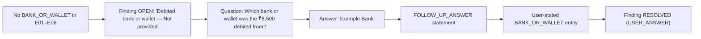

---

## 25. Urgency Fixture [FROZEN G-2, rule `G2-v1`]

| Item | Value |
|---|---|
| Level | **HIGH** |
| U1 (financial loss recorded) | TRANSACTION `627000418532` with AMOUNT INR 8,500.00 (`AMOUNT_OF`, E04/E05); PAYMENT_INITIATED T8 (E04) and DEBIT_NOTIFICATION T9 (E05) |
| U2 (credential/OTP exposure) | OTP detection in E02; CREDENTIAL_OTP_REQUEST T5 (E03) |
| Reasons (ordered) | U1: one sentence for TRANSACTION `627000418532` (sources E04, E05). U2: sentence (sources E02 detection line, E03). |
| Explanation (template) | "Urgency is HIGH because a debit of ₹8,500 on 24 Sep 2026 at 12:21 PM is recorded in this case (E04, E05). A request for passwords or an OTP was also observed (E02, E03)." (Doc 12 §17) + the fixed disclaimer |
| Not stored | Confidence, score, probability. Not time-elapsed based. |

---

## 26. Scam Analysis Expectations [FROZEN §7.2.7]

| Signal | Primary? | Cited evidence | Confidence band | UI |
|---|---|---|---|---|
| `KYC_IMPERSONATION` | **Yes** | E01, E02 | [UNDEFINED] (model judgement per 06 §21) | Header: "Signals consistent with KYC impersonation" |
| `PHISHING` | No | E03, E02 | [UNDEFINED] | Chip |
| `UPI_FRAUD` | No | E02, E04, E05 | [UNDEFINED] | Chip |

- Explanation wording is calibrated ("signals consistent with…"). The exact text is [UNDEFINED] (LLM-generated, phrase-checked).
- `cases.incident_type = KYC_IMPERSONATION`. Financial loss reported = **true**.
- No other labels are expected.

---

## 27. Missing vs. Contradiction vs. Correction Matrix

| Type | Example | Why | Representation |
|---|---|---|---|
| Missing information | Debited bank or wallet | No evidence contains it | `MISSING_FIELD` finding → user answer (statement) |
| Contradiction | 12:19 (E04) vs. ~12:40 (E06) | Two sources differ beyond tolerance | `CONTRADICTION` finding with both sources; left open |
| User correction | ~12:05 → 12:07 (T2) | The user provides a better value | CORRECTION statement; original kept |

**Dataset invariant:** exactly one of each. Absence is never a contradiction.

---

## 28. Sensitive-Value Fixtures

| Value | Evidence | Category | Redaction | Persisted | UI / report / logs |
|---|---|---|---|---|---|
| OTP `731904` | E02 (`OTP is 731904`) | OTP (cue "OTP", 6 digits; 07 §18.1) | Replaced by `[REDACTED:OTP]` before persistence | Line text `OTP is [REDACTED:OTP]`; `sensitive_detections` (kind OTP, offsets); **no value** | "▮ hidden code". Absent from DB text, logs, prompts, API responses, report and derived exports. **The original E02 image still shows it** (09 §14). |
| UTR `627000418532` | E04, E05 | Not sensitive-redacted (12 digits, label-anchored; not OTP/card) | — | Normal | Masked in the graph (`6270…8532`); full in detail |
| Account hints `****4821`, `XX4821` | E04, E05 | Already masked (last-4) | — | Last-4 only | As printed |
| Card numbers / full account numbers | — | **None exist** | — | — | — |

---

## 29. OCR / Parsing Fixtures

| Item | Expectation |
|---|---|
| Exact strings | All §13 texts recovered verbatim, with whitespace-collapse and NFC tolerance (07 §17 comparison form). Case-sensitive except URL/DOMAIN/EMAIL/UPI. |
| Line ordering | Reading order top to bottom per 07 §9. E04 L1–L10 exact. E06 single line. |
| Punctuation | `Rs.8500.00` (no space), `₹8,500` / `₹8,500.00`, `Rs 8,500`, `A/c`, `****4821`, `24-09-26`, `Date & time:`, `UPI Ref No:` |
| Dates and times | §5 forms. `12:21` without AM/PM (E05 message) and `12:16` (E03) parse as 24-hour **12:xx**, i.e., noon hour. |
| Currency | `₹` must OCR as `₹` in E02 (spike check). E04 uses the PDF text layer. |
| URLs | Including `?utm_source=sms` (E01). Wrapped URLs must not occur (the URL stays on one rendered line). |
| UPI | `kyc.refund.desk@demoupi`: in E02 and E05 it starts a wrapped line; literal validation spans joined lines |
| E04 | Text layer confirmed: `PDF_TEXT_LAYER` parser, `source_pages[1].has_usable_text_layer = true` |

---

## 30. Parser Edge Cases (dataset-supported only)

| Edge case | Where |
|---|---|
| Multiline messages (wrapped bubbles) | E01, E02, E03, E05 |
| Identifier at the start of a wrapped line | E02 and E05 UPI ID |
| Four currency forms | E02, E04, E05, E06 |
| Date without year in time-only fragments | E03 `12:16` |
| DD-MM-YY numeric date | E05 `24-09-26` |
| Approximation cues `Around` / `around` | E06 |
| Tracking parameter in a URL | E01 |
| Masked account hints with `****` and `XX` | E04, E05 |
| Chat sender marker and tilde display name `~ KYC Support` | E02 |
| Email-like value | **None** (UPI IDs have no TLD; no EMAIL entity expected) |

No additional adversarial content is part of the six (injection tests are separate scenarios, §36).

---

## 31. Integrity Fixtures

| Artifact | Hash computed | Expected verification |
|---|---|---|
| E01–E05 | At `complete`, by the server, over the stored bytes (07 §6–§7) | **Verified** (untouched) |
| E06 | At registration, over canonical bytes (= committed file bytes) | **Verified** |

**Final SHA-256 values are computed after artifact creation and recorded in the generated fixture manifest.** This document does not invent hashes.

| Scenario | Expected |
|---|---|
| Untouched demo path | **Verified** for all six |
| Stored object replaced by `E04_upi_receipt.TAMPERED.pdf` (S-H6; QA only, amount ₹5,500.00) | **Mismatch** |
| Stored object unreadable | **Could not complete** (never mismatch) |

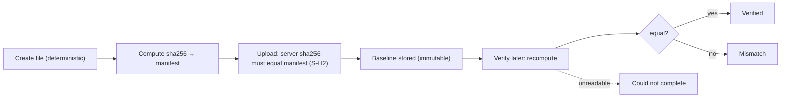

---

## 32. File Construction Requirements [FROZEN rendering + DS13]

| Artifact | Requirements |
|---|---|
| E01, E02, E03, E05 | PNG, **1080 px wide**, portrait (height [UNDEFINED]), lossless. Body text ≥ 32 px, dark on light, sans-serif with a correct ₹ glyph. No blur, noise or compression artifacts. No logos or trademarks. Generic layouts. |
| E04 | PDF, **1 page**, embedded text (selectable), the 10 lines of §13 in order, one per printed line. A font with ₹ embedded. No images of text. Not encrypted. Page size [UNDEFINED] (A4 or similar). |
| E06 | `E06_user_note.txt`: UTF-8 (no BOM), Unicode NFC, no CR, **no trailing newline**, content exactly §13 |
| All | Within G-4 limits (≤ 10 MB; PDF ≤ 20 pages; ≤ 40 MP). Filenames exactly §3. MIME: `image/png`, `application/pdf`, `text/plain`. |
| Paths [DS13] | `synthetic/demo/E01_kyc_sms.png` … `synthetic/demo/E05_bank_debit_sms.png`, `synthetic/demo/E06_user_note.txt`; `synthetic/manifest.json`; `synthetic/expected/oracle.json`; QA-only `synthetic/qa/E04_upi_receipt.TAMPERED.pdf` |

---

## 33. Determinism Requirements

| Source of nondeterminism | Rule |
|---|---|
| PNG metadata | No `tIME`, `tEXt`, `iTXt`, `zTXt` or `eXIf` chunks. Fixed colour type and bit depth. A deterministic encoder setting. |
| PDF metadata | Fixed or omitted `CreationDate`/`ModDate`. Fixed document `/ID`. No Producer/Creator version strings where the tool allows. No XMP timestamps. Deterministic font subsetting. |
| Text | Exact bytes (§32) |
| Randomness | No random noise, IDs or generated names |
| Toolchain | Rendering tooling [DS13]: generate images and the PDF **once** from versioned templates with pinned tool versions, then **commit the outputs**. Tests and the demo use the committed binaries, never regenerate. |
| If a binary differs after deliberate regeneration | Recompute hashes → update the manifest, oracle (if semantics changed) and fallback cache in **one commit** (S-H7). Semantic expectations (§35) remain valid as long as the visible text is identical. |

---

## 34. Dataset Manifest (structure only; not created here) [DS13]

`synthetic/manifest.json`:

```text
{
  "datasetVersion": "AD-03 v1",
  "fictional": true,
  "timezone": "Asia/Kolkata",
  "artifacts": [
    {
      "id": "E01",
      "filename": "E01_kyc_sms.png",
      "format": "PNG",
      "mimeType": "image/png",
      "size": <bytes, recorded after creation>,
      "sha256": "<64-hex, recorded after creation>",
      "sourceChannel": "SMS",
      "inputMode": "FILE",                 // E06: "PASTE", pasteKind "MESSAGE", label "My note about the call"
      "createdAt": null,                   // not embedded; omitted for determinism
      "expectedEvidenceState": "PROCESSED",
      "expectedEntities": ["PHONE:+919000000001", "URL:https://kyc-update-verify.example/kyc", "..."],
      "expectedRelationships": ["R1", "R7a", "R7b"],
      "expectedTimelineEvents": ["T1"],
      "expectedSignals": ["KYC_IMPERSONATION"],
      "expectedIntegrity": "MATCH"
    }
    // … E02–E06
  ]
}
```

`synthetic/expected/oracle.json` holds §15–§27 in machine-readable form: extractions, entities, appears-in, relationships (required/permitted), timeline, findings, correction, answer, urgency, signals, actions and report expectations.

---

## 35. Expected End-to-End Dataset Output (fixture oracle)

| Stage | Expected |
|---|---|
| Six artifacts | All `PROCESSED`. Hashes = manifest. |
| Extracted facts | §15 (all K fields present; no OTP) |
| Entities | §16 (PHONE 1 · URL 1 · UPI 1 · UTR 1 + others) |
| Relationships | R1–R7 required; X-3 permitted; supportCount 2 for R4–R6 |
| Timeline | T1–T9 (§20) |
| Contradiction | One, open, T8, E04 vs. E06 |
| Missing information | One field (bank/wallet) + ID document informational |
| User correction | T2 → 12:07, original preserved |
| User answer | "Example Bank", user-stated |
| Urgency | **HIGH** (`G2-v1`; U1 + U2) |
| Actions [FROZEN §7.2.7; 06 §14] | CONTACT_BANK (rank 1), REPORT_1930_NCRP (2), PRESERVE_EVIDENCE (3), REPORT_SUSPECT_NCRP (4). **Not** REPORT_CYBERCRIME_NCRP (U1 true). |
| Report | All sections. Financial: ₹8,500, UTR 627000418532, 24 Sep 2026, Example Bank (you stated). Identifiers: phone, URL/domain, UPI, SMS headers. Timeline incl. correction. Contradiction listed. Evidence index with six fingerprints. **No OTP.** |
| Review | Confirmation of version N → "Reviewed – version N"; status stays `USER_REVIEW` |
| Integrity | Verified ×6 |

---

## 36. Negative / Rejection Scenarios (test scenarios, not demo files)

None of these is a demo artifact. **No files are created here.** `DECISIONS.md` AD-03 anticipates such QA fixtures. Their exact contents are [UNDEFINED] and are to be designed in Doc 15 within these constraints:

| Scenario | Purpose | Constraint |
|---|---|---|
| Scanned (image-only) PDF | OD-03 rejection: `PDF_NO_TEXT_LAYER`, pages listed, no retry | Separate from E04. E04 is never altered. |
| Mixed PDF (one page < 10 chars) | Same | — |
| Oversized file (> 10,485,760 bytes) | Rejection `FILE_TOO_LARGE` | Generated at test time |
| Unsupported type (e.g., HEIC, DOCX, `.msg`) | `TYPE_NOT_SUPPORTED` / `EMAIL_FORMAT_NOT_SUPPORTED` | — |
| Unreadable image (blank) | `NO_READABLE_TEXT` | — |
| Malformed `.eml` / valid `.eml` with attachment | `EMAIL_UNPARSEABLE`; attachment listed, not processed | Fictional content only |
| Tamper copy | `E04_upi_receipt.TAMPERED.pdf`: amount `₹5,500.00` (S-H6) | QA environment only |
| Prompt injection text | AC-20 / 09 §39 | Fictional; never in the six |

---

## 37. Demo Fallback Fixture Rules [FROZEN AD-06; 06 §22; 07 §30]

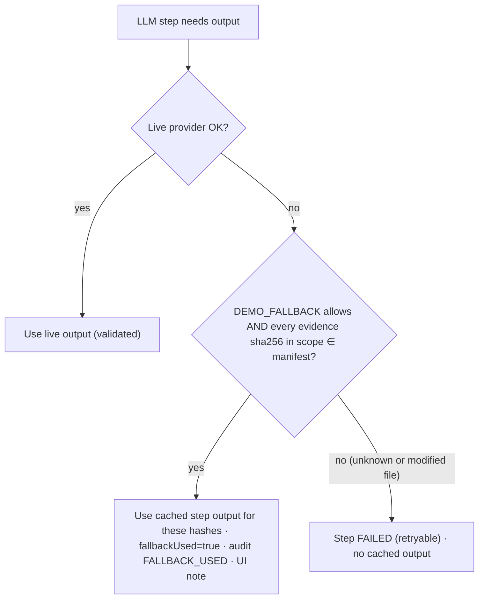

| Rule | Specification |
|---|---|
| Lookup | By the evidence `sha256` set in the step's scope, against the manifest |
| May provide | Cached **LLM-step outputs** only (candidates, typing, labels, wording, summary). They still pass all validators. |
| May not provide | Source text, OCR, hashes, validation results, urgency, actions (deterministic stages always run) |
| Unknown hash | Never used |
| Modified demo file | Its hash differs → never used |
| Disclosure | `agent_steps.fallback_used`, `FALLBACK_USED` audit, activity-feed note |

---

## 38. Synthetic Data Validation Rules

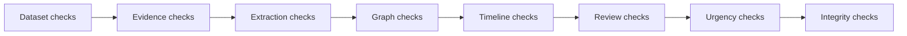

| Level | Checks |
|---|---|
| Dataset | Exactly 6 artifacts. Filenames §3. Formats/MIME. Hashes = manifest. Fictional-register scan (no values outside §7.2.1). Upload order E01→E06 (§6). |
| Evidence | All PROCESSED. E04 parser `PDF_TEXT_LAYER`, 1 page, usable text layer. Sizes within limits. E06 canonical hash = file hash. |
| Extraction | Every K field (§15) present with the exact raw value. No OTP value anywhere. No fabricated identifiers (every extraction literal in its lines). |
| Graph | Entities §16. Appears-in §19. R1–R7 present with listed supports. No edges outside required + permitted. No cross-case edges (run the dataset twice in two cases → disjoint entities). |
| Timeline | T1–T9 present and ordered. Precision §21. Contradiction preserved. |
| Review | Correction preserves the original. The bank answer is user-stated everywhere. Confirmation → "Reviewed – version N"; status `USER_REVIEW`. |
| Urgency | HIGH, `G2-v1`, U1 + U2 reasons with sources |
| Integrity | Verified ×6. QA tamper → Mismatch. |

---

## 39. Dataset QA Checklist (pre-demo)

- [ ] All six files exist at §32 paths
- [ ] Filenames and formats correct
- [ ] Visible text matches §13 exactly (manual read-through)
- [ ] No accidental real data (register scan)
- [ ] E04 passes the text-layer rule (selectable text, 1 page)
- [ ] Hashes recorded in the manifest after final creation
- [ ] Parser/OCR results match §15 (incl. ₹ in E02)
- [ ] Entities match §16 (counts PHONE 1 · URL 1 · UPI 1 · UTR 1)
- [ ] Relationships R1–R7 present
- [ ] Timeline T1–T9 present
- [ ] Contradiction appears (12:19 vs. ~12:40)
- [ ] Correction works (~12:05 → 12:07; original kept)
- [ ] Bank gap appears with the frozen question
- [ ] Answer "Example Bank" shows as "You stated"
- [ ] Urgency HIGH with the disclaimer
- [ ] Report includes the expected information and no OTP
- [ ] Integrity returns Verified ×6
- [ ] Fallback applies only to manifest hashes (test with a modified copy)

---

## 40. Traceability Matrix

| Fixture | DECISIONS | 07 | 08 | 09 | 10 | 11 | 12 |
|---|---|---|---|---|---|---|---|
| Six artifacts | §7.2.2–§7.2.3 | §30 | — | — | §42 | — | §7 |
| Values / register | §7.2.1 | §15–§16 | §4 | §13 | §41 | §41 | §6 |
| Extractions | §7.2.4 | §16–§17 | §19 | — | §19 | §29 | §18 |
| Relationships | §7.2.5 | §20 | §8–§10 | — | §22 | §30 | §19 |
| T1–T9 | §7.2.6 | §21 | §17–§21 | — | §20 | §26 | §20 |
| Contradiction | §7.2.6 | — | §24–§26 | — | §25 | §32 | §21 |
| Correction | §7.2.6 | — | §23 | — | §21 | §26 | §22 |
| Bank gap | §7.2.6 | — | §27–§28 | — | §24 | §31 | §23 |
| Urgency | §7.2.7, §7.3 | — | §30 | §25 | §11 | §43 | §17 |
| Sensitive (OTP) | §7.2.1 | §18 | — | §14 | §14 | §41 | §8 |
| Integrity | S-H1–S-H7 | §7 | — | §30–§31 | §31 | §35 | §28–§29 |
| Fallback | AD-06, S-H5 | §30 | — | — | §15 | — | §35 |

---

## 41. Implementation Guidance for Document 14 (dependencies only)

| Task Doc 14 must plan | Inputs from this document |
|---|---|
| Artifact creation (templates → PNG/PDF; TXT) | §13, §32, §33 |
| Fixture manifest generation (hash, size) | §34 |
| Oracle file authoring | §15–§27, §35 |
| Dataset validation runner | §38 |
| Hash generation and recording | §31, §33 |
| Storage/demo seeding | **Through the product upload path only** (no DB seeds; 03 §28.3) |
| Demo reset | Doc 12 §36 |
| Automated fixture tests | §36, §38 (designed in Doc 15) |
| OCR engine spike | E02 ₹, all §15 K fields |

---

## 42. Explicit Non-Goals

This document does **not**:
- create files, manifests, hashes, seeds or test code;
- modify APIs, the schema or the product;
- define production or real victim data;
- add demo artifacts (no seventh);
- replace the Doc 07 processing rules, the Doc 08 graph/timeline rules or the Doc 12 demo behaviour;
- introduce blockchain requirements.

---

## 43. Final Dataset Readiness

| Item | Status |
|---|---|
| Exactly six artifacts | ✅ §3 |
| Exact filenames / formats | ✅ §3, §32 |
| Exact authoritative values preserved | ✅ §13 (verbatim) |
| Source-line expectations | ✅ §14 (OCR by text; E04/E06 by number) |
| Extraction expectations | ✅ §15 |
| Entity expectations | ✅ §16–§17 |
| Relationship expectations | ✅ §18–§19 |
| Timeline T1–T9 | ✅ §20–§21 |
| Contradiction | ✅ §22 |
| Correction | ✅ §23 |
| Missing bank/wallet | ✅ §24 |
| User-stated answer | ✅ §24 |
| HIGH urgency | ✅ §25 |
| Sensitive-value behaviour | ✅ §28 |
| E04 text layer | ✅ §10, §29 |
| Integrity | ✅ §31 |
| Deterministic construction | ✅ §32–§33 |
| Manifest | ✅ §34 |
| Validation rules | ✅ §38 |
| Fallback rules | ✅ §37 |
| QA checklist | ✅ §39 |
| Traceability | ✅ §40 |

**Strict source-consistency pass:**
- 6 artifacts; no seventh.
- Phone `+91 90000 00001` / `9000000001`. URL `https://kyc-update-verify.example/kyc`. UPI `kyc.refund.desk@demoupi`. UTR `627000418532`. Amounts ₹8,500 forms. Account `****4821` / `XX4821`.
- T1–T9 unchanged. Contradiction 12:19 vs. around 12:40. Correction "Around 12:05 PM" → 12:07 PM. The bank question is the frozen wording. "Example Bank" is user-stated. Urgency HIGH.
- E04 is a text-layer PDF. No scanned-PDF OCR. No new relationship type. No fabricated entity. No real data or secrets. No invented hashes. No blockchain requirement. Fallback hash-keyed and demo-only.
- No source document modified.

**Non-blocking notes:**
- X-1: OCR line numbers are undefined; match by text.
- X-2: extra sourced timeline events are permitted.
- X-3: two permitted extra edges.
- [UNDEFINED] values: file sizes, image heights, fonts, page size, scam-signal confidence bands and explanation text, final hashes.

**Final status: READY WITH NON-BLOCKING NOTES**
