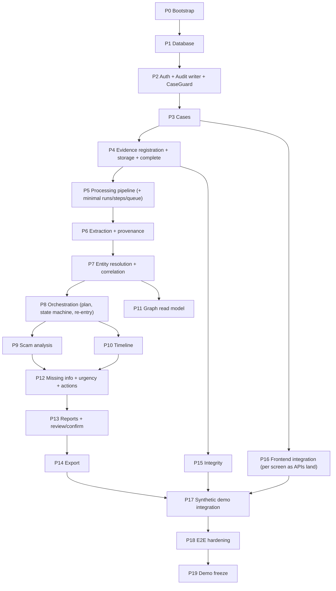
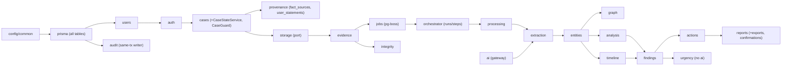
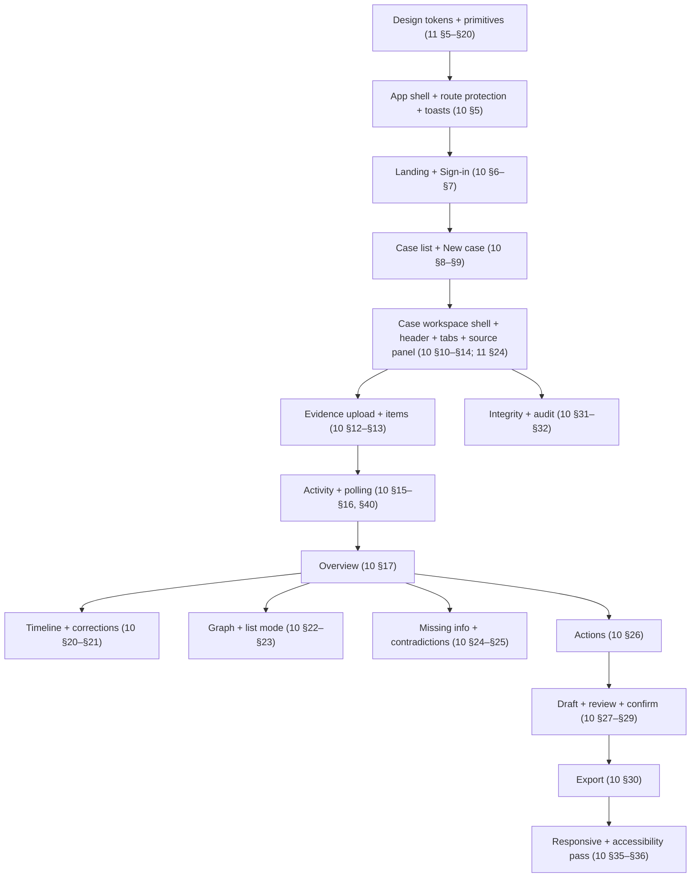
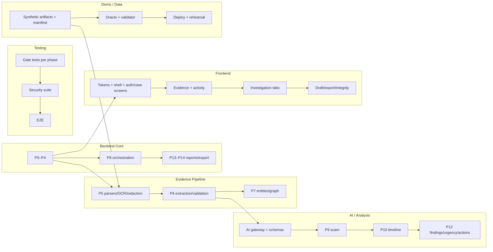

# Proofline — Implementation Roadmap

> **Build Proofline in the correct order.**

## 1. Document Control

| Field | Value |
|---|---|
| Document | Implementation Roadmap |
| File | `docs/14-IMPLEMENTATION-ROADMAP.md` |
| Version | 1.0 |
| Status | Frozen-spec-derived roadmap. No code, migrations or data files. |
| Last updated | 2026-10-02 |
| Purpose | Turn Documents 01–13 + `DECISIONS.md` into a dependency-ordered build plan for a small hackathon team: an empty repository to the end-to-end demo by **9 October 2026** |
| Authoritative sources | `01` Master Spec · `02` PRD · `03` Database Schema v1.1 · `04` Technical Architecture v1.1 · `05` API · `06` AI Agents · `07` Evidence Pipeline · `08` Graph & Timeline · `09` Security · `10` Frontend UX · `11` Design System · `12` Demo Scenario · `13` Synthetic Data · `DECISIONS.md` v0.2 |
| Scope | MVP only (01 §7; PRD §23). Deferred items stay deferred (§29). |
| Implementation target | One Next.js web app + one NestJS API/worker process + PostgreSQL + private object storage, demonstrating the six-artifact scenario end to end |

> **This document is an implementation roadmap derived from the frozen Proofline specifications. It does not redefine product behaviour or architecture.**

Three categories are kept separate throughout:
- **SPECIFICATION:** what Proofline must do (cited).
- **IMPLEMENTATION:** how the team builds it (this document).
- **DECISION:** anything requiring approval, which goes to `DECISIONS.md` first (§34).

### Non-blocking notes carried into this roadmap

| # | Note | Handling |
|---|---|---|
| R-N1 | The Master Spec does not reproduce a seven-day plan. It records source §20 "7-day plan" as planning context only (01 Appendix B). | §26 builds the seven days from frozen dependencies and the dated `DECISIONS.md` deadlines |
| R-N2 | Document 03 has no field table for `analysis_runs` / `agent_steps` (05 N-3) | Implement **only** attributes referenced in 03 §15/§21/§23.6, 04 §14, 05 §11.2 and 06 §24/§31 (§13). Smallest compatible implementation (§34). |
| R-N3 | Processing steps (PARSE/EXTRACT) run **inside analysis runs** (06 §4), so minimal run/step/job infrastructure must exist before the pipeline | Phase 5 introduces the minimal run + step + queue. Phase 8 completes orchestration infrastructure; the full `ACTIONS_READY` gate is the joint integration milestone after the required processors exist (`DECISIONS.md` §12). |
| R-N4 | The case reference is server-assigned (03 §5.1). The demo shows `CF-10001` only on a fresh database (12 D-1). | Demo freeze uses a fresh DB (§19 Phase 19) |
| R-N5 | Frontend API gaps G1–G4 (10 §39.2) | UI workarounds as specified. No new endpoints. |

---

## 2. Implementation Principles

| # | Principle | Practical meaning |
|---|---|---|
| P1 | Specification-first | Every task cites the doc/section it implements |
| P2 | Dependency-first | Nothing starts before its schema, contract and security prerequisites |
| P3 | Vertical slices | Prove one path end to end early (§24), then widen |
| P4 | Contract discipline | API shapes come from 05 via `packages/shared` zod schemas. The frontend codes against those schemas. |
| P5 | Provenance-first | No derived fact is written without its `fact_sources` / `extraction_source_lines` in the same transaction |
| P6 | Security before sensitive data | Auth, CaseGuard, private storage and redaction exist before real uploads are processed |
| P7 | Deterministic before LLM | Parsers, rules, literal validation and urgency before any model call |
| P8 | Test gates | Each phase ends with a measurable gate (§15) |
| P9 | Demo critical path | The six-artifact flow outranks polish |
| P10 | No speculative infrastructure | No Redis, Kafka, graph DB, microservices or Kubernetes (04 §1) |
| P11 | Adapters | LLM, OCR, storage, email and ledger sit behind ports (04 §29). Vendors stay swappable. |
| P12 | Idempotent processing | Natural keys, step idempotency keys, one active run per case |
| P13 | Case isolation | Composite case FKs + CaseGuard from the first table |
| P14 | Observable background work | Runs and steps persisted. Activity polling from day one of the pipeline. |
| P15 | Reversible choices | Vendor-open areas use env-selected adapters (AD-06) |

---

## 3. Frozen Implementation Baseline

| Area | Frozen decision | Implementation consequence |
|---|---|---|
| Frontend | Next.js App Router + TS (01 §19) | `apps/web`. Same-origin `/api` rewrite. No DB/storage credentials. |
| Backend | NestJS modular monolith, API + worker in one process (04; OD-15) | `apps/api` modules per 04 §5. `WORKER_ENABLED`. |
| Database | PostgreSQL 15+ + Prisma (01 §19). Host deferred (OD-13). | Prisma models + raw-SQL migrations for CHECKs, partial indexes, triggers, views (03 §28) |
| Storage | Private, signed URLs, provider encryption (OD-05, OD-14) | `ObjectStorage` port. Vendor implementation choice. |
| Authentication | Email OTP + opaque DB sessions, httpOnly cookie (OD-04; 09 §6) | `auth` module; HMAC codes; hashed tokens |
| Evidence upload | Register → signed PUT → complete (OD-14; 05 §8) | No multipart. Server hashes stored bytes. |
| Limits | 10 MB, 20 items, 20 pages, 40 MP, 20,000 characters (G-4) | Browser pre-check + API authoritative + DB CHECKs |
| Processing | Parse → OCR (images) → redact → lines → extract → validate (07) | `processing`, `extraction`, `entities` modules |
| OCR | Adapter. tesseract.js first; switch after the spike (OD-03 engine) | `OcrEngine` port. Language data bundled. |
| PDF | Text layer only; every page ≥ 10 non-whitespace chars; else `PDF_NO_TEXT_LAYER`, non-retryable (OD-03) | No PDF OCR anywhere |
| Email | Single-message `.eml`; attachments listed only; links never fetched (G-4) | MIME parser; no HTTP client in processing |
| Provenance | Relational `SourceRef`; literal validation (AD-02) | `fact_sources`; `ValidatedCandidate` constructor-only type |
| Entity resolution | Exact canonical key per case (07 §19) | Upsert on `(case, type, canonical)` |
| Graph | 8 relationship types; `appears_in` derived (03 §11; 08) | Rules D1–D5 + validated LLM proposals |
| Timeline | 10 event types; UTC store, IST display; precision (03 §12; 08) | `event_key` upsert; ordering algorithm 08 §21 |
| Urgency | `G2-v1` deterministic (G-2) | `urgency` module with no `ai` import; DB CHECK |
| AI agents | 7 logical agents; deterministic orchestrator; LLM inside steps only (06) | `ai` gateway; `submit_result` only; validators |
| Reports | Versioned JSON snapshot + pure-JS PDF; confirmation per version + checksum (AD-04, OD-07, R-1) | `reports` module. Case stays `USER_REVIEW`. |
| Export | PDF or ZIP; requires the active confirmation of the current version (OD-07) | Composite FK `exports(review_confirmation_id, report_id)` |
| Integrity | Server SHA-256; Verified / Mismatch / Could not complete (FR-021; 09 §30) | `integrity` module |
| Blockchain | Optional, off; go/no-go 2026-10-06 (OD-06) | `LedgerAdapter` stub only. Nothing scheduled in the MVP. |
| Progress | Polling (OD-10) | `GET /cases/:id/activity` + `pollAfterMs` |
| Security | 09 controls; rate-limit and URL-lifetime defaults | Applied per phase (§23) |
| Demo data | Six artifacts AD-03 (13) | `synthetic/` paths, manifest, oracle (13 §32–§34) |
| Fallback | Cached LLM-step outputs only, keyed by manifest hashes, disclosed (AD-06; 07 §30) | `CachedLlmProvider` + `DEMO_FALLBACK` |

---

## 4. Target Repository Structure

```text
proofline/
├── apps/
│   ├── web/                          [REQUIRED: AD-06]  Next.js App Router
│   │   └── app/                      routes per 10 §4 (names: implementation choice)
│   └── api/                          [REQUIRED: AD-06]  NestJS API + worker
│       ├── prisma/                   schema + migrations (incl. raw SQL)          [Prisma convention]
│       └── src/
│           ├── auth/ users/ cases/ evidence/ storage/ processing/ extraction/
│           ├── entities/ graph/ timeline/ findings/ analysis/ urgency/ actions/
│           ├── reports/ integrity/ audit/ provenance/ orchestrator/ ai/ jobs/
│           └── config/ common/       [RECOMMENDED: 04 §5.1 module names]
├── packages/
│   └── shared/                       [REQUIRED: AD-06]  zod schemas, enums, ReportDocument, API types
├── synthetic/                        [REQUIRED paths: 13 §32]
│   ├── demo/                         E01–E05 files + E06_user_note.txt
│   ├── qa/                           E04_upi_receipt.TAMPERED.pdf (QA only)
│   ├── expected/oracle.json
│   └── manifest.json
├── tools/                            [IMPLEMENTATION CHOICE]  artifact generation, dataset validator
├── tests/ (or per-app test dirs)     [IMPLEMENTATION CHOICE]  e2e, security, fixtures
├── docs/                             01–16 + DECISIONS.md
├── docker-compose.yml                [REQUIRED capability: OD-16 local backup; filename implementation choice]
└── pnpm-workspace.yaml               [REQUIRED: pnpm workspace, AD-06]
```

---

## 5. Dependency Graph



**Parallel branches:**
- design system and frontend shell (from P0);
- integrity (from P4);
- graph read model (from P7);
- synthetic artifact generation (from P0; spec 13);
- AI gateway and adapter (from P1, wired in P6);
- the security test suite (grows from P2).

---

## 6. Critical Path

| Category | Items |
|---|---|
| **Critical path** | P0 → P1 → P2 → P3 → P4 → P5 → P6 → P7 → P8 → P9/P10 → P12 → P13 → P14 → P17 → P18 → P19 |
| **Parallelisable** | Design tokens and primitives (11); frontend shell, auth and case screens (10); P15 integrity; P11 graph query; synthetic artifacts + manifest + oracle (13); AI gateway, adapter and prompt schemas (06); OCR spike; deployment setup |
| **Optional polish** | Dark mode (11 §5.4); graph animation; 8-minute demo extras; resend-cooldown niceties; dense-table refinements |

**Smallest working vertical slice:** sign in → create case → upload **E04 + E05** → analyse → extractions with provenance → TRANSACTION/UPI/AMOUNT entities → `PAID_TO` edge with supportCount 2 → T8/T9 → urgency HIGH → draft v1 → confirm → verify → export PDF. This exercises every layer (§24).

```mermaid
flowchart LR
    A["Sign in"] --> B["Create case"] --> C["Upload E01–E06"] --> D["Analyse (6/6)"] --> E["Entities + graph"] --> F["Timeline + correction"] --> G["Missing info answer"] --> H["Actions + HIGH"] --> I["Draft v1"] --> J["Confirm"] --> K["Verify ×6"] --> L["Export ZIP"]
```



---

## 7. Implementation Phases

Phases 0–19 (20 phases). Each uses the template in §8.

### Phase 0 — Repository Bootstrap
- **Objective:** a monorepo with runnable empty apps.
- **Inputs:** 04 §5.1, §30; AD-06.
- **Dependencies:** none.
- **Tasks:**
  - pnpm workspace; TypeScript strict; lint + format.
  - `apps/web` (Next.js), `apps/api` (NestJS), `packages/shared`.
  - Config module with zod env validation (fail fast).
  - docker-compose with Postgres + storage emulator.
  - Dev scripts; baseline CI (install, lint, typecheck, test).
  - `/api` rewrite in web; API health endpoint.
- **Expected files:** workspace config; app skeletons; `.env.example` per app (no secrets); compose file; CI workflow.
- **Security:** no secrets committed; nothing secret under `NEXT_PUBLIC_*`.
- **Tests:** `pnpm -r typecheck/lint/test` green; health returns 200 through the web rewrite.
- **Exit gate (Gate A):** `docker compose up` + dev scripts start web and API. `GET /api/health` via the web origin = 200. CI green.

### Phase 1 — Database Foundation
- **Objective:** the complete Document 03 schema.
- **Inputs:** 03 (all), R-N2.
- **Dependencies:** P0.
- **Tasks:**
  - Prisma models for all **30 tables**, enums (03 §4.1), the `case_reference_seq` sequence starting at 10001.
  - Composite `(id, case_id)` uniques and composite FKs.
  - Raw-SQL migrations: CHECKs (limits, states, hashes, urgency `G2-v1`, `num_nonnulls` arcs), partial unique indexes, generated columns (`evidence_ref`, `has_usable_text_layer`), immutability triggers (`sha256`, `original_*`, `audit_logs`), views `entity_evidence_links` and `case_overview`.
  - DB roles: migration and app (app has INSERT/SELECT only on `audit_logs`).
  - pg-boss schema kept out of Prisma.
  - **Seed strategy: none for product data** (03 §28.3).
- **Database impact:** migration checkpoints M1–M5 (§13).
- **Security:** least-privilege roles; TLS connection string.
- **Tests:** migrate up on a clean DB; schema assertion tests (CHECKs reject bad rows, composite FKs block cross-case refs, audit UPDATE/DELETE denied).
- **Exit gate (Gate B):** clean migrate succeeds. 100 % of the constraint tests listed in 03 §22 that are DB-enforced pass.

### Phase 2 — Authentication (+ audit writer + guards)
- **Objective:** a sign-in/session boundary and a case-access guard.
- **Inputs:** 05 #12–#14; 09 §6–§8; 03 §4.2–§4.4, §19.
- **Dependencies:** P1.
- **Tasks:**
  - `users`, `auth` and `audit` modules.
  - OTP request/verify: CSPRNG 6-digit code, HMAC-SHA-256 stored, 10 min expiry, 5 attempts.
  - `EmailTransport` port (`console` refused in production).
  - Session: 256-bit token, SHA-256 stored, httpOnly/Secure/SameSite=Lax cookie, rotation, logout revoke.
  - AuthGuard; Origin check; **CaseGuard** (`assertCaseAccess`, 404 for unowned).
  - `AuditService.record(tx, …)` with the metadata whitelist.
  - Rate limits (09 §18 defaults).
- **API impact:** #12, #13, #14.
- **Security:** no enumeration; no bypass.
- **Tests:** valid/invalid/expired/reused code; 6th attempt locked; expired or revoked session → 401; audit rows written in the same tx; audit with forbidden keys fails the action.
- **Exit gate (Gate C):** all auth tests pass. A request without a cookie to any protected route → 401.

### Phase 3 — Case Management
- **Objective:** case lifecycle shell.
- **Inputs:** 05 #1, #2, #15, #16, #17, #37; 03 §5; PRD FR-001.
- **Dependencies:** P2.
- **Tasks:**
  - `cases` module with `CaseStateService` (transition table, 03 §23.1; forward transitions used later).
  - Case create (server reference, `CASE_METADATA` statements via `provenance`), get (overview read model with empty sub-objects), list (cursor), patch.
  - Delete with `confirm=true` (cascade + tombstone; object deletion hook added in P4).
  - Audit-log read (#37).
- **API impact:** #1, #2, #15, #16, #17, #37.
- **Security:** CaseGuard on all; summary never AI-written (INV-C5).
- **Tests:** create with no fields → `NEW`, `CF-10001` on a fresh DB; User B → 404 on User A's case; delete removes rows and keeps the tombstone.
- **Exit gate:** endpoints pass contract tests against `packages/shared` schemas. Isolation test passes.

### Phase 4 — Evidence Registration and Storage
- **Objective:** the signed-URL upload flow with server fingerprinting.
- **Inputs:** 05 #3, #18, #19, #21, #22; 07 §4–§8; 09 §10–§11; G-4.
- **Dependencies:** P3.
- **Tasks:**
  - `storage` port + vendor adapter (implementation choice) + emulator adapter.
  - Opaque keys `cases/{caseId}/evidence/{evidenceId}`.
  - Register: slot ≤ 20 under case lock; extension/MIME pair; signed PUT (10 min).
  - Complete: head, stream, magic bytes, size, PDF pages/encryption, image header ≤ 40 MP, TXT UTF-8, SHA-256 → `UPLOADED`, or reject (row deleted + audit + post-commit object delete).
  - Paste path: canonical bytes (G-3), ≤ 20,000 characters.
  - List, download (signed GET, 5 min, attachment), delete (basic cascade; full derived-data semantics completed in P13).
  - Cleanup job for abandoned `UPLOADING` rows.
- **API impact:** #3, #18, #19, #21, #22.
- **Security:** private bucket verified; CORS = web origin; no filenames in keys or logs.
- **Tests:** each accepted type passes; boundary tests (10,485,760 B; 20 items; 20 pages; 40,000,000 px; 20,000 chars); spoofed MIME rejected; repeat `complete` idempotent; E06 canonical hash reproducible.
- **Exit gate (Gate D):** the E01–E06 upload produces six `UPLOADED` rows whose sha256 equals an independent computation.

### Phase 5 — Evidence Processing Pipeline
- **Objective:** source lines for every supported type.
- **Inputs:** 07 §9–§14, §18, §22–§24; 06 §4 (runs/steps); OD-15.
- **Dependencies:** P4. Minimal `orchestrator` + `jobs` introduced here (R-N3).
- **Tasks:**
  - pg-boss wiring (singleton per case).
  - `analysis_runs` / `agent_steps` minimal lifecycle (QUEUED → RUNNING → SUCCEEDED/FAILED; steps with idempotency key `(case, step, evidence, sha256‖step)`).
  - #4 analyze (PARSE only at first) and #23 activity.
  - `processing` module: parser dispatch; OCR adapter (tesseract.js, bundled language data); PDF text-layer gate; TXT; paste; EML MIME parsing (headers, body, HTML→text with `text (URL)`, attachments listed).
  - **Redaction** (OTP/card/unmasked account) before persistence.
  - `parse_results` / `source_pages` / `source_lines` / `sensitive_detections` in one tx.
  - Failure codes and retryable flags. Retry via #4. #20 source endpoint.
  - **OCR spike** on the six artifacts (₹ in E02).
- **Security:** no network in parsers; caps before decode; timeouts; no content in logs.
- **Tests:**
  - E04 → `PDF_TEXT_LAYER`, L1–L10 exact.
  - Scanned and mixed PDF → `PDF_NO_TEXT_LAYER`, pages listed, retry not offered.
  - E02 line `OTP is [REDACTED:OTP]` + detection row.
  - Malformed `.eml` → `EMAIL_UNPARSEABLE`.
  - URL-heavy fixture → zero egress.
- **Exit gate (Gate E):** all six artifacts parse to the expected source lines (13 §14, match by text for images). The negative scenarios (13 §36) produce their specified codes.

### Phase 6 — Extraction and Provenance
- **Objective:** literally validated extractions.
- **Inputs:** 07 §15–§17; 06 §5–§6; AD-02; 03 §9.
- **Dependencies:** P5.
- **Tasks:**
  - Rule candidates (07 §16).
  - `ValidatedCandidate` (constructor only in the validator).
  - Literal validation (ownership, NFC/whitespace, case rules, redaction guard, format).
  - Raw = matched span. Normalisation (07 §15). Confidence and band (06 §21).
  - `extractions` + `extraction_source_lines` tx; rejected counts in `output_summary`.
  - `provenance` module (`fact_sources`, `user_statements`).
  - AI gateway skeleton (`LlmProvider` port, `submit_result`, schema validation, timeouts) + EXTRACT LLM candidates (PERSON context, BANK labels).
  - `CachedLlmProvider` keyed by manifest hashes.
  - Extraction correction (#24).
- **Security:** prompts from redacted lines only; text-only by default.
- **Tests:** §15 K fields of 13 extracted; fabricated LLM identifier rejected and absent; foreign-line reference rejected; OTP never extractable; correction keeps the original.
- **Exit gate (Gate F part 1):** 100 % of persisted extractions have ≥ 1 own-evidence line, and > 95 % of K fields are correct on the synthetic set.

### Phase 7 — Entity Resolution and Evidence Correlation
- **Objective:** entities + relationships with provenance.
- **Inputs:** 07 §19–§20; 08 §4–§12; 06 §7–§8.
- **Dependencies:** P6.
- **Tasks:**
  - NORMALIZE step: upsert `(case, type, canonical)`, masked values, `entity_id`.
  - CORRELATE step: rules D1–D5 (08 §9.1); LLM proposals with the support check; one edge + one source row per supporting extraction; stale-edge sweep; orphan sweep.
  - #5 entities endpoint.
- **Tests:** three phone forms → one entity; R1–R7 present; PAID_TO supportCount 2; invalid proposal discarded; Case A/B disjoint.
- **Exit gate:** 13 §16–§19 entity, appears-in and relationship expectations met.

### Phase 8 — Analysis Orchestration
- **Objective:** a complete deterministic run.
- **Inputs:** 06 §4, §24–§26; 03 §23; AD-05; R-1; 05 §11, §25.
- **Dependencies:** P7.
- **Tasks:**
  - `plan()` from case state and evidence types.
  - Full step order PARSE → EXTRACT → NORMALIZE → SCAM_ANALYSIS → CORRELATE → TIMELINE → MISSING_INFO → ACTIONS → URGENCY.
  - Case state transitions via `CaseStateService`; `EXTRACTED` gate (`EVIDENCE_PENDING`); `CASE_CHANGED_DURING_RUN`.
  - Re-entry triggers (CORRECTION, ANSWER, EVIDENCE_DELETION); `alreadyActive`; 409 rules for mutations during runs.
  - `fallbackUsed` + `FALLBACK_USED` audit.
- **Tests:** concurrent analyze → one run; failed-step retry resumes; deletion mid-run stops cleanly; re-run creates no duplicates.
- **Infrastructure readiness:** planning, dependencies, lifecycle/evidence gates, re-entry, retry/resume, concurrency/mutation protection, deletion, idempotency, Phase 5–7 integration and unavailable-processor handling pass. Missing processors produce no fake outputs or successful steps (`DECISIONS.md` §12).
- **Final joint integration gate (Gate G part 1, after the required processors exist):** a full run reaches `ACTIONS_READY` deterministically twice in a row with identical outputs (excluding timestamps and IDs).

### Phase 9 — Scam Analysis
- **Objective:** validated signals.
- **Inputs:** 06 §9; AD-01; GR-08, GR-12.
- **Dependencies:** P8 (step slot), P7 (facts).
- **Tasks:**
  - Indicator rules.
  - SCAM_ANALYSIS LLM schema; enum, single-primary, `UNKNOWN_OTHER`-alone, citation-existence and phrase checks.
  - Replace signal set; `cases.incident_type` via cases.
  - Model-judgement confidence cap (06 §21).
- **Tests:** demo → KYC_IMPERSONATION primary + PHISHING + UPI_FRAUD with citations; a forbidden phrase in fixture output → rejected; an unknown label → rejected.
- **Exit gate:** 13 §26 expectations met; zero forbidden phrases.

### Phase 10 — Timeline
- **Objective:** ordered, sourced events.
- **Inputs:** 08 §16–§26; 06 §11–§12; G-5.
- **Dependencies:** P7, P8.
- **Tasks:**
  - TIMELINE step: LLM typing + description; deterministic time assignment from fragments (dateContext, cross-item date inference → APPROXIMATE); merge rule (80-char proximity).
  - `event_key` upsert (skip corrected/dismissed); ordering algorithm; contradiction detection with tolerances (2 / 10 / 20 min).
  - #6, #25, #26, #27 endpoints.
- **Tests:** T1–T9 order; T5 APPROXIMATE; T8 contradiction with E04/E06 sources; ~12:05 not flagged; correction to 12:07 persists with the original kept.
- **Exit gate (Gate H part 1):** 13 §20–§23 expectations met.

### Phase 11 — Evidence Graph
- **Objective:** graph read model.
- **Inputs:** 08 §11, §14–§15; 05 #7.
- **Dependencies:** P7.
- **Tasks:** #7 query (case node, entity nodes masked, evidence nodes, APPEARS_IN from the view, relationships with supportCount and sources).
- **Tests:** shape matches 05 §15; no duplicate edges; cross-case IDs → 404.
- **Exit gate (Gate H part 2):** demo graph contains R1–R7, with permitted extras only.

### Phase 12 — Missing Information, Urgency and Actions
- **Objective:** findings, answers, urgency, checklist.
- **Inputs:** 06 §10, §13–§14; 08 §24–§28; G-2; 05 #8, #28–#31.
- **Dependencies:** P9, P10.
- **Tasks:**
  - MISSING_INFO step: checklist by variant; contradictions upsert; question wording (LLM optional, template fallback).
  - Answer/skip endpoints (user statements, user-stated entities, re-entry).
  - URGENCY step (`G2-v1`, reasons with sources, `is_current`, staleness, deletion behaviour 03 §14.4).
  - ACTIONS step (templates, channel codes from the curated config, upsert by code preserving status).
  - #31 status.
- **Security:** urgency module has no `ai` import (lint rule).
- **Tests:** bank gap + question; answer "Example Bank" → user-stated entity, resolved; urgency HIGH with U1+U2; actions = CONTACT_BANK, REPORT_1930_NCRP, PRESERVE_EVIDENCE, REPORT_SUSPECT_NCRP.
- **Exit gate (Gate G part 2):** 13 §24–§25, §35 actions met.

### Phase 13 — Report Generation and Review
- **Objective:** versioned draft + confirmation.
- **Inputs:** 06 §15; AD-04; R-1; 05 #9, #32–#34; 03 §17.
- **Dependencies:** P12.
- **Tasks:**
  - REPORT_GENERATION run.
  - Snapshot builder; summary LLM step (cited facts, literal number check).
  - ReportDocument v1 schema in `packages/shared`.
  - Canonical JSON checksum; pure-JS PDF to storage; GENERATED → `USER_REVIEW`; void older confirmations.
  - Confirm (checksum + current + `USER_REVIEW` checks; status unchanged).
  - **Complete evidence-deletion semantics** (invalidate reports, delete exports, void confirmations, rebuild syntheses; 03 §24.2, §24.6).
- **Tests:**
  - All sections present, with "Not provided" where applicable.
  - 100 % key facts with SourceRefs; no OTP.
  - Stale-version and checksum-mismatch confirms → 409.
  - The status stays `USER_REVIEW` after confirm.
- **Exit gate (Gate I):** v1 for the demo case renders, confirms and shows "Reviewed – version 1". Regenerate → the old confirmation is voided.

### Phase 14 — Export
- **Objective:** confirmed-version export.
- **Inputs:** 05 #10, #35, #36; OD-07; 03 §17.4.
- **Dependencies:** P13.
- **Tasks:** export creation (current version + active confirmation of the same report); async build of PDF or ZIP (`report.pdf`, `case.json`, `manifest.json`, `evidence/` originals byte-for-byte); export sha256; status; download URL; `EXPORTED` transition.
- **Tests:** v2 + v1 confirmation → 409 `CONFIRMATION_VERSION_MISMATCH`; ZIP manifest hashes equal the originals; build failure → `FAILED`.
- **Exit gate (Gate K):** only eligible exports succeed; manifest verified.

### Phase 15 — Integrity Verification
- **Objective:** on-demand verification.
- **Inputs:** 05 #11; 09 §30–§32; FR-021.
- **Dependencies:** P4 (parallel branch).
- **Tasks:** stream + SHA-256 compare; `MATCH` / `MISMATCH` / `COULD_NOT_COMPLETE` (+ failure code); audit; latest result in the evidence list; `LedgerAdapter` interface stub (disabled).
- **Tests:** untouched → MATCH; QA tamper object → MISMATCH; storage down / object missing → COULD_NOT_COMPLETE; client hash ignored.
- **Exit gate (Gate J):** six demo items verify; the three outcomes are reproducible in tests.

### Phase 16 — Frontend Integration
See §10 for the per-screen table. **Exit gate:** every screen in 10 §4 works against the real API with the loading, empty, error and security states specified, and the UX-01–UX-14 checks pass.

### Phase 17 — Synthetic Demo Integration
- **Objective:** frozen dataset wired into the product and tests.
- **Inputs:** 13 (all); 12; AD-03; AD-06.
- **Dependencies:** P14, P15, P16 (artifact creation itself starts in parallel from P0).
- **Tasks:**
  - Generate E01–E05 from versioned templates (deterministic, 13 §33); author E06 bytes.
  - Commit outputs.
  - Manifest (sizes, sha256) and oracle.json.
  - Dataset validator (13 §38).
  - Fallback cache entries for the six hashes.
  - Demo reset runbook (12 §36).
- **Tests:** the dataset validator passes; the full oracle comparison passes; the modified-copy test proves the fallback is not used.
- **Exit gate:** DEMO-01–DEMO-17 (12 §39) automated where possible and pass.

### Phase 18 — End-to-End Hardening
- **Objective:** confidence under failure.
- **Tasks:**
  - Full workflow e2e (browser).
  - Security suite (09 §39: IDOR on all 37 routes, injection fixture, egress, log scan).
  - Provenance coverage query; deletion tests.
  - Integrity, report and export tests.
  - Failure-recovery drills (§22).
  - Cross-browser (Chrome, Firefox, Safari); responsive and accessibility checks (10 §36, 11 §15).
  - Performance sanity: upload → draft < 2 min (NFR-06).
- **Exit gate (Gate L):** the full synthetic scenario passes twice consecutively on the deployed environment within the NFR-06 target, and SEC-01–SEC-20 pass.

### Phase 19 — Hackathon Demo Freeze
- **Objective:** a stable presentation.
- **Tasks:**
  - Deploy (shape OD-16; vendors chosen).
  - Env validation; fresh DB (`CF-10001`).
  - Dataset hashes re-verified.
  - Presenter signed in (no bypass); script rehearsal (12 §32).
  - Backup docker-compose stack on the laptop.
  - Observability check; final smoke test.
  - Known limitations list; **freeze: no changes after the smoke test except a critical fix with re-test.**
- **Exit gate:** §25 checklist all ✓; two timed rehearsals at ≤ 5 min.

---

## 8. Phase Template

Every phase in §7 follows this template. Fields marked "only if applicable" are omitted where empty.

| Field | Content |
|---|---|
| Objective | One sentence |
| Inputs | Frozen sections |
| Dependencies | Prior phases / gates |
| Implementation tasks | Checklist |
| Expected files / modules | Modules per 04 §5.4 ownership |
| Database impact | Tables/migrations (only if applicable) |
| API impact | Endpoint numbers per 05 (only if applicable) |
| Frontend impact | Screens per 10 (only if applicable) |
| Security requirements | 09 controls activated in this phase |
| Tests | Unit, contract, integration, e2e |
| Exit gate | Measurable condition (never "make sure it works") |

---

## 9. Backend Implementation Order



| Module | Owns (03 tables; 04 §5.4) | Built in | Controllers | Jobs/steps | Adapters | Tx/audit boundary |
|---|---|---|---|---|---|---|
| config/common | — | P0 | health | — | — | request context, logger redaction |
| users | users | P2 | — | — | — | via auth |
| auth | otp_challenges, sessions | P2 | #12–#14 | cleanup | EmailTransport | code/session + audit |
| audit | audit_logs | P2 | #37 (read via cases) | — | — | `record(tx, …)` only |
| cases | cases | P3 | #1, #2, #15–#17 | — | — | case lock; state + audit |
| provenance | fact_sources, user_statements | P3/P6 | — | — | — | inside owner tx |
| storage | (objects) | P4 | — | orphan reconcile | ObjectStorage | post-commit deletes |
| evidence | evidence_items | P4 | #3, #18, #19, #21, #22 | UPLOADING cleanup | — | slot lock; accept/reject + audit |
| jobs | (pg-boss schema) | P5 | — | queues | — | — |
| orchestrator | analysis_runs, agent_steps | P5 → P8 | #4, #23 | analyze-case, report runs | — | step outputs + status per tx |
| processing | parse_results, source_pages, source_lines, sensitive_detections | P5 | #20 | PARSE | OcrEngine | parse tx |
| ai | — | P6 | — | — | LlmProvider, CachedLlmProvider | none (pure) |
| extraction | extractions, extraction_source_lines | P6 | #24 | EXTRACT | — | validated insert tx |
| entities | entities | P7 | #5 | NORMALIZE | — | upsert tx |
| graph | relationships | P7/P11 | #7 | CORRELATE | — | edges + sources tx |
| analysis | scam_signals | P9 | (via #2) | SCAM_ANALYSIS | — | replace tx |
| timeline | timeline_events, timeline_event_entities | P10 | #6, #25–#27 | TIMELINE | — | upsert tx; corrections + audit |
| findings | missing_information_items | P12 | #28–#30 | MISSING_INFO | — | upsert; answers + audit |
| urgency | urgency_assessments, urgency_reasons | P12 | (via #2) | URGENCY | — | insert + is_current flip |
| actions | action_items | P12 | #8, #31 | ACTIONS | — | upsert; status + audit |
| reports | reports, review_confirmations, exports, export_evidence_items | P13–P14 | #9, #10, #32–#36 | REPORT, export build | PdfRenderer | GENERATING/GENERATED tx; confirm tx; export tx |
| integrity | integrity_verifications | P15 | #11 | — | LedgerAdapter (off) | verify + audit tx |

**Rule:** each table has one owning module. Cross-module writes go through the owner's service (04 §5.4). No generic CRUD modules.

---

## 10. Frontend Implementation Order



| Screen (10) | API deps (05) | Backend prereq | Empty / loading / failure | Security | Completion criterion |
|---|---|---|---|---|---|
| Landing | — | P0 | static | no secrets | renders; CTAs route correctly |
| Sign-in | #12–#14 | P2 | code states | no token in JS | UX-01 |
| Case list | #15 | P3 | empty CTA; skeleton; retry | no evidence content | lists owner cases; pagination |
| New case | #1 | P3 | inline errors | — | UX-02 |
| Workspace shell / header | #2 | P3 (+P12 urgency) | Not assessed yet; out-of-date | 404 page | status labels exact (10 §11.1) |
| Evidence | #3, #18, #19, #20, #21, #22, #4 | P4–P5 | limits line; per-file progress; failure codes | signed URLs only | UX-03, UX-04 |
| Activity | #23 | P5/P8 | not started; running; failed; fallback note | — | UX-05 |
| Overview | #2, #8, #28 | P12 | not analysed | masked values | cards match the oracle |
| Timeline | #6, #25–#27 | P10 | no events | — | UX-07 |
| Graph | #7, #5 | P11 | empty/partial banners | masked labels | UX-06 |
| Missing info | #28–#30 | P12 | nothing missing | — | UX-08 |
| Actions | #8, #31 | P12 | no actions | official links only | "You do this yourself" shown |
| Draft / review | #9, #32–#34 | P13 | no draft; generating; failed | — | UX-09 |
| Export | #10, #35, #36 | P14 | generating; failed; expired link | attachment downloads | UX-10 |
| Integrity / audit | #19, #11, #37 | P15, P2 | not yet verified | no content in audit | UX-11 |

**Proofline is an evidence investigation workspace, not a chatbot. No chat UI is built.**

---

## 11. Evidence Pipeline Build Order


| Stage | Input | Output | Owner | Mode | Failure | Retry | Provenance |
|---|---|---|---|---|---|---|---|
| Register | metadata / paste | `UPLOADING` row, signed URL | evidence | sync | 409/413/415/422 | user re-submits | — |
| Upload | bytes | object | browser → storage | sync | transfer error | re-PUT / re-register | — |
| Complete | object | `UPLOADED` + sha256 | evidence | sync | reject (row deleted) / 503 | re-call `complete` | baseline hash |
| Parse | object | pages, lines | processing | async | codes 07 §22 | via analyze (if retryable) | line IDs |
| OCR | image | lines + bbox + conf | processing (OcrEngine) | async | `OCR_FAILED` / `NO_READABLE_TEXT` | yes | bbox |
| Redact | lines (memory) | masked text + detections | processing | async | — | — | detection rows |
| Candidates | lines | candidates (memory) | extraction (+ai) | async | step fail | yes | line refs |
| Literal validation | candidates + lines | `ValidatedCandidate` | extraction | async | discard (counted) | — | matched span |
| Normalise | raw | canonical/masked | extraction/entities | async | `NOT_NORMALIZED` | — | raw kept |
| Entity resolution | extractions | entities | entities | async | step fail | yes | via extractions |
| Correlation | entities + hints | edges + sources | graph | async | step fail | yes | `fact_sources` |
| Downstream | facts | events / signals / findings | timeline / analysis / findings | async | step fail | yes | `fact_sources` |

---

## 12. AI Implementation Order

| # | Item | Phase | Precondition |
|---|---|---|---|
| 1 | Source-line infrastructure | P5 | Redaction in place |
| 2 | Deterministic extraction (rules) | P6 | 1 |
| 3 | Literal validation (`ValidatedCandidate`) | P6 | 1–2 |
| 4 | Provenance (`fact_sources`, `extraction_source_lines`) | P6 | 3 |
| 5 | Deterministic taxonomy, indicators, checklist, urgency, action templates | P9/P12 | 4 |
| 6 | Tool interfaces (read/write/deterministic tools, 06 §16) | P6–P8 | 4 |
| 7 | Model adapter (`LlmProvider`, vendor implementation choice; `CachedLlmProvider`) | P6 | 6 |
| 8 | Structured outputs (`submit_result`, JSON Schema from zod) | P6 | 7 |
| 9 | Schema validation (enums, lengths, no extra fields) | P6 | 8 |
| 10 | Provenance validation (cited IDs, literal, support, phrase checks) | P6–P10 | 3–4, 9 |
| 11 | Agent orchestration (plan, steps, re-entry) | P8 | 10 |
| 12 | Report generation (snapshot + summary) | P13 | 11 |

**Frozen rules enforced by this order:**
- **The LLM does not OCR source material.**
- **An identifier proposed by the LLM is accepted only when it literally exists in the referenced source text/OCR lines and passes validation.**

The seven logical agents are scheduled as follows:
- Case Orchestrator: P5/P8.
- Evidence/Extraction: P5–P7.
- Evidence Correlation, including the missing-info role: P7, P12.
- Scam Analysis: P9.
- Timeline: P10.
- Response, plus the urgency engine: P12.
- Report Generator: P13.

---

## 13. Database Implementation Order

| Checkpoint | Group | Tables (03) | FK dependencies | Key constraints/indexes | Raw SQL |
|---|---|---|---|---|---|
| M1 | Identity | users, otp_challenges, sessions | — | email unique; token_hash unique | — |
| M1 | Cases + audit | cases, audit_logs | users | `case_reference_seq` (10001); `(id, user_id)` unique; audit indexes | audit triggers; insert-only grant |
| M2 | Evidence | evidence_items | cases | `sequence_no` 1–20 unique; size/page/pixel/char CHECKs; sha256 hex; `evidence_ref` generated | immutability trigger (sha256, uploaded_at) |
| M2 | Processing | parse_results, source_pages, source_lines, sensitive_detections | evidence_items | parse unique per evidence; line unique; `has_usable_text_layer` generated | generated column |
| M3 | Extraction / provenance | extractions, extraction_source_lines, user_statements | evidence, parse, lines | `method <> 'USER'`; identifier basis CHECK | CHECKs |
| M3 | Entities / graph | entities, relationships | cases | unique keys; `from <> to` | — |
| M3 | Timeline | timeline_events, timeline_event_entities | cases, entities, user_statements | `event_key` unique; precision ⇔ null `event_at` | `original_*` immutability trigger |
| M3 | Analysis | analysis_runs, agent_steps, scam_signals | cases, evidence | **one active run per case** (partial unique); step idempotency index; one primary signal (partial unique) | partial indexes |
| M3 | Findings / actions / urgency | missing_information_items, action_items, urgency_assessments, urgency_reasons | cases, entities, events, statements | `finding_key` / `action_code` uniques; **G2-v1 CHECK**; one current assessment | CHECK; partial unique |
| M3 | Provenance arc | fact_sources | all owners + targets | `num_nonnulls` exclusive arcs; `UNIQUE NULLS NOT DISTINCT` | CHECKs (PG15) |
| M4 | Reports / export | reports, review_confirmations, exports, export_evidence_items | cases, users, runs | version unique; active-confirmation partial unique; composite FK export → confirmation | partial unique |
| M4 | Integrity | integrity_verifications | evidence_items | result ⇔ computed hash CHECK | CHECK |
| M5 | Views | `entity_evidence_links`, `case_overview` | — | — | views |

**R-N2 columns** for `analysis_runs` / `agent_steps`, only as referenced in the frozen docs:
- `analysis_runs`: `id`, `case_id`, `kind`, `trigger`, `status`, `plan`, `fallback_used`, `failure_code`, `failure_retryable`, `failed_step_id`, `created_by`, `started_at`, `finished_at`, `created_at`.
- `agent_steps`: `id`, `run_id`, `case_id`, `step_name`, `evidence_id`, `sequence_no`, `status`, `input_hash`, `output_summary`, `failure_code`, `failure_retryable`, `fallback_used`, provider/model/prompt-version/latency/token metadata, `started_at`, `finished_at`.

Record the final column list in `DECISIONS.md` if any product-visible meaning arises (§34).

---

## 14. API Implementation Order (all 37 endpoints of 05)

| # | Endpoint | Phase | Dependency | Consumer (10) | Completion gate |
|---|---|---|---|---|---|
| 12 | POST /auth/request-code | P2 | users, otp, email port | Sign-in | 202 for any email; rate limits |
| 13 | POST /auth/verify-code | P2 | 12 | Sign-in | cookie set; failures 422 |
| 14 | POST /auth/logout | P2 | 13 | Header | session revoked |
| 1 | POST /cases | P3 | auth | New case | `NEW`, server reference |
| 2 | GET /cases/:id | P3 → P12 | cases (+ urgency, signals, report) | Header, overview | full object per 05 §7.3 |
| 15 | GET /cases | P3 | cases | Case list | cursor pagination |
| 16 | PATCH /cases/:id | P3 | cases, provenance | Edit details | statements written |
| 17 | DELETE /cases/:id | P3 (+P4 objects) | cases, storage | Delete dialog | cascade + tombstone |
| 37 | GET /cases/:id/audit-log | P3 | audit | Integrity/audit | whitelist only |
| 3 | POST /cases/:id/evidence | P4 | storage, evidence | Evidence | slot + signed URL / paste |
| 18 | POST /evidence/:id/complete | P4 | 3 | Evidence | validate + hash + accept/reject |
| 19 | GET /cases/:id/evidence | P4 | evidence (+ integrity) | Evidence, integrity | list incl. failure/integrity |
| 21 | GET /evidence/:id/download | P4 | storage | Viewer | signed GET, audited |
| 22 | DELETE /evidence/:id | P4 → P13 | evidence (+ reports) | Evidence | full cascade semantics (P13) |
| 4 | POST /cases/:id/analyze | P5 → P8 | orchestrator, jobs | Evidence/activity | one active run; full plan (P8) |
| 23 | GET /cases/:id/activity | P5 | orchestrator | Activity | plan/steps/progress/fallback |
| 20 | GET /evidence/:id/source | P5 | processing | Source panel | redacted lines |
| 24 | POST …/extractions/:id/correction | P6 | extraction, provenance, orchestrator | Entity detail | original kept; re-run |
| 5 | GET /cases/:id/entities | P7 | entities | Graph list, overview | appearsIn + extractions |
| 7 | GET /cases/:id/graph | P11 | graph | Graph | supportCount; no duplicates |
| 6 | GET /cases/:id/timeline | P10 | timeline | Timeline | ordering + precision |
| 25 | POST /cases/:id/timeline | P10 | timeline, provenance | Timeline | USER_ADDED event |
| 26 | PATCH /cases/:id/timeline/:eventId | P10 | timeline | Timeline | correction semantics |
| 27 | POST …/timeline/:eventId/dismiss | P10 | timeline | Timeline | dismissed + audit |
| 28 | GET /cases/:id/missing-information | P12 | findings | Missing info | items + contradictions |
| 29 | POST …/:itemId/answer | P12 | findings, provenance | Missing info | user-stated entity; re-run |
| 30 | POST …/:itemId/skip | P12 | findings | Missing info | stays Not provided |
| 8 | GET /cases/:id/actions | P12 | actions | Actions | ranks, reasons, channels |
| 31 | PATCH /cases/:id/actions/:actionId | P12 | actions | Actions | idempotent status |
| 9 | POST /cases/:id/report | P13 | reports, orchestrator | Draft | v N+1; `USER_REVIEW` |
| 32 | GET /cases/:id/reports | P13 | reports | Draft | versions + confirmations |
| 33 | GET /cases/:id/reports/:version | P13 | reports | Draft/review | ReportDocument |
| 34 | POST …/reports/:version/confirm | P13 | reports | Review | checksum-bound; status unchanged |
| 10 | POST /cases/:id/export | P14 | reports, storage | Export | confirmation-version match |
| 35 | GET …/exports/:exportId | P14 | reports | Export | status polling |
| 36 | GET …/exports/:exportId/download | P14 | storage | Export | signed GET, audited |
| 11 | POST /evidence/:id/verify | P15 | integrity, storage | Integrity | 3 outcomes |

Signed-upload flow preserved: **register evidence → receive signed upload URL → browser uploads directly → complete evidence.**

---

## 15. Testing Gates

| Gate | After | Pass condition |
|---|---|---|
| **A Bootstrap** | P0 | Web and API start. `/api/health` 200 via rewrite. CI green. |
| **B Database** | P1 | Clean migrate. DB-enforced invariants (03 §22) tested. |
| **C Authentication** | P2–P3 | Unauthenticated → 401. Cross-user → 404 on every implemented route. |
| **D Evidence** | P4 | E01–E06 → `UPLOADED`, hashes match. Limit boundaries enforced. |
| **E Processing** | P5 | All types behave per 07. Scanned/mixed PDF non-retryable. OTP redacted. |
| **F Provenance** | P6–P7 | Every persisted extraction, entity, edge, event, signal, finding, action and reason has ≥ 1 valid source. Fabrication tests rejected. |
| **G Analysis** | P8, P12 | Deterministic re-runs. Urgency HIGH (`G2-v1`). Actions per oracle. |
| **H Graph/Timeline** | P10–P11 | R1–R7, T1–T9, contradiction, correction per 13 |
| **I Report** | P13 | Version, checksum, confirm, void-on-change, status `USER_REVIEW` |
| **J Integrity** | P15 | Verified ×6; Mismatch and Could-not-complete in tests |
| **K Export** | P14 | Mismatch confirmation rejected; manifest verifies |
| **L Full demo** | P17–P18 | DEMO-01–17 + SEC-01–20 + < 2 min upload → draft |

---

## 16. Definition of Done

| Unit | Done when |
|---|---|
| Task | Implements the cited spec. Unit tests pass. No lint or type errors. No content in logs. Reviewed. |
| Phase | All tasks done. Exit gate met. Docs references updated (no spec changes). |
| API endpoint | Matches 05 request/response/error shapes (shared zod). AuthGuard + CaseGuard. Audit where state changes. Contract test + IDOR test pass. |
| Database module | Tables, constraints and triggers per 03. Migration reversible on a clean DB. Constraint tests pass. Owning module is the only writer. |
| Agent | Step contract (06 §3): inputs/outputs typed. Validators applied. Provenance in the same tx. Idempotent. Failure codes and retryable flags. Fallback behaviour tested. |
| Frontend screen | Matches 10 behaviour and 11 visuals. Loading, empty and error states. Keyboard and labels. No sensitive data in storage or URLs. Works on desktop and mobile. |
| **MVP** | §32 criteria true |

---

## 17. Parallel Workstreams



---

## 18. Team Assignment Model

| Role | Owns | Hands off |
|---|---|---|
| Backend/Core | P0–P4, P8, P13–P15; modules config, auth, audit, cases, storage, evidence, orchestrator, reports, integrity | Shared zod contracts per endpoint before the FE starts the screen; run/step model to Evidence/AI |
| Evidence/AI | P5–P7, P9–P10, P12; processing, extraction, entities, graph, ai, analysis, timeline, findings, urgency, actions | Step outputs + `fact_sources` contract; oracle-passing results to QA |
| Frontend/UX | P16; tokens and components (11); all screens (10) | Screen readiness against contract mocks, then real API |
| QA/Integration | Gate tests, security suite, e2e, failure drills (§15, §22) | Gate reports; blocking defects |
| DevOps/Demo | Compose stack, CI, deployment, synthetic artifacts (13), manifest/oracle, rehearsal (12) | Deploy URL, dataset hashes, runbook |

**Handoff contract:** a feature moves from one role to another only when its **shared schema is merged** and its **gate test is green**.

---

## 19. Critical Integration Checkpoints

| # | Checkpoint | Prereqs | Test | Expected | Failure response |
|---|---|---|---|---|---|
| I1 | Frontend ↔ auth | P2, sign-in screen | Sign in via the real email transport | Cookie set; case list loads | Fix the cookie/rewrite; no bypass |
| I2 | Frontend ↔ cases | P3 | Create, list, open, delete | `CF-10001`, `NEW` | Contract diff vs. 05 |
| I3 | Frontend ↔ upload | P4 | Upload E01–E06 | Six fingerprints = manifest | Check storage CORS, signed URL headers |
| I4 | Processing ↔ provenance | P5–P6 | Analyse; inspect lines/extractions | K fields + line refs; OTP redacted | Validator/OCR spike fix; consider OCR engine switch |
| I5 | Analysis ↔ graph/timeline | P7–P11 | Graph + timeline screens | R1–R7; T1–T9; contradiction | Rule/merge/tolerance fix per 08 |
| I6 | Analysis ↔ report | P12–P13 | Answer bank; generate v1 | Example Bank (you stated); no OTP | Snapshot builder fix |
| I7 | Report ↔ export | P14 | Confirm v1; export ZIP; try a v2 mismatch | ZIP ok; 409 mismatch | Composite FK/gate fix |
| I8 | Integrity ↔ evidence | P15 | Verify all; QA tamper | Verified ×6; Mismatch in QA | Hash-stream fix |
| I9 | Full demo | All | Doc 12 standard run | DEMO-01–17 in < 5 min | Failure recovery (§22); backup stack |

---

## 20. Environment and Configuration Roadmap

| When | Configuration | Notes |
|---|---|---|
| P0 | Local env + zod validation; `DATABASE_URL`; compose Postgres + storage emulator | `.env.example` only |
| P1 | Migration vs. app DB roles | Direct connection for pg-boss |
| P2 | `EMAIL_TRANSPORT` (console locally), session/OTP secrets, cookie settings | Console refused in production |
| P4 | `STORAGE_DRIVER`, bucket, signed-URL lifetimes (10/5 min), CORS origin | Vendor implementation choice (OD-14) |
| P5 | `OCR_PROVIDER` (tesseract.js default), `WORKER_ENABLED` | Language data bundled |
| P6 | `LLM_PROVIDER`, `LLM_MODEL`, timeouts, `DEMO_FALLBACK` (off/auto/force) | Vendor implementation choice (OD-02) |
| P15 | `LEDGER_ENABLED=false` | Only an interface exists |
| P19 | Deployed env (web host recommended Vercel; container host and DB/storage hosts chosen by the team; OD-13/OD-16) | Secrets in host stores; nothing secret in the web bundle |

---

## 21. Observability Roadmap

| Phase | Signal |
|---|---|
| P0 | Structured JSON logs with allow-list redaction; `request_id` |
| P2 | Audit writer; auth failure outcomes |
| P5 | `run_id` / `step_id` on worker logs; parse/OCR durations; failure codes |
| P6 | Accepted/rejected extraction counts; AI metrics (provider, model, tokens, latency, retries) on `agent_steps` |
| P8 | Run status transitions; fallback flag; activity endpoint |
| P13–P15 | Report/export/verify outcomes in audit |
| P18 | Log scan for demo values (must find none) |

**Never logged:** raw evidence, OCR text, snippets, OTPs, card values, secrets, tokens, prompts, filenames.

---

## 22. Failure-Recovery Roadmap

| Failure | Detection | Recovery | Retry allowed? | User experience |
|---|---|---|---|---|
| Invalid upload (type/content) | complete | row deleted | No | Specific message (10 §12) |
| Oversized file | register/complete/bucket | rejected | No | "Up to 10 MB" |
| Unsupported format | register | rejected | No | Supported types listed |
| Failed storage upload | browser/complete 409 | re-PUT or re-register | Yes | Retry/remove |
| Missing completion | UPLOADING age | cleanup job | — | Item disappears / retry |
| Parser failure | PARSE | item FAILED | Yes (analyze) | Retry/remove |
| OCR failure | PARSE | item FAILED | Yes | Retry/remove |
| Scanned PDF | text-layer gate | item FAILED `PDF_NO_TEXT_LAYER` | **No** | Upload pages as PNG/JPG; Remove only |
| Malformed email | MIME parse | FAILED `EMAIL_UNPARSEABLE` | **No** | Save as .eml / paste text |
| Extraction failure | EXTRACT | step FAILED | Yes | Retry analysis |
| Stale processing job | run state check | job ignored | — | None |
| Duplicate analysis | partial unique / singleton | return the active run | — | Progress continues |
| Case changed during run | step re-check | run FAILED `CASE_CHANGED_DURING_RUN` | Yes | "Analyse again" |
| LLM failure | gateway | 1 retry → FAILED; fallback for manifest hashes only | Yes | Retry; fallback note |
| Invalid LLM output | schema validation | 1 re-ask → FAILED | Yes | Retry |
| Provenance validation failure | validators | candidate discarded | — | Not shown |
| Report failure | REPORT run | version FAILED; case `REPORT_DRAFT` | Yes | Retry |
| Export failure | build | export FAILED | Yes (new export) | Try again |
| Integrity cannot read | verify | `COULD_NOT_COMPLETE` | Yes | "Verification could not be completed" |

---

## 23. Security Implementation Sequence

| # | Layer | Phase | Spec |
|---|---|---|---|
| 1 | Authentication | P2 | 09 §6 |
| 2 | Authorisation (CaseGuard) | P2–P3 | 09 §7–§8 |
| 3 | Case isolation (composite FKs + scoped queries/jobs/prompts/keys) | P1 → every phase | 09 §9 |
| 4 | Storage privacy | P4 | 09 §10 |
| 5 | Signed URLs (scope, TTL, attachment, no-referrer) | P4 | 09 §11 |
| 6 | Input validation (DTOs, magic bytes, caps) | P2–P5 | 09 §18–§20 |
| 7 | Sensitive-data masking/redaction | P5 | 09 §14 |
| 8 | Prompt-injection controls | P6 | 09 §23 |
| 9 | AI output validation | P6–P13 | 09 §24–§25 |
| 10 | Audit logging (same-tx, whitelist, append-only) | P2 → every phase | 09 §28–§29 |
| 11 | Integrity verification | P15 | 09 §30–§31 |
| 12 | Security testing (SEC-01–20) | P18 (suite grows from P2) | 09 §39–§40 |

---

## 24. Demo-First Vertical Slice

```text
Sign in → Create CF-10001 (fresh DB) → Upload E01–E06 → Process → Extract → Correlate → Analyze
→ Timeline → Graph → Missing information → User answer → Actions → Report → Review → Integrity → Export
```

| Tier | Scope |
|---|---|
| **First vertical slice** (target end of Day 4) | Same flow with E04 + E05 first (receipt + debit), then all six. Minimal UI (unstyled tokens acceptable). Deterministic rules + LLM extraction. Urgency HIGH. Draft v1 + confirm + verify + export PDF. |
| **Full MVP** | All FR-001–FR-027 (FR-022 and FR-028 optional/deferred), all 37 endpoints, all Doc 10 screens with Doc 11 visuals, gates A–L |
| **Post-MVP** | Only already-deferred items (§29) |

---

## 25. Demo Readiness Checklist

| Item | Verification condition |
|---|---|
| Environment | Deployed URL health 200. Env validation passes at boot. |
| Database | Fresh DB. Migrations applied. `case_reference_seq` at 10001. |
| Storage | Private bucket. Public-access check fails as expected. CORS = web origin. |
| Authentication | Presenter signed in. Logout/login tested. No bypass flag exists. |
| Synthetic artifacts | Six files at `synthetic/demo/`. Visual check vs. 13 §13. |
| Hashes | Local file hashes = manifest = server fingerprints after upload |
| Demo case | Created live → `CF-10001` |
| Processing | 6/6 PROCESSED in the rehearsal |
| Analysis | Signals and HIGH urgency per oracle |
| Timeline | T1–T9; T5 approx; T8 "Sources differ" |
| Graph | R1–R7; PAID_TO supportCount 2 |
| Missing information | Bank question shown; the answer → "You stated" |
| Actions | 4 actions with "You do this yourself" |
| Report | v1 sections complete; no OTP |
| Review | "Reviewed – version 1"; status `USER_REVIEW` |
| Integrity | Verified ×6 |
| Export | ZIP downloads; manifest matches |
| Reset | 12 §36 procedure executed and timed |
| Backup | Laptop compose stack runs the same flow offline (fallback disclosed) |
| Deployment | No sleeping tier. Container always on. |
| Browser | Clean profile; zoom set; notifications off |
| Presentation | Two timed rehearsals ≤ 5:00; 3-min variant rehearsed |

---

## 26. Implementation Timeline (seven days; R-N1)

Indicative calendar: Day 1 = 3 Oct … Day 7 = 9 Oct (final). The fixed dates come from `DECISIONS.md`:
- vendor choices by **3 Oct**;
- first deploy by **4 Oct**;
- blockchain go/no-go **6 Oct**;
- speech-to-text only if the DoD passes by **7 Oct**.

| Day | Focus | Must finish | Should finish | Can drop without breaking the core demo |
|---|---|---|---|---|
| 1 | Foundation | P0, P1 (M1–M3), P2; OCR spike; LLM vendor chosen | P3; tokens + shell | Dark mode |
| 2 | Evidence | P3, P4, P5 (PNG/PDF/paste/redaction); first deploy | EML parser; synthetic artifacts + manifest | Resend cooldown polish |
| 3 | Extraction | P6, P7; activity polling; evidence screens | Graph query (P11) | Graph animation |
| 4 | Analysis | P8, P9, P10; **first vertical slice** | Timeline UI + correction | — |
| 5 | Graph/actions/report | P11, P12, P13, P14; screens for these | Oracle comparison automated | Optional tests beyond DEMO-01–17 |
| 6 | Integrity/security/polish | P15, P16 complete, P17, P18 security suite; **freeze candidate by evening** | Responsive and accessibility pass; 3-min variant | 8-min extras (QA clip, ledger branch) |
| 7 | End-to-end/demo | P18 final e2e ×2, P19 freeze, rehearsal, presentation | — | Anything not passing gates by morning |

The phases are not equal in size: P5–P6 and P13 are the largest; P11 and P15 are small.

---

## 27. MVP Cut Line

| Category | Items (derived from 01 §7, §26; PRD §22–§23; 12 §39) |
|---|---|
| **MUST HAVE** | Auth (email OTP); cases; upload (signed URL); PNG + text-layer PDF + paste processing; redaction; literal-validated extraction with provenance; entities; R1–R7 graph; T1–T9 timeline with correction and contradiction; bank gap + answer; urgency `G2-v1`; actions; report v1 + review/confirm; export (at least PDF); integrity verify; audit; activity polling; deletion; demo fallback (hash-keyed, disclosed); security gates SEC-01–20 |
| **SHOULD HAVE** (may be simplified) | EML processing (in MVP scope, not in the demo path); ZIP bundle (fall back to PDF-only export if late, still OD-07-compliant); graph list mode polish; audit-log UI paging; responsive tablet layouts; "Verify all" convenience |
| **DEFER** | Everything in §29; dark mode; 8-minute demo extras |

---

## 28. Risk Register

| Risk | Probability | Impact | Early warning | Mitigation | Fallback |
|---|---|---|---|---|---|
| OCR quality (₹, small text) | Medium | High | Spike on Day 1 misreads K fields | Rendering rules (13 §32); preprocessing | Switch to the cloud OCR adapter (OD-03 rule) |
| PDF parsing (line grouping) | Low | Medium | E04 lines ≠ L1–L10 | y-tolerance tuning | Adjust grouping (no spec change) |
| LLM reliability | Medium | High | Invalid-output or timeout rates | Strict schemas, re-ask, short timeouts | Disclosed cached fallback for the demo hashes |
| Provenance failures | Medium | High | Gate F coverage < 100 % | Same-tx writes; sweeps | Fix before proceeding (blocking) |
| Processing time > 2 min | Medium | Medium | Rehearsal timing | Concurrency 2–3; minimal context | Pre-analysed backup case (disclosed) |
| Storage failures | Low | High | 503s | Emulator parity; retries | Local compose stack |
| Database issues (constraints, Prisma gaps) | Medium | Medium | Migration failures | Raw-SQL migrations early (P1) | Simplify via raw SQL, not schema change |
| Frontend/backend mismatch | Medium | Medium | Contract test failures | Shared zod schemas | Contract-first fixes |
| Report generation | Medium | High | Snapshot validation errors | Template-driven sections | Template summary if the LLM fails (fallback for demo hashes) |
| Deployment | Medium | High | Cold starts, env errors | Deploy by Day 2 | Local backup stack |
| Synthetic artifact generation | Low | High | Hash drift; OCR misreads | Commit binaries once; manifest | Regenerate + update manifest/oracle together (S-H7) |
| Blockchain integration | Low (off) | Low | — | Not scheduled | Stays off |
| Demo instability | Medium | High | Rehearsal failures | Freeze rules; two rehearsals | 12 §35 fallback + recovery |

---

## 29. Deferred Work (do not implement in the MVP)

| Item | Source |
|---|---|
| Blockchain/testnet hash attestation (only the adapter interface; build only if go/no-go on 6 Oct says yes) | OD-06; FR-022 (Optional) |
| Speech-to-text caller summary | OD-08; FR-028 |
| Identity-document uploads | OD-09 |
| Email connectors / mailbox ingestion | 01 §7; N13 |
| Multilingual Indian-language workflows | 01 §7; N11 |
| Continuous threat-intelligence enrichment / live URL inspection | 01 §7; N9 |
| Bank / call-centre workflow integrations; enterprise integrations (SSO, tenancy) | 01 §7; N10 |
| Advanced temporal reasoning and graph analytics; cross-case campaign clustering | 01 §7; N14 |
| Specialised multimodal model ensemble | 01 §7 |
| Enterprise-grade notarisation and policy-controlled integrity services | 01 §7 |
| Shared/family multi-user cases; phone/SMS OTP; envelope encryption; automatic retention expiry; SSE progress | OD-01, OD-04, OD-05, OD-11, OD-10 |
| Scanned-PDF OCR | OD-03 |
| Secondary chat/Q&A surface | 01 §7 (optional, not built) |

---

## 30. Implementation Traceability

| Area | Master Spec | PRD | Arch (04) | API (05) | AI (06) | Pipeline (07) | Graph/TL (08) | Security (09) | UX (10) | Design (11) | Demo (12) | Synthetic (13) |
|---|---|---|---|---|---|---|---|---|---|---|---|---|
| Bootstrap / config | §18–§19 | — | §5, §30 | §34 | — | — | — | §17 | — | §44 | — | §32 |
| Database | §17 | — | §5.4 | — | — | — | — | §27 | — | — | — | — |
| Auth | FR-026 | §19 | §26 | #12–#14 | — | — | — | §6 | §7 | §18 | §11 | — |
| Cases | FR-001 | FR-001 | §5 | #1, #2, #15–#17 | §4 | — | — | §7 | §8–§11 | §20 | §12 | §6 |
| Evidence upload | FR-002–FR-005 | §8 | §8–§9 | #3, #18–#22 | — | §4–§8 | — | §10–§11, §19 | §12–§14 | §27–§28 | §13 | §3, §32 |
| Processing | FR-007 | §9 | §10–§11 | #4, #20, #23 | §5 | §9–§14, §18 | — | §20–§22 | §15–§16 | §36 | §14 | §14, §29 |
| Extraction / provenance | FR-008/009 | §10 | §12 | #5, #24 | §6, §27 | §15–§17 | §7 | §14, §25 | §19 | §42 | §18 | §15 |
| Entities / graph | FR-011 | §12 | §17 | #5, #7 | §7–§8 | §19–§20 | §3–§15 | §9 | §22–§23 | §30 | §19 | §16–§19 |
| Orchestration | FR-006 | S-1–S-6 | §14 | #4, #23 | §4, §24–§26 | §23–§24 | §12 | §26 | §15, §40 | — | §14 | — |
| Scam analysis | FR-010 | §11 | §15 | #2 | §9 | — | — | §24 | §17 | §20 | §16 | §26 |
| Timeline | FR-012/013 | §13 | §16 | #6, #25–#27 | §11–§12 | §21 | §16–§26 | — | §20–§21 | §26 | §20–§22 | §20–§23 |
| Missing info / actions / urgency | FR-014–016 | §14–§15 | §15 | #8, #28–#31 | §10, §13–§14 | — | §27–§29 | §25 | §24–§26 | §31, §33, §43 | §17, §23–§24 | §24–§25 |
| Reports / review | FR-017–019 | §16, §18 | §18 | #9, #32–#34 | §15 | — | §31 | §33 | §27–§29 | §34 | §25–§27 | §35 |
| Export | FR-020 | §18.2 | §18 | #10, #35–#36 | — | — | — | §33 | §30 | §34 | §31 | — |
| Integrity | FR-021/022 | §17 | §19 | #11 | — | §7 | — | §30–§32 | §31 | §35 | §28–§30 | §31 |
| Audit | FR-023 | SP-5 | §20 | #37 | §31 | §28 | — | §28–§29 | §32 | — | — | — |
| Demo / fallback | §22, FR-027 | §22 | §34 | §33 | §33 | §30 | — | — | §42 | — | all | §37 |

---

## 31. Final Implementation Sequence

```text
1.  Bootstrap (monorepo, config, compose, CI)
2.  Database (all 30 tables, constraints, triggers, views, roles)
3.  Authentication + audit writer + CaseGuard
4.  Cases (+ CaseStateService, audit-log read)
5.  Evidence registration + storage + completion (fingerprint)
6.  Minimal runs/steps/queue + processing pipeline (parse, OCR, redaction, source lines)
7.  Extraction + literal validation + provenance + AI gateway
8.  Entity resolution + correlation (relationships)
9.  Orchestration (plan, state machine, re-entry, fallback disclosure)
10. Scam analysis
11. Timeline (+ corrections, contradictions)
12. Graph read model
13. Missing information + urgency + actions
14. Reports + review/confirmation (+ full evidence-deletion semantics)
15. Export
16. Integrity verification (parallel since step 5)
17. Frontend integration (incrementally since step 4)
18. Synthetic demo integration (artifacts in parallel since step 1)
19. Security hardening + full E2E
20. Demo freeze
```

---

## 32. Implementation Completion Criteria — **READY FOR HACKATHON DEMO**

All must be true:
- [ ] All MUST-HAVE flows (§27) work on the deployed environment
- [ ] All 37 endpoints exist and pass contract and IDOR tests
- [ ] The 03 schema (30 tables, views, constraints, triggers) is migrated
- [ ] Authentication works (email OTP; no bypass)
- [ ] The evidence pipeline processes E01–E06 and rejects the negative scenarios correctly
- [ ] Provenance coverage is 100 % for persisted derived facts
- [ ] Graph (R1–R7) and timeline (T1–T9, correction, contradiction) match the oracle
- [ ] Report v1, confirmation and "Reviewed – version 1" work; status remains `USER_REVIEW`
- [ ] Integrity returns Verified ×6
- [ ] Export works only for the confirmed current version
- [ ] Security gates SEC-01–SEC-20 pass
- [ ] The synthetic demo DEMO-01–DEMO-17 passes twice consecutively in ≤ 5 min
- [ ] No critical known blocker remains

---

## 33. Roadmap Anti-Patterns

| Anti-pattern | Why it is forbidden |
|---|---|
| Coding UI before API contracts | Causes contract drift. Shared schemas come first (P4). |
| Coding agents before provenance | Violates AD-02, GR-06 |
| Letting LLMs invent identifiers | GR-01–GR-05. Literal validation is mandatory. |
| Storing raw sensitive values | GR-09. Redact before persistence. |
| Bypassing case authorisation | NFR-08. Every route goes through CaseGuard. |
| Direct DB access from the frontend | 04 §6 |
| Undocumented endpoints | 05 is the full contract (37 endpoints) |
| "Temporary" architecture that becomes permanent | No Redis or microservices, even temporarily |
| Building blockchain before core integrity | OD-06 is deferred |
| Polishing UI while critical paths are incomplete | The critical path comes first (§6) |
| Demo-only hard-coded outputs in real processing | Only the hash-keyed, disclosed fallback (AD-06) |
| Changing frozen requirements without decision tracking | §34 |

---

## 34. Change-Control Rules

| Discovery | Rule |
|---|---|
| Implementation bug | Fix the implementation |
| Unclear implementation detail | Choose the smallest implementation compatible with Docs 01–13. Note it in the PR. |
| Contradiction with a frozen spec | **Stop and flag.** Do not resolve in code. |
| Genuine product decision | Record it in `DECISIONS.md` **before** changing behaviour |
| Vendor substitution | Keep the adapter contract stable (04 §29) |
| Performance optimisation | Must preserve observable product behaviour and provenance |
| Security issue | Security requirements (09) take precedence over convenience |

---

## 35. Final Roadmap Checklist

- [x] All source documents read (01–13, `DECISIONS.md`)
- [x] No architecture changed
- [x] No product decisions reopened
- [x] Dependencies documented (§5, §9, §13)
- [x] Critical path identified (§6)
- [x] Phases defined (P0–P19, §7)
- [x] Backend sequence defined (§9)
- [x] Frontend sequence defined (§10)
- [x] Evidence pipeline sequence defined (§11)
- [x] AI sequence defined (§12)
- [x] Database sequence defined (§13)
- [x] API sequence defined (§14, 37 endpoints)
- [x] Testing gates defined (§15)
- [x] Security sequence defined (§23)
- [x] Failure recovery defined (§22)
- [x] Demo vertical slice defined (§24)
- [x] Seven-day sequence defined (§26)
- [x] MVP cut line defined (§27)
- [x] Deferred work documented (§29)
- [x] Traceability completed (§30)
- [x] Final implementation sequence defined (§31)

**Final status: READY WITH NON-BLOCKING NOTES** (R-N1–R-N5)
