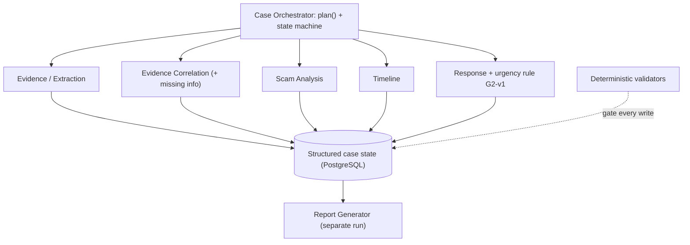
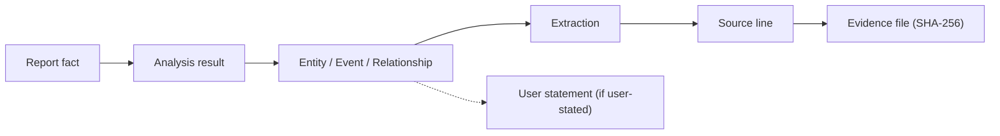
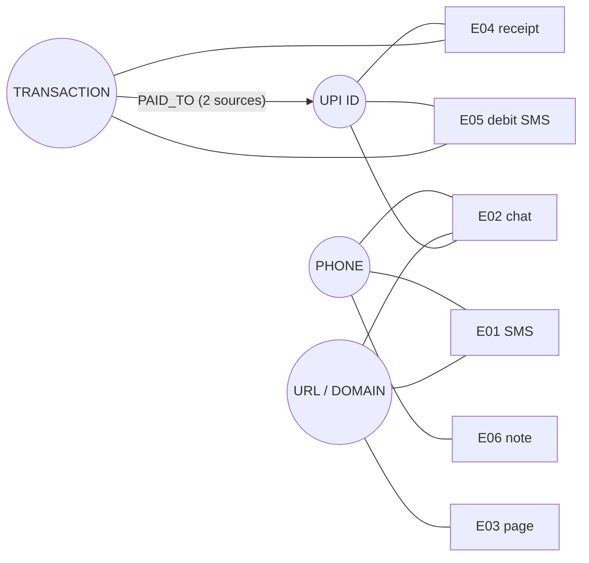
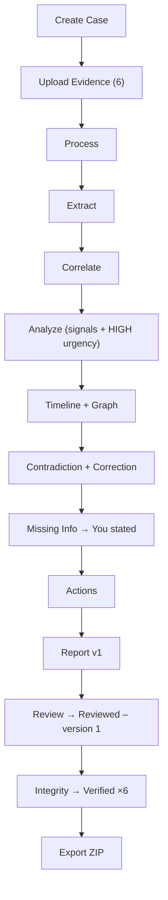
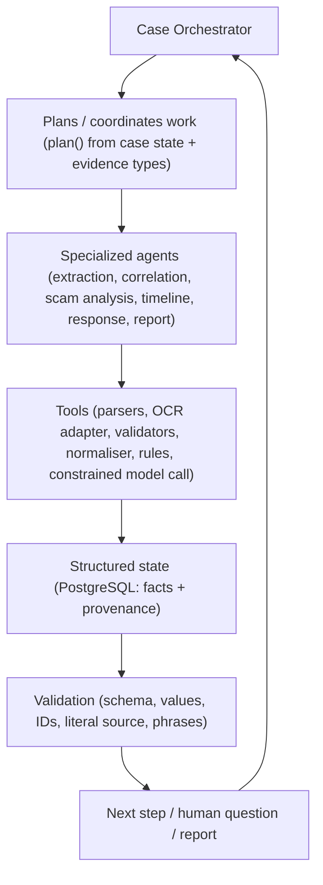
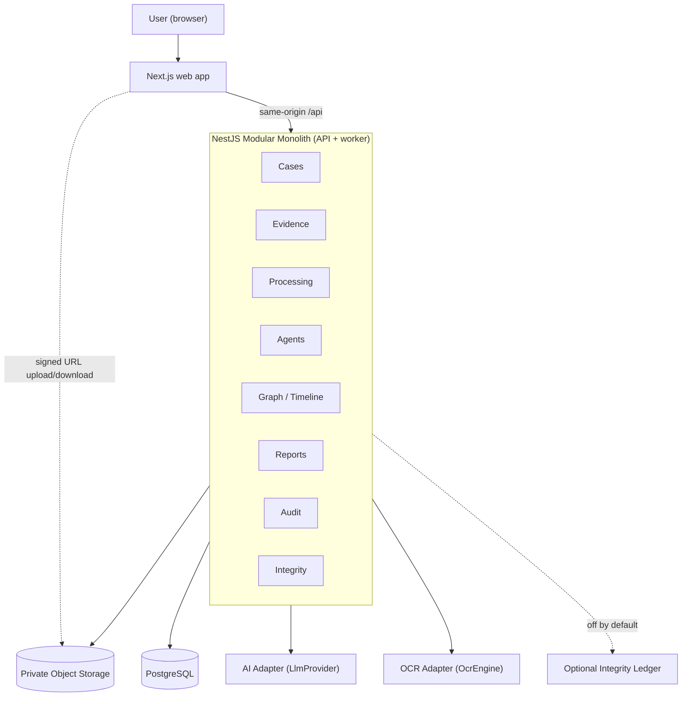

# Proofline — Hackathon Pitch and Demo Narrative

## 1. Document Control

| Field | Value |
|---|---|
| Document | Hackathon Pitch and Demo Narrative |
| File | `docs/16-HACKATHON-PITCH.md` |
| Version | 1.0 |
| Status | Final specification document (16 of 16). Communication layer only. |
| Last updated | 2026-10-02 |
| Purpose | Give the team one truthful, rehearsable story for the PCCOE DecentraHack 2.0 final presentation on **9 Oct 2026** |
| Target audience | Hackathon judges (product, technical, cybersecurity, AI/agentic systems), potential users, and the teammates presenting |
| Pitch duration assumptions | 30-second, 1-minute and 2-minute spoken pitches; a **5-minute standard live demo** (01 §22.3; 12 §34); 3- and 8-minute demo variants exist in 12 §34; a Q&A period of unknown length |
| Authoritative sources | `01`–`15` + `DECISIONS.md` v0.2 (all frozen) |

> **This document defines the communication and demonstration strategy for the frozen Proofline MVP. It does not redefine product behavior or architecture.**

Rules for every line in this document:
- Every product claim must trace to a frozen source (§58).
- Every target is labelled as a target. Nothing is reported as an achieved result until it has been measured at rehearsal (§37).
- All demo data is fictional (12 §6; 13 §2).

### Pitch notes (non-blocking)

| # | Note | Handling |
|---|---|---|
| PN-1 | The case reference `CF-10001` appears only on a fresh database. The reference is server-assigned (12 D-1; 14 R-N4; 15 TS-6). | Deploy a fresh DB for the final. If it shows a different number, say nothing about it. |
| PN-2 | The button that starts analysis is labelled **"Analyse evidence"** (12 §9). This brief calls it "Analyse Case". | Use the frozen label on stage. |
| PN-3 | The five-minute slots requested for §28 differ from the 12 §34 step timings. | §28 uses the requested slots and maps each one to the 12 steps. If they disagree, 12 §34 decides the live-demo pacing. |
| PN-4 | The brief's 15-step list shows HIGH urgency after the missing-information step. In 12 (step 8), urgency appears on the Overview. | The demo follows the 12 order (§25). |
| PN-5 | No official logo exists. The interim text wordmark is the only mark (11 §12). | §51 specifies the purpose of a logo only. |
| PN-6 | The fragmentation example mentions "WhatsApp" (01 §3.1). The demo chat (E02) uses a generic chat layout with no brand (12 §7). | WhatsApp is used only as a conceptual example and is never named as part of the demo. |
| PN-7 | The standard demo has **no blockchain screen or narration** (12 §30). | Blockchain appears only in one slide line and in Q&A (§24). |
| PN-8 | No measured results exist yet, because implementation starts on 3 Oct (14 §26). | §37 leaves the "observed" column to be filled in at rehearsal. |
| PN-9 | The frozen sources justify NestJS only as "source stack; small team; modular monolith" (04 §35). | §30 makes no comparative claims about frameworks. |

---

## 2. One-Line Pitch

> **Turn scattered scam messages, screenshots, transaction records and other evidence into a structured incident timeline, evidence map and complaint-ready case in minutes.** (01 §2.1)

### Product Name

**Proofline**

### Tagline

**Trace the Evidence. Build the Case.**

**Category:** an AI-powered cyber-fraud evidence intelligence and response platform. It is a post-incident evidence-orchestration layer (01 §2.2).

**Differentiation statement:** "We are not building another scam detector. We are building the evidence-response layer that turns a messy cyber-fraud incident into a structured case in minutes." (01 §2.6)

---

## 3. Thirty-Second Pitch

> After a cyber scam, the victim has the evidence, but it's in pieces: a fake SMS, a chat, a link, a UPI receipt, a bank alert. Each piece tells part of the story. None of them tells the whole story.
>
> Proofline turns those pieces into one structured case. It pulls the phone numbers, links, UPI IDs and transaction IDs out of every file and connects them. It rebuilds the timeline, shows what's missing, and drafts a complaint you review yourself.
>
> The difference is that every fact links back to the exact line of evidence it came from. Proofline — Trace the Evidence. Build the Case.

---

## 4. One-Minute Pitch

> **Problem.** In the minutes after a scam, a victim has to explain what happened: who contacted them, which link they opened, where the money went and when.
>
> **Fragmentation.** That information is spread across screenshots, SMS, a browser, a payment receipt and a bank alert. Every app formats it differently. The victim's memory may not match the receipts.
>
> **Proofline.** You upload those fragments into one case. Proofline fingerprints each file. It reads each file, and pulls out identifiers and amounts only if they literally appear in the source text.
>
> **AI, provenance and correlation.** AI agents work on that validated evidence. They connect the same phone number, link and UPI ID across files, and every fact keeps a pointer to its source line.
>
> **Timeline and graph.** You get a reconstructed timeline and an evidence graph. Where sources disagree, Proofline shows both instead of picking one.
>
> **Complaint-ready case.** Proofline asks for what's missing, prepares an action checklist you carry out yourself, and drafts a complaint you review and confirm.
>
> **Integrity.** It can then re-check, with SHA-256, that the stored evidence hasn't changed since upload.
>
> Trace the Evidence. Build the Case.

---

## 5. Two-Minute Pitch

> Imagine it's Thursday afternoon. An SMS says your KYC has expired. You call the number. Someone called "Rohan" chats with you, sends a link, asks for an OTP, and then asks for ₹8,500 over UPI. Two minutes after you pay, your bank texts you about the debit.
>
> Now you have to report it. And what you have is six fragments: three screenshots from different apps, a PDF receipt, a bank SMS, and your own memory of the call. The phone number is written three different ways. The link has tracking junk on it. Your memory says you paid around 12:40, but the receipt says 12:19. Nobody has connected any of it.
>
> That's the gap Proofline fills. It isn't a chatbot you ask questions. It's an evidence workspace.
>
> You upload the fragments. Each file is fingerprinted with SHA-256 and stored privately. Proofline reads each one: OCR for screenshots, the text layer for PDFs. It hides sensitive values like OTPs before anything else sees the text.
>
> Then a set of agents goes to work. An orchestrator plans the run based on the evidence types present. An extraction agent pulls out phone numbers, URLs, UPI IDs, amounts and transaction references, but a value is accepted only if it literally appears in the source text. A correlation agent links the same identifiers across files. A timeline agent orders the events and marks which times are exact and which are approximate. A scam-analysis agent records signals consistent with KYC impersonation, with citations.
>
> The result is a connected case. One phone number, one link, one UPI ID and one transaction, each linked to the files it appears in. Nine events in order. And the 12:19-versus-12:40 conflict is shown with both sources, not quietly resolved.
>
> Proofline also tells you what it doesn't know. No file names the bank that was debited, so it asks you. Your answer is labelled "You stated" everywhere it appears. Urgency is a fixed rule, not an AI guess: money left the account, so urgency is HIGH. The action checklist says contact your bank and report through 1930 or NCRP, and it says plainly that you do this yourself.
>
> Finally, Proofline drafts a complaint in which every key fact links back to its evidence. You review it and confirm that exact version. Then you can verify that the stored evidence is byte-for-byte unchanged, and the screen tells you what that proves and what it doesn't.
>
> Proofline — Trace the Evidence. Build the Case.

---

## 6. The Problem

Proofline addresses an **information-organisation problem** (01 §3.5):
- **Scattered evidence.** After a scam, the evidence is spread across a fake SMS or chat message, a phone call (often not recorded), a suspicious link, a credential or OTP page, a UPI receipt and a bank alert (01 §3.1).
- **Different formats.** Images, PDFs, plain text, email exports and URLs live in different apps and on different devices (01 §3.2).
- **Hidden entities.** The same phone number, domain or UPI ID appears in several artifacts, written differently each time: with or without `+91`, with or without tracking parameters, labelled "UTR", "Ref No." or "Transaction ID" (01 §3.2).
- **Unclear chronology.** Timestamps use different formats or are missing (01 §3.2).
- **Contradictions.** The victim's recollection may conflict with the documents (01 §3.2).
- **Missing information.** The official checklist asks for items such as the bank, wallet or merchant, the transaction ID or UTR, the amount and the date (01 §3.4). A victim holding screenshots has to work these out by hand.
- **Tedious conversion.** Turning a pile of screenshots into a structured complaint is slow, manual work, done under stress.

No statistics are cited. The frozen sources contain none, and none are invented here.

---

## 7. Why Existing Handling Is Difficult

```text
Chat screenshot (e.g., WhatsApp)   → a phone number and a link
SMS                                → the same phone number, written differently
Suspicious URL                     → the same domain, with tracking parameters
UPI receipt (PDF)                  → amount, UPI ID, transaction reference, time
Bank debit SMS                     → amount, account hint, the same transaction reference
User's own note                    → a remembered time that doesn't match the receipt
```

Storing these files in one folder is not enough. A folder doesn't know that:
- `+91 90000 00001` and `9000000001` are the same number;
- the link in the SMS and the link in the chat point to the same domain;
- `₹8,500.00` on the receipt and `Rs.8500.00` on the bank SMS are the same transaction (same UTR).

It also can't tell that the user's "around 12:40" conflicts with the receipt's 12:19.

The challenge is **connecting them into one defensible evidence story**, where every connection can be traced back to the files that support it (01 §3.3).

---

## 8. The Solution

Proofline is **an evidence investigation workspace, not a chatbot** (01 §4.1; NFR-12).

```text
Raw Evidence
→ Parsed Evidence           (OCR / text layer / text; sensitive values masked)
→ Validated Facts           (only values literally present in source lines)
→ Correlations              (same identifiers linked across files)
→ Timeline                  (ordered events; exact vs approximate)
→ Graph                     (relationships you can inspect and click through)
→ Missing Information       (gaps and contradictions surfaced, never guessed)
→ Actions                   (checklist the user performs)
→ Complaint Draft           (source-linked, versioned)
→ Review                    (explicit user confirmation of that version)
→ Integrity                 (SHA-256 re-check of stored bytes)
→ Export                    (PDF or ZIP bundle with manifest)
```

The MVP scope is frozen around **upload → extract → correlate → timeline → actions → report**, with integrity verification on top (01 §7).

---

## 9. Why Proofline Is Different

These are architectural differentiators. No competitor rankings are claimed.

### 1. Provenance-first

Every persisted derived fact (event, edge, signal, finding, action, urgency reason) and every key report fact traces back to:
- an evidence item, page and line; or
- an explicit user statement.

The target is 100 % (PRD G2; 03 INV-P1).

### 2. Evidence correlation

Identifiers are normalised to one canonical form, then matched exactly within a case. No fuzzy matching is used (08; 15 ENT-04).

### 3. Timeline reconstruction

Events come only from times found in evidence or stated by the user. Each one is marked exact, approximate or order-only (08).

### 4. Evidence graph

Eight typed relationships (such as `PAID_TO`, `HOSTED_ON` and `SENT_LINK`) are shown as an inspectable graph. Each edge shows its supporting evidence (03 §11.4).

### 5. AI with validation

The model has one tool, which returns a structured result. Schema, allowed-value, ID, literal-source and phrase checks decide what is accepted (06; 09 §23–§25).

### 6. Human review

The user corrects, answers questions and confirms a specific report version. Export requires that confirmation (R-1; FR-019).

### 7. Integrity verification

SHA-256 recorded at upload is recomputed on demand. The result is Verified, Mismatch or Could not complete (FR-021).

---

## 10. The "Not a Chatbot" Explanation

### Chatbot

```text
User
 ↓
Question
 ↓
LLM
 ↓
Answer
```

### Proofline

```text
Evidence
 ↓
Processing
 ↓
Source Lines
 ↓
Extraction
 ↓
Validation
 ↓
Provenance
 ↓
Correlation
 ↓
Agents
 ↓
Timeline + Graph
 ↓
Report
 ↓
Human Review
 ↓
Integrity
```

**Why this matters for cyber-fraud evidence** (01 §10.1):
- A chatbot's answer is only as good as its last reply. It can't show where a UPI ID came from, and it can invent one.
- Proofline has to carry out a workflow: inspect files, extract, compare, rebuild the timeline, detect gaps, ask targeted questions, validate and assemble a report.
- The state lives in a database, not in a conversation. That makes it inspectable, correctable, versioned and auditable.

There is no chat UI in the MVP (10; 15 §40).

---

## 11. How the System Works

```text
Next.js (web app; same-origin /api)
   ↓
NestJS modular monolith (API + background worker in one process)
   ↓
PostgreSQL / Prisma (cases, evidence, facts, provenance, graph, timeline, reports, audit)
   ↓
Evidence Processing (validate → parse/OCR → redact → source lines)
   ↓
AI Agent Layer (orchestrated steps; validated structured outputs)
   ↓
Graph / Timeline / Report
   ↓
Integrity (SHA-256 verify)
```

- **Private object storage:** evidence files sit in a private bucket and are never public (FR-005; 09 §10).
- **Signed upload URLs:** the browser uploads directly to storage with a short-lived signed URL for one object. The server then validates the stored bytes and computes the SHA-256 (05; 07).
- **Provenance:** source lines are stored once and referenced by extractions. Every derived fact links to them through `fact_sources` (03).
- **AI adapters:** the LLM, OCR, email, PDF and ledger are each behind an interface (port), so vendors can be swapped and failures handled (04 §29).
- **Optional blockchain boundary:** a `LedgerAdapter` exists but is **off** by default and never on the critical path (OD-06).
- **Background processing:** analysis runs as queued jobs (pg-boss in PostgreSQL). The UI polls run progress (OD-10, OD-15).

There are no microservices, no Redis, no graph database and no vector store (04 §1).

---

## 12. Agentic Architecture

| # | Logical agent | Responsibility |
|---|---|---|
| 1 | **Case Orchestrator** | Plans the run from the case state and evidence types, runs the steps in order, prevents duplicate processing and records progress in the activity feed. |
| 2 | **Evidence / Extraction** | Turns redacted source lines into validated, normalised extractions, accepting only values that literally appear in the source. |
| 3 | **Evidence Correlation** (incl. missing-information role) | Links identical identifiers across evidence into relationships, and detects missing fields and contradictions. |
| 4 | **Scam Analysis** | Records structured scam-pattern signals from a fixed taxonomy, each citing its evidence, in calibrated language. |
| 5 | **Timeline** | Builds ordered incident events from evidence and user-stated times, with precision markers, and never invents a time. |
| 6 | **Response** (+ deterministic urgency engine) | Produces the action checklist from fixed templates and computes urgency with rule `G2-v1`. |
| 7 | **Report Generator** | Assembles a versioned, source-linked complaint draft from a validated snapshot of the case. |

These are **logical agents, implemented as modules in one NestJS modular monolith**, not seven microservices (01 §10.4; 04 §5). The orchestrator is a **deterministic state machine**. Its `plan()` picks steps by evidence type, and LLM calls happen only inside steps (OD-12). Evidence text therefore cannot steer which tool runs (GR-10).



---

## 13. AI Safety Architecture

```text
Evidence
 ↓
Source Lines (redacted; OTP/card values never sent)
 ↓
Model (one tool: submit_result)
 ↓
Structured Result
 ↓
Schema Validation
 ↓
Allowed-Value Validation (enums, taxonomy, relationship types)
 ↓
Source/Literal Validation (IDs exist in this case; value literally in cited line)
 ↓
Provenance (written in the same transaction)
 ↓
Accepted Result
```

The model **cannot** (06 §16; 09 §24–§25):
- access arbitrary databases (it has no database tool);
- access other cases (its context is built from one case only);
- execute shell commands;
- open URLs (links are never fetched; GR-08);
- modify evidence;
- bypass provenance (writes without sources are rejected);
- fabricate identifiers (literal validation rejects any value not in the source).

It also cannot set urgency or integrity results. Those are deterministic (09 §25).

**Prompt injection is contained, not eliminated.** Text inside evidence can still influence wording within the allowed outputs. It cannot create unsupported facts, change urgency, act externally or cross cases (09 §23).

---

## 14. Provenance — The Core Trust Story

> **If Proofline says a fact exists, the user should be able to ask where it came from.**



Worked example using frozen demo values:

```text
₹8,500
   ↓
E04 (UPI receipt PDF, text layer)
   ↓
source line: "₹8,500.00" on page 1 of E04
   ↓
transaction entity (UTR 627000418532; also supported by E05)
   ↓
timeline event T8 "Payment made" 12:19 PM (E04)
   ↓
complaint draft: Financial details — ₹8,500 · UTR 627000418532 · 24 Sep 2026
```

On stage, the presenter clicks a fact and the **source drawer** opens with:
- the evidence reference;
- the page and line;
- the highlighted value;
- the surrounding lines.

This happens at least once in the demo (12 §4). User-stated facts say "You stated" instead of pointing to evidence.

---

## 15. Evidence Graph Story

```text
Phone (+91 90XXX XX001)
  │
  ├── E01
  ├── E02
  └── E06

URL (kyc-update-verify.example)
  │
  ├── E01
  ├── E02
  └── E03

UPI (kyc.refund.desk@demoupi)
  │
  ├── E02
  ├── E04
  └── E05

Transaction (UTR 627000418532)
  │
  ├── E04
  └── E05
```



The relationships the demo shows (R1–R7; 13 §18):
- `HOSTED_ON`;
- `SENT_LINK`;
- `REQUESTED_PAYMENT_TO`;
- `PAID_TO` ("supported by 2 items");
- `AMOUNT_OF`;
- `DEBITED_FROM`;
- `MESSAGE_CONTAINED`.

> **The system discovers relationships that are difficult to see when evidence is viewed one file at a time.**

---

## 16. Timeline Story

The frozen sequence, all IST on 24 Sep 2026 (13 §20; 12 §20):

| # | Time | Event | Source | Precision |
|---|---|---|---|---|
| T1 | 12:03 | Message received (lure SMS) | E01 | Exact |
| T2 | ~12:05 → **12:07** | Call | E06 → user correction | Approximate → corrected |
| T3 | 12:09 | Message received (link) | E02 | Exact |
| T4 | 12:11 | Link opened | E02 | Exact |
| T5 | ~12:16 | Password/OTP requested | E03 (date inferred) | Approximate |
| T6 | 12:17 | Password/OTP shared (value hidden) | E02 | Exact |
| T7 | 12:18 | Payment requested | E02 | Exact |
| T8 | 12:19 | Payment made — **Sources differ** | E04 (vs E06) | Exact |
| T9 | 12:21 | Debit alert | E05 | Exact |

What to say about times:
- **Event time vs. evidence time vs. user-stated time.** Event times come from text in the evidence or from the user's statement, never from upload or processing time.
- **Precision.** Exact, approximate and order-only events are marked differently.
- **Contradiction.** The receipt says **12:19 PM**. The user's note says **around 12:40 PM**. That is 21 minutes apart, outside the 10-minute tolerance for exact-vs-approximate. Proofline shows both sources and **does not silently resolve it**. It stays open in the demo.
- **Correction.** The user changes the call from **around 12:05 PM → 12:07 PM** ("Checked my call log"). The original is kept and shown as "Originally ~12:05 PM (E06)", the change is recorded as the user's statement, and an audit entry is written.

---

## 17. Missing Information Story

> **Proofline doesn't only tell the user what it knows; it also tells the user what is missing.**

```text
Missing:
Debited bank name          ("Debited bank or wallet — Not provided · Needed";
                            checked E01–E06; neither E04 nor E05 names a bank)
User:
Example Bank
System:
You stated                 ("You stated: Example Bank" — everywhere it appears)
```

**Why the distinction matters:**
- The bank name is not in any evidence, so Proofline does not guess it, even though a payee name and account hint are present (15 MI-02).
- The answer is recorded as a user statement and shown as user-stated in the overview, the report and the export. A reader of the draft can always tell **evidence-backed facts** from **user-provided facts**.

---

## 18. Scam Analysis Story

For the demo case, Proofline records **signals consistent with**:
- **KYC impersonation** (primary): the "KYC expired" lure and the impersonating support contact;
- **UPI fraud**: the payment request to a UPI ID and the payment;
- **Phishing**: the look-alike link and the page asking for credentials or an OTP.

The recorded payment and debit (E04, E05) are the financial facts that drive urgency (§19) and the financial-fraud actions (§20).

How it is constrained:
- Labels come from a fixed nine-label taxonomy. There is exactly one primary label (AD-01).
- Every signal cites its evidence.
- Wording is calibrated: "signals consistent with". Phrases such as "confirmed fraud" or "the scammer is" are rejected by a phrase check (GR-12).
- **Proofline never determines criminal identity or legal guilt.** Identifiers are "observed in evidence". It never says "Rohan is the scammer" (PRD N6).

---

## 19. Deterministic Urgency

Urgency is **not left to the LLM**. It is computed by rule `G2-v1` from facts recorded in the case (DECISIONS §7.3):

```text
Recorded payment/debit                         →  HIGH
No recorded loss + password/OTP exposure       →  MEDIUM
Neither                                        →  LOW
Before analysis                                →  Not assessed yet
```

The database itself rejects a HIGH level that has no recorded-loss reason. There is no confidence number (15 URG-08/09).

**Demo result: HIGH.** The on-screen reason says: "a debit of ₹8,500 on 24 Sep 2026 at 12:21 PM is recorded in this case (E04, E05). A request for passwords or an OTP was also observed (E02, E03)."

Fixed disclaimer, shown every time:

> "Urgency shows how soon to act on the steps below, based only on facts recorded in this case. It is not a risk score, a legal assessment, or a law-enforcement determination."

On stage, say: **"This isn't a fraud score. It's a fixed rule."** (12 §17)

---

## 20. Response Actions

Frozen demo checklist (12 §24):

| Rank | Action | Reason |
|---|---|---|
| 1 | Contact your bank (official customer-care channel) | Debit recorded (E04, E05); OTP shared |
| 2 | Report financial cyber fraud via 1930 / NCRP | Debit recorded |
| 3 | Preserve original evidence | Evidence present |
| 4 | Report suspect identifiers via NCRP "Report Suspect" | Phone, link and UPI ID observed |

Actions come from fixed templates, and each one shows its reason. The user can mark progress.

> **The user performs these actions themselves.** Proofline does not contact the bank, the police, NCRP or anyone else (PRD N1, N2, N7).

---

## 21. Complaint Draft

```text
Evidence
 ↓
Structured Facts
 ↓
Timeline
 ↓
Incident Context
 ↓
Source-linked Complaint Draft
 ↓
Human Review
```

- **Source-linked facts.** Every key fact carries a source reference (target 100 %, PRD G2).
- **User-stated information is distinguished.** "Example Bank (You stated)"; "12:07 — You corrected this".
- **Missing information is not fabricated.** Anything absent shows "Not provided".
- **Contradictions are listed** with both sources.
- **Evidence index.** All six items are listed with their fingerprints and integrity status.
- **Versions exist.** Each generation creates a new version, and earlier versions are never changed (15 RPT-10).
- **Confirmation is explicit.** The draft carries the disclaimer that it is AI-assisted, not official and not submitted.

---

## 22. Human-in-the-Loop

```text
AI Draft (version N, checksummed)
   ↓
User Review (uncertain items, corrections, statements, evidence refs)
   ↓
Confirmation ("I've reviewed version N" — bound to version + checksum)
   ↓
Reviewed – version N
```

- The case status stays **USER_REVIEW**. There is never a "Confirmed" status (R-1).
- Any later change voids the confirmation: a correction, an answer, new or deleted evidence, or regeneration.
- Export requires an active confirmation of the **current** version. Exporting version 2 with a version-1 confirmation is refused (15 EXP-03).
- **Why it matters:** the person stays the final reviewer (NFR-10). AI output is never submitted or exported unreviewed.

---

## 23. Integrity Verification

```text
At upload:
Evidence bytes → SHA-256 → Fingerprint A   (recorded by the server)

Later (Verify):
Evidence bytes → SHA-256 → Fingerprint B   (recomputed from storage)
```

| Result | Meaning |
|---|---|
| A = B → **Verified** | The stored bytes are identical to the bytes recorded at upload |
| A ≠ B → **Mismatch** | The stored file has changed since upload. Both hashes are shown. |
| Cannot read the file → **Could not complete** | Storage or object unavailable. **Never reported as a mismatch.** |

| Proves | Does **not** prove |
|---|---|
| The stored bytes haven't changed since upload | That the evidence is true |
| | Who sent it, or who created the file |
| | That the event really happened |
| | That it wasn't fabricated before upload |
| | Legal admissibility |

This "proves / doesn't prove" text is fixed copy on the verification screen (09 §31).

---

## 24. Blockchain Position

- Core integrity uses **SHA-256**, recorded server-side at upload.
- Blockchain attestation is **optional** and **off by default** (OD-06). It is **not required** for the MVP. A go/no-go decision is due on 2026-10-06.
- If enabled, only the **hash, an opaque non-reversible reference and a timestamp** would be written to a testnet. No evidence or personal data goes on-chain.
- It never blocks anything. If the ledger is unavailable, the screen shows "Attestation unavailable".
- **It does not prove the truth or legal admissibility of evidence.**
- The standard demo shows no blockchain screen (12 §30). It is never the headline.

---

## 25. End-to-End Demo

Canonical demo, using only the frozen synthetic scenario (12 §10–§31). The order follows Doc 12 (PN-4).

| # | Step | Doc 12 step |
|---|---|---|
| 1 | Sign in (presenter signed in before going on stage; real email OTP; no bypass) | 2 |
| 2 | Create case → `CF-10001` on a fresh DB (PN-1) | 3 |
| 3 | Upload six artifacts (E01–E05 files + E06 pasted note) → fingerprints | 4 |
| 4 | Process evidence → activity feed, 6/6 processed | 5–6 |
| 5 | Overview + **HIGH urgency** with its reason and disclaimer | 7–8 |
| 6 | Extract entities / correlate evidence (phone in E01 · E02 · E06) | 9 |
| 7 | Evidence graph → click `PAID_TO` → E04 source line | 10 |
| 8 | Timeline T1–T9 with precision markers | 11 |
| 9 | Contradiction 12:19 vs around 12:40 (left open) | 12 |
| 10 | Correction ~12:05 → 12:07 | 13 |
| 11 | Answer the missing bank question → "You stated: Example Bank" | 14 |
| 12 | Actions (you do this yourself) | 15 |
| 13 | Generate complaint draft v1 | 16 |
| 14 | Review → confirm → "Reviewed – version 1" | 17–18 |
| 15 | Verify integrity → Verified ×6 | 19 |
| 16 | Export ZIP for version 1 → manifest checksum | Final |



---

## 26. Six-Artifact Demo

| Artifact | Format | Role in Story |
|---|---|---|
| **E01** `E01_kyc_sms.png` | PNG (OCR) | **The lure.** A fake "KYC expired" SMS with the phone number and a link that carries a tracking parameter |
| **E02** `E02_chat_kyc_agent.png` | PNG (OCR) | **The social engineering.** The chat with "Rohan": the link sent, the OTP shared (hidden), and ₹8,500 requested to the UPI ID |
| **E03** `E03_phishing_page.png` | PNG (OCR) | **The credential/OTP harvest.** A look-alike page asking for credentials or an OTP, with an approximate time |
| **E04** `E04_upi_receipt.pdf` | PDF, text layer | **The payment.** ₹8,500.00 to the UPI ID, UTR, account hint, 12:19 PM. **No bank name.** |
| **E05** `E05_bank_debit_sms.png` | PNG (OCR) | **The debit.** The bank SMS with Rs.8500.00, the same UTR, 12:21. A second source for the payment. |
| **E06** "My note about the call" | Pasted text | **The victim's recollection.** Call around 12:05, paid around 12:40. Source of the **contradiction** and the **correction**. |

Exact content is owned by `DECISIONS.md` §7.2.3 and Doc 13. There is **no seventh artifact**, and none is ever edited (12 §4). Every name, number, link and account is fictional, and the team says so aloud.

---

## 27. The "Wow Moment"

```text
Six disconnected files (just refs, types, fingerprints)
        ↓
"Analyse evidence"
        ↓
Entities appear (one phone, one link, one UPI ID, one transaction)
        ↓
Connections appear (graph; PAID_TO "supported by 2 items")
        ↓
Timeline appears (T1–T9, exact vs approximate)
        ↓
Contradiction appears ("Sources differ" on 12:19)
        ↓
Missing information appears ("Debited bank — Not provided")
        ↓
Complaint draft appears (source-linked)
```

The peak is the **evidence graph** (12 §19 ★): six separate files become one connected picture, and every edge opens its source line.

The message is the **transformation from scattered evidence into a structured case**. No speed figure is quoted, except that the < 2 min upload-to-draft time is a **target** (§37).

---

## 28. Five-Minute Demo Script

Slots as requested, each mapped to Doc 12 steps (PN-3). The presenter is already signed in.

### 0:00–0:30 — Problem (12 step 1)

*Landing page on screen.*
> "After a scam, the evidence is in pieces: an SMS, a chat, a link, a receipt, a bank alert, your own memory. Proofline turns those pieces into one case you can trace. Everything you'll see is fictional data."

### 0:30–1:00 — Create case / upload (12 steps 3–4)

*Create the case, drop E01–E05, paste E06 as "My note about the call".*
> "Here's a new case, nearly empty. I'll add the six fragments from our fictional victim, Asha: three screenshots, a PDF receipt, and her note. Each file gets a SHA-256 fingerprint when it's stored. Now, Analyse evidence."

### 1:00–1:45 — Processing / activity (12 steps 5–6)

*Activity feed: plan, steps, 6/6 processed.*
> "This isn't a chat. It's a plan running step by step: read each file, hide sensitive values like the OTP, extract identifiers, correlate, build the timeline. A value is kept only if it literally appears in the source text. If the AI proposes something that isn't there, it's rejected."

*(If the fallback was used, say so now; see §48.)*

### 1:45–2:30 — Overview / entities / analysis (12 steps 7–9)

*Overview cards; open the urgency "i"; entity list.*
> "Here's the shape of the incident: signals consistent with KYC impersonation, UPI fraud and phishing, and a recorded loss of ₹8,500. Urgency is HIGH, and here's why: a debit is recorded in E04 and E05. That's a fixed rule, not a fraud score. And this phone number appears in three files, written three different ways, but it's resolved to one number."

### 2:30–3:15 — Timeline + graph (12 steps 10–13)

*Graph: click `PAID_TO` → E04 source line. Timeline: point to the approximate markers, click "Sources differ" on T8, then correct T2.*
> "Every line in this graph is backed by evidence you can open. Here's the UTR line in the receipt. On the timeline, the receipt says 12:19, but Asha's note says around 12:40. Proofline doesn't pick one; it shows both. Her call log says the call was at 12:07, so she corrects it. The original stays on record, and the correction is labelled as hers."

### 3:15–3:45 — Missing information + actions (12 steps 14–15)

*Answer "Example Bank"; point to the actions label.*
> "No file names the bank that was debited, so Proofline asks instead of guessing. Her answer is marked 'You stated' everywhere. And here are the next steps: call the bank, report via 1930 or NCRP, preserve the evidence, report the identifiers. Each step says why. Proofline doesn't contact anyone; she does."

### 3:45–4:30 — Complaint draft + review (12 steps 16–18)

*Generate draft v1; scroll the financial details and evidence index; confirm.*
> "Here's a draft aligned to what the official complaint form asks for. Every key fact links to its source, and user-provided facts are labelled. Nothing has been submitted anywhere. She reviews version 1 and confirms that exact version. If anything changes later, that confirmation is voided."

### 4:30–5:00 — Integrity + export + closing (12 step 19 + final)

*Verify all → Verified ×6; export the ZIP; show the manifest line; return to the Overview.*
> "Verify recomputes each file's hash. All six match what was recorded at upload. That proves the files haven't changed; it doesn't prove they're true, or that they're legally admissible. Export gives her a bundle with a manifest. Six scattered fragments, one traceable case. That's Proofline — Trace the Evidence. Build the Case."

---

## 29. Judge Narration

| Screen | What Judge Sees | What Presenter Says | Why It Matters |
|---|---|---|---|
| Evidence | Six items, mixed types, each with a fingerprint | "These are the fragments a victim actually has." | Shows the real input problem and integrity from the first step |
| Activity | Plan and steps, N/N processed | "It keeps only details it can find in the source text." | Agentic orchestration, not chat; validation visible |
| Overview | Signals, recorded loss, HIGH urgency, needs-attention items | "Shape of the incident, and what it doesn't know." | Structured understanding at a glance |
| Timeline | T1–T9, approximate markers, "Sources differ" | "It surfaces the discrepancy and keeps both." | Honest uncertainty, not false confidence |
| Graph | Phone/URL/UPI/Transaction nodes; `PAID_TO` with 2 sources | "Every line is backed by evidence you can open." | Cross-evidence correlation with provenance |
| Missing information | "Debited bank — Not provided" → "You stated: Example Bank" | "It asks instead of guessing." | No fabrication; user facts labelled |
| Actions | Four ranked steps, each with a reason; "you do this" label | "You do this yourself." | Actionable and honest about its limits |
| Draft | v1 with disclaimer, sources, evidence index | "A draft for review; nothing is submitted." | Complaint-ready output with traceability |
| Integrity | Verified ×6 + proves/doesn't-prove text | "Proves unchanged, not true." | Tamper detection with honest limits |
| Export | ZIP + manifest checksum for the reviewed version | "Only the version she reviewed." | Human-gated output, verifiable bundle |

---

## 30. Technical Judge Deep Dive

### Why NestJS?

It is the frozen source stack. It gives a modular, typed, TypeScript backend for a small team, and it holds API and worker modules in **one deployable process** (04 §35). No comparative claim against other frameworks is made (PN-9).

### Why PostgreSQL instead of a graph DB?

Each graph is small and case-scoped. Entities and relationships are relational rows with constraints, so graph, provenance and facts commit in **one transaction**, and composite foreign keys enforce case isolation. The graph view is rendered from these rows. The trade-off is that there is no graph query language. Graph analytics are future scope (04 §36).

### Why provenance?

Fraud evidence has to be checkable. Provenance lets any fact be traced to the file, page and line, or to the user's statement. It also lets deletions cascade correctly and makes the 100 % key-fact coverage testable (PRD G2; 15 §20).

### Why deterministic validation around AI?

LLMs can produce plausible but unsupported identifiers. A fabricated UPI ID in a fraud complaint would be harmful. Literal-source validation, enums, ID checks and phrase checks make extraction repeatable and reject fabrication. The accepted cost is that a true value can be discarded if OCR misreads it (04 §36; NFR-11).

### Why modular monolith?

There is one codebase, one deployment and one database transaction scope. Module boundaries (one owning module per table) keep a later split possible (04 §36).

### Why private object storage?

Evidence is sensitive. Files are kept out of the database in a private bucket with provider encryption at rest, and are accessed only through short-lived signed URLs for one object (FR-005; 09 §10–§11).

### Why SHA-256?

It is a standard, server-computed fingerprint that detects any change to the stored bytes. The server ignores client-supplied hashes (15 INTG-08).

### Why is blockchain optional?

Its only possible role is a public timestamp of a hash. Core integrity doesn't need it, it must never be on the critical path, and it doesn't prove truth (OD-06; 04 §36).

---

## 31. Security Story

| Control | What it does | Source |
|---|---|---|
| Authentication | Email OTP (hashed, expiring, attempt-limited); opaque session in an httpOnly cookie; no sign-in bypass | 09 §6 |
| Authorization | Every case resource requires the owning signed-in user | 09 §7 |
| Case isolation | Another user's case or evidence returns **404**. Composite FKs stop cross-case links. AI context is built from one case only. | 09 §8–§9 |
| Private storage | Private bucket; no public URLs | 09 §10 |
| Signed URLs | Short-lived, single-object upload and download | 09 §11 |
| Sensitive-value masking | OTPs and card numbers are redacted before storage of parsed text, AI calls, reports and logs | 09 §14 |
| Prompt-injection defences | Evidence is passed as data, there is a single result tool, a deterministic plan, and the validation chain | 09 §23 |
| AI output validation | Schema → allowed values → IDs → literal source → provenance → phrases | 06; 09 §24 |
| Audit logging | Written in the same transaction as the action; content-free; append-only | 09 §28–§29 |
| Integrity verification | Server-side SHA-256 with three honest outcomes | 09 §30–§31 |

**Honest limits:**
- Prompt injection is contained, not eliminated.
- Parser libraries carry residual risk.
- An email-inbox compromise defeats email OTP.
- There is no WAF against volumetric attacks.
- A signed URL is usable until it expires (09 §4).

---

## 32. Privacy Story

- **Evidence is sensitive and private.** It is stored privately, owned by one user, and reached only through authorised, short-lived links.
- **Access is case-scoped.** That covers the UI, the API and what is sent to the AI provider (NFR-08).
- **Sensitive values are minimised.** OTP and card values are never stored in parsed text and never reach the model, reports or logs. Identifiers are masked by default in the UI.
- **The original evidence can still show sensitive values.** For example, E02's original image visibly contains the OTP. It is shown only behind "Show original" (15 §17).
- **Backups may retain deleted data** until they expire under the host's backup retention. This is a documented limitation (09 §36).
- **Encryption at rest is provider-managed** and depends on the hosting and storage choices made at deployment (09 §16; OD-05, OD-13).
- **Synthetic data only** in the hackathon (N15).

Proofline does not claim absolute privacy.

---

## 33. What We Deliberately Did Not Build

This is **deliberate scope control**: the MVP is frozen around one complete, verifiable workflow (01 §7, §24).

| Not built | Status |
|---|---|
| Speech-to-text caller summary | Optional, deferred (OD-08). Calls are never recorded. |
| ID-document uploads | Deferred (OD-09). The ID is a "keep ready" item. |
| Email / mailbox connectors | Future. Users upload single-message `.eml` exports. |
| Multilingual workflows | Future. The UI is English only. |
| Continuous threat intelligence / URL fetching | Out of scope. Links are **never fetched**. |
| Advanced temporal reasoning and graph analytics | Future |
| Cross-case campaign clustering | Future. Each case is isolated. |
| Enterprise / bank / call-centre integrations | Future |
| Specialised multimodal model ensemble | Future |
| Scanned-PDF OCR | Not in the MVP. PDFs need a text layer (OD-03). |
| Required blockchain integration | Optional, off (OD-06) |
| Chat interface | Not required. The workspace is the product. |
| Automatic submission or contact with authorities | Never (N1, N7) |

---

## 34. MVP vs Future

| MVP | Future |
|---|---|
| PNG/JPEG, text-layer PDF, UTF-8 TXT, single-message EML, pasted text/URL | Email connectors / mailbox ingestion |
| OCR + parsing; entity extraction with provenance; normalisation and masking | Specialised multimodal model ensemble |
| Scam taxonomy signals with evidence-backed explanation | Continuous threat-intelligence enrichment |
| Cross-evidence correlation and evidence graph (PostgreSQL) | Advanced temporal reasoning and graph analytics |
| Timeline with user correction | Cross-case campaign clustering |
| Missing/contradictory info + targeted questions | Bank / call-centre workflow integrations |
| Action checklist; complaint draft; evidence index | Enterprise-grade notarisation and policy-controlled integrity |
| Review gate; PDF/ZIP export | Pilot deployments with consented real cases |
| SHA-256 verification; audit log; activity view; deletion | Multilingual Indian-language workflows |
| Synthetic demo data with disclosed fallback | — |
| *Optional:* testnet hash attestation (off), speech-to-text (deferred) | — |

Source: 01 §7.

---

## 35. What the Prototype Proves

On the frozen six-artifact synthetic scenario, the MVP is built to demonstrate:
- multi-artifact, mixed-format evidence ingestion with fingerprints;
- structured extraction with literal-source validation;
- provenance from report fact back to source line;
- cross-evidence correlation;
- timeline reconstruction with precision, a contradiction and a correction;
- an evidence graph;
- scam signals with citations;
- missing-information detection and a targeted question;
- a response checklist;
- a source-linked complaint draft;
- human review bound to a version;
- SHA-256 integrity verification;
- export.

**What it does not prove:**
- real-world effectiveness;
- accuracy on real victims' evidence;
- any effect on police or bank outcomes.

The prototype demonstrates the workflow on one controlled synthetic case. Effectiveness beyond that scenario is not shown (01 §23).

---

## 36. Validation and Testing Story

Doc 15 verifies the frozen specs at multiple levels:

```text
Unit (rules: normalisation, literal validation, redaction, time, urgency)
 ↓
Service (owning modules, transactions, same-tx audit)
 ↓
Database (constraints, triggers, composite FKs, cascades)
 ↓
API (37 endpoints; cross-user access → 404)
 ↓
Pipeline (each file type, limits, scanned-PDF gate)
 ↓
Security (25 threats; SEC-01–SEC-20; injection suite; no-egress; log scans)
 ↓
AI contracts (fake provider; fabricated identifier rejected)
 ↓
Frontend (states, source drawer, accessibility)
 ↓
E2E (canonical journey)
 ↓
Demo oracle (expected outputs for E01–E06, 13 §34–§35)
```

- **Synthetic oracle:** the expected entities, R1–R7, T1–T9, the contradiction, the correction, the "Example Bank" answer, HIGH urgency and Verified ×6 are written down **before** the build. The demo is compared against them (15 §7).
- **Provenance testing:** coverage queries check that every persisted derived fact has a source (15 PROV-01).

No test results are quoted. Testing begins with implementation (14 §26).

---

## 37. Success Criteria

| Metric | Target (frozen) | Implemented behaviour | Observed demo result |
|---|---|---|---|
| Extraction accuracy (simple structured fields) | **> 95 %** on the synthetic benchmark | Literal validation + normalisation | To be measured at rehearsal |
| Provenance coverage (key report facts) | **100 %** | Source refs required on every write | To be measured |
| Timeline ordering | **> 90 %** of known events | Ordering rules (08) | To be measured |
| Upload → usable draft | **< 2 minutes** (demo environment) | Background pipeline | To be measured |
| Integrity on untouched evidence | **100 %** match | Server SHA-256 recompute | To be measured |
| Planted gap / contradiction | Shown as "Not provided" / both sources | Checklist + tolerance rules | To be measured |
| User correction rate | Minimise; no numeric target | Corrections tracked | Observational only |
| Demo duration | ≤ 5 minutes (12 §34) | Scripted (§28) | To be measured |

Sources: 01 §23; PRD G1–G10; NFR-06.

These are **engineering/demo targets on the fixed synthetic benchmark, not claims of production accuracy**. A target is never presented as an achieved result.

---

## 38. Limitations

| Limitation | What it means |
|---|---|
| Synthetic demo data | One fictional six-artifact case. No real victims. |
| OCR quality | OCR can misread text. A misread value fails literal validation and is **dropped**, never guessed. Scanned PDFs are not processed. |
| AI limitations | Explanation wording can be imperfect. Signals are "consistent with", not conclusions. |
| Prompt injection | Contained, **cannot be completely eliminated** |
| Integrity ≠ truth | A hash proves bytes are unchanged, not that the content is true, nor who sent it |
| No legal-admissibility guarantee | The draft is AI-assisted and not an official document |
| No official integration | No police, bank, NCRP or 1930 integration. The user acts through official channels. |
| Blockchain | Optional and off. A go/no-go decision is pending. |
| No fund recovery | Proofline never promises or implies recovery |
| Deferred features | Speech-to-text, ID uploads, connectors, multilingual support and the rest of §33 |
| Fallback | The disclosed cached AI results apply only to the six known demo file hashes |

Saying these limits plainly is part of the trust story. The product shows the same honesty in its own interface.

---

## 39. Ethical / Responsible Positioning

Proofline **assists evidence preparation**. It does not:
- determine guilt;
- replace investigators;
- replace police;
- replace banks;
- provide legal advice;
- guarantee recovery;
- decide what legally happened.

It works **alongside** India's official cyber-fraud reporting channels and never presents itself as one. There is no government branding (01 §2, §4.2; PRD N19).

**The user remains responsible** for reviewing the case, confirming the draft and taking every external action.

---

## 40. Closing Pitch

> "Every scam victim ends up holding fragments: a message here, a receipt there, a memory that doesn't quite match. Proofline turns those fragments into one case. It connects the same identifiers, rebuilds the timeline, admits what's missing, and gives clear next steps. You review the result, and every fact in it can be traced back to the evidence."

```text
Scattered evidence
        ↓
Structured case
        ↓
Traceable facts
        ↓
Actionable response
```

> "**Proofline — Trace the Evidence. Build the Case.**"

---

## 41. Judge Q&A Preparation

| # | Question | Answer |
|---|---|---|
| 1 | Why not just use ChatGPT? | A chat answer can't show where a fact came from, and it can invent identifiers. Proofline is a stateful workflow: every value is validated against the source text, linked to its line, correlated across files, and reviewed by the user before export. |
| 2 | How do you prevent hallucinations? | The model only proposes. A value is accepted only if it literally appears in a cited source line of this case, passes format and enum checks, and is written with provenance. Anything else is rejected. |
| 3 | How do you prove where a fact came from? | Every derived fact has source rows pointing to an extraction and a source line (evidence, page, line), or to a user statement. Clicking a fact opens the source drawer. |
| 4 | How does the graph work without Neo4j? | Entities and typed relationships are PostgreSQL tables with constraints. The case graph is small, so it's rendered from those rows. It commits in one transaction with its provenance. |
| 5 | Why PostgreSQL? | One store for facts, provenance, graph, queue and audit, with constraints, triggers and composite foreign keys that enforce our rules, including case isolation. |
| 6 | What happens if OCR is wrong? | A misread value won't match literal validation, so it's dropped rather than guessed. The user can correct extractions, and the original evidence is never changed. Blank or unreadable images fail visibly with a retry. |
| 7 | What if the AI sees malicious instructions in evidence? | Evidence is passed as data. The plan is deterministic, the model's only tool returns a structured result, and validators gate every write. Injection can't add unsupported facts, change urgency, act externally or cross cases. It's contained, not eliminated. |
| 8 | Can users modify evidence? | No. Originals are immutable and fingerprinted. Users can correct derived facts, which records a statement, keeps the original value and writes an audit entry. They can also delete evidence, which cascades and invalidates reports. |
| 9 | How is integrity verified? | The server recomputes SHA-256 of the stored file and compares it to the hash recorded at upload. The result is Verified, Mismatch, or Could not complete. |
| 10 | Does blockchain make the evidence legally valid? | No. Blockchain is optional and off. If enabled, it would only timestamp a hash. Neither a hash nor a ledger proves truth or legal admissibility. |
| 11 | Can Proofline contact police or banks? | No. It prepares the case and an action checklist. The user contacts the bank and reports via 1930 or NCRP. |
| 12 | What happens with conflicting evidence? | Conflicts beyond fixed time tolerances are flagged with both sources and left for the user. Proofline never silently picks one (12:19 vs around 12:40). |
| 13 | What happens if information is missing? | It's shown as "Not provided", with why it matters and a targeted question. An answer is labelled "You stated". |
| 14 | Why is urgency deterministic? | Urgency drives what the user does next, so it must be predictable and explainable. A fixed rule on recorded facts is enforced by a database check. The LLM cannot set it. It isn't a risk score. |
| 15 | What is the role of the human? | The user corrects facts, answers questions, performs the actions, and confirms a specific report version. Export requires that confirmation. |
| 16 | What if the LLM provider fails? | The step fails visibly and can be retried, resuming at the failed step. For the six known demo files only, prepared results can be used. The app discloses this and the presenter says so. Unknown files never get cached output. |
| 17 | What's implemented versus future? | §34. The MVP is the complete upload-to-export workflow with integrity. Connectors, multilingual support, graph analytics, cross-case clustering and integrations are future. Blockchain and speech-to-text are optional or deferred. |
| 18 | How is case isolation enforced? | Ownership checks on every route (a foreign ID returns 404), composite foreign keys in the database, AI context built from one case, and signed URLs scoped to one object. All of this is covered by an isolation test matrix. |
| 19 | Why is this agentic? | An orchestrator plans steps from the case state and evidence types, and specialised agents use constrained tools on structured state. Results are validated before the next step, and the user is asked targeted questions (§43). |
| 20 | What would you build next? | From the frozen future list: email connectors, multilingual workflows, advanced temporal and graph analytics, and pilots with consented real cases (01 §7). |

---

## 42. Difficult Judge Questions

### "Isn't this just an OCR + LLM wrapper?"

> "OCR and the LLM are two adapters in a larger system. What we built around them:
> - provenance from every fact to a source line;
> - exact-match correlation across files;
> - a typed evidence graph;
> - a timeline with precision and contradiction rules;
> - deterministic validation that rejects anything not in the source;
> - a rule-based urgency;
> - a versioned report with checksum-bound review;
> - SHA-256 integrity;
> - case isolation enforced down to the database.
>
> Remove the LLM and most of the pipeline is still deterministic."

### "Why should we trust the AI?"

> "You shouldn't have to. Proofline doesn't ask for blind trust. Every fact links to its source, AI-derived content is labelled, uncertainty is shown, and the user reviews and confirms before anything leaves the system."

### "Can your hash prove the evidence is genuine?"

> "No. It proves the stored bytes match the fingerprint recorded at upload. It doesn't prove the content is true, who sent it, where it came from, or that it's legally admissible. The screen says exactly that."

### "Can the AI fabricate a UPI ID?"

> "It can propose one, but it won't be accepted. Literal-source validation checks that the value appears in the cited line of evidence in this case. A fabricated identifier is rejected and never reaches the database, the API or the report. We test this directly."

### "Can a malicious screenshot control the agent?"

> "It can't choose tools, because the plan is deterministic and the model's only tool returns a structured result. It can't open URLs, read other cases or write unvalidated facts. It might bias wording within the allowed outputs. That's the residual risk we acknowledge: contained, not eliminated."

---

## 43. Agentic AI Explanation for Judges



The agents operate on **structured evidence**, use **constrained tools**, keep **persistent state** and **cross-check** results. They also **involve the human** for answers and confirmation (01 §10.1).

It is a coordinated, constrained workflow. It is **not autonomous law enforcement**, and it takes no external action.

---

## 44. Architecture Diagram



---

## 45. Demo Flow Diagram


---

## 46. Storyboard

| Scene | Visual | Message |
|---|---|---|
| 1. Scattered evidence | Six separate items in a list: refs, types, fingerprints only | "These are the fragments a victim actually has." |
| 2. Upload | Drop zone; E06 pasted; fingerprints appear | Each item is fingerprinted when stored |
| 3. Processing | Activity feed: plan, steps, 6/6 | A structured, validated workflow, not a chat |
| 4. Overview | Signals, recorded loss, HIGH urgency with reason | The shape of the incident at a glance |
| 5. Graph | Phone/URL/UPI/Transaction linked to E01–E06; `PAID_TO` ×2 | Connections that are invisible file by file |
| 6. Timeline | T1–T9 with exact/approximate markers | The incident, reconstructed in order |
| 7. Contradiction | "Sources differ": 12:19 (E04) vs around 12:40 (E06) | Uncertainty surfaced, not hidden |
| 8. Missing information | "Debited bank — Not provided" → "You stated: Example Bank" | It asks instead of guessing |
| 9. Action checklist | Four ranked steps with reasons; "you do this" | Actionable and honest |
| 10. Report | Draft v1 with sources and evidence index → "Reviewed – version 1" | Complaint-ready, human-confirmed |
| 11. Integrity | Verified ×6 + proves/doesn't-prove | Unchanged, not "true" |
| 12. Export | ZIP + manifest checksum | A verifiable bundle of the reviewed version |

---

## 47. Presenter Handoff

| Role | Speaks during | Hands off with |
|---|---|---|
| **Problem/Product** | Opening (§3 or §4) and the Problem slide; demo 0:00–0:30 | "Let's show you." → Demo Operator |
| **Demo Operator** | Drives the UI for the whole demo and narrates 0:30–3:45 (§28) | Hands narration to AI/Security at the draft |
| **AI/Security** | Demo 3:45–4:30 (draft, review) plus any AI-safety or security question | "And you can check the evidence itself." → Technical Architecture |
| **Technical Architecture** | Demo 4:30–4:50 (integrity, export); architecture slide if time allows | → Closing |
| **Closing** | Final 15 seconds (§55); leads Q&A routing | — |

Rules:
- Each handoff is **one sentence**.
- The Demo Operator keeps the mouse throughout. Narrators don't touch the laptop.
- During Q&A, the Closing role routes each question: product → Problem/Product; AI or security → AI/Security; architecture → Technical Architecture.
- One person can hold more than one role in a smaller team.

---

## 48. Backup Demo Plan

From 12 §35–§37:

| Failure | Truthful response |
|---|---|
| Internet fails | Switch to the **docker-compose local stack** on the laptop, running the same build. Set `DEMO_FALLBACK=force` only if fully offline, and **say so aloud**. |
| LLM provider fails | The disclosed cached results apply automatically **only** to the six manifest hashes. The activity feed shows "Prepared demo results were used". Say: "The AI service is down, so this step is using prepared results for these demo files — the app shows that." |
| OCR fails | Retry the analysis once. If it still fails, use the local backup stack. **There is no OCR fallback.** |
| Upload fails | Remove the row and re-drop the file. If storage is down, use the local backup stack. |
| Deployment fails | Use the local backup stack. |
| Browser fails | Open the prepared clean browser profile (110–125 % zoom, notifications muted) on the same stack and continue from the current screen. Server state is restored on reload. |
| Processing takes too long | Narrate the activity steps. **After 60 s**, switch to the pre-analysed backup case on the local stack and say so. |
| Graph / report / verify fails | Retry once. Show the graph in list mode (same data). For "Could not complete", explain that it is the correct, honest result. If needed, play a labelled recorded backup segment. |

**Never:**
- produce an AI result for an arbitrary or real upload;
- use the fallback for files outside the manifest;
- present fallback output as live processing.

---

## 49. Demo Failure Policy

- **Never hide a failure by claiming success.** Read the error aloud, retry once, then switch to the backup.
- **Never fabricate evidence.** E01–E06 only, byte-identical to the manifest.
- **Never silently alter demo values.** No edits to the artifacts, the oracle or the expected outputs.
- **Never present fallback output as live AI analysis.** The app labels it, and the presenter says it.
- **Clearly distinguish** deterministic demo fallback, the pre-analysed backup case and recorded segments from live processing, every time any of them is used.

Credibility with judges depends on this policy more than on any single feature.

---

## 50. Pitch Do / Don't

| DO | DON'T |
|---|---|
| Show the transformation (fragments → case) | Say "AI catches criminals" |
| Show provenance (click through to a source line) | Say "100 % accurate" |
| Show the graph and the timeline | Say "legally admissible" |
| Show the contradiction with both sources | Say "blockchain makes evidence valid" |
| Show human review ("Reviewed – version 1") | Say "automatically reports to police" |
| Show integrity and its limits | Say "guarantees recovery" |
| Explain AI constraints in one breath | Overload judges with implementation detail early |
| Explain limitations honestly | Claim unverified benchmarks |
| Say "all data is fictional" | Call urgency a score, probability or confidence |
| Use "signals consistent with" | Say "the scammer is Rohan" |

---

## 51. Key Visual Assets

These are specified here, not created.

| Asset | Purpose | Should communicate |
|---|---|---|
| Product logo | Title and closing identity | Proofline + tagline. Only the interim text wordmark exists (11 §12, PN-5). No government-style seals. |
| Landing screen | First impression | "Scattered evidence → structured case"; not a chatbot |
| Evidence upload | Show the input problem | Mixed formats, six items, fingerprints |
| Processing activity | Show orchestration | Plan + steps + validation, N/N processed |
| Overview dashboard | Incident at a glance | Signals, recorded loss, HIGH urgency + reason, attention items |
| Evidence graph | The wow moment | Four hubs linked to E01–E06; edge sources |
| Timeline | Reconstruction | T1–T9, precision markers, "Sources differ", "You corrected this" |
| Missing information | No guessing | "Not provided" → "You stated" |
| Actions | Response | Ranked steps with reasons; "you do this" |
| Complaint draft | Output | Disclaimer, source-linked facts, evidence index, version badge |
| Integrity verification | Trust with limits | Verified ×6 + proves/doesn't-prove text |
| Export | Deliverable | ZIP with manifest checksum for the reviewed version |
| Architecture diagram | Technical credibility | §44: one monolith, adapters, private storage, optional ledger |

---

## 52. Slide / Presentation Outline

1. Title
2. Problem
3. Why evidence is fragmented
4. Solution
5. How Proofline works
6. Evidence correlation
7. Agentic architecture
8. Provenance + security
9. Live demo
10. Integrity
11. MVP / future
12. Closing

No `.pptx` or image files are created. This is a content outline only.

---

## 53. Slide-by-Slide Content

### Slide 1 — Title

- **Objective:** identity in five seconds.
- **Visual:** wordmark + tagline.
- **Points:**
  - Proofline;
  - Trace the Evidence. Build the Case.;
  - Cyber-fraud evidence intelligence.
- **Narration:** "We're Proofline."
- **Transition:** "Let's start with what a scam victim is left holding."

### Slide 2 — Problem

- **Objective:** make the pain concrete.
- **Visual:** six fragment icons (SMS, chat, link, receipt, bank SMS, note).
- **Points:**
  - Evidence ends up in pieces;
  - Each piece tells part of the story;
  - The report needs structured details.
- **Narration:** §6 in two sentences.
- **Transition:** "Why is that hard?"

### Slide 3 — Why evidence is fragmented

- **Objective:** show that storage isn't connection.
- **Visual:** the same phone number written three ways; 12:19 vs around 12:40.
- **Points:**
  - Different formats and apps;
  - Inconsistent identifiers;
  - Conflicting times;
  - Missing fields.
- **Narration:** "A folder doesn't know these are the same number."
- **Transition:** "So we built…"

### Slide 4 — Solution

- **Objective:** one-sentence positioning.
- **Visual:** the §8 transformation strip.
- **Points:**
  - An evidence workspace, not a chatbot;
  - Fragments → structured, traceable case;
  - The user stays in control.
- **Narration:** §2 one-liner.
- **Transition:** "Here's how it works."

### Slide 5 — How Proofline works

- **Objective:** the pipeline in one glance.
- **Visual:** §11 stack.
- **Points:**
  - Fingerprint and store privately;
  - Read and redact;
  - Validated extraction;
  - Agents build the case.
- **Narration:** ≤ 20 s (12 §4).
- **Transition:** "The key step is connecting."

### Slide 6 — Evidence correlation

- **Objective:** show the connected-case idea.
- **Visual:** §15 graph.
- **Points:**
  - One phone, link, UPI ID and transaction;
  - Each linked to its files;
  - Edges show their sources.
- **Narration:** "Hard to see one file at a time."
- **Transition:** "Who does this work?"

### Slide 7 — Agentic architecture

- **Objective:** credible "agentic".
- **Visual:** §12 diagram.
- **Points:**
  - Orchestrator plans;
  - Six specialised agents;
  - Constrained tools;
  - One modular monolith.
- **Narration:** §12 summary.
- **Transition:** "And why should you trust the output?"

### Slide 8 — Provenance + security

- **Objective:** the trust story.
- **Visual:** §14 chain (₹8,500 → E04 line).
- **Points:**
  - Every fact traces to a source line;
  - Fabricated values are rejected;
  - Case isolation;
  - Injection contained, not eliminated.
- **Narration:** §14 quote.
- **Transition:** "Let us show you."

### Slide 9 — Live demo

- **Objective:** prove it.
- **Visual:** the live product.
- **Points:** §28.
- **Narration:** §28.
- **Transition:** "One last thing about the evidence itself."

### Slide 10 — Integrity

- **Objective:** honest integrity.
- **Visual:** §23 A/B fingerprints; three outcomes.
- **Points:**
  - SHA-256 at upload;
  - Verified / Mismatch / Could not complete;
  - Proves unchanged, not true;
  - Blockchain optional and off.
- **Narration:** §23.
- **Transition:** "What we built, and what we didn't."

### Slide 11 — MVP / future

- **Objective:** scope credibility.
- **Visual:** the §34 two-column table.
- **Points:**
  - Complete MVP workflow;
  - Deliberate deferrals;
  - Limits stated.
- **Narration:** "Deliberate scope control."
- **Transition:** "To close…"

### Slide 12 — Closing

- **Objective:** memorable end.
- **Visual:** wordmark + the §40 strip.
- **Points:**
  - Scattered → structured → traceable → actionable.
- **Narration:** §55.
- **Transition:** Q&A.

---

## 54. Elevator Pitch Variants

The product claim is identical across all three variants.

### Technical judge

> "Proofline is an evidence intelligence platform for cyber-fraud victims, built as a NestJS modular monolith over PostgreSQL. A deterministic orchestrator runs seven logical agents over redacted source lines. The model has one structured-output tool. Everything it proposes passes schema, enum, ID and literal-source validation, and is written with provenance in the same transaction. The result is a correlated graph, a timeline, a version-bound reviewed report, and SHA-256 integrity, with case isolation enforced down to foreign keys. Trace the Evidence. Build the Case."

### Product judge

> "After a scam, victims hold screenshots, receipts and memories that don't line up. Proofline turns them into one case. It connects the same identifiers, rebuilds the timeline, asks only for what's missing, and gives clear next steps. The victim gets a complaint draft they review and confirm, and every fact links back to its evidence. Trace the Evidence. Build the Case."

### General judge

> "Six messy pieces of scam evidence go in. One clear, connected case comes out: who contacted you, where the money went, when it happened, what's missing and what to do next. And you can check where every fact came from. Proofline — Trace the Evidence. Build the Case."

---

## 55. Final 15-Second Closing

> "Six scattered fragments became one connected case: what happened, where the money went, what's missing and what to do next, with every fact traceable to its evidence, reviewed by the person it belongs to. **Proofline — Trace the Evidence. Build the Case.**"

---

## 56. Pitch Anti-Patterns

- Starting with architecture instead of the victim's problem
- Explaining every API or table
- Reading the screen labels aloud
- Claiming unsupported results or quoting targets as achievements
- Overusing "AI"
- Calling everything "agentic" without explaining the orchestration
- Hiding limitations
- Spending too long on setup, sign-in or upload
- Skipping the provenance click-through
- Skipping the human-review step
- Making blockchain the headline
- Claiming legal or official authority
- Using real personal data, or the real brand of a bank or app, in the demo

---

## 57. Pitch Validation Checklist

- [ ] Problem understandable in 30 seconds
- [ ] Proofline explained in one sentence
- [ ] "Not a chatbot" distinction clear
- [ ] Provenance explained (and clicked through once)
- [ ] Agentic architecture explained
- [ ] Graph shown
- [ ] Timeline shown
- [ ] Contradiction shown
- [ ] Missing information shown
- [ ] Human review shown
- [ ] Integrity shown
- [ ] Limitations acknowledged
- [ ] Five-minute demo scripted
- [ ] Backup demo prepared
- [ ] Closing memorable

---

## 58. Source Traceability

| Pitch Topic | Source Document | Source Section |
|---|---|---|
| Product definition, one-liner, category | 01 | §2, §2.1–§2.6 |
| Positioning (is / is not) | 01; 02 | 01 §4; PRD §4 (N1–N19) |
| Problem | 01 | §3.1–§3.6 |
| Agentic rationale | 01; DECISIONS | 01 §10.1–§10.4; OD-12 |
| Architecture | 04 | §1, §5, §35, §36 |
| Agents and tools | 06 | agent sections; §16 |
| AI guardrails / injection | 06; 09 | 06 §18–§20; 09 §23–§25 |
| Evidence pipeline | 07 | validation, OCR, PDF (OD-03), redaction, literal validation |
| Graph | 03; 08 | 03 §11.4; 08 §9 (D1–D5) |
| Timeline, tolerances, correction | 08 | §21, §24 |
| Urgency | DECISIONS | §7.3 (G-2, `G2-v1`) |
| Review gate | DECISIONS; 05 | §8 (R-1); 05 confirm/export |
| Security | 09 | §4, §6–§11, §14, §28–§31 |
| Privacy, backups, encryption | 09 | §15, §16, §35, §36 |
| Blockchain | DECISIONS; 09 | OD-06; 09 §32 |
| UX (no chat, source drawer, labels) | 10; 11 | 10 screens; 11 §12 |
| Demo | 12 | §2–§39 |
| Synthetic data / oracle | 13 | §3, §13, §16, §18, §20, §22–§26, §34–§35 |
| Implementation timeline | 14 | §26, §27 |
| Testing | 15 | §3, §7, §20, §36, §53 |
| Success criteria | 01; 02 | 01 §23; PRD §3 G1–G10, NFR-06 |
| MVP vs future / out of scope | 01 | §7, §24 |

---

## 59. Final Pitch Readiness Checklist

### Product

- [ ] Positioning correct (evidence-intelligence layer; not a chatbot, portal or detector)
- [ ] Tagline correct: "Trace the Evidence. Build the Case."
- [ ] Problem clear
- [ ] Solution clear

### Technical

- [ ] Architecture accurate (Next.js + NestJS modular monolith + PostgreSQL + private storage + adapters)
- [ ] AI architecture accurate (seven logical agents; deterministic orchestrator; single tool; validation chain)
- [ ] Provenance accurate
- [ ] Security claims accurate (injection contained, not eliminated)
- [ ] Integrity claims accurate (unchanged ≠ true)

### Demo

- [ ] Six artifacts (E01–E06, manifest hashes)
- [ ] Exact demo scenario (Doc 12/13)
- [ ] Timeline (T1–T9)
- [ ] Graph (R1–R7)
- [ ] Contradiction (12:19 vs around 12:40)
- [ ] Missing information ("Example Bank" → You stated)
- [ ] Report (v1, source-linked)
- [ ] Review ("Reviewed – version 1"; status USER_REVIEW)
- [ ] Integrity (Verified ×6)
- [ ] Export (ZIP, manifest)

### Claims

- [ ] No unsupported metrics
- [ ] No legal claims
- [ ] No recovery guarantee
- [ ] No official integration claims
- [ ] No fabricated testimonials
- [ ] No fabricated results

---

## 60. Final Document Validation

| # | Check | Result |
|---|---|---|
| 1 | Documents 01–15 used as sources | Yes (§58) |
| 2 | `DECISIONS.md` used | Yes (OD-03, OD-06, OD-12, G-2, R-1, AD-01, AD-06, §7.2) |
| 3 | No frozen product decision changed | Yes |
| 4 | No new feature introduced | Yes |
| 5 | No unsupported metric invented | Yes. Only 01 §23 / PRD targets, labelled as targets. |
| 6 | Six-artifact demo unchanged | Yes (§26) |
| 7 | Exact tagline | Yes |
| 8 | Architecture description | Matches 04 §1, §35 |
| 9 | All seven logical agents | Yes (§12) |
| 10 | Provenance story | Yes (§14) |
| 11 | Security story | Yes (§31), with residual risks |
| 12 | Integrity limitations | Yes (§23) |
| 13 | Blockchain positioning | Optional, off, never the headline (§24) |
| 14 | Deferred features | Yes (§33) |
| 15 | Five-minute demo | Yes (§28) |
| 16 | Judge Q&A | Yes (20 questions, §41; 5 difficult questions, §42) |
| 17 | Slide outline | Yes (§52–§53) |
| 18 | Backup-demo policy | Yes (§48–§49) |
| 19 | All claims traceable | Yes (§58) |
| 20 | Only `docs/16-HACKATHON-PITCH.md` created | Yes |

**Final status: READY WITH NON-BLOCKING NOTES** (PN-1 to PN-9)
